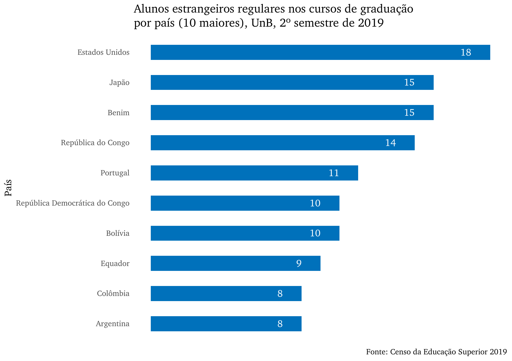
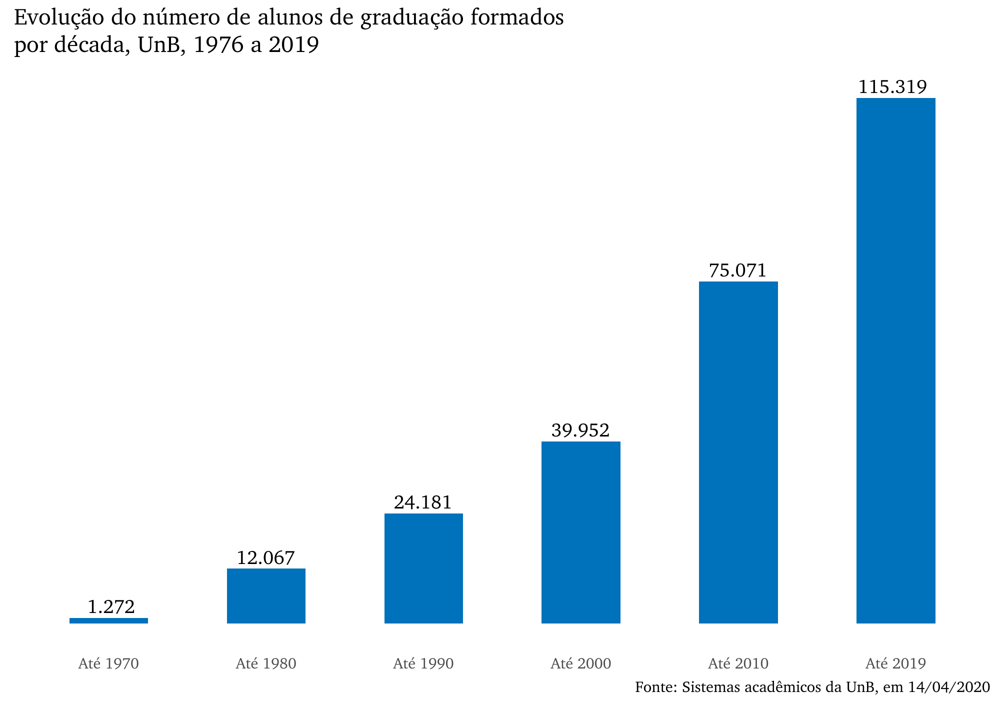

# Graduação {#grad}

```{r}
# define o fundo desta seção
fundo <- cores_anuario[2]
```

Faça o download de todas as tabelas desta seção: `r xfun::embed_file("dados_graduacao/tabelas_graduacao.xlsx")`

<br>

## Dados e características dos cursos de graduação oferecidos pela UnB, 2019
```{r}
# tabela 12 - Dados e características dos cursos de graduação oferecidos pela UnB
tab1 <- rio::import("dados_graduacao/Tabela12_DEG-2019.xlsx", sheet = "tab")
tab1 <- tab1 %>% 
  mutate(`Unidade Acadêmica / Curso / Habilitação` = str_replace(`Unidade Acadêmica / Curso / Habilitação`,
                                                                 "Enfermagem FCE",
                                                                 "Enfermagem"))
tab1 %>% 
  mutate(`Data do Ato` = as.double(`Data do Ato`),
         `Data do Ato` = as.Date(`Data do Ato`, origin = "1899-12-30"),
         `Data do Ato` = format(`Data do Ato`, "%d/%m/%Y")) %>% 
  map_df(~replace_na(., "")) %>% 
  select(`Unidade Acadêmica / Curso / Habilitação`:`Perm. Máx.`, `N. Ord.`) %>% 
  tabela_geral("Dados e características dos cursos de graduação oferecidos pela UnB, 2019", 
               linhatotal = FALSE, 
               tamfonte = 10,
               fundo = fundo) %>% 
  colorir(dados = tab1) %>% 
  footnote(general_title = "Fonte: SIGAA, atualização CAEG/DTG/DEG, em 23/06/2020",
           general = c("Nota: O ato de reconhecimento dos cursos Integral é valido para os cursos noturnos",
                       "Legenda: D: Decreto; P: Portaria; Seres: Secretaria de Regulação da Educação Superior; Res: Resolução"))
```

<br>

## Ingresso nos cursos de graduação pelo vestibular, PAS, ENEM e outras vias, por unidade acadêmica, curso e habilitação, UnB, 2019
```{r}
# tabela 13
tab2 <- rio::import("dados_graduacao/Tabela2.03.xlsx")
tab2 <- tab2 %>% 
  mutate(`Unidade acadêmica / curso / habilitação` = str_replace(`Unidade acadêmica / curso / habilitação`,
                                                                 "Enfermagem FCE",
                                                                 "Enfermagem"))

tab2 %>% 
  tabela_geral(titulo = "Ingresso nos cursos de graduação pelo vestibular, PAS, ENEM e outras vias, por unidade acadêmica, curso e habilitação, UnB, 2019", 
               colunas = c("UNIDADE ACADÊMICA / CURSO / HABILITAÇÃO",
                           "1º SEM", "2º SEM",
                           "1º SEM", "2º SEM",
                           "1º SEM", "2º SEM",
                           "1º SEM", "2º SEM",
                           "1º SEM", "2º SEM",
                           "1º SEM", "2º SEM",
                           "1º SEM", "2º SEM",
                           "1º SEM", "2º SEM",
                           "TOTAL GERAL"),
               fundo = fundo,
               tamfonte = 7) %>% 
  colorir(dados = tab2) %>% 
  add_header_above(c("-", 
                     "VESTIBULAR" = 2,
                     "PAS" = 2,
                     "ENEM" = 2,
                     "TR.OB." = 2,
                     "TR.OPT." = 2,
                     "P.ESP." = 2,
                     "C.PEC" = 2,
                     "JUD." = 2,
                     "-"),
                   color = "white", extra_css = 'text-align: center', background = fundo) %>% 
  footnote(general_title = "Fonte: Censo da Educação Superior 2019", general = "")
```

<br>

## Gráfico do ingresso de alunos nos cursos de graduação por forma de ingresso, UnB, 2019
```{r fig.cap='Ingresso de alunos nos cursos de graduação por forma de ingresso, UnB, 2019'}
include_graphics("graficos/graduacao/graf1.png")

xfun::embed_file("graficos/graduacao/graf1.png")
```

<br>

## Ingresso de alunos e número de formados nos cursos de graduação, por unidade acadêmica, curso e habilitação, UnB, 2019
```{r}
# tabela 14
tab3 <- rio::import("dados_graduacao/Tabela2.04.xlsx") %>% 
  mutate(`Unidade acadêmica / curso / habilitação` = str_replace(`Unidade acadêmica / curso / habilitação`,
                                                                 "Enfermagem FCE",
                                                                 "Enfermagem"))

tab3 %>% 
  tabela_geral(
    titulo = "Ingresso de alunos e número de formados nos cursos de graduação, por unidade acadêmica, curso e habilitação, UnB, 2019",
    fundo = fundo,
    tamfonte = 14
  ) %>% 
  colorir(dados = tab3) %>% 
  footnote(general_title = "Fonte: Censo da Educação Superior 2019", general = "")
```

<br>

## Gráfico dos ingressantes e formados nos cursos de graduação, por unidade acadêmica, UnB, 2019
```{r fig.cap='Ingressantes e formados nos cursos de graduação, por unidade acadêmica, UnB, 2019'}
include_graphics("graficos/graduacao/graf2.png")

xfun::embed_file("graficos/graduacao/graf2.png")
```

<br>

## Ingresso de alunos nos cursos de graduação, por sexo e faixa etária, UnB, 2019
```{r}
# tabela 15

tab4 <- rio::import("dados_graduacao/Tabela2.05.xlsx")

tab4 %>% 
  tabela_geral(
    titulo = "Ingresso de alunos nos cursos de graduação, por sexo e faixa etária, UnB, 2019",
    fundo = fundo
  ) %>% 
  footnote(general_title = "Fonte: Censo da Educação Superior 2019", general = "")
```

<br>

## Gráfico do ingresso de alunos nos cursos de graduação por faixa etária e sexo, UnB, 2019
```{r fig.cap='Ingresso de alunos nos cursos de graduação por faixa etária e sexo, UnB, 2019'}


xfun::embed_file("graficos/graduacao/graf3.png")
```

<br>

## Alunos regulares registrados nos cursos de graduação presenciais, por unidade acadêmica e turno, UnB, 2019
```{r}
# tabela 16
tab5 <- rio::import("dados_graduacao/Tabela2.06.xlsx")

tab5 %>% 
  tabela_geral(
    titulo = "Alunos regulares registrados nos cursos de graduação presenciais, por unidade acadêmica e turno, UnB, 2019",
    colunas = c("UNIDADE",
                "INTEGRAL", "NOTURNO", "EAD", "TOTAL",
                "INTEGRAL", "NOTURNO", "EAD", "TOTAL"),
    fundo = fundo
  ) %>% 
  footnote(general_title = "Fonte: Censo da Educação Superior 2019", general = "") %>% 
  add_header_above(c("-",
                     "1º SEMESTRE" = 4,
                     "2º SEMESTRE" = 4),
                   color = "white", 
                   extra_css = 'text-align:center', 
                   background = fundo)
```

<br>

## Gráfico dos alunos regulares nos cursos de graduação por turno e unidade acadêmica, UnB, 2º semestre de 2019
```{r fig.cap='Alunos regulares nos cursos de graduação por turno e unidade acadêmica, UnB, 2º semestre de 2019'}
include_graphics("graficos/graduacao/graf4.png")

xfun::embed_file("graficos/graduacao/graf4.png")
```

## Alunos regulares registrados nos cursos de graduação, por unidade acadêmica e sexo, UnB, 2019
```{r}
# tabela 17
tab6 <- rio::import("dados_graduacao/Tabela2.07.xlsx")

tab6 %>% 
  tabela_geral(
    titulo = "Alunos regulares registrados nos cursos de graduação, por unidade acadêmica e sexo, UnB, 2019",
    colunas = c("UNIDADE", "FEM", "MASC", "TOTAL", "FEM", "MASC", "TOTAL"),
    fundo = fundo
  )  %>% 
  add_header_above(c("-",
                     "1º SEMESTRE" = 3,
                     "2º SEMESTRE" = 3),
                   color = "white", 
                   extra_css = 'text-align:center', 
                   background = fundo) %>% 
  footnote(general_title = "Fonte: Censo da Educação Superior 2019", general = "")
```

<br>

## Gráfico dos alunos regulares nos cursos de graduação por sexo e unidade acadêmica, UnB, 2º semestre de 2019
```{r fig.cap='Alunos regulares nos cursos de graduação por sexo e unidade acadêmica, UnB, 2º semestre de 2019'}
include_graphics("graficos/graduacao/graf5.png")

xfun::embed_file("graficos/graduacao/graf5.png")
```

<br>

## Alunos regulares ativos e com trancamento geral de matrícula nos cursos de graduação, por unidade acadêmica, curso, habilitação e sexo, UnB, 2019
```{r}
# tabela 18
tab7 <- rio::import("dados_graduacao/Tabela2.08.xlsx") %>% 
  mutate(`Unidade acadêmica / curso / habilitação` = str_replace(`Unidade acadêmica / curso / habilitação`,
                                                                 "Enfermagem FCE",
                                                                 "Enfermagem"))

tab7 %>% 
  tabela_geral(
    titulo = "Alunos regulares ativos e com trancamento geral de matrícula nos cursos de graduação, por unidade acadêmica, curso, habilitação e sexo, UnB, 2019",
    colunas = c("UNIDADE ACADÊMICA / CURSO / HABILITAÇÃO",
                "FEM", "MASC", "FEM", "MASC",
                "FEM", "MASC", "FEM", "MASC",
                "FEM", "MASC", "FEM", "MASC"),
    fundo = fundo,
    tamfonte = 10
  ) %>% 
  colorir(dados = tab7) %>% 
  add_header_above(c("-",
                     "1º SEM" = 2,
                     "2º SEM" = 2,
                     "1º SEM" = 2,
                     "2º SEM" = 2,
                     "1º SEM" = 2,
                     "2º SEM" = 2),
                   color = "white", 
                   extra_css = 'text-align:center', 
                   background = fundo) %>% 
  add_header_above(c("-",
                     "ATIVOS" = 4,
                     "TRANCADOS" = 4,
                     "TOTAL" = 4),
                   color = "white", 
                   extra_css = 'text-align:center', 
                   background = fundo) %>% 
  footnote(general_title = "Fonte: Censo da Educação Superior 2019", general = "")
```

<br>

## Alunos regulares registrados nos cursos de graduação, por sexo e faixa etária, UnB, 2019 (2º semestre)
```{r}
# tabela 19
tab8 <- rio::import("dados_graduacao/Tabela2.09.xlsx")

tab8 %>% 
  tabela_geral(
    titulo = "Alunos regulares registrados nos cursos de graduação, por unidade acadêmica e sexo, UnB, 2019",
    fundo = fundo,
    tamfonte = 14
  ) %>% 
  footnote(general_title = "Fonte: Censo da Educação Superior 2019", general = "")
```

<br>

## Gráfico dos alunos regulares nos cursos de graduação por faixa etária e sexo, UnB, 2º semestre de 2019
```{r fig.cap='Alunos regulares nos cursos de graduação por faixa etária e sexo, UnB, 2º semestre de 2019'}
include_graphics("graficos/graduacao/graf6.png")

xfun::embed_file("graficos/graduacao/graf6.png")
```

<br>

## Alunos regulares ativos, matrículas e aprovados em disciplinas, nos cursos de graduação, por unidade acadêmica, curso e habilitação, UnB, 2019
```{r}
# tabela 20
tab9 <- rio::import("dados_graduacao/Tabela2.10.xlsx") %>% 
  mutate(`Unidade acadêmica / curso / habilitação` = str_replace(`Unidade acadêmica / curso / habilitação`,
                                                                 "Enfermagem FCE",
                                                                 "Enfermagem"))

tab9 %>% 
  tabela_geral(
    titulo = "Alunos regulares ativos, matrículas e aprovados em disciplinas, nos cursos de graduação, por unidade acadêmica, curso e habilitação, UnB, 2019",
    colunas = c("UNIDADE ACADÊMICA / CURSO / HABILITAÇÃO",
                "1º SEM", "2º SEM",
                "1º SEM", "2º SEM",
                "1º SEM", "2º SEM",
                "1º SEM", "2º SEM"),
    fundo = fundo,
    tamfonte = 12
  ) %>% 
  colorir(dados = tab9) %>% 
  add_header_above(c("-",
                     "ALUNOS\nATIVOS" = 2,
                     "MATRÍCULAS EM\nDISCIPLINAS" = 2,
                     "APROVADOS EM\nDISCIPLINAS" = 2,
                     "PERCENTUAL DE\nAPROVAÇÃO" = 2),
                   color = "white", 
                   extra_css = 'text-align:center', 
                   background = fundo) %>% 
  footnote(general_title = "Fonte: Censo da Educação Superior 2019", general = "")
```

<br>

## Movimentação dos alunos nos cursos de graduação, por Unidade Acadêmica, curso e habilitação, UnB, 2019
```{r}
# tabela 21
tab10 <- rio::import("dados_graduacao/Tabela2.11.xlsx") %>% 
  mutate(`Unidade acadêmica / curso / habilitação` = str_replace(`Unidade acadêmica / curso / habilitação`,
                                                                 "Enfermagem FCE",
                                                                 "Enfermagem"))

tab10 %>% 
  map_df(~replace_na(., 0)) %>% 
  tabela_geral(
    titulo = "Movimentação dos alunos nos cursos de graduação, por Unidade Acadêmica, curso e habilitação, UnB, 2019",
    colunas = c("UNIDADE ACADÊMICA / CURSO / HABILITAÇÃO",
                "1º SEM", "2º SEM",
                "1º SEM", "2º SEM",
                "1º SEM", "2º SEM",
                "1º SEM", "2º SEM",
                "1º SEM", "2º SEM",
                "1º SEM", "2º SEM"),
    fundo = fundo,
    tamfonte = 10
  ) %>% 
  colorir(dados = tab10) %>% 
  add_header_above(c("-",
                     "MATRICULADOS" = 2,
                     "ABANDONO" = 2,
                     "DESLIG.\nVOLUNTÁRIO" = 2,
                     "DESLIG. FALTA RENDIMENTO" = 2,
                     "OUTROS(1)" = 2,
                     "TOTAL\nMOVIMENTAÇÃO" = 2),
                   color = "white", 
                   extra_css = 'text-align:center', 
                   background = fundo) %>% 
  footnote(general_title = "Fonte: Censo da Educação Superior 2019", 
           general = "(1) Inclui falecimento, força de convênio, falta de documentação, anulação de registro, mudança de habilitação, transferência, desligamento decisão judicial, novo vestibular, expulsão disciplinar, mudança de curso, vestibular para outra habilitação, mudança de turno")
```

<br>

## Alunos regulares registrados nos cursos de graduação, por unidade acadêmica, curso, habilitação e raça/cor autodeclarada, UnB, 2019 (2º semestre)
```{r}
# tabela 22
tab11 <- rio::import("dados_graduacao/Tabela2.XX.xlsx") %>% 
  mutate(`Unidade acadêmica / curso / habilitação` = str_replace(`Unidade acadêmica / curso / habilitação`,
                                                                 "Enfermagem FCE",
                                                                 "Enfermagem"))

tab11 %>% 
  map_df(~replace_na(., 0)) %>% 
  tabela_geral(
    titulo = "Alunos regulares registrados nos cursos de graduação, por unidade acadêmica, curso, habilitação e raça/cor autodeclarada, UnB, 2019 (2º semestre)",
    fundo = fundo,
    tamfonte = 12
  ) %>% 
  colorir(dados = tab11) %>% 
  footnote(general_title = "Fonte: Censo da Educação Superior 2019", 
           general = "")
```

<br>

## Gráfico dos alunos regulares nos cursos de graduação por raça/cor autodeclarada, UnB, 2º semestre de 2019
```{r fig.cap='Alunos regulares nos cursos de graduação por raça/cor autodeclarada, UnB, 2º semestre de 2019'}
include_graphics("graficos/graduacao/graf7.png")

xfun::embed_file("graficos/graduacao/graf7.png")
```

<br>

## Alunos regulares registrados nos cursos de graduação, por raça/cor autodeclarada e sexo, UnB, 2019 (2º semestre)
```{r}
# tabela 23
tab12 <- rio::import("dados_graduacao/Tabela2.XX2.xlsx")

tab12 %>% 
  tabela_geral(
    titulo = "Alunos regulares registrados nos cursos de graduação, por raça/cor autodeclarada e sexo, UnB, 2019 (2º semestre)",
    fundo = fundo,
    tamfonte = 14
  ) %>% 
  footnote(general_title = "Fonte: Censo da Educação Superior 2019", general = "")
```

<br>

## Gráfico dos alunos regulares nos cursos de graduação por raça/cor autodeclarada e sexo, UnB, 2º semestre de 2019
```{r fig.cap='Alunos regulares nos cursos de graduação por raça/cor autodeclarada e sexo, UnB, 2º semestre de 2019'}
include_graphics("graficos/graduacao/graf8.png")

xfun::embed_file("graficos/graduacao/graf8.png")
```

<br>

## Alunos regulares registrados nos cursos de graduação, por unidade acadêmica, curso, habilitação e cota de ingresso, UnB, 2019 (2º semestre)
```{r}
# tabela 24
tab13 <- rio::import("dados_graduacao/Tabela2.COTA.xlsx") %>% 
  mutate(`Unidade acadêmica / curso / habilitação` = str_replace(`Unidade acadêmica / curso / habilitação`,
                                                                 "Enfermagem FCE",
                                                                 "Enfermagem"))

tab13 %>% 
  map_df(~replace_na(., 0)) %>% 
  tabela_geral(
    titulo = "Alunos regulares registrados nos cursos de graduação, por unidade acadêmica, curso, habilitação e cota de ingresso, UnB, 2019 (2º semestre)",
    fundo = fundo,
    tamfonte = 14
  ) %>% 
  colorir(dados = tab13) %>% 
  footnote(general_title = "Fonte: Censo da Educação Superior 2019", 
           general = "")
```

<br>

## Alunos regulares registrados nos cursos de graduação, por cota de ingresso e sexo, UnB, 2019 (2º semestre)
```{r}
# tabela 25
tab14 <- rio::import("dados_graduacao/Tabela2.COTA2.xlsx")

tab14 %>% 
  tabela_geral(
    titulo = "Alunos regulares registrados nos cursos de graduação, por cota de ingresso e sexo, UnB, 2019 (2º semestre)",
    fundo = fundo,
    tamfonte = 14
  ) %>% 
  footnote(general_title = "Fonte: Censo da Educação Superior 2019", 
           general = "")
```

<br>

## Alunos estrangeiros regulares registrados nos cursos de graduação, por continente e país, UnB, 2º semestre de 2019
```{r}
# tabela 26
tab15 <- rio::import("dados_graduacao/Tabela2.14.xlsx")

cor <- tab15 %>% 
  mutate(n = row_number()) %>% 
  filter(str_detect(`Unidade acadêmica / curso / habilitação`, "Total do")) %>% 
  select(n) %>% 
  deframe()

tab15 %>% 
  select("PAÍS / CONTINENTE" = `Unidade acadêmica / curso / habilitação`, Total) %>% 
  tabela_geral(
    titulo = "Alunos estrangeiros regulares registrados nos cursos de graduação, por continente e país, UnB, 2019 (2º semestre)",
    fundo = fundo,
    tamfonte = 14
  ) %>% 
  row_spec(row = cor, background = colorspace::lighten(fundo, 0.8)) %>% 
  footnote(general_title = "Fonte: Censo da Educação Superior 2019", 
           general = "")
```

<br>

## Gráfico dos alunos estrangeiros regulares nos cursos de graduação por continente, UnB, 2º semestre de 2019
```{r fig.cap='Alunos estrangeiros regulares nos cursos de graduação por continente, UnB, 2º semestre de 2019'}

include_graphics("graficos/graduacao/graf9.png")

xfun::embed_file("graficos/graduacao/graf9.png")
```

<br>

## Gráfico dos alunos estrangeiros regulares nos cursos de graduação por país (10 maiores), UnB, 2º semestre de 2019
```{r fig.cap='Alunos estrangeiros regulares nos cursos de graduação por país (10 maiores), UnB, 2º semestre de 2019'}


xfun::embed_file("graficos/graduacao/graf10.png")
```

<br>

## Alunos regulares Portadores de Necessidades Especiais registrados nos cursos da UnB, 2019 (2º semestre)
```{r}
# tabela 27
tab16 <- rio::import("dados_graduacao/Tabela2.12.xlsx")

tab16 %>% 
  tabela_geral(
    titulo = "Alunos regulares Portadores de Necessidades Especiais registrados nos cursos da UnB, 2019 (2º semestre)",
    fundo = fundo,
    tamfonte = 12
  ) %>% 
  colorir(dados = tab16) %>% 
  footnote(general_title = "Fonte: Censo da Educação Superior 2019", 
           general = "Outros: deficiência múltipla, autismo, síndrome de Asperger, síndrome de Rett e transtorno desintegrativo da infância")
```

## Bolsas acadêmicas de pesquisa concedidas a alunos de graduação, por unidade acadêmica, curso e habilitação, 2019
```{r}
# tabela 28
tab17 <- rio::import("dados_graduacao/Tabela2.27.xlsx")

tab17 %>% 
  tabela_geral(
    titulo = "Bolsas acadêmicas de pesquisa concedidas a alunos de graduação, por unidade acadêmica, curso e habilitação, 2019",
    fundo = fundo,
    colunas = c("UNIDADE ACADÊMICA / CURSO / HABILITAÇÃO",
                "REM\n1º SEM", "NÃO REM\n1º SEM",
                "REM\n2º SEM", "NÃO REM\n2º SEM"),
    tamfonte = 12
  ) %>% 
  colorir(dados = tab17) %>% 
  footnote(general_title = "Fonte: Censo da Educação Superior 2019", 
           general = "")
```

<br>

## Bolsas acadêmicas de extensão concedidas a alunos de graduação, por unidade acadêmica, curso e habilitação, 2019
```{r}
# tabela 29
tab18 <- rio::import("dados_graduacao/Tabela2.28.xlsx")

tab18 %>% 
  tabela_geral(
    titulo = "Bolsas acadêmicas de extensão concedidas a alunos de graduação, por unidade acadêmica, curso e habilitação, 2019",
    fundo = fundo,
    colunas = c("UNIDADE ACADÊMICA / CURSO / HABILITAÇÃO",
                "REM\n1º SEM", "NÃO REM\n1º SEM",
                "REM\n2º SEM", "NÃO REM\n2º SEM"),
    tamfonte = 12
  ) %>% 
  colorir(dados = tab18) %>% 
  footnote(general_title = "Fonte: Censo da Educação Superior 2019", 
           general = "")
```

<br>

## Bolsas acadêmicas de monitoria concedidas a alunos de graduação, por unidade acadêmica, curso e habilitação, 2019
```{r}
# tabela 30
tab19 <- rio::import("dados_graduacao/Tabela2.29.xlsx")

tab19 %>% 
  tabela_geral(
    titulo = "Bolsas acadêmicas de monitoria concedidas a alunos de graduação, por unidade acadêmica, curso e habilitação, 2019",
    fundo = fundo,
    colunas = c("UNIDADE ACADÊMICA / CURSO / HABILITAÇÃO",
                "REM\n1º SEM", "NÃO REM\n1º SEM",
                "REM\n2º SEM", "NÃO REM\n2º SEM"),
    tamfonte = 12
  ) %>% 
  colorir(dados = tab19) %>% 
  footnote(general_title = "Fonte: Censo da Educação Superior 2019", 
           general = "")
```

<br>

## Estágio não obrigatatório sem remuneração dos alunos de graduação, por unidade acadêmica, curso e habilitação, 2019
```{r}
# tabela 31
tab20 <- rio::import("dados_graduacao/Tabela2.30.xlsx")

tab20 %>% 
  tabela_geral(
    titulo = "Estágio não obrigatatório sem remuneração dos alunos de graduação, por unidade acadêmica, curso e habilitação, 2019",
    fundo = fundo,
    colunas = c("UNIDADE ACADÊMICA / CURSO / HABILITAÇÃO",
                "1º SEM", "2º SEM"),
    tamfonte = 14
  ) %>% 
  colorir(dados = tab20) %>% 
  footnote(general_title = "Fonte: Censo da Educação Superior 2019", 
           general = "")
```

<br>

## Alunos de graduação atendidos para orientação ou acompanhamento acadêmico, por unidade acadêmica, 2019
```{r}
# tabela 32
tab21 <- rio::import("dados_graduacao/TABELA 32.xlsx", sheet = "Tabela 32", skip = 2) %>% 
  drop_na()

tab21 %>% 
  tabela_geral(
    titulo = "Alunos de graduação atendidos para orientação ou acompanhamento acadêmico, por unidade acadêmica, 2019",
    fundo = fundo,
    tamfonte = 14
  ) %>% 
  footnote(general_title = "Fonte: SOU - Serviço de Orientação ao Universitário", 
           general = "")
```

<br>

## Avaliação dos cursos de graduação da UnB no Exame Nacional de Desempenho dos Estudantes – ENADE/MEC, 2019
```{r}
# tabela 33
tab22 <- rio::import("dados_graduacao/tab_enade.xlsx")

tab22 %>% 
  select(-`Código de curso`, -`Enade anterior`) %>% 
  tabela_geral(
    titulo = "Avaliação dos cursos de graduação da UnB no Exame Nacional de Desempenho dos Estudantes – ENADE/MEC, 2019",
    fundo = fundo,
    linhatotal = FALSE,
    tamfonte = 14
  ) %>% 
  footnote(general_title = "Fonte: portal.inep.gov.br/web/guest/microdados", 
           general = "")
```

<br>

## Índice Geral de Cursos da instituição – IGC 2018 (Triênio 2016, 2017 e 2018)
```{r}
# tabela 34
tab23 <- rio::import("dados_graduacao/portal_IGC_edicao2018.xlsx", sheet = "IGC")

tab23 %>% 
  filter(`Organização Acadêmica` == "Universidade") %>% 
  select(`Código da IES`, `Nome da IES`, `Sigla da IES`, `IGC (Contínuo)`, `IGC (Faixa)`) %>% 
  mutate(`IGC (Contínuo)` = as.double(`IGC (Contínuo)`)) %>% 
  slice_max(order_by = `IGC (Contínuo)`, n = 15) %>% 
  tabela_geral(
    titulo = "Índice Geral de Cursos da instituição – IGC 2018 (Triênio 2016, 2017 e 2018)",
    fundo = fundo,
    linhatotal = FALSE,
    tamfonte = 14,
    digitos = 4
  ) %>% 
  # coloquei a referência fixa - cuidado
  row_spec(14, background = alpha(fundo, 0.2)) %>% 
  footnote(general_title = "Fonte: portal.inep.gov.br/web/guest/educacao-superior/indicadores-de-qualidade/resultados", 
           general = "")
```

<br>

## Evolução do ingresso de alunos (vestibular, PAS, ENEM e outras vias) nos cursos de graduação, por unidade acadêmica, curso e habilitação, UnB, 2015 a 2019
```{r}
# tabela 35
tab24 <- rio::import("dados_graduacao/Tabela2.21.xlsx") %>% 
  mutate(`Unidade Acadêmica / Curso / Habilitação` = str_replace(`Unidade Acadêmica / Curso / Habilitação`,
                                                                 "Enfermagem FCE",
                                                                 "Enfermagem"))

tab24 %>% 
  tabela_geral(
    titulo = "Evolução do ingresso de alunos (vestibular, PAS, ENEM e outras vias) nos cursos de graduação, por unidade acadêmica, curso e habilitação, UnB, 2015 a 2019",
    fundo = fundo,
    tamfonte = 14
  ) %>% 
  colorir(dados = tab24) %>% 
  footnote(general_title = "Fonte: Censo da Educação Superior", 
           general = "")
```

<br>

## Evolução do número de alunos regulares registrados nos cursos de graduação, por unidade acadêmica, curso e habilitação, UnB, 2015 a 2019 (2º semestre)
```{r}
# tabela 36
tab25 <- rio::import("dados_graduacao/Tabela2.22.xlsx") %>% 
  mutate(`Unidade Acadêmica / Curso / Habilitação` = str_replace(`Unidade Acadêmica / Curso / Habilitação`,
                                                                 "Enfermagem FCE",
                                                                 "Enfermagem"))

tab25 %>% 
  tabela_geral(
    titulo = "Evolução do número de alunos regulares registrados nos cursos de graduação, por unidade acadêmica, curso e habilitação, UnB, 2015 a 2019 (2º semestre)",
    fundo = fundo,
    tamfonte = 14
  ) %>% 
  colorir(dados = tab25) %>% 
  footnote(general_title = "Fonte: Censo da Educação Superior", 
           general = "")
```

<br>

## Evolução do número de alunos formados nos cursos de graduação, por unidade acadêmica, curso e habilitação, UnB, 2015 a 2019
```{r}
# tabela 37
tab26 <- rio::import("dados_graduacao/Tabela2.23.xlsx") %>% 
  mutate(`Unidade Acadêmica / Curso / Habilitação` = str_replace(`Unidade Acadêmica / Curso / Habilitação`,
                                                                 "Enfermagem FCE",
                                                                 "Enfermagem"))

tab26 %>% 
  tabela_geral(
    titulo = "Evolução do número de alunos formados nos cursos de graduação, por unidade acadêmica, curso e habilitação, UnB, 2015 a 2019",
    fundo = fundo,
    tamfonte = 14
  ) %>% 
  colorir(dados = tab26) %>% 
  footnote(general_title = "Fonte: Censo da Educação Superior", 
           general = "")
```

<br>

## Gráfico da evolução do número de alunos de graduação matriculados, ingressantes e formados, UnB, 2015 a 2019
```{r fig.cap='Evolução do número de alunos de graduação matriculados, ingressantes e formados, UnB, 2015 a 2019'}
include_graphics("graficos/graduacao/graf11.png")

xfun::embed_file("graficos/graduacao/graf11.png")
```

<br>

## Gráfico da evolução do número de alunos de graduação formados, por década, UnB, 2015 a 2019
```{r fig.cap='Evolução do número de alunos de graduação formados, por década, UnB, 2015 a 2019'}


xfun::embed_file("graficos/graduacao/graf12.png")
```
