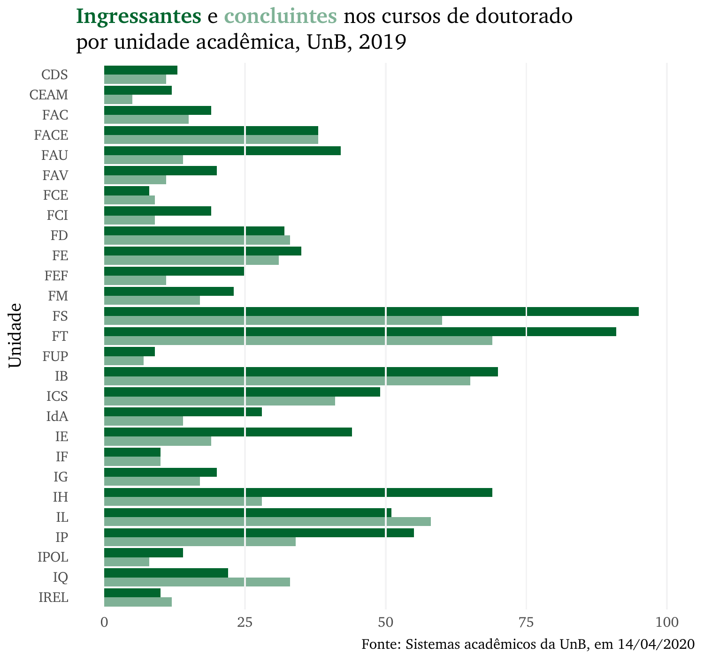

# Doutorado {#dout}

```{r}
fundo <- cores_anuario["dout"]
```

Faça o download de todas as tabelas desta seção: `r xfun::embed_file("dados_doutorado/tabelas_doutorado.xlsx")`

<br>

## Ingresso de alunos e número de teses homologadas nos cursos de doutorado, por unidade acadêmica e curso, UnB, 2019
```{r}
tab1 <- rio::import("dados_doutorado/Tabelas_Doutorado_Anuário_2019.xlsx", 
                    sheet = "Tabela 3.23",
                    skip = 1)
# xfun::embed_file("dados_doutorado/EvoForD.csv")

 tab1 %>% 
  tabela_geral("Ingresso de alunos e número de teses homologadas nos cursos de doutorado, por unidade acadêmica e curso, UnB, 2019", 
               linhatotal = TRUE, 
               tamfonte = 10,
               colunas = c("Unidade Acadêmica/Curso","Ing. Fem. 1S","Ing. Masc. 1S", "Ing. Totais 1S", "Ing. Fem. 2S","Ing. Masc. 2S", "Ing. Totais 2S", "Ing. 2019", "Teses Hom. Masc. 1S", "Teses Hom. Fem. 1S", "Teses Hom. Totais 1S", "Teses Hom. Masc. 2S", "Teses Hom. Fem. 2S", "Teses Hom.Totais 2S", "Teses Hom. Totais 2019"),
               fundo = fundo) %>% 
  colorir(dados = tab1)
```

<br>

## Gráfico dos ingressantes e concluintes nos cursos de doutorado por unidade acadêmica, UnB, 2019
```{r fig.cap='Ingressantes e concluintes nos cursos de doutorado por unidade acadêmica, UnB, 2019'}


xfun::embed_file("graficos/doutorado/graf1.png")
```

<br>

## Alunos ingressantes e concluintes nos cursos de doutorado, por sexo e faixa etária, UnB, 2019
```{r}

tab2 <- rio::import("dados_doutorado/Tabelas_Doutorado_Anuário_2019.xlsx", 
                    sheet = "Tabela 3.24",
                    skip = 1)
# xfun::embed_file("dados_doutorado/EvoForD.csv")

 tab2 %>% 
  tabela_geral("Alunos ingressantes e concluintes nos cursos de doutorado, por sexo e faixa etária, UnB, 2019", 
               linhatotal = TRUE, 
               tamfonte = 12,
               colunas = c("Faixa Etária", "Ing. Fem.",	"Ing. Fem %",	"Ing. Masc.", "Ing. Masc. %", "Ing. Total.", "Conc. Fem.",	"Conc. Fem. %", "Conc. Masc.",	"Conc. Masc. %", "Conc.	Total"),
               fundo = fundo)
   
```

<br>

## Gráfico do ingresso de alunos nos cursos de doutorado por faixa etária e sexo, UnB, 2019
```{r fig.cap='Ingresso de alunos nos cursos de doutorado por faixa etária e sexo, UnB, 2019'}
include_graphics("graficos/doutorado/graf2.png")

xfun::embed_file("graficos/doutorado/graf2.png")
```

<br>

## Gráfico da formatura de alunos nos cursos de doutorado por faixa etária e sexo, UnB, 2019
```{r fig.cap='Formatura de alunos nos cursos de doutorado por faixa etária e sexo, UnB, 2019'}
include_graphics("graficos/doutorado/graf3.png")

xfun::embed_file("graficos/doutorado/graf3.png")
```

<br>

## Alunos ativos, matrículas e aprovações em disciplinas nos cursos de doutorado, por unidade acadêmica e curso, UnB, 2019
```{r}

tab3 <- rio::import("dados_doutorado/Tabelas_Doutorado_Anuário_2019.xlsx", 
                    sheet = "Tabela 3.25",
                    skip = 1)
# xfun::embed_file("dados_doutorado/EvoForD.csv")

tab3 %>% 
  tabela_geral("Alunos ativos, matrículas e aprovações em disciplinas nos cursos de doutorado, por unidade acadêmica e curso, UnB, 2019", 
               linhatotal = TRUE, 
               tamfonte = 10,
               colunas = c("Unidade Acadêmica/Curso","AAt 1S", "AAt 2S",	"AAp 1S",	"AAp 2S", "Mat. 1S", "Mat. 2S", "ARp. 1S", "ARp. 2S", "% Ap. / Mat. 1S",	"% Ap. / Mat. 2S", "% Rp. / Mat. 1S",	"% Rp. / Mat. 2S"),
               fundo = fundo) %>% 
   colorir(dados = tab3)
```

<br>

## Alunos regulares nos cursos de doutorado, por sexo e faixa etária, UnB, 2019
```{r}

tab4 <- rio::import("dados_doutorado/Tabelas_Doutorado_Anuário_2019.xlsx", 
                    sheet = "Tabela 3.26",
                    skip = 1)
# xfun::embed_file("dados_doutorado/EvoForD.csv")

 tab4 %>% 
  tabela_geral("Alunos regulares registrados nos cursos de doutorado, por sexo e faixa etária, UnB, 2019", 
               linhatotal = TRUE, 
               tamfonte = 16,
               colunas = c("Faixa Etária", "Fem.",	"% Fem.",	"Masc.", "% Masc", "Total"),
               fundo = fundo)
```

<br>

## Gráfico dos alunos regulares nos cursos de doutorado por faixa etária e sexo, UnB, 2019
```{r fig.cap='Alunos regulares nos cursos de doutorado por faixa etária e sexo, UnB, 2019'}
include_graphics("graficos/doutorado/graf4.png")

xfun::embed_file("graficos/doutorado/graf4.png")
```

<br>

## Alunos regulares nos cursos de doutorado, por semestre, unidade acadêmica, curso e sexo UnB, 2019
```{r}

tab6 <- rio::import("dados_doutorado/Tabelas_Doutorado_Anuário_2019.xlsx", 
                    sheet = "Tabela 3.27",
                    skip = 1)
# xfun::embed_file("dados_doutorado/EvoForD.csv")

 tab6 %>% 
  tabela_geral("Alunos regulares registrados nos cursos de doutorado, por semestre, unidade acadêmica, curso e sexo UnB, 2019", 
               linhatotal = TRUE, 
               tamfonte = 10,
               colunas = c("Unidade Acadêmica/Curso", "Fem. 1S",	"Masc. 1S",	"Total 1S", "Fem 2S", "Fem. 2S", "Total 2S"),
               fundo = fundo) %>% 
   colorir(dados = tab6)
```

<br>

## Gráfico dos alunos regulares nos cursos de doutorado por unidade e sexo, UnB, 2º semestre de 2019
```{r fig.cap='Alunos regulares nos cursos de doutorado por unidade e sexo, UnB, 2º semestre de 2019'}
include_graphics("graficos/doutorado/graf5.png")

xfun::embed_file("graficos/doutorado/graf5.png")
```

<br>

## Alunos ativos e com trancamento geral de matrícula nos cursos de doutorado, por semestre, sexo, unidade acadêmica e curso, UnB, 2019
```{r}
tab7 <- rio::import("dados_doutorado/Tabelas_Doutorado_Anuário_2019.xlsx", 
                    sheet = "Tabela 3.28",
                    skip = 1)
# xfun::embed_file("dados_doutorado/EvoForD.csv")

 tab7 %>% 
  tabela_geral("Alunos ativos e com trancamento geral de matrícula nos cursos de doutorado, por semestre, sexo, unidade acadêmica e curso, UnB, 2019", 
               linhatotal = TRUE, 
               tamfonte = 12,
               colunas = c("Unidade Acadêmica/Curso", "AAt. Fem. 1S",	"AAt. Masc. 1S",	"AAt. Tot. 1S", "AAt. Fem. 2S",	"AAt. Masc. 2S",	"AAt. Tot. 2S", "TGM Fem. 1S", "TGM Masc. 1S", "TGM Tot. 1S", "TGM Fem. 2S", "TGM Masc. 2S", "TGM Tot. 2S", "Fem. Tot. 1S", "Masc. Tot. 1S", "Tot. 1S", "Fem. Tot. 2S", "Masc. Tot. 2S", "Tot. 2S"),  
               fundo = fundo) %>% 
   colorir(dados = tab7)
```

<br>

## Desligamento de alunos nos cursos de doutorado, por forma, semestre, unidade acadêmica e curso, UnB, 2019
```{r}
tab8 <- rio::import("dados_doutorado/Tabelas_Doutorado_Anuário_2019.xlsx", 
                    sheet = "Tabela 3.29",
                    skip = 1)
# xfun::embed_file("dados_doutorado/EvoForD.csv")

 tab8 %>% 
  tabela_geral("Alunos regulares registrados ativos e com trancamento geral de matrícula nos cursos de doutorado, por semestre, sexo, unidade acadêmica e curso, UnB, 2019", 
               linhatotal = TRUE, 
               tamfonte = 14,
               colunas = c("Unidade Acadêmica/Curso", "Al. Reg. 2º2019", "Aband. 1S", "Aband. 2S", "Desl. Vol 1S", "Desl. Vol 2S", "Rend. 1S", "Rend 2S", "Outros 1S", "Outros 2S", "Total 1S", "Total 2S"),  
               fundo = fundo) %>% 
   colorir(dados = tab8)
```

<br>

## Evolução do ingresso de alunos nos cursos de doutorado, por unidade acadêmica e curso, UnB, 2015 a 2019
```{r}
tab9 <- rio::import("dados_doutorado/Tabelas_Doutorado_Anuário_2019.xlsx", 
                    sheet = "Tabela 3.30",
                    skip = 1)

 tab9 %>% 
  tabela_geral("Evolução do ingresso de alunos nos cursos de doutorado, por unidade acadêmica e curso, UnB, 2015 a 2019", 
               linhatotal = TRUE, 
               tamfonte = 14,
               colunas = c("Unidade Acadêmica/Curso", "2015", "2016", "2017", "2018", "2019"),  
               fundo = fundo) %>% 
   colorir(dados = tab9)
```

<br>

## Evolução do número de alunos registrados nos cursos de doutorado, por unidade acadêmica e curso, UnB, 2015 a 2019 (2º semestre)
```{r}
tab10 <- rio::import("dados_doutorado/Tabelas_Doutorado_Anuário_2019.xlsx", 
                    sheet = "Tabela 3.31",
                    skip = 1)
# xfun::embed_file("dados_doutorado/EvoForD.csv")

 tab10 %>% 
  tabela_geral("Evolução do número de alunos registrados nos cursos de doutorado, por unidade acadêmica e curso, UnB, 2015 a 2019 (2º semestre)", 
               linhatotal = TRUE, 
               tamfonte = 14,
               colunas = c("Unidade Acadêmica/Curso", "2015", "2016", "2017", "2018", "2019"),  
               fundo = fundo) %>% 
   colorir(dados = tab10)
```

<br>

## Evolução do número de alunos com teses homologadas nos cursos de doutorado, por unidade acadêmica e curso, UnB, 2015 a 2019
```{r}
tab11 <- rio::import("dados_doutorado/Tabelas_Doutorado_Anuário_2019.xlsx", 
                    sheet = "Tabela 3.32",
                    skip = 1)
# xfun::embed_file("dados_doutorado/EvoForD.csv")

 tab11 %>% 
  tabela_geral("Evolução do número de alunos com teses homologadas nos cursos de doutorado, por unidade acadêmica e curso, UnB, 2015 a 2019", 
               linhatotal = TRUE, 
               tamfonte = 14,
               colunas = c("Unidade Acadêmica/Curso", "2015", "2016", "2017", "2018", "2019"),  
               fundo = fundo) %>% 
   colorir(dados = tab11)
```

<br>

## Gráfico da evolução do número de alunos de doutorado matriculados, ingressantes e formados, UnB, 2015 a 2019
```{r fig.cap='Evolução do número de alunos de doutorado matriculados, ingressantes e formados, UnB, 2015 a 2019'}
include_graphics("graficos/doutorado/graf6.png")

xfun::embed_file("graficos/doutorado/graf6.png")
```

<br>

## Gráfico da evolução do número de alunos com teses homologadas nos cursos de doutorado por década, 1976 a 2019
```{r fig.cap='Evolução do número de alunos com teses homologadas nos cursos de doutorado por década, 1976 a 2019'}


xfun::embed_file("graficos/doutorado/graf7.png")
```
