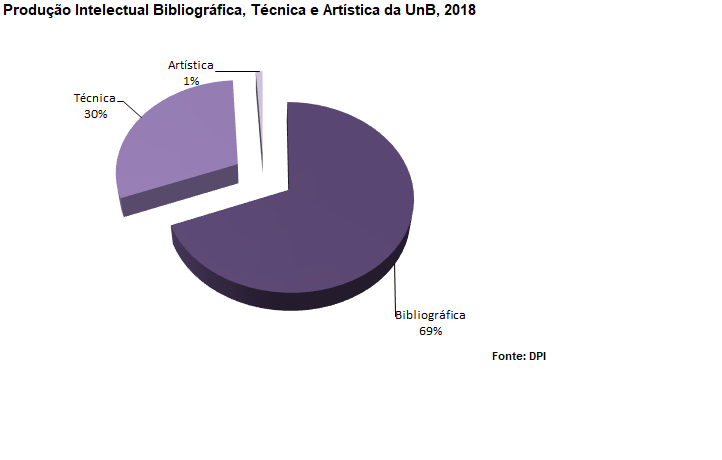

# Produção Intelectual e Pesquisa {#pip}

```{r}
# define o fundo desta seção
fundo <- cores_anuario["pip"]
```

Faça o download de todas as tabelas desta seção: `r xfun::embed_file("dados_producao_intelectual/producao_intelectual.xlsx")`

<br>

## Produção intelectual bibliográfica, 2019
```{r}
prod_bibliografica <- rio::import("dados_producao_intelectual/producao_intelectual.xlsx", sheet=1)

prod_bibliografica %>%  map_df(~replace_na(., 0)) %>% tabela_geral("Produção intelectual bibliográfica, 2019", linhatotal =TRUE, colunas = c("Produção Bibliográfica",	"2019"), tamfonte = 14, fundo = fundo) %>% colorir(dados = prod_bibliografica) %>%  footnote(general = "", general_title = "Fonte: Extraído do Sistema Coleta da CAPES")

```

<br>

## Gráfico de Produção intelectual bibliográfica, técnica e artística da UnB, 2019
```{r fig.cap='Produção intelectual bibliográfica, técnica e artística da UnB, 2019', out.width='100%'}


xfun::embed_file("graficos/prod_int/graf1.png")
```

<br>

## Produção intelectual técnica, 2019
```{r}
prod_tecnica <- rio::import("dados_producao_intelectual/producao_intelectual.xlsx", sheet=2)

prod_tecnica %>%  map_df(~replace_na(., 0)) %>% tabela_geral("Produção intelectual técnica, 2019", linhatotal =TRUE, colunas = c("Produção Técnica",	"2019"), tamfonte = 14, fundo = fundo) %>% colorir(dados = prod_tecnica) %>%  footnote(general = "", general_title = "Fonte: Extraído do Sistema Coleta da CAPES")

```

<br>

## Produção intelectual artística, 2019
```{r}
prod_artistica <- rio::import("dados_producao_intelectual/producao_intelectual.xlsx", sheet=3)

prod_artistica %>% map_df(~replace_na(., 0)) %>% tabela_geral("Produção intelectual técnica, 2019", linhatotal =TRUE, colunas = c("Produção Artística",	"2019"), tamfonte = 14, fundo = fundo) %>% colorir(dados = prod_artistica) %>%  footnote(general = "", general_title = "Fonte: Extraído do Sistema Coleta da CAPES")

```

<br>

## Número de bolsas e investimento em bolsas no país, por modalidade, 2019
```{r}
num_bolsa_pais <- rio::import("dados_producao_intelectual/producao_intelectual.xlsx", sheet=4)

num_bolsa_pais %>% map_df(~replace_na(., 0)) %>% tabela_geral("Número de bolsas e investimento em bolsas no país, por modalidade, 2019", linhatotal =TRUE, colunas = c("Modalidade",	"Número de Bolsas",	"Valor das Bolsas*"), tamfonte = 14, fundo = fundo) %>% colorir(dados = num_bolsa_pais) %>% footnote(number = c("Valor Mensal*"), general = "", general_title = "Fonte: DPG/DIRIC e Programas de Pós-Graduação, julho-2020")

```

<br>

## Número de bolsas e investimento em bolsas no exterior, por modalidade – UnB, 2019
```{r}
num_bolsa_ex <- rio::import("dados_producao_intelectual/producao_intelectual.xlsx", sheet=5)

num_bolsa_ex %>%  map_df(~replace_na(., 0)) %>% tabela_geral("Número de bolsas e investimento em bolsas no exterior, por modalidade – UnB, 2019", linhatotal =TRUE, colunas = c("Modalidade",	"Número de Bolsas",	"Investimento (reais)",	"Investimento (dólares)"), tamfonte = 14, fundo = fundo) %>% colorir(dados = num_bolsa_ex) %>% footnote(number = c("Valor Mensal*","Cotação do dólar em 08/07/2020 = R$ 6,02"), general = "", general_title = "Fonte: Programas de Pós-Graduação, julho-2020.")

```

<br>

## CNPq: Distribuição dos grupos de pesquisa por área de conhecimento cadastrados no diretório, 2019
```{r}
cnpq_grupos <- rio::import("dados_producao_intelectual/producao_intelectual.xlsx", sheet=6)

cnpq_grupos %>% map_df(~replace_na(., 0)) %>% tabela_geral("CNPq: Distribuição dos grupos de pesquisa por área de conhecimento cadastrados no diretório, 2019", linhatotal =TRUE, colunas = c("Área",	"Grupos"), tamfonte = 14, fundo = fundo) %>% colorir(dados = cnpq_grupos) %>% footnote(general = "", general_title = "Fonte: DPG/ CNPq/ Plataforma Lattes (www.lattes.cnpq.br/web/dgp), julho-2020")

```

<br>

## Grupos de Pesquisa ativos da UnB, 2019
```{r}
unb_grupos <- rio::import("dados_producao_intelectual/producao_intelectual.xlsx", sheet=7)

unb_grupos %>% map_df(~replace_na(., 0)) %>% tabela_geral("Grupos de Pesquisa ativos da UnB, 2019", linhatotal =TRUE, colunas = c("Área",	"Grupos"), tamfonte = 14, fundo = fundo) %>% colorir(dados = unb_grupos) %>% footnote(general = "", general_title = "Fonte: DPI, julho-2020")

```

<br>

## Programa institucional de bolsas de iniciação científica – PIBIC, 2019
```{r}
pibic <- rio::import("dados_producao_intelectual/producao_intelectual.xlsx", sheet=8)

pibic %>% map_df(~replace_na(., 0)) %>% tabela_geral("Programa institucional de bolsas de iniciação científica – PIBIC, 2019", linhatotal = FALSE, colunas = c("Descrição",	"Qtd."), tamfonte = 14, fundo = fundo) %>% colorir(dados = pibic) %>% footnote(general = "", general_title = "Fonte: DPG/DIRIC, Julho-2020")

```

<br>

## Evolução do PIBIC na UnB, por inscrições, bolsas do CNPq e da UnB, 2015 a 2019
```{r}
bolsas_pibic <- rio::import("dados_producao_intelectual/producao_intelectual.xlsx", sheet=9)

bolsas_pibic$`Unidade / Ano` <- c("2015","2016","2017","2018","2019")

bolsas_pibic %>% map_df(~replace_na(., 0)) %>% tabela_geral("Evolução do PIBIC na UnB, por inscrições, bolsas do CNPq e da UnB, 2015 a 2019", linhatotal = FALSE, colunas = c("Ano","Inscrições","Bolsas CNPq",	"Bolsas UnB",	"Bolsas FAPDF","Total de Bolsas"), tamfonte = 14, fundo = fundo) %>% colorir(dados = bolsas_pibic) %>% footnote(number = c("No último mês de 2015 houve a implementação das bolsas da FAP-DF*","Revisão da apuração do dado, julho-2020**","Em 2019, a FAPDF concedeu 352 bolsas de IC à UnB ***"),general = "", general_title = "Fonte: DPG/DIRIC, julho-2020")

```

<br>

## Evolução do número de alunos voluntários do PIBIC, 2015 a 2019
```{r}
alunos_volunt <- rio::import("dados_producao_intelectual/producao_intelectual.xlsx", sheet=10)

alunos_volunt$`Unidade / Ano` <- c("2015","2016","2017","2018","2019")

alunos_volunt %>% map_df(~replace_na(., 0)) %>% tabela_geral("Evolução do número de alunos voluntários do PIBIC, 2015 a 2019", linhatotal = FALSE, colunas = c("Ano","Voluntários"), tamfonte = 14, fundo = fundo) %>% colorir(dados = alunos_volunt) %>% footnote(general = "", general_title = "Fonte: DPG/DIRIC, julho-2020")

```

<br>

## Evolução do número de projetos aprovados, orientadores e bolsistas do PIBIC, 2015 a 2019
```{r}
projetos_pibic <- rio::import("dados_producao_intelectual/producao_intelectual.xlsx", sheet=11)

projetos_pibic$`Unidade / Ano` <- c("2015", "2016","2017","2018","2019")

projetos_pibic %>% map_df(~replace_na(., 0)) %>% tabela_geral("Evolução do número de projetos aprovados, orientadores e bolsistas do PIBIC, 2015 a 2019", linhatotal = FALSE, colunas = c("Ano",	"Projetos",	"Orientadores",	"Bolsistas"), tamfonte = 14, fundo = fundo) %>% colorir (dados = projetos_pibic) %>% footnote(number = c("Revisão da apuração do dado, julho-2020*","revisão da apuração do dado, julho-2020**"), general = "", general_title = "Fonte: DPG/DIRIC")

```

<br>

## Evolução do número de trabalhos apresentados pelos bolsistas do PIBIC nas reuniões da SBPC, 2015 a 2019
```{r}
trabalhos_pibic <- rio::import("dados_producao_intelectual/producao_intelectual.xlsx", sheet=12)

trabalhos_pibic$`Unidade / Ano` <- c("2015","2016","2017","2018","2019")

trabalhos_pibic %>% map_df(~replace_na(., 0)) %>% tabela_geral("Evolução do número de trabalhos apresentados pelos bolsistas do PIBIC nas reuniões da SBPC, 2015 a 2019",        linhatotal = FALSE, colunas = c("Ano","Trabalhos"), tamfonte = 14, fundo = fundo) %>% colorir(dados = trabalhos_pibic) %>% footnote(general = "", general_title = "Fonte: DPG/DIRIC, julho-2020")

```

<br>

## Evolução do número de trabalhos apresentados nos congressos do PIBIC – UnB, 2015 a 2019
```{r}
congresso_pibic <- rio::import("dados_producao_intelectual/producao_intelectual.xlsx", sheet=12)

congresso_pibic$`Unidade / Ano` <- c("2015","2016","2017","2018","2019")

congresso_pibic %>% map_df(~replace_na(., 0)) %>% tabela_geral("Evolução do número de trabalhos apresentados nos congressos do PIBIC – UnB, 2015 a 2019", linhatotal = FALSE, colunas = c("Ano","Trabalhos"), tamfonte = 14, fundo = fundo) %>% colorir(dados = congresso_pibic) %>% footnote(general = "", general_title = "Fonte: DPG/DIRIC, julho-2020")

```
<br>
