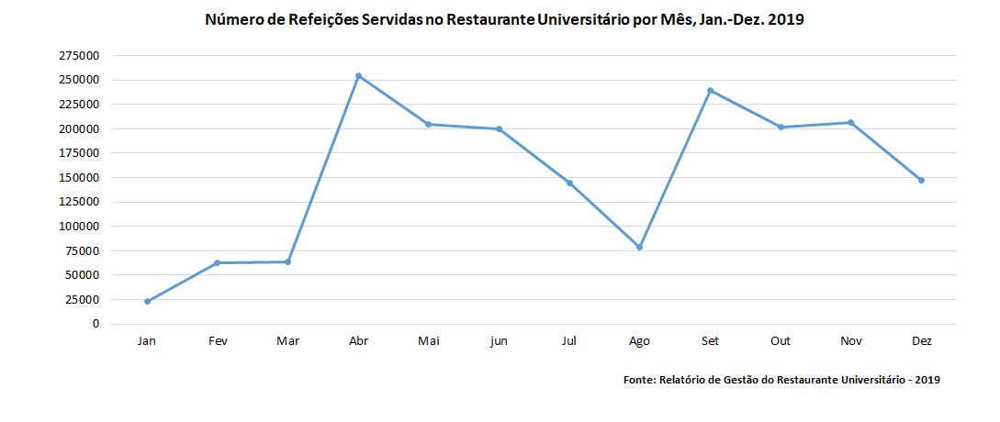
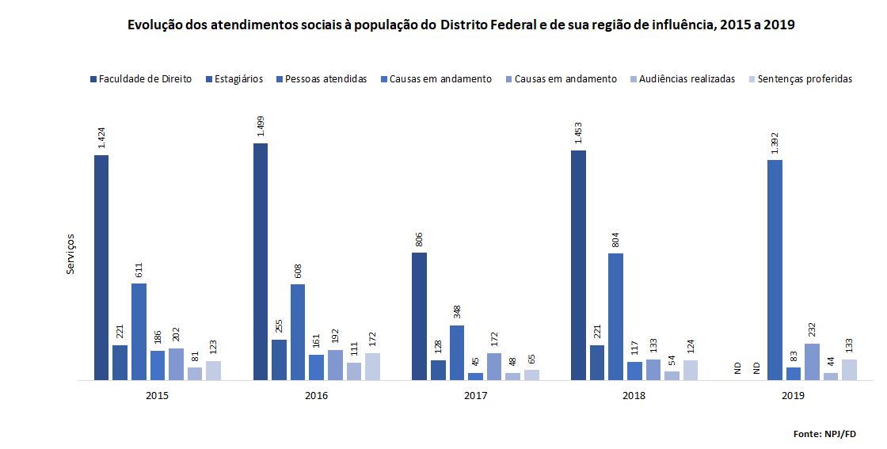

# Atividades Comunitárias {#comu}

```{r}
# define o fundo desta seção
fundo <- cores_anuario["comu"]
```

Faça o download de todas as tabelas desta seção:`r xfun::embed_file("dados_atividades_comunitarias/atividades_comunitarias.xlsx")`

<br>


## Decanato de Assuntos Comunitários (DAC) 

<br>

### Evolução da assistência estudantil, 2015 a 2019
```{r}
assistencia <- rio::import("dados_atividades_comunitarias/atividades_comunitarias.xlsx", sheet=1)

assistencia %>% map_df(~replace_na(., 0)) %>% tabela_geral("Evolução da assistência estudantil, 2015 a 2019", linhatotal =  FALSE, colunas = c("Indicadores","2015",	"2016",	"2017",	"2018",	"2019"), tamfonte = 14, fundo = fundo) %>% colorir(dados = assistencia) %>% footnote(general = "", general_title = "Fonte: DDS/DAC")

```

<br>

### Atividades e serviços ofertados à comunidade universitária, 2019
```{r}

dasu <- rio::import("dados_atividades_comunitarias/atividades_comunitarias.xlsx", sheet=2)

dasu %>% map_df(~replace_na(., 0)) %>% tabela_geral("Atividades e serviços ofertados à comunidade universitária, 2019", linhatotal =  FALSE, colunas = c("Unidade",	"Descrição",	"Nº de pessoas",	"Nº de Atendimentos"), tamfonte = 14, fundo = fundo) %>% colorir(dados = dasu) %>% footnote(general = "", general_title = "Fonte: DASU/DAC")

```

<br>

### Atividades comunitárias abertas à população do Distrito Federal e à de outros estados, 2015 a 2019
```{r}
atividade_comunitaria <- rio::import("dados_atividades_comunitarias/atividades_comunitarias.xlsx", sheet=3)

atividade_comunitaria %>% map_df(~replace_na(., 0)) %>% tabela_geral("Atividades comunitárias abertas à população do Distrito Federal e à de outros estados, 2015 a 2019", linhatotal =  FALSE, colunas = c("Atividade",	"Descrição",	"2015",	"2016",	"2017",	"2018",	"2019"), tamfonte = 14, fundo = fundo) %>% colorir(dados = atividade_comunitaria) %>% footnote(number = c("ND : Não Disponível","*Projetos acrescentados em 2019"), general = "", general_title = "Fonte: DEA/DAC")

```

<br>

## Restaurante Universitário (RU) 

<br>

### Recursos humanos, serviços e custos, Jan. – Dez. de 2019
```{r}

ru <- rio::import("dados_atividades_comunitarias/atividades_comunitarias.xlsx", sheet=4)

ru[8,2] <- 9.45

ru %>% 
  map_df(~replace_na(., 0)) %>% 
  tabela_geral("Recursos humanos, serviços e custos, Jan. – Dez. de 2019", linhatotal =  FALSE, tamfonte = 14, colunas = c("Descrição",	"Número"), fundo = fundo) %>% colorir(dados = ru) %>% footnote(general = "", general_title = "Fonte: RU")

```

<br>

### Número de refeições servidas no Restaurante Universitário por mês, Jan. – Dez. de 2019
```{r}
ru2 <- rio::import("dados_atividades_comunitarias/atividades_comunitarias.xlsx", sheet=5)

ru2 %>% map_df(~replace_na(., 0)) %>% tabela_geral("Número de refeições servidas no Restaurante Universitário por mês, Jan. – Dez. de 2019", linhatotal = TRUE, colunas = c("Meses","Desjejum",	"Almoço",	"Jantar",	"Total"), tamfonte = 14, fundo = fundo) %>% colorir(dados = ru2) %>% footnote(general = "", general_title = "Fonte: RU")

```
<br>

### Gráfico de Número de Refeições Servidas no Restaurante Universitário por Mês, Jan.-Dez. 2019
```{r fig.cap='Número de Refeições Servidas no Restaurante Universitário por Mês, Jan.-Dez. 2019'}


xfun::embed_file("graficos/at_comu/graf1.png")
```

<br>

### Núcleo de Práticas Jurídicas da Faculdade de Direito (NPJ/FD) {-}

<br>

### Evolução dos atendimentos sociais à população do Distrito Federal e de sua região de influência, 2015 a 2019
```{r}
fd <- rio::import("dados_atividades_comunitarias/atividades_comunitarias.xlsx", sheet=6)

fd %>% map_df(~replace_na(., 0)) %>% tabela_geral("Evolução dos atendimentos sociais à população do Distrito Federal e de sua região de influência, 2015 a 2019", linhatotal =  FALSE, colunas = c("Atendimentos",	"2015",	"2016",	"2017",	"2018",	"2019"),  tamfonte = 14, fundo = fundo) %>% colorir(dados = fd) %>% footnote(number = c("ND : Não Disponível"),general = "", general_title = "Fonte: NPJ/FD")

```

<br>

### Gráfico de Evolução dos atendimentos sociais à população do Distrito Federal e de sua região de influência, 2015 a 2019
```{r fig.cap='Evolução dos atendimentos sociais à população do Distrito Federal e de sua região de influência, 2015 a 2019'}


xfun::embed_file("graficos/at_comu/graf2.png")
```

<br>


## Centro de Atendimento e Estudos Psicológicos (CAEP/IP) 

<br>

### Atendimentos psicoterápicos à população do Distrito Federal e de sua região de influência por Mês, Jan. – Dez. 2019"
```{r}
caep <- rio::import("dados_atividades_comunitarias/atividades_comunitarias.xlsx", sheet=7)

caep %>% map_df(~replace_na(., 0)) %>% tabela_geral("Atendimentos psicoterápicos à população do Distrito Federal e de sua região de influência por Mês, Jan. – Dez. 2019", linhatotal =  TRUE, colunas = c("Meses", "Atendimentos *"), tamfonte = 14, fundo = fundo) %>% colorir(dados = caep) %>%  footnote(number= c("* Devido às restrições relacionadas a pandemia (COVID-19), não foi possível realizar a contagem mensal. "), general = "", general_title = "Fonte: CAEP/IP")

```

<br>

## Núcleo de apoio Psicopedagógico e Bem Estar do Estudante de Medicina (NAPEM/FM)

<br>

### Atendimentos psicopedagógicos aos estudantes de medicina da Universidade de Brasília por mês, Jan – Dez. de 2019
```{r}
napem <- rio::import("dados_atividades_comunitarias/atividades_comunitarias.xlsx", sheet=8)

napem %>% map_df(~replace_na(., 0)) %>% tabela_geral("Atendimentos psicopedagógicos aos estudantes de medicina da Universidade de Brasília por mês, Jan – Dez. de 2019", linhatotal =  TRUE, colunas = c("Meses", "Atendimentos Psicopedagógicos"), tamfonte = 14, fundo = fundo) %>% colorir(dados = napem) %>% footnote(general = "", general_title = "Fonte: NAPEM/FM")

```

<br>

