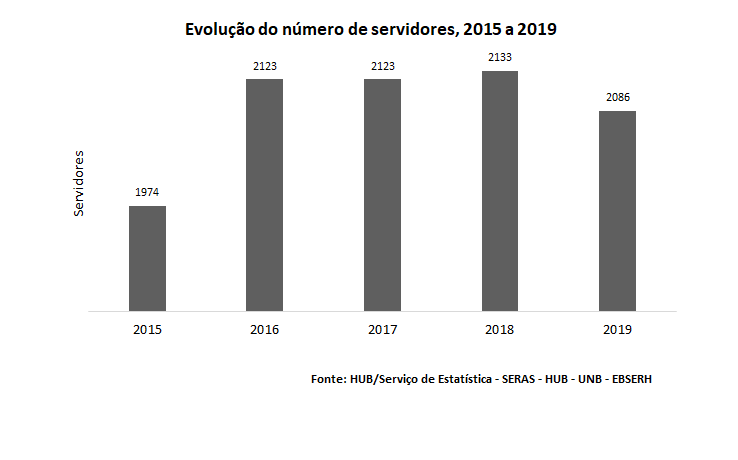
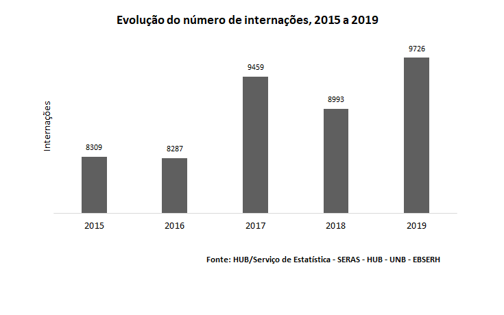
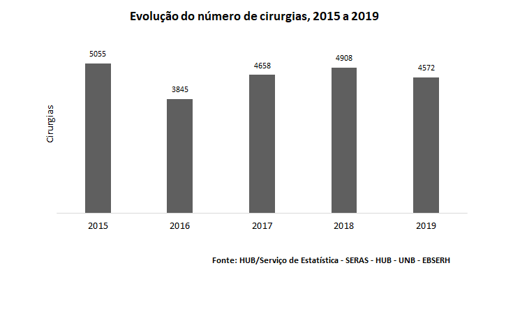
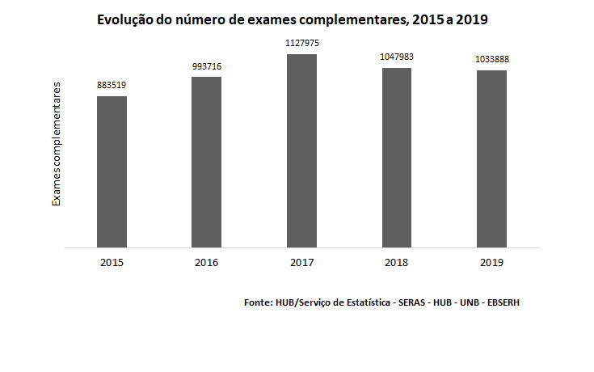
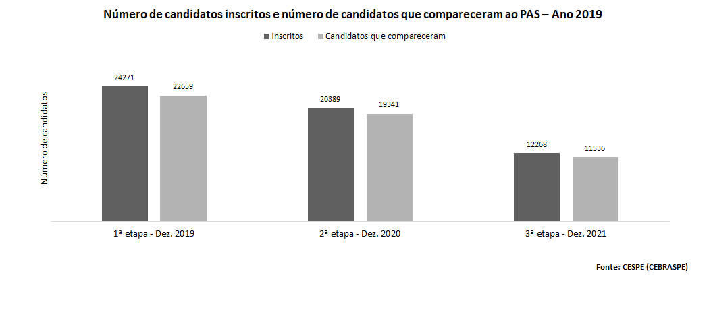
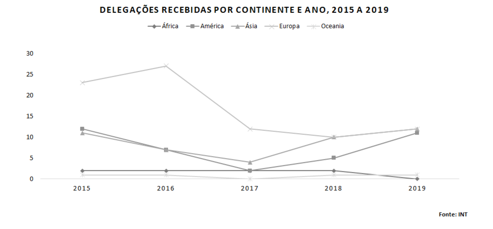
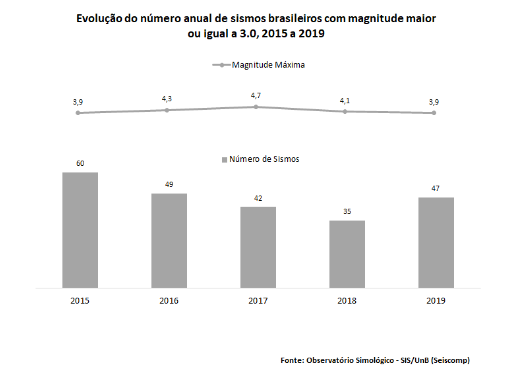

# Órgãos Complementares, Centros, Assessorias, Secretarias e Unidades Auxiliares {#org}

```{r}
# define o fundo desta seção
fundo <- cores_anuario["org"]
```

<br>
Faça o download de todas as tabelas desta seção:`r xfun::embed_file("dados_planejamento/planejamento.xlsx")`
<br>

## Hospital Universitário de Brasília (HUB) 

### Indicadores de produtividade, 2015 a 2019
```{r}
options(scipen = 9)
indicadores_prod <- rio::import("dados_orgaos_complementares_e_outros/orgaos_complementares_e_outros.xlsx", sheet=1)

indicadores_prod %>% map_df(~replace_na(., 0)) %>% tabela_geral("Indicadores de produtividade, 2015 a 2019", linhatotal = FALSE, colunas = c("Denominação", "2015","2016","2017","2018","2019"), tamfonte = 14, fundo = fundo) %>% colorir (dados = indicadores_prod) %>% footnote(number = c("Não inclui outros procedimentos médicos","Inclui: Nutrição, Enfermagem, Psicologia, Serviço Social e Fisioterapia.","Outros Exames: Espirografia, Gasometria, Broncoscopia, Endoscopia Digestiva Baixa, Reabilitação Pulmonar, Laboratório de Reumatologia e Urodinâmica."),general = "", general_title = "Fonte:HUB/Serviço de Estatística")

```

<br>

### Gráfico de Evolução do número de servidores, 2015 a 2019
```{r fig.cap='Evolução do número de servidores, 2015 a 2019', out.width='100%'}


xfun::embed_file("graficos/org_comp/graf1.png")
```

<br>

### Gráfico de Evolução do número de internações, 2015 a 2019
```{r fig.cap='Evolução do número de internações, 2015 a 2019', out.width='100%'}


xfun::embed_file("graficos/org_comp/graf2.png")
```

<br>

### Gráfico de Evolução do número de cirurgias, 2015 a 2019
```{r fig.cap='Evolução do número de cirurgias, 2015 a 2019', out.width='100%'}


xfun::embed_file("graficos/org_comp/graf3.png")
```

<br>

### Gráfico de Evolução do número de exames complementares, 2015 a 2019
```{r fig.cap='Evolução do número de exames complementares, 2015 a 2019', out.width='100%'}


xfun::embed_file("graficos/org_comp/graf4.png")
```

<br>

### Gráfico de Evolução do número de consultas, 2015 a 2019
```{r fig.cap='Evolução do número de consultas, 2015 a 2019', out.width='100%'}
include_graphics("graficos/org_comp/graf5.png")

xfun::embed_file("graficos/org_comp/graf5.png")
```

<br>

### Despesas realizadas pelo HUB, 2019
```{r}
despesas_hub <- rio::import("dados_orgaos_complementares_e_outros/orgaos_complementares_e_outros.xlsx", sheet=2)

despesas_hub %>% map_df(~replace_na(., 0)) %>%  tabela_geral("Despesas realizadas pelo HUB, 2019", linhatotal = TRUE, coluna = c("Despesas", "R$"), tamfonte = 14, fundo = fundo) %>% colorir (dados = despesas_hub) %>% footnote(general = "", general_title = "Fonte: Divisão de Administração e Finanças – DAF/HUB")

```

<br>

### Gráfico de despesas realizadas pelo HUB por natureza, 2019
```{r fig.cap='Despesas realizadas pelo HUB por natureza, 2019', out.width='100%'}
include_graphics("graficos/org_comp/graf6.png")

xfun::embed_file("graficos/org_comp/graf6.png")
```

<br>

### Programa de residência médica, 2019
```{r}
programa_residencia <- rio::import("dados_orgaos_complementares_e_outros/orgaos_complementares_e_outros.xlsx", sheet=3)

programa_residencia %>% map_df(~replace_na(., 0)) %>% tabela_geral("Programa de residência médica, 2019", linhatotal = TRUE, colunas = c("Áreas","C.H.  (créditos)","Registrados","Concluintes"), tamfonte = 14, fundo = fundo) %>% colorir (dados = programa_residencia) %>% footnote(general = "", general_title = "Fonte: Diretoria Adjunta de Ensino e Pesquisa - DAEP/HUB/UnB")

```

<br>

## Hospital Veterinário (HVET) 

### Atividades realizadas pelo HVET - Setor de Grandes Animais, 2019
```{r}
hvetao <- rio::import("dados_gerais/dados_gerais_tabelas.xlsx", sheet=23)

hvetao %>% map_df(~replace_na(., 0)) %>% tabela_geral("Atividades realizadas pelo HVET - Setor de Grandes Animais, 2019", linhatotal = TRUE, colunas = c("Mês",	"Cons. - Equino",	"Cons. - Ruminante",	"Cons. - Suíno",	"Cirurgias", "Exames"
), tamfonte = 14, fundo = fundo) %>% colorir (dados = hvetao) %>% footnote(general_title = "Fonte: Hospital Universitário (HVET)", general = "")

```

<br>

### Atividades realizadas pelo HVET - Setor de Pequenos Animais, 2019
```{r}
hvetinho <- rio::import("dados_gerais/dados_gerais_tabelas.xlsx", sheet=24)

hvetinho %>% map_df(~replace_na(., 0)) %>% tabela_geral("Atividades realizadas pelo HVET - Setor de Pequenos Animais, 2019", linhatotal = TRUE, colunas = c("Mês",	"Consultas - CCM",	"Consultas -CCF",	"Consultas -CCC",	"Consultas -COFT",	"Consultas -CCS",	"Total",	"Retornos - RCM",	"Retornos - RCF",	"Retornos - RCC",	"Retornos - ROFT",	"Retornos - RCS",	"Total",	"Cirurgias",	"Internações",	"Fisioterapia",	"Exames Laboratoriais"), tamfonte = 10, fundo = fundo) %>% colorir (dados = hvetinho) %>% footnote(general_title = "Fonte: Hospital Universitário (HVET)", general = "")

```

<br>

## Arquivo Central (ACE) 

### Custos (em reais), 2015 a 2019
```{r}
custos <- rio::import("dados_orgaos_complementares_e_outros/orgaos_complementares_e_outros.xlsx", sheet=4)

custos %>% map_df(~replace_na(., 0)) %>% tabela_geral("Custos (em reais), 2015 a 2019", linhatotal = FALSE, colunas = c("Tipo",	"2015",	"2016",	"2017",	"2018",	"2019"), tamfonte = 14, fundo = fundo) %>% colorir (dados = custos) %>% footnote(general = "", general_title = "Fonte: ACE")

```
<br>

### Projetos arquivísticos, 2015 a 2019
```{r}
projetos_ace <- rio::import("dados_orgaos_complementares_e_outros/orgaos_complementares_e_outros.xlsx", sheet=5)

projetos_ace %>%  map_df(~replace_na(., 0)) %>%  tabela_geral("Projetos arquivísticos, 2015 a 2019", colunas = c("Atividades",	"2015",	"2016",	"2017",	"2018",	"2019"), linhatotal = FALSE, tamfonte = 14, fundo = fundo) %>% colorir (dados = projetos_ace) %>% footnote(number = c("ND : Não Disponível"),general = "", general_title = "Fonte: ACE")

```
<br>

### Documentos tratados arquivisticamente , 2015 a 2019
```{r}
documentos_ace <- rio::import("dados_orgaos_complementares_e_outros/orgaos_complementares_e_outros.xlsx", sheet=6)

documentos_ace %>% map_df(~replace_na(., 0)) %>% tabela_geral("Documentos tratados arquivisticamente , 2015 a 2019", colunas = c("Atividades",	"2015",	"2016",	"2017",	"2018",	"2019"), linhatotal = FALSE, tamfonte = 14, fundo = fundo) %>% colorir (dados = documentos_ace) %>%  footnote (general = "", general_title = "Fonte: ACE")

```

<br>

## Biblioteca Central (BCE)

### Evolução dos serviços prestados pela BCE - empréstimo por tipo de material, 2015 a 2019
```{r}
bce_servicos <- rio::import("dados_orgaos_complementares_e_outros/orgaos_complementares_e_outros.xlsx", sheet=7)

bce_servicos %>% map_df(~replace_na(., 0)) %>% tabela_geral("Evolução dos serviços prestados pela BCE - empréstimo por tipo de material, 2015 a 2019", linhatotal = TRUE, colunas = c("Atendimento ao Público - Empréstimo por tipo de material",	"2015",	"2016",	"2017",	"2018",	"2019"), tamfonte = 14, fundo = fundo) %>% colorir (dados = bce_servicos ) %>% footnote (general = "", general_title = "Fonte: BCE")

```

<br>

### Evolução dos serviços prestados pela BCE - empréstimo por categoria de usuário, 2015 a 2019
```{r}

bce_servicos2 <- rio::import("dados_orgaos_complementares_e_outros/orgaos_complementares_e_outros.xlsx", sheet=8)

bce_servicos2 %>% map_df(~replace_na(., 0)) %>% tabela_geral("Evolução dos serviços prestados pela BCE - empréstimo por categoria de usuário, 2015 a 2019", colunas = c("Atendimento ao Público - Empréstimo por categoria de usuário",	"2015",	"2016",	"2017",	"2018",	"2019"), linhatotal = TRUE, tamfonte = 14, fundo = fundo) %>% colorir (dados = bce_servicos2) %>% footnote (general = "", general_title = "Fonte: BCE")
                                             
```

<br>

### Evolução dos serviços prestados pela BCE - tipos, 2015 a 2019
```{r}
bce_servicos3 <- rio::import("dados_orgaos_complementares_e_outros/orgaos_complementares_e_outros.xlsx", sheet=9)

bce_servicos3 %>% map_df(~replace_na(., 0)) %>% tabela_geral("Evolução dos serviços prestados pela BCE - tipos, 2015 a 2019", linhatotal = FALSE, colunas = c("Tipo",	"2015",	"2016",	"2017",	"2018",	"2019"), tamfonte = 14, fundo = fundo) %>% colorir (dados = bce_servicos3) %>% footnote (general = "",  general_title = "Fonte: BCE")

```

<br>

### Evolução dos serviços prestados pela BCE - acessos as bases de dados, 2015 a 2019
```{r}
bce_servicos4 <- rio::import("dados_orgaos_complementares_e_outros/orgaos_complementares_e_outros.xlsx", sheet=10)

bce_servicos4 %>% map_df(~replace_na(., 0)) %>% tabela_geral("Evolução dos serviços prestados pela BCE - acessos as bases de dados, 2015 a 2019", linhatotal = FALSE, colunas = c("Bases de dados (acessos)","2015","2016","2017","2018","2019"), tamfonte = 14, fundo = fundo) %>% colorir (dados = bce_servicos4) %>% footnote (general = "", general_title = "Fonte: BCE")

```

<br>

### Evolução dos serviços prestados pela BCE - comutação bibliográfica, 2015 a 2019
```{r}

bce_servicos5 <- rio::import("dados_orgaos_complementares_e_outros/orgaos_complementares_e_outros.xlsx", sheet=11)

bce_servicos5 %>% map_df(~replace_na(., 0)) %>% tabela_geral("Evolução dos serviços prestados pela BCE - comutação bibliográfica, 2015 a 2019", linhatotal = FALSE, colunas = c("Comutação Bibliográfica",	"2015",	"2016",	"2017",	"2018",	"2019"), tamfonte = 14, fundo = fundo) %>% colorir (dados = bce_servicos5) %>% footnote (general = "", general_title = "Fonte: BCE")

```

<br>

### Evolução dos serviços prestados pela BCE - informações adicionais, 2015 a 2019
```{r}

bce_servicos6 <- rio::import("dados_orgaos_complementares_e_outros/orgaos_complementares_e_outros.xlsx", sheet=12)

bce_servicos6 %>% map_df(~replace_na(., 0)) %>% tabela_geral("Evolução dos serviços prestados pela BCE - informações adicionais, 2015 a 2019", linhatotal = FALSE, colunas = c("Informações adicionais","2015","2016","2017","2018","2019"), tamfonte = 14, fundo = fundo) %>% colorir (dados = bce_servicos6) %>% footnote (general = "", general_title = "Fonte: BCE")

```
<br>

### Acervo da BCE - Acervo Biblioteca Central por Tipo de Material
```{r}

acervo_bce <- rio::import("dados_orgaos_complementares_e_outros/orgaos_complementares_e_outros.xlsx", sheet=13)

acervo_bce %>% map_df(~replace_na(., 0)) %>% tabela_geral("Acervo da BCE - Acervo Biblioteca Central por Tipo de Material¹, 2019", linhatotal = TRUE, colunas = c("Tipo",	"Títulos",	"Exemplares",	"Ex. Adic."), tamfonte = 14, fundo = fundo) %>% colorir (dados = acervo_bce ) %>%   footnote (general = "", general_title = "Fonte: BCE")

```

<br>

### Acervo da BCE - Acervo Digital, 2019
```{r}

acervo_bce1 <- rio::import("dados_orgaos_complementares_e_outros/orgaos_complementares_e_outros.xlsx", sheet=14)

acervo_bce1 %>% map_df(~replace_na(., 0)) %>% tabela_geral("Acervo da BCE - Acervo Digital, 2019", linhatotal = TRUE, colunas = c("Tipo",	"Títulos"), tamfonte = 14, fundo = fundo) %>% colorir (dados = acervo_bce1  ) %>% footnote (general = "", general_title = "Fonte: BCE")

```

<br>

### Acervo da BCE - Acervo Biblioteca  Planaltina por Tipo de Material, 2019
```{r}

acervo_bce2 <- rio::import("dados_orgaos_complementares_e_outros/orgaos_complementares_e_outros.xlsx", sheet=15)

acervo_bce2 %>% map_df(~replace_na(., 0)) %>% tabela_geral("Acervo da BCE - Acervo Biblioteca  Planaltina por Tipo de Material, 2019", linhatotal = TRUE, colunas = c("Tipo",	"Títulos",	"Exemplares",	"Ex. Adic."), tamfonte = 14, fundo = fundo) %>% colorir (dados = acervo_bce2) %>% footnote (general = "", general_title = "Fonte: BCE")

```

<br>

### Acervo da BCE - Acervo Biblioteca Ceilândia por tipo de Material, 2019
```{r}

acervo_bce3 <- rio::import("dados_orgaos_complementares_e_outros/orgaos_complementares_e_outros.xlsx", sheet=16)

acervo_bce3 %>% map_df(~replace_na(., 0)) %>% tabela_geral("Acervo da BCE - Acervo Biblioteca Ceilândia por tipo de Material, 2019", linhatotal = TRUE, colunas = c("Tipo",	"Títulos",	"Exemplares",	"Ex. Adic."), tamfonte = 14, fundo = fundo) %>% colorir (dados = acervo_bce3) %>%  footnote (general = "", general_title = "Fonte: BCE")

```

<br>

### Acervo da BCE - Acervo Biblioteca Gama por tipo de Material, 2019
```{r}

acervo_bce4 <- rio::import("dados_orgaos_complementares_e_outros/orgaos_complementares_e_outros.xlsx", sheet=17)

acervo_bce4 %>% map_df(~replace_na(., 0)) %>% tabela_geral("Acervo da BCE - Acervo Biblioteca Gama por tipo de Material, 2019", linhatotal = TRUE, colunas = c("Tipo",	"Títulos",	"Exemplares",	"Ex. Adic."), tamfonte = 14, fundo = fundo) %>% colorir (dados = acervo_bce4) %>%  footnote (general = "", general_title = "Fonte: BCE")

```

<br>

### Acervo da BCE - Acervo Biblioteca Darcy e Berta Ribeiro por tipo de Material, 2019
```{r}

acervo_bce5 <- rio::import("dados_orgaos_complementares_e_outros/orgaos_complementares_e_outros.xlsx", sheet=18)

acervo_bce5 %>% map_df(~replace_na(., 0)) %>% tabela_geral("Acervo da BCE - Acervo Biblioteca Darcy e Berta Ribeiro por tipo de Material, 2019", colunas = c("Tipo",	"Títulos",	"Exemplares",	"Ex. Adic."), linhatotal = TRUE, tamfonte = 14, fundo = fundo) %>% colorir (dados = acervo_bce5) %>% footnote (general = "",  general_title = "Fonte: BCE")

```

<br>

### Acervo da BCE - Acervo Biblioteca CEDIARTE  por tipo de Material, 2019
```{r}

acervo_bce6 <- rio::import("dados_orgaos_complementares_e_outros/orgaos_complementares_e_outros.xlsx", sheet=19)

acervo_bce6 %>% map_df(~replace_na(., 0)) %>% tabela_geral("Acervo da BCE - Acervo Biblioteca CEDIARTE  por tipo de Material, 2019", linhatotal = TRUE, colunas = c("Tipo",	"Títulos",	"Exemplares",	"Ex. Adic."), tamfonte = 14, fundo = fundo) %>% colorir (dados = acervo_bce6) %>% footnote (general = "", general_title = "Fonte: BCE")

```

<br>

### Acervo da BCE - Biblioteca Digital, 2019
```{r}
acervo_bce7 <- rio::import("dados_orgaos_complementares_e_outros/orgaos_complementares_e_outros.xlsx", sheet=20)

acervo_bce7 %>% map_df(~replace_na(., 0)) %>% tabela_geral("Acervo da BCE - Biblioteca Digital, 2019", colunas = c("Tipo","Títulos"), linhatotal = FALSE, tamfonte = 14, fundo = fundo) %>% colorir (dados = acervo_bce7) %>%   footnote (general = "",
           general_title = "Fonte: BCE")
```

<br>

### Acervo da BCE - Aquisição BCE, 2019
```{r}

acervo_bce8 <- rio::import("dados_orgaos_complementares_e_outros/orgaos_complementares_e_outros.xlsx", sheet=21)

acervo_bce8 %>% map_df(~replace_na(., 0)) %>% tabela_geral("Acervo da BCE - Aquisição BCE, 2019", linhatotal = TRUE, colunas = c("Tipo","Títulos", "Exemplares"), tamfonte = 14, fundo = fundo) %>% colorir (dados = acervo_bce8) %>% footnote (general = "", general_title = "Fonte: BCE")

```

<br>

### Acervo da BCE - Doação incorporada ao acervo , 2019
```{r}

acervo_bce9<- rio::import("dados_orgaos_complementares_e_outros/orgaos_complementares_e_outros.xlsx", sheet=22)

acervo_bce9 %>% map_df(~replace_na(., 0)) %>% tabela_geral("Acervo da BCE - Doação incorporada ao acervo , 2019", linhatotal = TRUE, colunas = c("Tipo",	"Títulos", "Exemplares"), tamfonte = 14, fundo = fundo) %>% colorir (dados = acervo_bce9) %>%  footnote (general = "", general_title = "Fonte: BCE")

```

<br>

### Acervo da BCE - Permuta , 2019
```{r}

acervo_bce14<- rio::import("dados_orgaos_complementares_e_outros/orgaos_complementares_e_outros.xlsx", sheet=23)

acervo_bce14 %>% map_df(~replace_na(., 0)) %>% tabela_geral("Acervo da BCE - Permuta , 2019", linhatotal = TRUE, tamfonte = 14, fundo = fundo) %>% colorir (dados = acervo_bce14) %>% footnote (general = "", general_title = "Fonte: BCE")

```

<br>

## Editora Universidade de Brasília (EDU) 

### Serviços executados, 2019
```{r}

servicos_edu<- rio::import("dados_orgaos_complementares_e_outros/orgaos_complementares_e_outros.xlsx", sheet=24)

servicos_edu %>% map_df(~replace_na(., 0)) %>% tabela_geral("Serviços executados, 2019", linhatotal = FALSE, colunas = c("Publicações", "2019"), tamfonte = 14, fundo = fundo) %>% colorir (dados = servicos_edu) %>% footnote (general = "", general_title = "Fonte: Editora Universidade de Brasília – EDU")

```

<br>

## Fazenda Água Limpa (FAL) 

### Frequentadores da FAL, 2019
```{r}

frequentadores_fal<- rio::import("dados_orgaos_complementares_e_outros/orgaos_complementares_e_outros.xlsx", sheet=25)

frequentadores_fal %>% map_df(~replace_na(., 0)) %>% tabela_geral("Frequentadores da FAL, 2019", linhatotal = TRUE, colunas = c("Mês","Professores","Visitantes","Alunos","Colaboradores","Total"), tamfonte = 14, fundo = fundo) %>% colorir (dados = frequentadores_fal) %>% footnote (general = "", general_title = "Fonte: FAL")

```

<br>

### Animais de Criação, 2019
```{r}

animais_fal<- rio::import("dados_orgaos_complementares_e_outros/orgaos_complementares_e_outros.xlsx", sheet=26)

animais_fal %>% map_df(~replace_na(., 0)) %>% tabela_geral("Animais de Criação, 2019", linhatotal = FALSE, colunas = c("Tipos de Animais","Quantidades"), tamfonte = 14, fundo = fundo) %>% colorir (dados = animais_fal) %>% footnote (general = "", general_title = "Fonte: FAL")

```

<br>

### Produção anual comercializada, 2019
```{r}

producao_fal<- rio::import("dados_orgaos_complementares_e_outros/orgaos_complementares_e_outros.xlsx", sheet=27)

producao_fal %>% map_df(~replace_na(., 0)) %>% tabela_geral("Produção anual comercializada, 2019", colunas = c("Produtos","Unidades","Quantidades"), linhatotal = FALSE, tamfonte = 14, fundo = fundo) %>% colorir (dados = producao_fal) %>%  footnote (general = "", general_title = "Fonte: FAL")

```

<br>

## Parque Científico e Tecnológico (PCTec) 

### Parque Científico e Tecnológico, 2019
```{r}

pctec <- rio::import("dados_orgaos_complementares_e_outros/orgaos_complementares_e_outros.xlsx", sheet=28)

pctec %>% map_df(~replace_na(., 0)) %>% tabela_geral("Parque Científico e Tecnológico, 2019", linhatotal = FALSE, colunas = c("Parque Científico e Tecnológico*",	"Quantidade"), tamfonte = 14, fundo = fundo) %>% colorir (dados = pctec) %>%  footnote (number = c("Áreas de atuação do Parque Científico e Tecnológico: Biotecnologia; Tecnologia da Informação e Comunicação – TICs; Eficiência Energética; Tecnologias Ambientais; Tecnologias da Educação, Inteligência Urbana","Estimativa dos empregos gerados pelas empresas residentes, sem contar os gerados nas fabricas das empresas  e os empregos gerados pelas contratações de ganhadores dos Hackatons e eventos realizados pelo PCTec"),general = "", general_title = "Fonte: PCTec")

```

<br>

### Eventos Acadêmicos, 2019
```{r}

eventos_pctec<- rio::import("dados_orgaos_complementares_e_outros/orgaos_complementares_e_outros.xlsx", sheet=29)

eventos_pctec %>% map_df(~replace_na(., 0)) %>% tabela_geral("Eventos Acadêmicos, 2019", colunas = c("Descrição","Quantidade de Participantes"), linhatotal = FALSE, tamfonte = 14, fundo = fundo) %>% colorir (dados = eventos_pctec) %>% footnote (general = "", general_title = "Fonte: PCTec")

```

<br>

## Centro de Informática (CPD) 

### Resumo Estatístico de Desempenho - Utilização dos Sistemas Administrativos/Acadêmicos Legados (VB e JAVA, em produção), 2019
```{r}

sistemas_cpd<- rio::import("dados_orgaos_complementares_e_outros/orgaos_complementares_e_outros.xlsx", sheet=30)

sistemas_cpd %>% map_df(~replace_na(., 0)) %>% tabela_geral("Resumo Estatístico de Desempenho - Utilização dos Sistemas Administrativos/Acadêmicos Legados (VB e JAVA, em produção), 2019", linhatotal = FALSE, colunas = c("Discriminação",	"1º trim.",	"2º trim.",	"3º trim.",	"4º trim.",	"Total"),tamfonte = 14, fundo = fundo) %>% colorir (dados = sistemas_cpd) %>% footnote (general = "", general_title = "Fonte: Serviço de Estratégia de Dados/CPD")

```

<br>

### Resumo Estatístico de Desempenho - Utilização dos Sistemas Integrados de Gestão - SIG (em produção)
```{r}

sistemas_cpd1<- rio::import("dados_orgaos_complementares_e_outros/orgaos_complementares_e_outros.xlsx", sheet=31)

sistemas_cpd1 %>% map_df(~replace_na(., 0)) %>% tabela_geral("Resumo Estatístico de Desempenho - Utilização dos Sistemas Integrados de Gestão - SIG (em produção), 2019", linhatotal = FALSE, tamfonte = 14, fundo = fundo) %>% colorir (dados = sistemas_cpd1) %>% footnote (general = "", general_title = "Fonte: Serviço de Estratégia de Dados/CPD")

```

<br>

## Centro de Seleção e Promoção de Eventos (CESPE) 

### Inscritos no Programa de Avaliação Seriada – PAS, por tipos de escolas, 2019
```{r}

inscritos_cespe<- rio::import("dados_orgaos_complementares_e_outros/orgaos_complementares_e_outros.xlsx", sheet=32)

inscritos_cespe %>% map_df(~replace_na(., 0)) %>% tabela_geral("Inscritos no Programa de Avaliação Seriada – PAS, por tipos de escolas, 2019", linhatotal = TRUE, colunas = c("Tipos de Escolas",	"N. de Candidatos Inscritos - 1ª Etapa",	"N. de Candidatos Inscritos - 2ª Etapa",	"N. de Candidatos Inscritos - 3ª Etapa"), tamfonte = 14, fundo = fundo) %>% colorir (dados = inscritos_cespe) %>%   footnote (general = "", general_title = "Fonte: CESPE (CEBRASPE)")

```

<br>

### Distribuição do Número de Inscritos no PAS, por Região – Ano 2019
```{r}

regiao_cespe<- rio::import("dados_orgaos_complementares_e_outros/orgaos_complementares_e_outros.xlsx", sheet=33)

regiao_cespe %>% map_df(~replace_na(., 0)) %>% tabela_geral("Distribuição do Número de Inscritos no PAS, por Região – Ano 2019", linhatotal = TRUE, colunas = c("Regiões",	"1ª Etapa",	"2ª Etapa",	"3ª Etapa"), tamfonte = 14, fundo = fundo) %>% colorir (dados = regiao_cespe) %>% footnote (general = "", general_title = "Fonte: CESPE (CEBRASPE)")

```

<br>

### Inscritos, candidatos que compareceram e percentual de frequência, por tipo de escola – Ano 2019
```{r}

inscritos_pas<- rio::import("dados_orgaos_complementares_e_outros/orgaos_complementares_e_outros.xlsx", sheet=34)

inscritos_pas %>% map_df(~replace_na(., 0)) %>% tabela_geral("Inscritos, candidatos que compareceram e percentual de frequência, por tipo de escola – Ano 2019", colunas = c("Descrição/ Etapas",	"Escolas Públicas - Distrito Federal", "Escolas Particulares -  Distrito Federal",	"Escola Militar -  Distrito Federal", "Escola Pública Federal -  Distrito Federal",	"Cursinho -  Distrito Federal", "Instituto Federal -  Distrito Federal",	"Escolas Públicas - Estados",	"Escolas Particulares -   Estados", "Escola Militar  - Estados",	"Escola Pública Federal  - Estados",	"Cursinho  - Estados",	"Instituto Federal   - Estados", "Escolas Não Cadastradas",	"Total"), linhatotal = FALSE, tamfonte = 14, fundo = fundo) %>% colorir (dados = inscritos_pas) %>% footnote (general = "", general_title = "Fonte: CESPE (CEBRASPE)")

```

<br>

### classificados e selecionados, por tipo de escola – Ano 2019
```{r}

classificados_pas<- rio::import("dados_orgaos_complementares_e_outros/orgaos_complementares_e_outros.xlsx", sheet=35)

classificados_pas %>% map_df(~replace_na(., 0)) %>% tabela_geral("classificados e selecionados, por tipo de escola – Ano 2019", linhatotal = FALSE, colunas = c("Descrição/ Etapas","Escolas Públicas - Distrito Federal","Escolas Particulares -  Distrito Federal",	"Escola Militar -  Distrito Federal","Instituto Federal -  Distrito Federal","Escolas Públicas - Estados",	"Escolas Particulares - Estados",	"Escola Militar  - Estados","Escola Pública Federal  - Estados","Instituto Federal - Estados",	"Escolas Não Cadastradas", "Total"), tamfonte = 14, fundo = fundo) %>% colorir (dados = classificados_pas) %>%   footnote (general = "", general_title = "Fonte: CESPE (CEBRASPE)")

```

<br>

### Gráfico de Número de candidatos inscritos e número de candidatos que compareceram ao PAS – Ano 2019
```{r fig.cap='Número de candidatos inscritos e número de candidatos que compareceram ao PAS – Ano 2019'}


xfun::embed_file("graficos/org_comp/graf7.png")
```

<br>
## Centro de Apoio ao Desenvolvimento Tecnológico (CDT) 

### Ações de ensino e extensão promovidas pelo CDT - Ensino na Graduação, 2019
```{r}

cdt_ensinograd<- rio::import("dados_orgaos_complementares_e_outros/orgaos_complementares_e_outros.xlsx", sheet=36)

cdt_ensinograd %>% map_df(~replace_na(., 0)) %>% tabela_geral("Ações de ensino e extensão promovidas pelo CDT - Ensino na Graduação, 2019", colunas = c("Disciplinas de Empreendedorismo Ofertadas",	"Quantidade de turmas",	"Índice de aproveitamento acadêmico"), linhatotal = FALSE, tamfonte = 14, fundo = fundo) %>% colorir (dados = cdt_ensinograd) %>% footnote (general = "", general_title = "Fonte: CDT")

```

<br>

### Ações de ensino e extensão promovidas pelo CDT - Ensino na Graduação (métrica acadêmica), 2019
```{r}

cdt_ensinograd2<- rio::import("dados_orgaos_complementares_e_outros/orgaos_complementares_e_outros.xlsx", sheet=37)

cdt_ensinograd2 %>% map_df(~replace_na(., 0)) %>% tabela_geral("Ações de ensino e extensão promovidas pelo CDT - Ensino na Graduação (métrica acadêmica), 2019", linhatotal = FALSE, colunas = c("Métricas acadêmicas",	"Quantidade"), tamfonte = 14, fundo = fundo) %>% colorir (dados = cdt_ensinograd2) %>% footnote (general = "", general_title = "Fonte: CDT")

```

<br>

### Ações de ensino e extensão promovidas pelo CDT - Ensino na Graduação (métrica acadêmica), 2019
```{r}
cdt_pos<- rio::import("dados_orgaos_complementares_e_outros/orgaos_complementares_e_outros.xlsx", sheet=38)

cdt_pos %>% map_df(~replace_na(., 0)) %>% tabela_geral("Ações de ensino e extensão promovidas pelo CDT - Ensino na Pós-Graduação (PROFNIT), 2019", linhatotal = FALSE, colunas = c("Ensino na Pós-Graduação (PROFNIT)", "Quantidade"), tamfonte = 14, fundo = fundo) %>% colorir (dados = cdt_pos) %>% footnote (general = "", general_title = "Fonte: CDT")

```

<br>

### Ações de ensino e extensão promovidas pelo CDT - Extensão, 2019
```{r}

cdt_extensao<- rio::import("dados_orgaos_complementares_e_outros/orgaos_complementares_e_outros.xlsx", sheet=39)

cdt_extensao %>% map_df(~replace_na(., 0)) %>% tabela_geral("Ações de ensino e extensão promovidas pelo CDT - Extensão, 2019", linhatotal = FALSE, colunas = c("EXTENSÃO",	"Quantidade"), tamfonte = 14, fundo = fundo) %>% colorir (dados = cdt_extensao) %>% footnote (general = "", general_title = "Fonte: CDT")

```

<br>

### Projetos de Pesquisa, Desenvolvimento e Inovação – PD&I do CDT, 2019
```{r}
cdt_pesquisa<- rio::import("dados_orgaos_complementares_e_outros/orgaos_complementares_e_outros.xlsx", sheet=40)
cdt_pesquisa %>% map_df(~replace_na(., 0)) %>% tabela_geral("Projetos de Pesquisa, Desenvolvimento e Inovação – PD&I do CDT, 2019", linhatotal = FALSE, colunas = c("Projetos de Pesquisa, Desenvolvimento e Inovação - PD&I","Quantidade"), tamfonte = 14, fundo = fundo) %>% colorir (dados = cdt_pesquisa) %>% footnote (general = "", general_title = "Fonte: CDT")

```

<br>

### Propriedade intelectual e transferência de tecnologia - Serviços Tecnológicos, 2019
```{r}

cdt_pi1<- rio::import("dados_orgaos_complementares_e_outros/orgaos_complementares_e_outros.xlsx", sheet=41)

cdt_pi1 %>% map_df(~replace_na(., 0)) %>% tabela_geral("Propriedade intelectual e transferência de tecnologia - Serviços Tecnológicos, 2019", linhatotal = FALSE, colunas = c("Serviços Tecnológicos",	"Quantidade"), tamfonte = 14, fundo = fundo) %>% colorir (dados = cdt_pi1) %>%  footnote (general = "", general_title = "Fonte: CDT")

```

<br>

### Propriedade intelectual e transferência de tecnologia - Propriedade Intelectual e Transferência de Tecnologia, 2019
```{r}
cdt_pi2<- rio::import("dados_orgaos_complementares_e_outros/orgaos_complementares_e_outros.xlsx", sheet=42)

cdt_pi2 %>% map_df(~replace_na(., 0)) %>% tabela_geral("Propriedade intelectual e transferência de tecnologia - Propriedade Intelectual e Transferência de Tecnologia, 2019", linhatotal = FALSE, colunas = c("Propriedade Intelectual e Transferência de Tecnologia",	"Quantidade"), tamfonte = 14, fundo = fundo) %>% colorir (dados = cdt_pi2) %>% footnote (general = "", general_title = "Fonte: CDT")

```

<br>

### Propriedade intelectual e transferência de tecnologia - Agência de Comercialização de Tecnologias, 2019
```{r}

cdt_pi3<- rio::import("dados_orgaos_complementares_e_outros/orgaos_complementares_e_outros.xlsx", sheet=43)

cdt_pi3 %>% map_df(~replace_na(., 0)) %>% tabela_geral("Propriedade intelectual e transferência de tecnologia - Agência de Comercialização de Tecnologias, 2019", linhatotal = FALSE, colunas = c("Agência de Comercialização de Tecnologias", "Quantidade"), tamfonte = 14, fundo = fundo) %>% colorir (dados = cdt_pi3) %>% footnote (general = "", general_title = "Fonte: CDT")

```

<br>

### Incubação de empresas, 2019
```{r}

cdt_incubacao<- rio::import("dados_orgaos_complementares_e_outros/orgaos_complementares_e_outros.xlsx", sheet=44)

cdt_incubacao %>% map_df(~replace_na(., 0)) %>% tabela_geral("Incubação de empresas, 2019", linhatotal = FALSE, colunas = c("Multincubadora de Empresas e Hotel de Projetos",	"Quantidade"), tamfonte = 14, fundo = fundo) %>% colorir (dados = cdt_incubacao) %>% footnote (general = "", general_title = "Fonte: CDT")

```

<br>

## Centro de Estudos Avançados e Multidisciplinares (CEAM) 

### Atividades desenvolvidas pelo CEAM por meio dos Núcleos Temáticos -  eventos de extensão realizados: cursos, minicursos e oficinas, 2019
```{r}

ceam_extensao<- rio::import("dados_orgaos_complementares_e_outros/orgaos_complementares_e_outros.xlsx", sheet=45)

ceam_extensao %>% map_df(~replace_na(., 0)) %>% tabela_geral("Atividades desenvolvidas pelo CEAM por meio dos Núcleos Temáticos -  eventos de extensão realizados: cursos, minicursos e oficinas, 2019", linhatotal = FALSE, colunas = c("Nome do Curso",	"Núcleo Responsável"), tamfonte = 14, fundo = fundo) %>% colorir (dados = ceam_extensao) %>% footnote (general = "", general_title = "Fonte: CEAM")

```

<br>

### Atividades desenvolvidas pelo CEAM por meio dos Núcleos Temáticos - projetos de ação contínua, 2019
```{r}

ceam_projetos<- rio::import("dados_orgaos_complementares_e_outros/orgaos_complementares_e_outros.xlsx", sheet=46)

ceam_projetos %>% map_df(~replace_na(., 0)) %>% tabela_geral("Atividades desenvolvidas pelo CEAM por meio dos Núcleos Temáticos - projetos de ação contínua, 2019", linhatotal = FALSE, colunas = c("Nome do Projeto",	"Núcleo Responsável"), tamfonte = 14, fundo = fundo) %>% colorir (dados = ceam_projetos) %>% footnote (general = "", general_title = "Fonte: CEAM")

```

<br>

### Atividades desenvolvidas pelo CEAM por meio dos Núcleos Temáticos - cursos de especialização, 2019
```{r}
ceam_especializacao<-rio::import("dados_orgaos_complementares_e_outros/orgaos_complementares_e_outros.xlsx", sheet=47)

ceam_especializacao %>% map_df(~replace_na(., 0)) %>% tabela_geral("Atividades desenvolvidas pelo CEAM por meio dos Núcleos Temáticos - cursos de especialização, 2019", linhatotal = FALSE, colunas = c("Código",	"Nome",	"Núcleo Responsável"),  tamfonte = 14, fundo = fundo) %>% colorir (dados = ceam_especializacao) %>% footnote (general = "", general_title = "Fonte: CEAM")

```

<br>

### Atividades desenvolvidas pelo CEAM por meio dos Núcleos Temáticos - Eventos Acadêmicos, 2019
```{r}

ceam_eventos<- rio::import("dados_orgaos_complementares_e_outros/orgaos_complementares_e_outros.xlsx", sheet=48)

ceam_eventos %>% map_df(~replace_na(., 0)) %>% tabela_geral("Atividades desenvolvidas pelo CEAM por meio dos Núcleos Temáticos - Eventos Acadêmicos, 2019", linhatotal = FALSE, colunas = c("Cursos/Palestras/Eventos","Período de Realização",	"Participantes"),  tamfonte = 14, fundo = fundo) %>% colorir (dados = ceam_eventos) %>% footnote (general = "", general_title = "Fonte: CEAM")

```


<br>

## Centro de Excelência em Turismo (CET) 

### Cursos, palestras e eventos eealizados pelo CET, 2019
```{r}

cet_cursos<- rio::import("dados_orgaos_complementares_e_outros/orgaos_complementares_e_outros.xlsx", sheet=49)

cet_cursos %>% map_df(~replace_na(., 0)) %>%   tabela_geral("Cursos, palestras e eventos eealizados pelo CET, 2019", linhatotal = FALSE, colunas = c("Cursos/Palestras/Eventos","Período de Realização","Participantes"), tamfonte = 14, fundo = fundo) %>% colorir (dados = cet_cursos) %>% footnote (general = "", general_title = "Fonte: CET")

```

<br>

### Projetos de pesquisa do CET, 2019
```{r}

cet_pesquisa<- rio::import("dados_orgaos_complementares_e_outros/orgaos_complementares_e_outros.xlsx", sheet=50)

cet_pesquisa %>% map_df(~replace_na(., 0)) %>% tabela_geral("Projetos de pesquisa do CET, 2019", linhatotal = FALSE, colunas = c("Projeto de Pesquisa",	"Área de Concentração",	"Natureza do Projeto"),  tamfonte = 14, fundo = fundo) %>% colorir (dados = cet_pesquisa) %>% footnote (general = "", general_title = "Fonte: CET")

```

<br>

### Produção científica, cultural e artística do CET, 2019
```{r}

cet_producao<- rio::import("dados_orgaos_complementares_e_outros/orgaos_complementares_e_outros.xlsx", sheet=51)

cet_producao %>% map_df(~replace_na(., 0)) %>% tabela_geral("Produção científica, cultural e artística do CET, 2019", linhatotal = FALSE, colunas = c("Título",	"Autor Principal","Tipo de Produção","Subtipo de Produção"), tamfonte = 14, fundo = fundo) %>% colorir (dados = cet_producao) %>% footnote (general = "", general_title = "Fonte: CET")
```

<br>

## Centro de Educação a Distância (CEAD) 

### Atividades de extensão desenvolvidas pelo CEAD - cursos de extensão, 2019
```{r}
cead_extensao<- rio::import("dados_orgaos_complementares_e_outros/orgaos_complementares_e_outros.xlsx", sheet=52)

cead_extensao %>% map_df(~replace_na(., 0)) %>% tabela_geral("Atividades de extensão desenvolvidas pelo CEAD - cursos de extensão, 2019", linhatotal = TRUE, colunas = c("Cursos",	"Alunos Inscritos",	"Alunos Aprovados"),  tamfonte = 14, fundo = fundo) %>% colorir (dados = cead_extensao) %>% footnote (general = "", general_title = "Fonte: CEAD")

```

<br>

### Atividades de extensão desenvolvidas pelo CEAD - cursos de especialização (Programa UAB), 2019
```{r}

cead_especializacao<-rio::import("dados_orgaos_complementares_e_outros/orgaos_complementares_e_outros.xlsx", sheet=53)

cead_especializacao %>% map_df(~replace_na(., 0)) %>% tabela_geral("Atividades de extensão desenvolvidas pelo CEAD - cursos de especialização (Programa UAB), 2019", linhatotal = TRUE, colunas = c("Cursos",	"Alunos Inscritos",	"Alunos Aprovados"), tamfonte = 14, fundo = fundo) %>% colorir (dados = cead_especializacao) %>% footnote (general = "", general_title = "Fonte: CEAD")

```

<br>

## Centro de Produção Cultural e Educativa (CPCE) 

### Principais atividades do CPCE por mês, 2019
```{r}

cpce<- rio::import("dados_orgaos_complementares_e_outros/orgaos_complementares_e_outros.xlsx", sheet=54)

cpce %>% map_df(~replace_na(., 0)) %>% tabela_geral("Principais atividades do CPCE por mês, 2019", linhatotal = TRUE, colunas = c("Mês",	"Íntegras ao Vivo/WEB",	"Programas",	"Reportagens",	"Informes",	"Vinhetas",	"Extras",	"Total"), tamfonte = 14, fundo = fundo) %>% colorir (dados = cpce) %>% footnote (general = "", general_title = "Fonte: CPCE")

```

<br>

## Assessoria de Assuntos Internacionais (INT) 

### Visitas de cortesia, delegações e eventos por continente e países - África, 2015 a 2019"
```{r}

int_africa<- rio::import("dados_orgaos_complementares_e_outros/orgaos_complementares_e_outros.xlsx", sheet=55)

int_africa %>% map_df(~replace_na(., 0)) %>% tabela_geral("Visitas de cortesia, delegações e eventos por continente e países - África, 2015 a 2019", linhatotal = TRUE, colunas = c("Países",	"2015",	"2016", "2017",	"2018",	"2019",	"Total"), tamfonte = 14, fundo = fundo) %>% colorir (dados = int_africa) %>% footnote (general = "", general_title = "Fonte: Int")

```

<br>

### Visitas de cortesia, delegações e eventos por continente e países - América, 2015 a 2019"
```{r}

int_america<- rio::import("dados_orgaos_complementares_e_outros/orgaos_complementares_e_outros.xlsx", sheet=56)

int_america %>% map_df(~replace_na(., 0)) %>% tabela_geral("Visitas de cortesia, delegações e eventos por continente e países - América, 2015 a 2019", linhatotal = TRUE, colunas = c("Países",	"2015",	"2016", "2017",	"2018",	"2019",	"Total"), tamfonte = 14, fundo = fundo) %>% colorir (dados = int_america) %>% footnote (general = "", general_title = "Fonte: Int")

```

<br>

### Visitas de cortesia, delegações e eventos por continente e países - Ásia, 2015 a 2019"
```{r}

int_asia<- rio::import("dados_orgaos_complementares_e_outros/orgaos_complementares_e_outros.xlsx", sheet=57)

int_asia %>% map_df(~replace_na(., 0)) %>% tabela_geral("Visitas de cortesia, delegações e eventos por continente e países - Ásia, 2015 a 2019", linhatotal = TRUE, colunas = c("Países",	"2015",	"2016", "2017",	"2018",	"2019",	"Total"), tamfonte = 14, fundo = fundo) %>% colorir (dados = int_asia) %>% footnote (general = "", general_title = "Fonte: Int")

```

<br>

### Visitas de cortesia, delegações e eventos por continente e países - Europa, 2015 a 2019"
```{r}

int_europa<- rio::import("dados_orgaos_complementares_e_outros/orgaos_complementares_e_outros.xlsx", sheet=58)

int_europa %>% map_df(~replace_na(., 0)) %>% tabela_geral("Visitas de cortesia, delegações e eventos por continente e países - Europa, 2015 a 2019", linhatotal = TRUE, colunas = c("Países",	"2015",	"2016", "2017",	"2018",	"2019",	"Total"), tamfonte = 14, fundo = fundo) %>% colorir (dados = int_europa) %>% footnote (general = "", general_title = "Fonte: Int")

```

<br>

### Visitas de cortesia, delegações e eventos por continente e países - Oceania, 2015 a 2019
```{r}

int_oceania<- rio::import("dados_orgaos_complementares_e_outros/orgaos_complementares_e_outros.xlsx", sheet=59)

int_oceania %>% map_df(~replace_na(., 0)) %>% tabela_geral("Visitas de cortesia, delegações e eventos por continente e países - Oceania, 2015 a 2019", linhatotal = TRUE, colunas = c("Países",	"2015",	"2016", "2017",	"2018",	"2019",	"Total"), tamfonte = 14, fundo = fundo) %>% colorir (dados = int_oceania) %>% footnote (general = "", general_title = "Fonte: Int")

```

<br>

### Delegações recebidas, 2015 a 2019
```{r}

int_delegacoes<- rio::import("dados_orgaos_complementares_e_outros/orgaos_complementares_e_outros.xlsx", sheet=60)

int_delegacoes %>%  map_df(~replace_na(., 0)) %>% tabela_geral("Delegações recebidas, 2015 a 2019", linhatotal = TRUE, colunas = c("Instituições",	"2015",	"2016", "2017",	"2018",	"2019", "Total"), tamfonte = 14, fundo = fundo) %>% colorir (dados = int_delegacoes ) %>% footnote (general = "", general_title = "Fonte: Int")

```

<br>

### Gráfico de Delegações recebidas por continente e ano, 2015 a 2019
```{r fig.cap='Delegações recebidas por continente e ano, 2015 a 2019'}


xfun::embed_file("graficos/org_comp/graf8.png")
```

<br>

## Secretaria de Patrimônio Imobiliário (SPI) 

### Arrecadação com aluguéis (R$ 1,00), 2015 a 2019
```{r}

sgp_arrecadacoes<- rio::import("dados_orgaos_complementares_e_outros/orgaos_complementares_e_outros.xlsx", sheet=61)

sgp_arrecadacoes %>% map_df(~replace_na(., 0)) %>% tabela_geral("Arrecadação com aluguéis (R$ 1,00), 2015 a 2019", linhatotal = TRUE, colunas = c("Arrecadação",	"2015",	"2016",	"2017",	"2018",	"2019"), tamfonte = 14, fundo = fundo) %>% colorir (dados = sgp_arrecadacoes) %>% footnote (general = "", general_title = "Fonte: SPI")

```

<br>

### Imóveis da FUB para locação, 2015 a 2019
```{r}

sgp_imoveis<- rio::import("dados_orgaos_complementares_e_outros/orgaos_complementares_e_outros.xlsx", sheet=62)

sgp_imoveis %>% map_df(~replace_na(., 0)) %>% tabela_geral("Imóveis da FUB para locação, 2015 a 2019", linhatotal = TRUE, colunas = c("Imóveis",	"2015",	"2016",	"2017",	"2018",	"2019"), tamfonte = 14, fundo = fundo) %>% colorir (dados = sgp_imoveis) %>% footnote (general = "", general_title = "Fonte: SPI")

```

<br>

### Outros imóveis, 2019
```{r}

sgp_outros<- rio::import("dados_orgaos_complementares_e_outros/orgaos_complementares_e_outros.xlsx", sheet=63)

sgp_outros %>% map_df(~replace_na(., 0)) %>% tabela_geral("Outros imóveis, 2019", linhatotal = TRUE, colunas = c("Especificação",	"2019"), tamfonte = 14, fundo = fundo) %>% colorir (dados = sgp_outros) %>% footnote (general = "", general_title = "Fonte: SPI")

```

<br>

## Secretaria de Infraestrutura (INFRA) 

### Atividades desenvolvidas pela INFRA, 2019
```{r}

infra_atividades<- rio::import("dados_orgaos_complementares_e_outros/orgaos_complementares_e_outros.xlsx", sheet=64)

infra_atividades %>% map_df(~replace_na(., 0)) %>%  tabela_geral("Atividades desenvolvidas pela INFRA, 2019", linhatotal = TRUE, colunas = c("Atividades","	Qtd."), tamfonte = 14, fundo = fundo) %>% colorir (dados = infra_atividades) %>% footnote (general = "", general_title = "Fonte: INFRA")

```

<br>

### Eventos realizados no auditório do SG10-CEPLAN, 2019
```{r}

infra_eventos<- rio::import("dados_orgaos_complementares_e_outros/orgaos_complementares_e_outros.xlsx", sheet=65)

infra_eventos %>% map_df(~replace_na(., 0)) %>% tabela_geral("Eventos realizados no auditório do SG10-CEPLAN, 2019", linhatotal = TRUE, colunas = c("Evento",	"Número de Eventos",	"Quantidade de Participantes"), tamfonte = 14, fundo = fundo) %>% colorir (dados = infra_eventos) %>% footnote (general = "", general_title = "Fonte: INFRA")

```

<br>

### Relatório de Obras - Obras e Reformas para atender portadores de Necessidades Especiais nos Campi e Unidades Dispersas da UnB, 2019
```{r}

infra_obras1<- rio::import("dados_orgaos_complementares_e_outros/orgaos_complementares_e_outros.xlsx", sheet=66)

infra_obras1 %>% tabela_geral("Relatório de Obras - Obras e Reformas para atender portadores de Necessidades Especiais nos Campi e Unidades Dispersas da UnB, 2019", linhatotal = FALSE, colunas = c("Obra Direta",	"Inicio",	"Término",	"Local",	"Centro de Custo",	"Situação",	"Área"), tamfonte = 14, fundo = fundo) %>% colorir (dados = infra_obras1) %>% footnote (general = "", general_title = "Fonte: INFRA")

```

<br>

### Relatório de Obras - Atividades realizadas pela INFRA / DOB, 2019
```{r}

infra_obras2<- rio::import("dados_orgaos_complementares_e_outros/orgaos_complementares_e_outros.xlsx", sheet=67)

infra_obras2 %>% tabela_geral("Relatório de Obras - Atividades realizadas pela INFRA / DOB, 2019", linhatotal = FALSE, colunas = c("Obra Direta",	"Inicio",	"Término",	"Local",	"Centro de Custo",	"Situação",	"Área"), tamfonte = 14, fundo = fundo) %>% colorir (dados = infra_obras2) %>% footnote (general = "", general_title = "Fonte: INFRA")

```

<br>

## Prefeitura do Campus (PRC) 

### Manutenção: ordens de serviço executadas, 2015 a 2019
```{r}

prc1<- rio::import("dados_orgaos_complementares_e_outros/orgaos_complementares_e_outros.xlsx", sheet=68)

prc1 %>% map_df(~replace_na(., 0)) %>% tabela_geral("Manutenção: ordens de serviço executadas, 2015 a 2019", linhatotal = FALSE, colunas = c("Setor",	"2015",	"2016",	"2017",	"2018",	"2019"), tamfonte = 14, fundo = fundo) %>% colorir (dados = prc1)  %>% footnote (general = "", general_title = "Fonte: PRC/DIMAP - SICOS e SIPAC")

```

<br>

### Atividades da Diretoria de Manutenção de Equipamentos e Transportes (PRC/DIMEQ) - QUANTIDADE DE ORDENS DE SERVIÇOS FINALIZADAS POR TIPO SERVIÇO/EQUIPAMENTO, 2019
```{r}

prc2<- rio::import("dados_orgaos_complementares_e_outros/orgaos_complementares_e_outros.xlsx", sheet=69)

prc2 %>% map_df(~replace_na(., 0)) %>% tabela_geral("Atividades da Diretoria de Manutenção de Equipamentos e Transportes (PRC/DIMEQ) - QUANTIDADE DE ORDENS DE SERVIÇOS FINALIZADAS POR TIPO SERVIÇO/EQUIPAMENTO, 2019", linhatotal = TRUE, colunas = c("Item",	"Serviço/ Equipamento",	"Finalizados em 2019"), tamfonte = 14, fundo = fundo) %>% colorir (dados = prc2) %>%  footnote (general = "",    general_title = "Fonte: PPRC/DIMEQ")

```

<br>

### Atividades realizadas pela Coordenação de Zeladoria e Mudança, 2019
```{r}

prc3<- rio::import("dados_orgaos_complementares_e_outros/orgaos_complementares_e_outros.xlsx", sheet=70)

prc3 %>%   map_df(~replace_na(., 0)) %>% tabela_geral("Atividades realizadas pela Coordenação de Zeladoria e Mudança, 2019", linhatotal = FALSE, colunas = c("Item",	"Atividades realizadas pela Coordenação de Zeladoria e Mudança",	"Qtd.",	"Locais"), tamfonte = 14, fundo = fundo) %>% colorir (dados = prc3) %>% footnote (general = "", general_title = "Fonte: PRC/DIMAP/CZM")
```

<br>

## Observatório Sismológico (SIS) 

### Evolução do número anual de sismos brasileiros com magnitude maior ou igual a 3,0, 2015 a 2019
```{r}

sis<- rio::import("dados_orgaos_complementares_e_outros/orgaos_complementares_e_outros.xlsx", sheet=71)

sis %>% map_df(~replace_na(., 0)) %>% tabela_geral("Evolução do número anual de sismos brasileiros com magnitude maior ou igual a 3,0, 2015 a 2019", linhatotal = FALSE, colunas = c("Ano",	"Número de Sismos",	"Magnitude Máxima"), tamfonte = 14, fundo = fundo) %>% colorir (dados = sis)  %>% footnote (general = "", general_title = "Fonte: SISBRA e Boletim Sísmico / SIS")

```

<br>

### Visitantes da mostra sismológica do observatório sismológico - SIS, 2016 a 2019
```{r}

sis2<- rio::import("dados_orgaos_complementares_e_outros/orgaos_complementares_e_outros.xlsx", sheet=72)

sis2 %>% map_df(~replace_na(., 0)) %>% tabela_geral("Visitantes da mostra sismológica do observatório sismológico - SIS, 2016 a 2019", linhatotal = FALSE, colunas = c("Ano", "Visitantes"),  tamfonte = 14, fundo = fundo) %>% colorir (dados = sis2) %>% footnote (number = c("ND : Não Disponível","*A Mostra esteve fechada para reforma durante um período do ano de 2019."),general = "", general_title = "Fonte: SIS")

```

<br>

### Gráfico de Evolução do número anual de sismos brasileiros com magnitude maior ou igual a 3.0, 2015 a 2019 
```{r fig.cap='Evolução do número anual de sismos brasileiros com magnitude maior ou igual a 3.0, 2015 a 2019', out.width='100%'}



xfun::embed_file("graficos/org_comp/graf9.png")
```

<br>