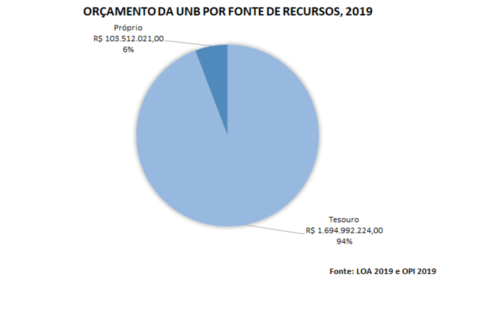
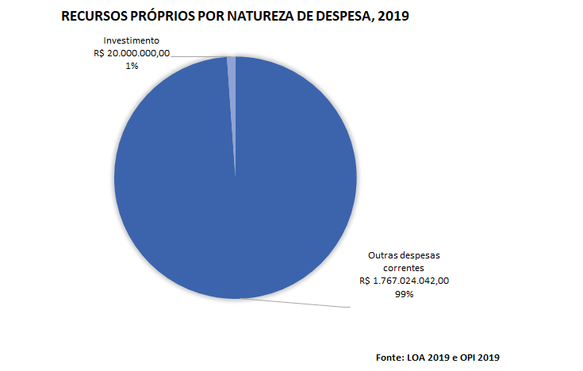

# Planejamento, Execução Orçamentária e Convênios {#dpo}

```{r}
# define o fundo desta seção
fundo <- cores_anuario["dpo"]
```

Faça o download de todas as tabelas desta seção: `r xfun::embed_file("dados_planejamento/planejamento.xlsx")`

<br>

## Orçamento da FUB – por grupos de despesas nas fontes Tesouro e Recursos Próprios (PLOA), 2019
```{r}
options(scipen = 9)
dpo <- rio::import("dados_planejamento/planejamento.xlsx", sheet=1)

dpo %>% map_df(~replace_na(., 0)) %>% tabela_geral("Orçamento da FUB – por grupos de despesas nas fontes Tesouro e Recursos Próprios (PLOA), 2019", linhatotal =  FALSE, colunas = c("Item",	"GRUPO DE DESPESA",	"TESOURO",	"(%)",	"PRÓPRIOS",	"(%)", 	"TOTAL",	"(%)"), tamfonte = 10, fundo = fundo) %>% colorir(dados = dpo) %>% footnote(general = "", general_title = "Fonte: LOA 2019 e OPI2019.")
```

<br>

## Gráfico de Orçamento da UnB por fonte de recursos, 2019
```{r fig.cap='Orçamento da UnB por fonte de recursos, 2019'}


xfun::embed_file("graficos/plan/graf1.png")
```

<br>

## Gráfico de Recursos de Tesouro por Natureza de Despesa, 2019

<br>

## Gráfico de Recursos Próprios por Natureza de Despesa, 2019
```{r fig.cap='Recursos Próprios por Natureza de Despesa, 2019'}


xfun::embed_file("graficos/plan/graf3.png")
```

<br>


## Instrumentos Assinados - Natureza, 2019
```{r}

dpa1<- rio::import("dados_planejamento/planejamento.xlsx", sheet=2)

dpa1 %>% tabela_geral("Instrumentos Assinados - Natureza, 2019", linhatotal = TRUE, colunas = c("Natureza", "Quantidade"), tamfonte = 10, fundo = fundo) %>% colorir(dados = dpa1) %>%  footnote(general = "", general_title = "Fonte: DPA")

```

<br>

## Instrumentos Assinados - Esfera Administrativa, 2019
```{r}
dpa2<- rio::import("dados_planejamento/planejamento.xlsx", sheet=3)
dpa2 %>% map_df(~replace_na(., 0)) %>% tabela_geral("Instrumentos Assinados - Esfera Administrativa, 2019", linhatotal =  FALSE, colunas = c("Esfera Administrativa", "Quantidade"), tamfonte = 10, fundo = fundo) %>% colorir(dados = dpa2) %>% footnote(general = "", general_title = "Fonte: DPA")
```

<br>

## Instrumentos Assinados - Instrumento, 2019
```{r}
dpa3<- rio::import("dados_planejamento/planejamento.xlsx", sheet=4)
dpa3 %>% 
  map_df(~replace_na(., 0)) %>% 
  tabela_geral("Instrumentos Assinados - Instrumento, 2019", linhatotal =  TRUE,colunas = c("Instrumento", "Quantidade"), tamfonte = 10, fundo = fundo) %>% colorir(dados = dpa3) %>% footnote(general = "", general_title = "Fonte: DPA")
```

<br>

## Instrumentos Assinados (Nacionais e Internacionais), 2015 a 2019
```{r}
dpa4<- rio::import("dados_planejamento/planejamento.xlsx", sheet=5)
dpa4 %>% 
  map_df(~replace_na(., 0)) %>% tabela_geral("Instrumentos Assinados (Nacionais e Internacionais), 2015 a 2019", linhatotal =  TRUE, colunas = c("Convênios", "2015", "2016", "2017", "2018", "2019"), tamfonte = 10, fundo = fundo) %>% colorir(dados = dpa4) %>% footnote(general = "",general_title = "Fonte: DPA")
```

<br>