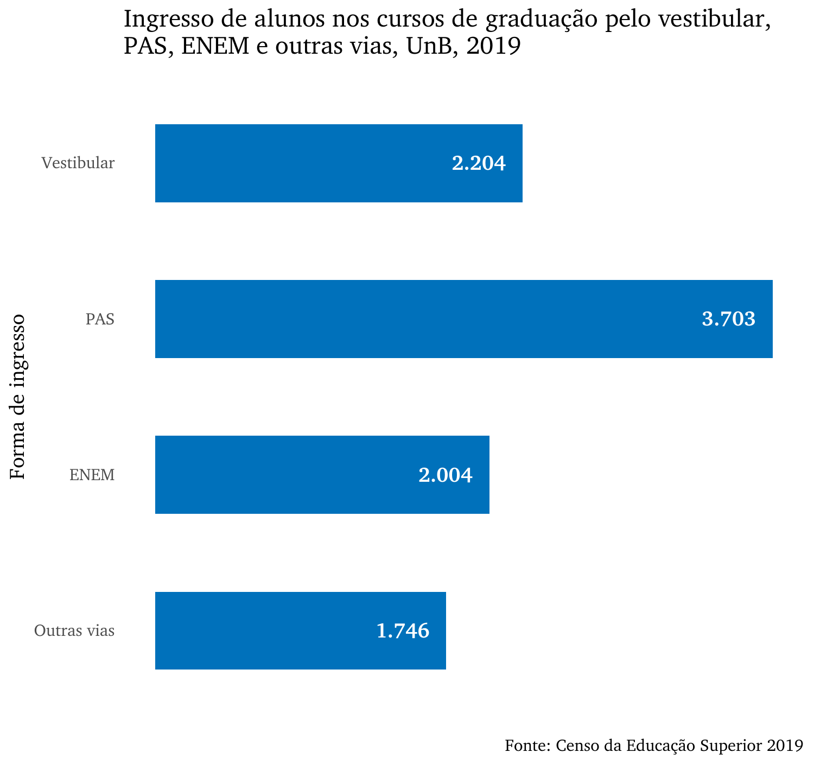
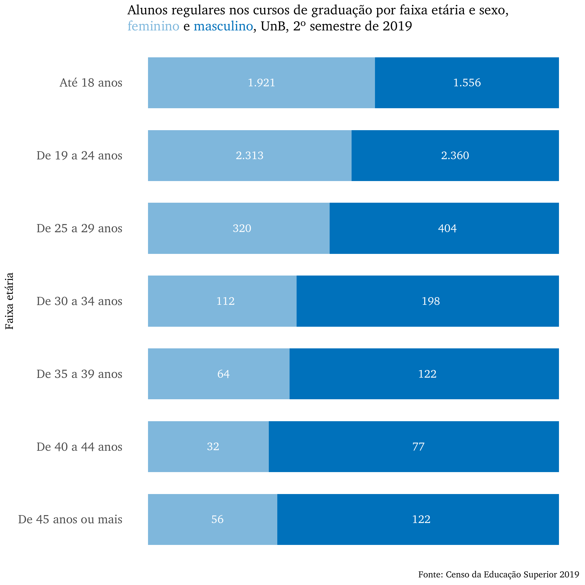
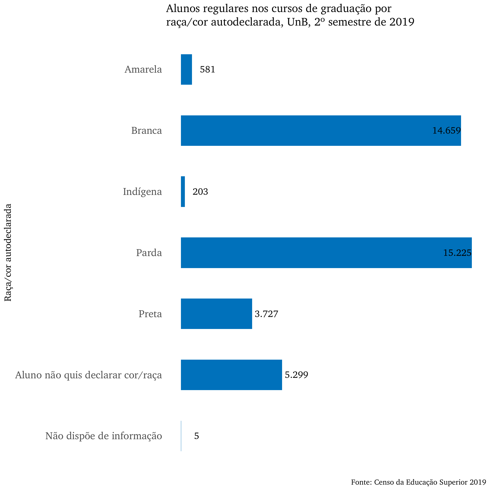
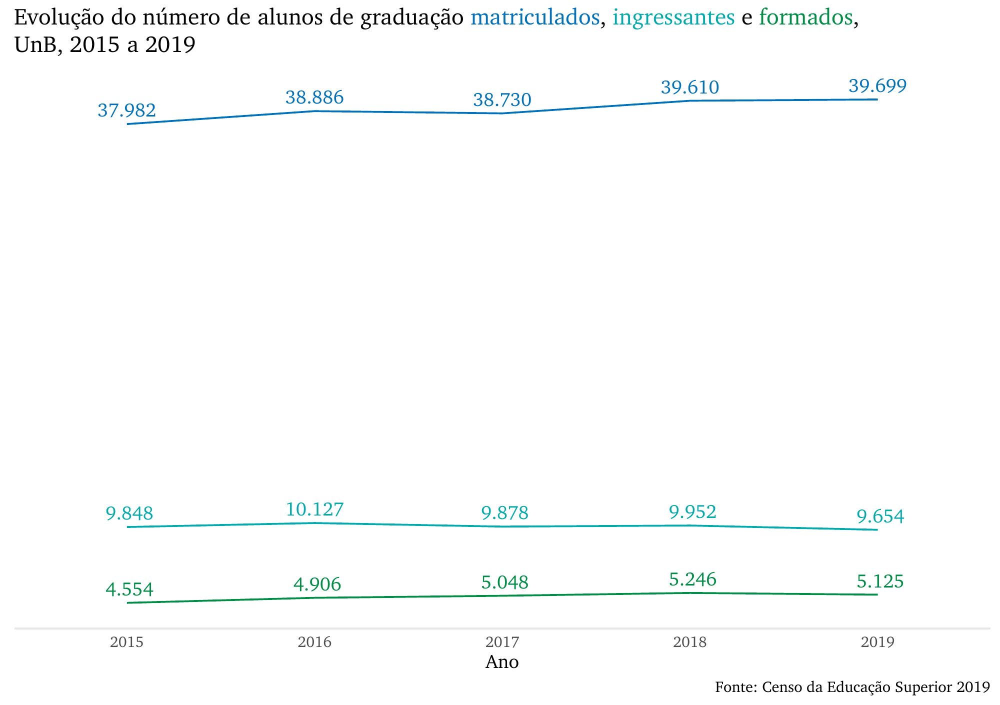
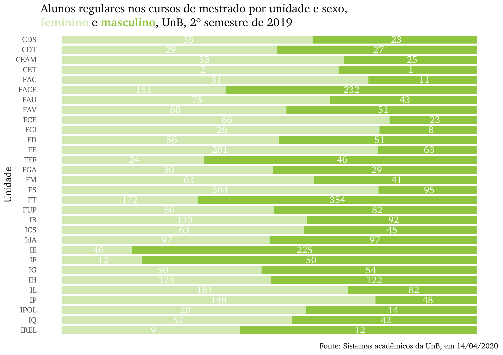
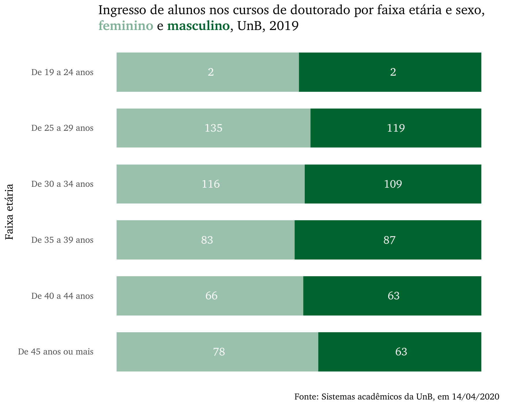
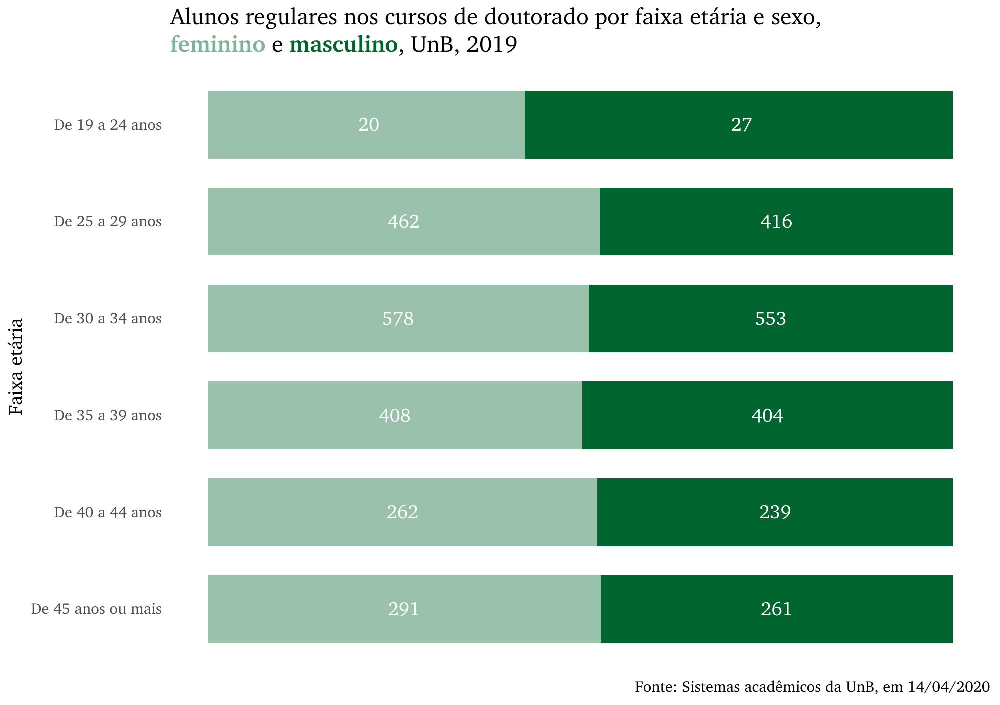
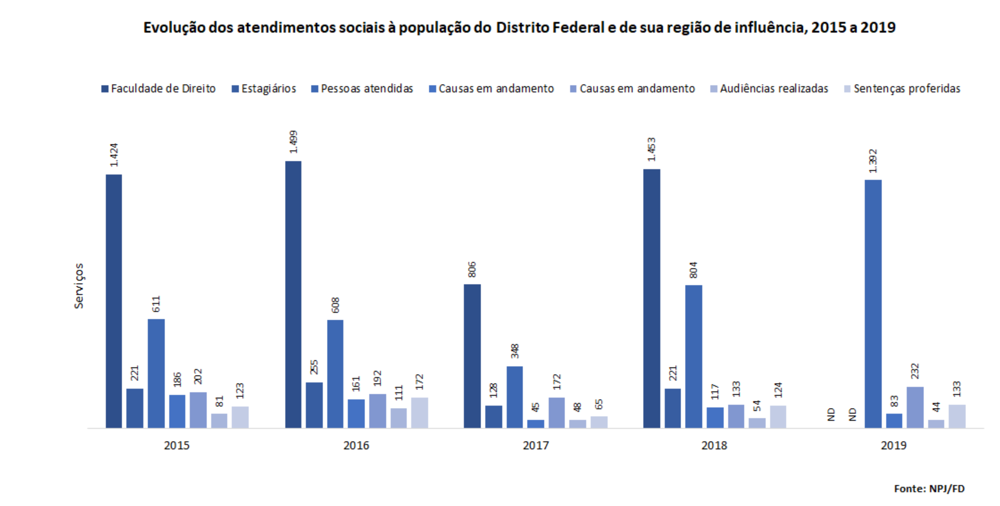
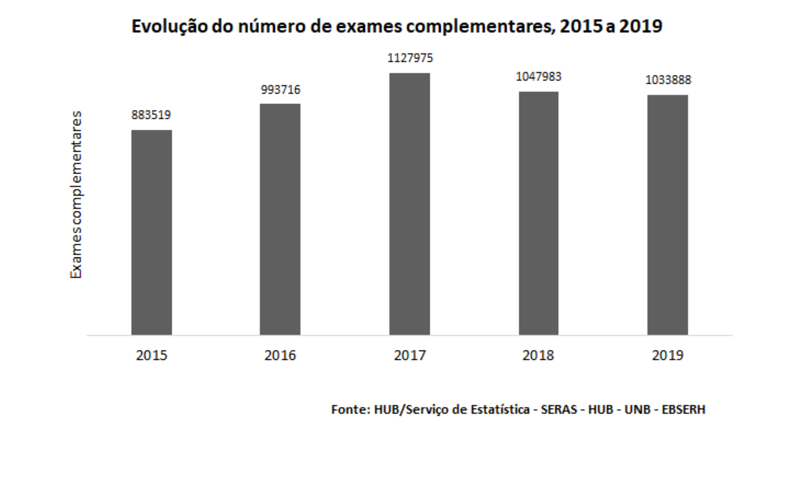

--- 
title: "ANUÁRIO ESTATÍSTICO 2020"
author: "Diretoria de Avaliação e Informações Gerenciais (DAI)<br>Decanato de Planejamento, Orçamento e Avaliação Institucional (DPO)"
date: "Setembro de 2020"
site: bookdown::bookdown_site
output: bookdown::gitbook
documentclass: book
bibliography: ["packages.bib"]
biblio-style: "apalike"
link-citations: true
github-repo: dai-unb/anuario2020
description: "Anuário Estatístico 2020 da UnB"
---

```{r setup, include=FALSE}
knitr::opts_chunk$set(
  echo = FALSE,
  message = FALSE,
  error = FALSE,
  warning = FALSE,
  cache = FALSE
)

library(tidyverse)
library(knitr)
library(kableExtra)
library(rio)
library(bookdown)

options(OutDec = ",")

load("labels/Label_Unidades_pos.RData")
```

```{r paleta-cores}
cores_anuario <- c("geral" = "#00427E",
                   "grad"  = "#0071BB",
                   "pos"   = "#008D46",
                   "mest"  = "#8EC63F",
                   "dout"  = "#00652E",
                   "pip"   = "#303192",
                   "ext"   = "#828065",
                   "rh"    = "#FFCB06",
                   "comu"  = "#00ADEE",
                   "org"   = "#A8A791",
                   "dpo"   = "#00AAAD",
                   "plan" = "#00AAAD")
```

```{r functions}
# insere a coluna de unidade etc nas tabelas que não têm
# serve só pra graduação por enquanto
# insere_descricao <- function(tabela, nome){
#   
#   tabela %>% 
#     mutate({{ nome }} := rownames(tabela)) %>% 
#     select({{ nome }}, everything())
# }

# acha as linhas que devem ser coloridas
colorir <- function(tabela, dados, alpha = 0.5){
  
  unidades <- label_unidade %>% 
    select(Unidade) %>% 
    deframe() %>% 
    paste(., collapse = "|")
  
  var <- dados %>% select(starts_with("Unidade")) %>% names()
  
  colorir <- dados %>% 
    mutate(n = row_number()) %>% 
    filter(str_detect(.data[[var]], unidades)) %>% 
    select(n) %>% 
    deframe()
  
  tabela %>% 
    row_spec(
      row = colorir, background = alpha(fundo, alpha)
      )
}

# tabela geral
tabela_geral <- function(dados, 
                         titulo, 
                         linhatotal = TRUE,
                         tamfonte = 16, 
                         colunas = colnames(dados), 
                         fundo = NULL, 
                         digitos = 0) {
  
  colnames(dados) <- str_to_upper(colnames(dados))
  
  tab <- dados %>%
    kable(
      caption = titulo,
      col.names = colunas,
      digits = digitos,
      escape = FALSE, # considera o <br> uma quebra de linha,
      align = c("l", rep("r", ncol(dados) - 1)),
      booktabs = TRUE,
      format.args = list(big.mark = ".")
    ) %>%
    kable_styling(
      bootstrap_options = c("striped", "hover", "responsive"),
      full_width = F,
      font_size = tamfonte
    ) %>%
    row_spec(
      row = 0,
      align = "c", color = ifelse(is.null(fundo), "#84898C", "white"), # pantone monument
      background = fundo,
      font_size = tamfonte - 2, extra_css = c("vertical-align: middle", "horizontal-align: middle")
    )
  
  if(linhatotal == TRUE){
    
    tab %>% 
    row_spec(
      row = nrow(dados),
      bold = TRUE,
      background = fundo,
      color = ifelse(is.null(fundo), "#84898C", "white")
    )
  } else {
    
    tab
    
  }
}
```

```{r}
include_graphics("img/unb-longo.jpg")
```

# Apresentação {-}

A Universidade de Brasília – UnB apresenta o Anuário Estatístico 2020, documento que tem por finalidade consolidar e disponibilizar informações à comunidade acadêmica, além de constituir-se em um importante referencial para estudos e pesquisas  relacionadas à Instituição.

Esta é a 22ª edição do anuário, cujo primeiro exemplar data de 1988. Nesta edição, os dados informados referem-se a cursos e alunos de graduação e de pós-graduação do ano de 2019, com retrospectiva desde o ano de 2015. Os dados de graduação têm como fonte de dados o Censo da Educação Superior (CenSup), após sua consolidação pelo Instituto de Estudos e Pesquisas Educacionais Anísio Teixeira (INEP) e os dados da pós-graduação são retirados dos sistemas acadêmicos da universidade. Sempre que possível, os dados são comparados a de uma série histórica de pelo menos cinco anos, o que possibilita análises longitudinais e de evolução em cada área de conhecimento.

Ao consultar o Anuário Estatístico de 2020, também será possível ter acesso ao panorama da estrutura física e organizacional da Universidade, além de um conjunto de indicadores relativos às atividades de ensino, pesquisa e extensão desenvolvidas no período vigente e na série histórica. 

A organização do documento é feita sob a coordenação do Decanato de Planejamento e Orçamento e Avaliação Institucional (DPO), por meio da Diretoria de Avaliação e Informações Gerenciais (DAI). A publicação está à disposição da comunidade universitária, de autoridades, dirigentes públicos e da sociedade.  Com isso, além de firmar o compromisso com a transparência, a Universidade prima pela consistência histórica e institucional de seus dados em um processo dinâmico e de constante aperfeiçoamento.


<br><br>

## Inovações desta versão {-}

Na edição de 2020, em busca de inovação para o Anuário Estatístico, o documento foi feito inteiramente no [software livre R](https://www.r-project.org/), por meio do pacote [bookdown](https://cran.r-project.org/package=bookdown). Essa mudança teve como objetivo tornar o processo de consolidação do documento e organização dos dados mais linear,  aumentando a confiabilidade das informações apresentadas.

Além disso, também aprimora a transparência da Instituição, pois todo o fluxo de trabalho  passou a ser documentado no repositório  [github/dai-dpo/anuario2020](https://github.com/dai-unb/anuario2020). 

Importante ressaltar que, por princípio de privacidade e segurança, não é permitido reproduzir ou replicar as tabelas e gráficos contidos no Anuário Estatístico. Há diversos dados sensíveis, tais como informações pessoais que devem ser protegidas, o que inviabiliza a disponibilização da base de dados bruta. Porém, o download das informações é permitido e a atual versão o disponibiliza de forma facilitada. 
<br><br>

## Lista de autoridades {-}
Jair Messias Bolsonaro  
**Presidente da República**

Abraham Weintraub (Até 19/06/2020)  
Milton Ribeiro    
**Ministro da Educação**

Ricardo Braga (Até 29/07/2020)  
Wagner Vilas Boas de Souza  
**Secretário de Educação Superior – Ministério da Educação – MEC**

<br><br>

**Universidade de Brasília**  

**Reitora**: Márcia Abrahão Moura  
**Vice-Reitor**: Enrique Huelva Unternbäumen  
**Decana de Administração**: Maria Lucília dos Santos  
**Decano de Assuntos Comunitários**: Ileno Izídio da Costa  
**Decana de Ensino de Graduação**: Sérgio Antônio Andrade de Freitas  
**Decana de Extensão**: Olgamir Ferreira de Paiva  
**Decano de Gestão de Pessoas**: Carlos Vieira Mota  
**Decana de Pesquisa e Inovação**: Maria Emilia Walter  
**Decana de Planejamento, Orçamento e Avaliação Institucional**: Denise Imbroisi  
**Decana de Pós-Graduação**: Adalene Moreira Silva  

<br><br>

## Equipe DPO {-}

**Decanato de Planejamento, Orçamento e Avaliação Institucional (DPO)**  
Decana de Planejamento, Orçamento e Avaliação Institucional: Denise Imbroisi  
Diretora de Avaliação e Informações Gerenciais: Andrea Felippe Cabello (Até 31/12/2019)  
Diretor de Avaliação e Informações Gerenciais: Guilherme Viana Ferreira  
Coordenador de Informações Gerenciais: Roberto de Freitas Neder  

Organização: Guilherme Viana Ferreira  
Revisão: --  

Equipe Técnica:   
Alexandre Cardias Pereira Alves  
Geisa Rodrigues Novais  
Pedro Ivo Guimarães Póvoa  
Roberto de Freitas Neder  

Coordenação Editoria, Projeto Gráfico, Editoração e Capa: DAI/DPO  
Este anuário foi organizado com base nas informações prestadas pelas unidades acadêmicas e administrativas, pelos centros, órgãos complementares e sistemas eletrônicos de dados da Universidade de Brasília.  

<br>

Universidade de Brasília  
Decanato de Planejamento e Orçamento – Prédio da Reitoria, bloco B, 1º andar  
Campus Universitário Darcy Ribeiro – Asa Norte  
70910-900 Brasília, DF, Brasil  
Telefones: + (61) 3107-0620 e 3107-0621  
http://www.unb.br  
unb@unb.br  
dpo@unb.br  
dai@unb.br  

<br><br>

## Lista de siglas e denominações {-}

**FUNDAÇÃO UNIVERSIDADE DE BRASÍLIA (FUB)**   
CONSELHO DIRETOR  
SCD	Secretaria do Conselho Diretor    

**UNIVERSIDADE DE BRASÍLIA (UnB)**   

**CONSELHOS SUPERIORES**  

CONSUNI	  Conselho Universitário  

CEPE      Conselho de Ensino, Pesquisa e Extensão  
CEG       Câmara de Ensino de Graduação  
CEX       Câmara de Extensão  
CPP       Câmara de Pesquisa e Pós-Graduação  
CCD       Câmara da Carreira Docente  
CAD       Conselho de Administração  
CAC       Câmara de Assuntos Comunitários  
CGP       Câmara de Gestão de Pessoas  
CPLAD     Câmara de Planejamento e Administração  

	
**CONSELHO COMUNITÁRIO**  

CAPRO	Câmara de Projetos, Convênios, Contratos e Instrumentos Correlatos  
	
**REITORIA**

VRT        Vice-Reitoria  
OUV        Ouvidoria  
PJU        Procuradoria Jurídica  
AUD        Auditoria  
  
**ÓRGÃOS AUXILIARES**

GRE        Gabinete da Reitora  
PRC        Prefeitura da UnB  
INFRA      Secretaria de Infraestrutura  
SEMA       Secretaria de Meio Ambiente da Universidade de Brasília  
SPI        Secretaria do Patrimônio Imobiliário  

**DECANATOS**

**DEG**       **Decanato de Ensino de Graduação**

DAIA       Diretoria de Acompanhamento e Integração Acadêmica  
DIEG       Diretoria de Inovação e Estratégias para o Ensino de Graduação  
DTG        Diretoria Técnica de Graduação  
DEX        Decanato de Extensão  
DTE        Diretoria Técnica de Extensão  
DDIR       Diretoria de Integração Social e Desenvolvimento Regional  
DDC        Diretoria de Difusão Cultural  

**DPG**       **Decanato de Pós-Graduação**

DIRIC      Diretoria de Fomento à Iniciação Científica  
DIRPG      Diretoria de Pós-Graduação  

**DPI**       **Decanato de Pesquisa e Inovação**

DIRPE      Diretoria de Pesquisa  
DPA        Diretoria de Apoio a Projetos Acadêmicos  
CDT        Centro de Apoio ao Desenvolvimento Tecnológico  

**DAC**       **Decanato de Assuntos Comunitários**

DDS        Diretoria de Desenvolvimento Social  
DEAC       Diretoria de Esporte e Atividades Comunitárias  
DIV        Diretoria da Diversidade  
DASU       Diretoria de Atenção à Saúde da Comunidade Universitária  
DRU        Diretoria do Restaurante Universitário  
DACES 	   Diretoria de Acessibilidade  

**DGP**       **Decanato de Gestão de Pessoas**

DCADE      Diretoria de Capacitação, Desenvolvimento e Educação  
DAP        Diretoria de Administração de Pessoas  
DSQVT      Diretoria de Saúde, Segurança e Qualidade de Vida no Trabalho  
DPAM       Diretoria de Provimento, Acompanhamento e Movimentação  

**DAF**       **Decanato de Administração**

DIMEX      Diretoria de Importação e Exportação  
DTER       Diretoria de Terceirização  
DGM        Diretoria de Gestão de Materiais  
DCF        Diretoria de Contabilidade e Finanças  
DCO        Diretoria de Compras  
DCA        Diretoria de Contratos Administrativos  

**DPO**       **Decanato de Planejamento, Orçamento e Avaliação Institucional**

DPL        Diretoria de Planejamento  
DOR        Diretoria de Orçamento  
DPR        Diretoria de Processos Organizacionais  
DAI        Diretoria de Avaliação e Informações Gerenciais   

**ÓRGÃOS COMPLEMENTARES**

BCE       Biblioteca Central  
STI       Centro de Informática  
EDU       Editora Universidade de Brasília  
FAL       Fazenda Água Limpa   
HUB       Hospital Universitário  
ACE       Arquivo Central  
PCTec     Parque Científico e Tecnológico da Universidade de Brasília  
CPCE      Centro de Produção Cultural e Educativa (UnB-TV)   

**ASSESSORIAS E SECRETARIAS**

SAA        Secretaria de Administração Acadêmica   
SECOM      Secretaria de Comunicação   
INT        Secretaria de Assuntos Internacionais   
CERI       Coordenação do Cerimonial  

**CENTROS (GRE)**

CRAD       Centro de Referência em Conservação da Natureza e Recuperação de Áreas Degradadas  
CEAD       Centro de Educação a Distância  
CEAM       Centro de Estudos Avançados Multidisciplinares  
CET        Centro de Excelência em Turismo  
CER        UnB Cerrado  
CESPE      Centro de Seleção e de Promoção de Eventos  
CIBH       Centro Internacional de Bioética e Humanidades  
CIFMC      Centro Internacional de Física da Matéria Condensada  
CDS        Centro de Desenvolvimento Sustentável  
CCOM       Centro de Políticas, Direito, Economia e Tecnologias das Comunicações  
CPAB       Centro de Pesquisa e Aplicação de Bambu e Fibras Naturais  


**CENTROS**   

CCOM	    Centro de Políticas, Direito, Economia e Tecnologias das Comunicações  
CDS	      Centro de Desenvolvimento Sustentável  
CEAD	    Centro de Educação a Distância  
CEPLAN	  Centro de Planejamento  
CET	      Centro de Excelência em Turismo  
CER	      Centro de Estudos do Cerrado  
CESPE	    Centro de Seleção e de Promoção de Eventos  
CIFMC	    Centro Internacional de Física da Matéria Condensada  
CIORD	    Centro Integrado de Ordenamento Territorial (FACE)  
CME	      Centro de Manutenção de Equipamentos Científicos  
CPAB	    Centro de Pesquisa e Aplicação de Bambu e Fibras Naturais  
CPCE	    Centro de Produção Cultural e Educativa  
CRAD	    Centro de Referência em Conservação da Natureza e Recuperação de Áreas Degradadas  
DATAUnB	  Centro de Pesquisas de Opinião Pública  
CEAM	    Centro de Estudos Avançados Multidisciplinares  

**UNIDADES ACADÊMICAS**

**FGA     Faculdade do Gama**

**FACE**     **Direção da Faculdade de Economia, Administração, Contabilidade e Gestão de Políticas Públicas**

GPP        Departamento de Gestão de Políticas Públicas  
ADM        Departamento de Administração  
CCA        Departamento de Ciências Contábeis e Atuariais  
ECO        Departamento de Economia  
CIORD      Centro Integrado de Ordenamento Territorial  

**FCE**    **Faculdade de Ceilândia**

**FAU**    **Faculdade de Arquitetura e Urbanismo**

PRO        Departamento de Projeto, Expressão e Representação em Arquitetura e Urbanismo  
TEC        Departamento de Tecnologia em Arquitetura e Urbanismo  
THAU      Departamento de Teoria e História em Arquitetura e Urbanismo  

**FAV**    **Faculdade de Agronomia e Medicina Veterinária**

**FAC**    **Faculdade de Comunicação**

DAP        Departamento de Audiovisuais e Publicidade  
JOR        Departamento de Jornalismo  
COM        Departamento de Comunicação Organizacional  

**FCI**    **Faculdade de Ciência da Informação**

**FD**     **Faculdade de Direito**

**FE**     **Faculdade de Educação**

MTC        Departamento de Métodos e Técnicas  
PAD        Departamento de Planejamento e Administração  
TEF        Departamento de Teoria e Fundamentos  

**FEF**    **Faculdade de Educação Física**

CO         Centro Olímpico

**FUP**    **Faculdade de Planaltina**

**FM**     **Faculdade de Medicina**

**FS**     **Faculdade de Ciências da Saúde**

FAR        Departamento de Farmácia  
ODT        Departamento de Odontologia  
DSC        Departamento de Saúde Coletiva  
ENF        Departamento de Enfermagem  
NUT        Departamento de Nutrição  

**FT**    **Faculdade de Tecnologia**

EPR        Departamento de Engenharia de Produção  
EFL        Departamento de Engenharia Florestal  
ENC        Departamento de Engenharia Civil e Ambiental  
ENE        Departamento de Engenharia Elétrica  
ENM        Departamento de Engenharia Mecânica  
CEFTRU     Centro de Formação de Recursos Humanos em Transportes  

**IB**     **Instituto de Ciências Biológicas**

BOT        Departamento de Botânica  
CEL        Departamento de Biologia Celular  
CFS        Departamento de Ciências Fisiológicas  
ECL        Departamento de Ecologia  
FIT        Departamento de Fitopatologia  
GEM        Departamento de Genética e Morfologia  
ZOO        Departamento de Zoologia  
CNANO      Centro de Nano Ciência e Nanobiotecnologia  
CP         Centro de Primatologia  

**ICS**    **Instituto de Ciências Sociais**

ELA        Departamento de Estudos Latino-Americanos  
DAN        Departamento de Antropologia  
SOL        Departamento de Sociologia  

**IdA**    **Instituto de Artes**

CEN        Departamento de Artes Cênicas  
DIN        Departamento de Desenho Industrial  
MUS        Departamento de Música  
VIS        Departamento de Artes Visuais  

**IE**     **Instituto de Ciências Exatas**

CIC        Departamento de Ciência da Computação  
EST        Departamento de Estatística  
MAT        Departamento de Matemática  

**IF**     **Instituto de Física**

IG         Instituto de Geociências  
SIS        Observatório Sismológico  

**IH**     **Instituto de Ciências Humanas**

FIL        Departamento de Filosofia  
GEA        Departamento de Geografia  
HIS        Departamento de História  
SER        Departamento de Serviço Social  

**IL**     **Instituto de Letras**

LET        Departamento de Línguas Estrangeiras e Tradução  
LIP        Departamento de Linguística, Português e Línguas Clássicas  
TEL        Departamento de Teoria Literária e Literatura  

**IP**     **Instituto de Psicologia**

PST        Departamento de Psicologia Social e do Trabalho  
PCL        Departamento de Psicologia Clínica  
PED        Departamento de Psicologia Escolar e do Desenvolvimento  
PPB        Departamento de Processos Psicológicos Básicos  
CAEP       Centro de Atendimento e Estudos Psicológicos  

**IPOL**   **Instituto de Ciência Política**

**IQ**     **Instituto de Química**

**IREL**   **Instituto de Relações Internacionais**

<br><br>

## Organograma {-}

```{r}
include_graphics("img/organograma-unb.jpg")
```
Fonte:  http://www.dpo.unb.br/index.php?option=com_content&view=article&id=24&Itemid=744?menu=425

<br><br>

## Mapa do Campus Darcy Ribeiro {-}

```{r}
include_graphics("img/campus-unb.png")
```

<!--chapter:end:index.Rmd-->


```{r}
options(scipen = 9)
fundo <- cores_anuario["geral"]
```

# Dados gerais {#geral}

1. Informações e Dados Gerais
<br>
**Fundação Universidade de Brasília**  
Criação: Lei n. 3998/1961, de 15/12/1961, homologada pelo Decreto n. 500, de 15/1/1962.  
Estatuto da FUB: publicado no Diário Oficial da União de 16/1/1962.  
Edificação da Pedra Fundamental em 15/12/1961.  
<br>
**Universidade de Brasília**  
Criação: prevista no art. 3º da Lei n. 3998/1961, de 15/12/1961.  
Estatuto em vigor: aprovado pela Resolução do Conselho Diretor n. 13/1993, de 19/10/1993, e publicado no Diário Oficial da União n. 7 de 11/1/1994.  
<br>
**Missão da UnB**  
Ser uma instituição inovadora, comprometida com a excelência acadêmica, científica e tecnológica
formando cidadãos conscientes do seu papel transformador na sociedade, respeitadas a ética e a
valorização de identidades e culturas com responsabilidade social.
<br>
**Visão de Futuro**  
Estar entre as melhores universidades do Brasil, inserida internacionalmente, com excelência em gestão de processos que fortaleça o ensino, pesquisa e extensão.
<br>
<br>

## Componentes institucionais da UnB
```{r}
comp_inst <- rio::import("dados_gerais/dados_gerais_tabelas.xlsx", sheet=1)

comp_inst %>% 
  map_df(~replace_na(., 0)) %>% 
  tabela_geral("Componentes Institucionais", 
               linhatotal = FALSE, 
               fundo = "#00376f",
               colunas = c("Componentes Institucionais", "Total"))
```

<br>

## Vagas oferecidas nos processos de seleção primários da UnB, 2019
```{r}
vagas_oferecidas <- rio::import("dados_gerais/dados_gerais_tabelas.xlsx", sheet=2)

vagas_oferecidas %>% 
  map_df(~replace_na(., 0)) %>% 
  tabela_geral("Vagas oferecidas nos processos de seleção primários da UnB, 2019", 
               linhatotal = TRUE,
               tamfonte = 14, 
               fundo = "#00376f",
               colunas = c("FORMA DE INGRESSO", "1º SEM","2º SEM","TOTAL ANUAL"))
```

<br>

## Inscritos nos processos de seleção primários da UnB, 2019
```{r}
inscritos <- rio::import("dados_gerais/dados_gerais_tabelas.xlsx", sheet=3)

inscritos %>% 
  map_df(~replace_na(., 0)) %>% 
  tabela_geral("Inscritos nos processos de seleção primários da UnB, 2019", 
               linhatotal = TRUE, 
               tamfonte = 14, 
               fundo = "#00376f",
               colunas = c("FORMA DE INGRESSO", "1º SEM","2º SEM","TOTAL ANUAL"))
```

<br>

## Relação candidato x vaga nos processos de seleção primários da UnB, 2019
```{r}
demanda <- rio::import("dados_gerais/dados_gerais_tabelas.xlsx", sheet=4)
demanda$`1º semestre` <- round(demanda$`1º semestre`, digits = 2)
demanda$`2º semestre` <- round(demanda$`2º semestre`, digits = 2)
demanda$`Total Anual` <- round(demanda$`Total Anual`, digits = 2)

demanda %>% 
  map_df(~replace_na(., 0)) %>% 
  tabela_geral("Relação candidato x vaga nos processos de seleção primários da UnB, 2019", 
               linhatotal = FALSE, 
               tamfonte = 14, 
               fundo = "#00376f",
               colunas = c("FORMA DE INGRESSO", "1º SEM","2º SEM","TOTAL ANUAL")) %>% 
  footnote(general_title = "Notas: ",
           general = c("(1) O Sistema de Seleção Unificada (Sisu) é o sistema informatizado, gerenciado pelo Ministério da Educação (MEC), no qual instituições públicas de ensino superior oferecem vagas a candidatos participantes do Exame Nacional do Ensino Médio (Enem)",
                       "(2) O Programa de Avaliação Seriada (PAS) é uma das modalidade de acesso ao ensino superior, de iniciativa da UnB. Trata-se de um sistema de avaliação gradual e progressiva, com provas realizadas ao final de cada um dos três anos regulares do ensino médio. Tem por objetivo a ampliação do processo de interação da universidade com o ensino médio e a redução do impacto da passagem dos estudantes para o ensino superior"))
```

<br>

## Ingressantes pelos processos de seleção da UnB, 2019
```{r}
ingressantes <- rio::import("dados_gerais/dados_gerais_tabelas.xlsx", sheet = 5)

ingressantes %>% 
  tabela_geral("Ingressantes pelos processos de seleção da UnB, 2019", 
               linhatotal = TRUE, 
               tamfonte = 14, 
               fundo = "#00376f",
               colunas = c("FORMA DE INGRESSO", "1º SEM","2º SEM","TOTAL ANUAL")) %>% 
  footnote(general_title = "Nota: ",
           general = "(*) Transferência Obrigatória, Transferência Facultativa, Programas Especiais e Convênio PEC")
```

<br>

## Total de cursos da UnB por grau, 2019
```{r}
Cursos <-  rio::import("dados_gerais/dados_gerais_tabelas.xlsx", sheet = 6)

Cursos %>% 
  filter(!str_detect(Curso, "Especialização")) %>% 
  tabela_geral("Total de cursos da UnB por grau, 2019", 
               linhatotal =   FALSE, 
               colunas = c("GRAU", "QUANTIDADE"),
               fundo = "#00376f") %>% 
  footnote(general_title = "Notas: ",
           general = "O total refere-se a todos os cursos de graduação, por habilitação e turno, que ainda tenham alunos matriculados; os cursos de graduação ativos referem-se aos cursos que tiveram ingressantes no ano base, também diferenciando por habilitação e turno")
```

<br>

## Total de formados da UnB por grau, 2019
```{r}
Formados <-  rio::import("dados_gerais/dados_gerais_tabelas.xlsx", sheet = 7)

Formados %>% 
  map_df(~replace_na(., 0)) %>% 
  tabela_geral("Total de formados da UnB por grau, 2019", 
               linhatotal =   FALSE, 
               tamfonte = 14, 
               fundo = "#00376f",
               colunas = c("GRAU", "1º SEM","2º SEM", "TOTAL")) %>% 
  footnote(general_title =  "Nota: ",
           general = "(*) Dados anuais")
```

<br>

## Total de docentes ativos da UnB por grau de titulação, 2019
```{r}
docente_ativo <- rio::import("dados_gerais/dados_gerais_tabelas.xlsx", sheet=8)

docente_ativo %>% 
  tabela_geral("Total de docentes ativos da UnB por grau de titulação, 2019", 
               linhatotal =  FALSE, 
               colunas = c("TITULAÇÃO", "DEDICAÇÃO EXCLUSIVA", "40 HORAS", "20 HORAS", "TOTAL"), 
               fundo = "#00376f")
```

<br>

## Número de técnico-administrativos do quadro, por cargo, 2019
```{r}
escolaridade_tecnico <- rio::import("dados_gerais/dados_gerais_tabelas.xlsx", sheet=9)

escolaridade_tecnico %>% 
  tabela_geral("Número de técnico-administrativos do quadro, por cargo, 2019", 
               linhatotal = TRUE,
               fundo = "#00376f",
               colunas = c("CARGO OCUPADO","QUANTIDADE"))
```

<br>

## Área física dos campi da Universidade de Brasília, 2019
```{r}
area_fisica <- rio::import("dados_gerais/dados_gerais_tabelas.xlsx", sheet=10)

area_fisica %>%
  mutate(`m²` = format(round(`m²`, 0), big.mark = "."),
         `m²` = ifelse(str_detect(`m²`, "NA"),
                       "",
                       `m²`)) %>% 
  # map_df(~replace_na(., " ")) %>%
  tabela_geral("Área física dos campi da Universidade de Brasília, 2019", 
               colunas = c("Campus", "Metragem (m²)"),
               linhatotal = FALSE, 
               fundo = "#00376f")
```

<br>

## Números da Biblioteca Central (BCE) da UnB, 2019
```{r}
bce <- rio::import("dados_gerais/dados_gerais_tabelas.xlsx", sheet=11)

bce %>% 
  tabela_geral("Números da Biblioteca Central (BCE) da UnB, 2019", 
               linhatotal = FALSE, 
               fundo = "#00376f",
               colunas = c("CATEGORIA","QUANTIDADE"))
```

<br>

## Números da Editora Universidade de Brasília (EDU), 2019
```{r}
edu <- rio::import("dados_gerais/dados_gerais_tabelas.xlsx", sheet=12)

edu %>% 
  map_df(~replace_na(., 0)) %>% 
  tabela_geral("Números da Editora Universidade de Brasília (EDU), 2019", 
               linhatotal = FALSE, 
               tamfonte = 14, 
               fundo = "#00376f",
               colunas = c("CATEGORIA","QUANTIDADE"))
```

<br>

## Números da extensão da UnB, 2019
```{r}
extensao <- rio::import("dados_gerais/dados_gerais_tabelas.xlsx", sheet=13)

extensao %>% 
  map_df(~replace_na(., 0)) %>% 
  tabela_geral("Números da extensão da UnB, 2019", 
               linhatotal = FALSE, 
               fundo = "#00376f",
               colunas = c("CATEGORIA","QUANTIDADE"))
```

<br>

## Números do Restaurante Universitário (RU) da UnB, 2019
```{r}
ru <- rio::import("dados_gerais/dados_gerais_tabelas.xlsx", sheet=14)

# tá estranha a tabela
ru %>% 
  map_df(~replace_na(., 0)) %>% 
  tabela_geral("Números do Restaurante Universitário (RU) da UnB, 2019", 
               linhatotal = FALSE, 
               fundo = "#00376f",
               colunas = c("RESTAURANTE UNIVERSITÁRIO – RU",""))
```

<br>

## Indicadores gerais de desempenho da UnB, 2011 a 2019
```{r}
indicadores_gerais <- rio::import("dados_gerais/planilha_1.15_mod.xlsx", sheet=1)

cores <- indicadores_gerais %>% 
  mutate(n = row_number()) %>% 
  filter(CATEGORIA %in% c("ATIVIDADES DE ENSINO",
                          "GRADUAÇÃO",
                          "PÓS-GRADUAÇÃO",
                          "Número de cursos",
                          "Alunos registrados (2º semestre)",
                          "Títulos outorgados",
                          "SERVIÇOS À COMUNIDADE",
                          "EDITORA UnB",
                          "BIBLIOTECA",
                          "QUADRO DE PESSOAL",
                          "COOPERAÇÃO NACIONAL E INTERNACIONAL")) %>% 
  select(n) %>% 
  deframe()

indicadores_gerais %>% 
  mutate(`2011 A 2019` = ifelse(is.na(`2011 A 2019`) | `2011 A 2019` == "-",
                                `2011 A 2019`,
                                paste0(round(100 * as.double(`2011 A 2019`), 2), "%"))) %>% 
  map_df(~replace_na(., "")) %>%
  tabela_geral("Indicadores gerais de desempenho da UnB, 2011 a 2019", 
               linhatotal = F, 
               tamfonte = 10, 
               fundo = fundo) %>% 
  row_spec(row = cores, background = fundo, color = "white") %>% 
  footnote(general_title = "Notas: ",
           general = c("ND: dado não disponível", "(1): os dados dos programas Sisu e Enem só puderam ser computados a partir de 2014"))
```

<br>

## Dados gerais por unidade da UnB, 2019
```{r}
geral <- rio::import("dados_gerais/Tabela_1.03.xlsx")

geral %>% 
  map_df(~replace_na(., 0)) %>% 
  tabela_geral("Dados gerais por unidade da UnB, 2019", 
               linhatotal = TRUE, tamfonte = 14, fundo = "#00376f",
               colunas = c("Unidades", "Graduação", "Pós-graduação\nMest./Dout.", 
                           "Grad.", "Mestr.", "Dout.", 
                           "Graduação", "Mestrado", "Doutorado")) %>% 
  add_header_above(c("", 
                   "ALUNOS REGULARES\n(DADOS DO 2º SEMESTRE)" = 2,
                   "CURSOS\nMINISTRADOS" = 3,
                   "TÍTULOS\nOUTORGADOS" = 3),
                   color = "white", extra_css = 'vertical-align: middle', background = "#00376f") %>% 
  footnote(general_title = "",
           general = "Fonte: Sistemas acadêmicos & Censo da Educação Superior 2019")
```

<br>

## População universitária da UnB, 2015 a 2019
```{r}
evo_pop <- rio::import("dados_gerais/dados_gerais_tabelas.xlsx", sheet=16)
evo_pop$Ano <- as.character(evo_pop$Ano)

# precisa desses números subescritos?
evo_pop %>% 
  map_df(~replace_na(., 0)) %>% 
  tabela_geral("População universitária da UnB, 2015 a 2019",
               linhatotal = FALSE, 
               fundo = "#00376f",
               colunas = c("Ano","Alunos de Graduação¹","Alunos de Pós-Graduação¹","Docentes²","Técnicos-Administrativos","Total")) %>% 
  footnote(general_title = "Notas: ",
           general = c("(1) dados do 2º semestre",
                       "(2) inclui os docentes ativos permanentes, substitutos, temporários e visitantes",
                       "OBS: Na pós-graduação foram computados os alunos dos cursos de Mestrado e Doutorado"))
```

<br>

## Gráfico da evolução da população universitária da UnB, 2015 a 2019
```{r fig.cap='Evolução da população universitária da UnB, 2015 a 2019'}


xfun::embed_file("graficos/dados_gerais/graf1.png")
```

<br>

## Alunos regulares na graduação e na pós-graduação Stricto Sensu, 2015 a 2019 (2º semestre)
```{r}
evo_alunos <- rio::import("dados_gerais/dados_gerais_tabelas.xlsx", sheet=17)
evo_alunos$Ano <- as.character(evo_alunos$Ano)

evo_alunos %>% 
  map_df(~replace_na(., 0)) %>% 
  tabela_geral("Alunos regulares na graduação e na pós-graduação Stricto Sensu, 2015 a 2019 (2º semestre)",
               tamfonte = 14, 
               fundo = "#00376f", 
               linhatotal = FALSE,
               colunas = c("Ano","Graduação","Mestrado","Doutorado","Residência Médica","Total da Pós-Graduação","Total Geral")) %>% 
  footnote(general_title = "Fonte: Sistemas acadêmicos & Censo da Educação Superior",
           general = "")
```

<br>

## Alunos formados na graduação e pós-graduação, 1966 a 2019
```{r}
evo_formados <- rio::import("dados_gerais/dados_gerais_tabelas.xlsx", sheet=18)

evo_formados %>% 
  map_df(~replace_na(., 0)) %>% 
  tabela_geral("Alunos formados na graduação e pós-graduação, 1966 a 2019", 
               linhatotal = TRUE, 
               tamfonte = 14, 
               fundo = "#00376f",
               colunas = c("Ano","Graduação","Especialização¹","Formados com Especialização²","Mestrado","Doutorado","Total")) %>% 
  footnote(general_title = "Fonte: Sistemas acadêmicos & Censo da Educação Superior",
           general = c("Notas:\n(1) dados de 2010 a 2018 não disponíveis",
                       "(2) alunos de mestrado que não apresentaram a dissertação"))
```

<br>

## Gráfico do total de alunos formados por período, UnB, 1966 a 2019
```{r fig.cap='Total de alunos formados por período, UnB, 1966 a 2019'}
include_graphics("graficos/dados_gerais/graf2.png")

xfun::embed_file("graficos/dados_gerais/graf2.png")
```

<br>

## Área física do Campus Universitário Darcy Ribeiro, 2019
```{r}
area_darcy <- rio::import("dados_gerais/dados_gerais_tabelas.xlsx", sheet=19)

area_darcy %>% 
  map_df(~replace_na(., 0)) %>% 
  tabela_geral("Área física do Campus Universitário Darcy Ribeiro, 2019", 
               linhatotal = FALSE, 
               tamfonte = 14, 
               fundo = "#00376f") %>% 
  footnote(general_title = "Fonte: Prefeitura do Campus (PRC)",
           general = "")
```

<br>

## Área física dos Campi UnB Planaltina, UnB Gama e UnB Ceilândia, 2019
```{r}
area_outros <- rio::import("dados_gerais/dados_gerais_tabelas.xlsx", sheet=20)

area_outros %>% 
  map_df(~replace_na(., 0)) %>% 
  tabela_geral("Área física dos Campi UnB Planaltina, UnB Gama e UnB Ceilândia, 2019", 
               linhatotal = TRUE,
               fundo = "#00376f") %>% 
  footnote(general_title = "Fonte: FUP, FGA & FCE",
           general = "")
```

<br>

## Área física da Fazenda Água Limpa (FAL), 2019
```{r}
area_fal <- rio::import("dados_gerais/dados_gerais_tabelas.xlsx", sheet=21)

area_fal %>% 
  map_df(~replace_na(., 0)) %>% 
  tabela_geral("Área física da Fazenda Água Limpa (FAL), 2019", linhatotal = FALSE, tamfonte = 14, fundo = "#00376f") %>% 
  footnote(general_title = "Fonte: FAL/PRC",
           general = "")
```

<br>

## Área física do Hospital Universitário de Brasília (HUB), 2019
```{r}
area_hub <- rio::import("dados_gerais/dados_gerais_tabelas.xlsx", sheet=22)

area_hub %>% 
  map_df(~replace_na(., 0)) %>% 
  tabela_geral("Área física do Hospital Universitário de Brasília (HUB), 2019", linhatotal = FALSE, tamfonte = 14, fundo = "#00376f") %>% 
  footnote(general_title = "Fonte: Divisão de Infraestrututura Hospitalar e Logistica - DLH/HUB/UnB",
           general = "")
```

<br>


<!--chapter:end:01-dados_gerais.Rmd-->

# Graduação {#grad}

```{r}
# define o fundo desta seção
fundo <- cores_anuario[2]
```

Faça o download de todas as tabelas desta seção: `r xfun::embed_file("dados_graduacao/tabelas_graduacao.xlsx")`

<br>

## Dados e características dos cursos de graduação oferecidos pela UnB, 2019
```{r}
# tabela 12 - Dados e características dos cursos de graduação oferecidos pela UnB
tab1 <- rio::import("dados_graduacao/Tabela12_DEG-2019.xlsx", sheet = "tab")
tab1 <- tab1 %>% 
  mutate(`Unidade Acadêmica / Curso / Habilitação` = str_replace(`Unidade Acadêmica / Curso / Habilitação`,
                                                                 "Enfermagem FCE",
                                                                 "Enfermagem"))
tab1 %>% 
  mutate(`Data do Ato` = as.double(`Data do Ato`),
         `Data do Ato` = as.Date(`Data do Ato`, origin = "1899-12-30"),
         `Data do Ato` = format(`Data do Ato`, "%d/%m/%Y")) %>% 
  map_df(~replace_na(., "")) %>% 
  select(`Unidade Acadêmica / Curso / Habilitação`:`Perm. Máx.`, `N. Ord.`) %>% 
  tabela_geral("Dados e características dos cursos de graduação oferecidos pela UnB, 2019", 
               linhatotal = FALSE, 
               tamfonte = 10,
               fundo = fundo) %>% 
  colorir(dados = tab1) %>% 
  footnote(general_title = "Fonte: SIGAA, atualização CAEG/DTG/DEG, em 23/06/2020",
           general = c("Nota: O ato de reconhecimento dos cursos Integral é valido para os cursos noturnos",
                       "Legenda: D: Decreto; P: Portaria; Seres: Secretaria de Regulação da Educação Superior; Res: Resolução"))
```

<br>

## Ingresso nos cursos de graduação pelo vestibular, PAS, ENEM e outras vias, por unidade acadêmica, curso e habilitação, UnB, 2019
```{r}
# tabela 13
tab2 <- rio::import("dados_graduacao/Tabela2.03.xlsx")
tab2 <- tab2 %>% 
  mutate(`Unidade acadêmica / curso / habilitação` = str_replace(`Unidade acadêmica / curso / habilitação`,
                                                                 "Enfermagem FCE",
                                                                 "Enfermagem"))

tab2 %>% 
  tabela_geral(titulo = "Ingresso nos cursos de graduação pelo vestibular, PAS, ENEM e outras vias, por unidade acadêmica, curso e habilitação, UnB, 2019", 
               colunas = c("UNIDADE ACADÊMICA / CURSO / HABILITAÇÃO",
                           "1º SEM", "2º SEM",
                           "1º SEM", "2º SEM",
                           "1º SEM", "2º SEM",
                           "1º SEM", "2º SEM",
                           "1º SEM", "2º SEM",
                           "1º SEM", "2º SEM",
                           "1º SEM", "2º SEM",
                           "1º SEM", "2º SEM",
                           "TOTAL GERAL"),
               fundo = fundo,
               tamfonte = 8) %>% 
  colorir(dados = tab2) %>% 
  add_header_above(c("-", 
                     "VESTIBULAR" = 2,
                     "PAS" = 2,
                     "ENEM" = 2,
                     "TR.OB." = 2,
                     "TR.OPT." = 2,
                     "P.ESP." = 2,
                     "C.PEC" = 2,
                     "JUD." = 2,
                     "-"),
                   color = "white", extra_css = 'text-align: center', background = fundo) %>% 
  footnote(general_title = "Fonte: Censo da Educação Superior 2019", general = "")
```

<br>

## Gráfico do ingresso de alunos nos cursos de graduação por forma de ingresso, UnB, 2019
```{r fig.cap='Ingresso de alunos nos cursos de graduação por forma de ingresso, UnB, 2019'}


xfun::embed_file("graficos/graduacao/graf1.png")
```

<br>

## Ingresso de alunos e número de formados nos cursos de graduação, por unidade acadêmica, curso e habilitação, UnB, 2019
```{r}
# tabela 14
tab3 <- rio::import("dados_graduacao/Tabela2.04.xlsx") %>% 
  mutate(`Unidade acadêmica / curso / habilitação` = str_replace(`Unidade acadêmica / curso / habilitação`,
                                                                 "Enfermagem FCE",
                                                                 "Enfermagem"))

tab3 %>% 
  tabela_geral(
    titulo = "Ingresso de alunos e número de formados nos cursos de graduação, por unidade acadêmica, curso e habilitação, UnB, 2019",
    fundo = fundo,
    tamfonte = 14
  ) %>% 
  colorir(dados = tab3) %>% 
  footnote(general_title = "Fonte: Censo da Educação Superior 2019", general = "")
```

<br>

## Gráfico dos ingressantes e formados nos cursos de graduação, por unidade acadêmica, UnB, 2019
```{r fig.cap='Ingressantes e formados nos cursos de graduação, por unidade acadêmica, UnB, 2019'}
include_graphics("graficos/graduacao/graf2.png")

xfun::embed_file("graficos/graduacao/graf2.png")
```

<br>

## Ingresso de alunos nos cursos de graduação, por sexo e faixa etária, UnB, 2019
```{r}
# tabela 15

tab4 <- rio::import("dados_graduacao/Tabela2.05.xlsx")

tab4 %>% 
  tabela_geral(
    titulo = "Ingresso de alunos nos cursos de graduação, por sexo e faixa etária, UnB, 2019",
    fundo = fundo
  ) %>% 
  footnote(general_title = "Fonte: Censo da Educação Superior 2019", general = "")
```

<br>

## Gráfico do ingresso de alunos nos cursos de graduação por faixa etária e sexo, UnB, 2019
```{r fig.cap='Ingresso de alunos nos cursos de graduação por faixa etária e sexo, UnB, 2019'}
include_graphics("graficos/graduacao/graf3.png")

xfun::embed_file("graficos/graduacao/graf3.png")
```

<br>

## Alunos regulares registrados nos cursos de graduação presenciais, por unidade acadêmica e turno, UnB, 2019
```{r}
# tabela 16
tab5 <- rio::import("dados_graduacao/Tabela2.06.xlsx")

tab5 %>% 
  tabela_geral(
    titulo = "Alunos regulares registrados nos cursos de graduação presenciais, por unidade acadêmica e turno, UnB, 2019",
    colunas = c("UNIDADE",
                "INTEGRAL", "NOTURNO", "EAD", "TOTAL",
                "INTEGRAL", "NOTURNO", "EAD", "TOTAL"),
    fundo = fundo
  ) %>% 
  footnote(general_title = "Fonte: Censo da Educação Superior 2019", general = "") %>% 
  add_header_above(c("-",
                     "1º SEMESTRE" = 4,
                     "2º SEMESTRE" = 4),
                   color = "white", 
                   extra_css = 'text-align:center', 
                   background = fundo)
```

<br>

## Gráfico dos alunos regulares nos cursos de graduação por turno e unidade acadêmica, UnB, 2º semestre de 2019
```{r fig.cap='Alunos regulares nos cursos de graduação por turno e unidade acadêmica, UnB, 2º semestre de 2019'}
include_graphics("graficos/graduacao/graf4.png")

xfun::embed_file("graficos/graduacao/graf4.png")
```

## Alunos regulares registrados nos cursos de graduação, por unidade acadêmica e sexo, UnB, 2019
```{r}
# tabela 17
tab6 <- rio::import("dados_graduacao/Tabela2.07.xlsx")

tab6 %>% 
  tabela_geral(
    titulo = "Alunos regulares registrados nos cursos de graduação, por unidade acadêmica e sexo, UnB, 2019",
    colunas = c("UNIDADE", "FEM", "MASC", "TOTAL", "FEM", "MASC", "TOTAL"),
    fundo = fundo
  )  %>% 
  add_header_above(c("-",
                     "1º SEMESTRE" = 3,
                     "2º SEMESTRE" = 3),
                   color = "white", 
                   extra_css = 'text-align:center', 
                   background = fundo) %>% 
  footnote(general_title = "Fonte: Censo da Educação Superior 2019", general = "")
```

<br>

## Gráfico dos alunos regulares nos cursos de graduação por sexo e unidade acadêmica, UnB, 2º semestre de 2019
```{r fig.cap='Alunos regulares nos cursos de graduação por sexo e unidade acadêmica, UnB, 2º semestre de 2019'}
include_graphics("graficos/graduacao/graf5.png")

xfun::embed_file("graficos/graduacao/graf5.png")
```

<br>

## Alunos regulares ativos e com trancamento geral de matrícula nos cursos de graduação, por unidade acadêmica, curso, habilitação e sexo, UnB, 2019
```{r}
# tabela 18
tab7 <- rio::import("dados_graduacao/Tabela2.08.xlsx") %>% 
  mutate(`Unidade acadêmica / curso / habilitação` = str_replace(`Unidade acadêmica / curso / habilitação`,
                                                                 "Enfermagem FCE",
                                                                 "Enfermagem"))

tab7 %>% 
  tabela_geral(
    titulo = "Alunos regulares ativos e com trancamento geral de matrícula nos cursos de graduação, por unidade acadêmica, curso, habilitação e sexo, UnB, 2019",
    colunas = c("UNIDADE ACADÊMICA / CURSO / HABILITAÇÃO",
                "FEM", "MASC", "FEM", "MASC",
                "FEM", "MASC", "FEM", "MASC",
                "FEM", "MASC", "FEM", "MASC"),
    fundo = fundo,
    tamfonte = 10
  ) %>% 
  colorir(dados = tab7) %>% 
  add_header_above(c("-",
                     "1º SEM" = 2,
                     "2º SEM" = 2,
                     "1º SEM" = 2,
                     "2º SEM" = 2,
                     "1º SEM" = 2,
                     "2º SEM" = 2),
                   color = "white", 
                   extra_css = 'text-align:center', 
                   background = fundo) %>% 
  add_header_above(c("-",
                     "ATIVOS" = 4,
                     "TRANCADOS" = 4,
                     "TOTAL" = 4),
                   color = "white", 
                   extra_css = 'text-align:center', 
                   background = fundo) %>% 
  footnote(general_title = "Fonte: Censo da Educação Superior 2019", general = "")
```

<br>

## Alunos regulares registrados nos cursos de graduação, por sexo e faixa etária, UnB, 2019 (2º semestre)
```{r}
# tabela 19
tab8 <- rio::import("dados_graduacao/Tabela2.09.xlsx")

tab8 %>% 
  tabela_geral(
    titulo = "Alunos regulares ativos registrados nos cursos de graduação, por unidade acadêmica e sexo, UnB, 2019",
    fundo = fundo,
    tamfonte = 14
  ) %>% 
  footnote(general_title = "Fonte: Censo da Educação Superior 2019", general = "")
```

<br>

## Gráfico dos alunos regulares nos cursos de graduação por faixa etária e sexo, UnB, 2º semestre de 2019
```{r fig.cap='Alunos regulares nos cursos de graduação por faixa etária e sexo, UnB, 2º semestre de 2019'}


xfun::embed_file("graficos/graduacao/graf6.png")
```

<br>

## Alunos regulares ativos, matrículas e aprovados em disciplinas, nos cursos de graduação, por unidade acadêmica, curso e habilitação, UnB, 2019
```{r}
# tabela 20
tab9 <- rio::import("dados_graduacao/Tabela2.10.xlsx") %>% 
  mutate(`Unidade acadêmica / curso / habilitação` = str_replace(`Unidade acadêmica / curso / habilitação`,
                                                                 "Enfermagem FCE",
                                                                 "Enfermagem"))

tab9 %>% 
  tabela_geral(
    titulo = "Alunos regulares ativos, matrículas e aprovados em disciplinas, nos cursos de graduação, por unidade acadêmica, curso e habilitação, UnB, 2019",
    colunas = c("UNIDADE ACADÊMICA / CURSO / HABILITAÇÃO",
                "1º SEM", "2º SEM",
                "1º SEM", "2º SEM",
                "1º SEM", "2º SEM",
                "1º SEM", "2º SEM"),
    fundo = fundo,
    tamfonte = 12
  ) %>% 
  colorir(dados = tab9) %>% 
  add_header_above(c("-",
                     "ALUNOS\nATIVOS" = 2,
                     "MATRÍCULAS EM\nDISCIPLINAS" = 2,
                     "APROVADOS EM\nDISCIPLINAS" = 2,
                     "PERCENTUAL DE\nAPROVAÇÃO" = 2),
                   color = "white", 
                   extra_css = 'text-align:center', 
                   background = fundo) %>% 
  footnote(general_title = "Fonte: Censo da Educação Superior 2019", general = "")
```

<br>

## Movimentação dos alunos nos cursos de graduação, por Unidade Acadêmica, curso e habilitação, UnB, 2019
```{r}
# tabela 21
tab10 <- rio::import("dados_graduacao/Tabela2.11.xlsx") %>% 
  mutate(`Unidade acadêmica / curso / habilitação` = str_replace(`Unidade acadêmica / curso / habilitação`,
                                                                 "Enfermagem FCE",
                                                                 "Enfermagem"))

tab10 %>% 
  map_df(~replace_na(., 0)) %>% 
  tabela_geral(
    titulo = "Movimentação dos alunos nos cursos de graduação, por Unidade Acadêmica, curso e habilitação, UnB, 2019",
    colunas = c("UNIDADE ACADÊMICA / CURSO / HABILITAÇÃO",
                "1º SEM", "2º SEM",
                "1º SEM", "2º SEM",
                "1º SEM", "2º SEM",
                "1º SEM", "2º SEM",
                "1º SEM", "2º SEM",
                "1º SEM", "2º SEM"),
    fundo = fundo,
    tamfonte = 10
  ) %>% 
  colorir(dados = tab10) %>% 
  add_header_above(c("-",
                     "MATRICULADOS" = 2,
                     "ABANDONO" = 2,
                     "DESLIG.\nVOLUNTÁRIO" = 2,
                     "DESLIG. FALTA RENDIMENTO" = 2,
                     "OUTROS(1)" = 2,
                     "TOTAL\nMOVIMENTAÇÃO" = 2),
                   color = "white", 
                   extra_css = 'text-align:center', 
                   background = fundo) %>% 
  footnote(general_title = "Fonte: Censo da Educação Superior 2019", 
           general = "(1) Inclui falecimento, força de convênio, falta de documentação, anulação de registro, mudança de habilitação, transferência, desligamento decisão judicial, novo vestibular, expulsão disciplinar, mudança de curso, vestibular para outra habilitação, mudança de turno")
```

<br>

## Alunos regulares registrados nos cursos de graduação, por unidade acadêmica, curso, habilitação e raça/cor autodeclarada, UnB, 2019 (2º semestre)
```{r}
# tabela 22
tab11 <- rio::import("dados_graduacao/Tabela2.XX.xlsx") %>% 
  mutate(`Unidade acadêmica / curso / habilitação` = str_replace(`Unidade acadêmica / curso / habilitação`,
                                                                 "Enfermagem FCE",
                                                                 "Enfermagem"))

tab11 %>% 
  map_df(~replace_na(., 0)) %>% 
  tabela_geral(
    titulo = "Alunos regulares registrados nos cursos de graduação, por unidade acadêmica, curso, habilitação e raça/cor autodeclarada, UnB, 2019 (2º semestre)",
    fundo = fundo,
    tamfonte = 12
  ) %>% 
  colorir(dados = tab11) %>% 
  footnote(general_title = "Fonte: Censo da Educação Superior 2019", 
           general = "")
```

<br>

## Gráfico dos alunos regulares nos cursos de graduação por raça/cor autodeclarada, UnB, 2º semestre de 2019
```{r fig.cap='Alunos regulares nos cursos de graduação por raça/cor autodeclarada, UnB, 2º semestre de 2019'}


xfun::embed_file("graficos/graduacao/graf7.png")
```

<br>

## Alunos regulares registrados nos cursos de graduação, por raça/cor autodeclarada e sexo, UnB, 2019 (2º semestre)
```{r}
# tabela 23
tab12 <- rio::import("dados_graduacao/Tabela2.XX2.xlsx")

tab12 %>% 
  tabela_geral(
    titulo = "Alunos regulares registrados nos cursos de graduação, por raça/cor autodeclarada e sexo, UnB, 2019 (2º semestre)",
    fundo = fundo,
    tamfonte = 14
  ) %>% 
  footnote(general_title = "Fonte: Censo da Educação Superior 2019", general = "")
```

<br>

## Gráfico dos alunos regulares nos cursos de graduação por raça/cor autodeclarada e sexo, UnB, 2º semestre de 2019
```{r fig.cap='Alunos regulares nos cursos de graduação por raça/cor autodeclarada e sexo, UnB, 2º semestre de 2019'}
include_graphics("graficos/graduacao/graf8.png")

xfun::embed_file("graficos/graduacao/graf8.png")
```

<br>

## Alunos regulares registrados nos cursos de graduação, por unidade acadêmica, curso, habilitação e cota de ingresso, UnB, 2019 (2º semestre)
```{r}
# tabela 24
tab13 <- rio::import("dados_graduacao/Tabela2.COTA.xlsx") %>% 
  mutate(`Unidade acadêmica / curso / habilitação` = str_replace(`Unidade acadêmica / curso / habilitação`,
                                                                 "Enfermagem FCE",
                                                                 "Enfermagem"))

tab13 %>% 
  map_df(~replace_na(., 0)) %>% 
  tabela_geral(
    titulo = "Alunos regulares registrados nos cursos de graduação, por unidade acadêmica, curso, habilitação e cota de ingresso, UnB, 2019 (2º semestre)",
    fundo = fundo,
    tamfonte = 14
  ) %>% 
  colorir(dados = tab13) %>% 
  footnote(general_title = "Fonte: Censo da Educação Superior 2019", 
           general = "")
```

<br>

## Alunos regulares registrados nos cursos de graduação, por cota de ingresso e sexo, UnB, 2019 (2º semestre)
```{r}
# tabela 25
tab14 <- rio::import("dados_graduacao/Tabela2.COTA2.xlsx")

tab14 %>% 
  tabela_geral(
    titulo = "Alunos regulares registrados nos cursos de graduação, por cota de ingresso e sexo, UnB, 2019 (2º semestre)",
    fundo = fundo,
    tamfonte = 14
  ) %>% 
  footnote(general_title = "Fonte: Censo da Educação Superior 2019", 
           general = "")
```

<br>

## Alunos estrangeiros regulares registrados nos cursos de graduação, por continente e país, UnB, 2º semestre de 2019
```{r}
# tabela 26
tab15 <- rio::import("dados_graduacao/Tabela2.14.xlsx")

cor <- tab15 %>% 
  mutate(n = row_number()) %>% 
  filter(str_detect(`Unidade acadêmica / curso / habilitação`, "Total do")) %>% 
  select(n) %>% 
  deframe()

tab15 %>% 
  select("PAÍS / CONTINENTE" = `Unidade acadêmica / curso / habilitação`, Total) %>% 
  tabela_geral(
    titulo = "Alunos estrangeiros regulares registrados nos cursos de graduação, por continente e país, UnB, 2019 (2º semestre)",
    fundo = fundo,
    tamfonte = 14
  ) %>% 
  row_spec(cor, background = alpha(fundo, 0.2)) %>% 
  footnote(general_title = "Fonte: Censo da Educação Superior 2019", 
           general = "")
```

<br>

## Gráfico dos alunos estrangeiros regulares nos cursos de graduação por continente, UnB, 2º semestre de 2019
```{r fig.cap='Alunos estrangeiros regulares nos cursos de graduação por continente, UnB, 2º semestre de 2019'}

include_graphics("graficos/graduacao/graf9.png")

xfun::embed_file("graficos/graduacao/graf9.png")
```

<br>

## Gráfico dos alunos estrangeiros regulares nos cursos de graduação por país (10 maiores), UnB, 2º semestre de 2019
```{r fig.cap='Alunos estrangeiros regulares nos cursos de graduação por país (10 maiores), UnB, 2º semestre de 2019'}
include_graphics("graficos/graduacao/graf10.png")

xfun::embed_file("graficos/graduacao/graf10.png")
```

<br>

## Alunos regulares Portadores de Necessidades Especiais registrados nos cursos da UnB, 2019 (2º semestre)
```{r}
# tabela 27
tab16 <- rio::import("dados_graduacao/Tabela2.12.xlsx")

tab16 %>% 
  tabela_geral(
    titulo = "Alunos regulares Portadores de Necessidades Especiais registrados nos cursos da UnB, 2019 (2º semestre)",
    fundo = fundo,
    tamfonte = 12
  ) %>% 
  colorir(dados = tab16) %>% 
  footnote(general_title = "Fonte: Censo da Educação Superior 2019", 
           general = "Outros: deficiência múltipla, autismo, síndrome de Asperger, síndrome de Rett e transtorno desintegrativo da infância")
```

## Bolsas acadêmicas de pesquisa concedidas a alunos de graduação, por unidade acadêmica, curso e habilitação, 2019
```{r}
# tabela 28
tab17 <- rio::import("dados_graduacao/Tabela2.27.xlsx")

tab17 %>% 
  tabela_geral(
    titulo = "Bolsas acadêmicas de pesquisa concedidas a alunos de graduação, por unidade acadêmica, curso e habilitação, 2019",
    fundo = fundo,
    colunas = c("UNIDADE ACADÊMICA / CURSO / HABILITAÇÃO",
                "REM\n1º SEM", "NÃO REM\n1º SEM",
                "REM\n2º SEM", "NÃO REM\n2º SEM"),
    tamfonte = 12
  ) %>% 
  colorir(dados = tab17) %>% 
  footnote(general_title = "Fonte: Censo da Educação Superior 2019", 
           general = "")
```

<br>

## Bolsas acadêmicas de extensão concedidas a alunos de graduação, por unidade acadêmica, curso e habilitação, 2019
```{r}
# tabela 29
tab18 <- rio::import("dados_graduacao/Tabela2.28.xlsx")

tab18 %>% 
  tabela_geral(
    titulo = "Bolsas acadêmicas de extensão concedidas a alunos de graduação, por unidade acadêmica, curso e habilitação, 2019",
    fundo = fundo,
    colunas = c("UNIDADE ACADÊMICA / CURSO / HABILITAÇÃO",
                "REM\n1º SEM", "NÃO REM\n1º SEM",
                "REM\n2º SEM", "NÃO REM\n2º SEM"),
    tamfonte = 12
  ) %>% 
  colorir(dados = tab18) %>% 
  footnote(general_title = "Fonte: Censo da Educação Superior 2019", 
           general = "")
```

<br>

## Bolsas acadêmicas de monitoria concedidas a alunos de graduação, por unidade acadêmica, curso e habilitação, 2019
```{r}
# tabela 30
tab19 <- rio::import("dados_graduacao/Tabela2.29.xlsx")

tab19 %>% 
  tabela_geral(
    titulo = "Bolsas acadêmicas de monitoria concedidas a alunos de graduação, por unidade acadêmica, curso e habilitação, 2019",
    fundo = fundo,
    colunas = c("UNIDADE ACADÊMICA / CURSO / HABILITAÇÃO",
                "REM\n1º SEM", "NÃO REM\n1º SEM",
                "REM\n2º SEM", "NÃO REM\n2º SEM"),
    tamfonte = 12
  ) %>% 
  colorir(dados = tab19) %>% 
  footnote(general_title = "Fonte: Censo da Educação Superior 2019", 
           general = "")
```

<br>

## Estágio não obrigatatório sem remuneração dos alunos de graduação, por unidade acadêmica, curso e habilitação, 2019
```{r}
# tabela 31
tab20 <- rio::import("dados_graduacao/Tabela2.30.xlsx")

tab20 %>% 
  tabela_geral(
    titulo = "Estágio não obrigatatório sem remuneração dos alunos de graduação, por unidade acadêmica, curso e habilitação, 2019",
    fundo = fundo,
    colunas = c("UNIDADE ACADÊMICA / CURSO / HABILITAÇÃO",
                "1º SEM", "2º SEM"),
    tamfonte = 14
  ) %>% 
  colorir(dados = tab20) %>% 
  footnote(general_title = "Fonte: Censo da Educação Superior 2019", 
           general = "")
```

<br>

## Alunos de graduação atendidos para orientação ou acompanhamento acadêmico, por unidade acadêmica, 2019
```{r}
# tabela 32
tab21 <- rio::import("dados_graduacao/TABELA 32.xlsx", sheet = "Tabela 32", skip = 2) %>% 
  drop_na()

tab21 %>% 
  tabela_geral(
    titulo = "Alunos de graduação atendidos para orientação ou acompanhamento acadêmico, por unidade acadêmica, 2019",
    fundo = fundo,
    tamfonte = 14
  ) %>% 
  footnote(general_title = "Fonte: SOU - Serviço de Orientação ao Universitário", 
           general = "")
```

<br>

## Avaliação dos cursos de graduação da UnB no Exame Nacional de Desempenho dos Estudantes – ENADE/MEC, 2019
```{r}
# tabela 33
tab22 <- rio::import("dados_graduacao/tab_enade.xlsx")

tab22 %>% 
  select(-`Código de curso`, -`Enade anterior`) %>% 
  tabela_geral(
    titulo = "Avaliação dos cursos de graduação da UnB no Exame Nacional de Desempenho dos Estudantes – ENADE/MEC, 2019",
    fundo = fundo,
    linhatotal = FALSE,
    tamfonte = 14
  ) %>% 
  footnote(general_title = "Fonte: portal.inep.gov.br/web/guest/microdados", 
           general = "")
```

<br>

## Índice Geral de Cursos da instituição – IGC 2018 (Triênio 2016, 2017 e 2018)
```{r}
# tabela 34
tab23 <- rio::import("dados_graduacao/portal_IGC_edicao2018.xlsx", sheet = "IGC")

tab23 %>% 
  filter(`Organização Acadêmica` == "Universidade") %>% 
  select(`Código da IES`, `Nome da IES`, `Sigla da IES`, `IGC (Contínuo)`, `IGC (Faixa)`) %>% 
  mutate(`IGC (Contínuo)` = as.double(`IGC (Contínuo)`)) %>% 
  slice_max(order_by = `IGC (Contínuo)`, n = 15) %>% 
  tabela_geral(
    titulo = "Índice Geral de Cursos da instituição – IGC 2018 (Triênio 2016, 2017 e 2018)",
    fundo = fundo,
    linhatotal = FALSE,
    tamfonte = 14,
    digitos = 4
  ) %>% 
  # coloquei a referência fixa - cuidado
  row_spec(14, background = alpha(fundo, 0.2)) %>% 
  footnote(general_title = "Fonte: portal.inep.gov.br/web/guest/educacao-superior/indicadores-de-qualidade/resultados", 
           general = "")
```

<br>

## Evolução do ingresso de alunos (vestibular, PAS, ENEM e outras vias) nos cursos de graduação, por unidade acadêmica, curso e habilitação, UnB, 2015 a 2019
```{r}
# tabela 35
tab24 <- rio::import("dados_graduacao/Tabela2.21.xlsx") %>% 
  mutate(`Unidade Acadêmica / Curso / Habilitação` = str_replace(`Unidade Acadêmica / Curso / Habilitação`,
                                                                 "Enfermagem FCE",
                                                                 "Enfermagem"))

tab24 %>% 
  tabela_geral(
    titulo = "Evolução do ingresso de alunos (vestibular, PAS, ENEM e outras vias) nos cursos de graduação, por unidade acadêmica, curso e habilitação, UnB, 2015 a 2019",
    fundo = fundo,
    tamfonte = 14
  ) %>% 
  colorir(dados = tab24) %>% 
  footnote(general_title = "Fonte: Censo da Educação Superior", 
           general = "")
```

<br>

## Evolução do número de alunos regulares registrados nos cursos de graduação, por unidade acadêmica, curso e habilitação, UnB, 2015 a 2019 (2º semestre)
```{r}
# tabela 36
tab25 <- rio::import("dados_graduacao/Tabela2.22.xlsx") %>% 
  mutate(`Unidade Acadêmica / Curso / Habilitação` = str_replace(`Unidade Acadêmica / Curso / Habilitação`,
                                                                 "Enfermagem FCE",
                                                                 "Enfermagem"))

tab25 %>% 
  tabela_geral(
    titulo = "Evolução do número de alunos regulares registrados nos cursos de graduação, por unidade acadêmica, curso e habilitação, UnB, 2015 a 2019 (2º semestre)",
    fundo = fundo,
    tamfonte = 14
  ) %>% 
  colorir(dados = tab25) %>% 
  footnote(general_title = "Fonte: Censo da Educação Superior", 
           general = "")
```

<br>

## Evolução do número de alunos formados nos cursos de graduação, por unidade acadêmica, curso e habilitação, UnB, 2015 a 2019
```{r}
# tabela 37
tab26 <- rio::import("dados_graduacao/Tabela2.23.xlsx") %>% 
  mutate(`Unidade Acadêmica / Curso / Habilitação` = str_replace(`Unidade Acadêmica / Curso / Habilitação`,
                                                                 "Enfermagem FCE",
                                                                 "Enfermagem"))

tab26 %>% 
  tabela_geral(
    titulo = "Evolução do número de alunos formados nos cursos de graduação, por unidade acadêmica, curso e habilitação, UnB, 2015 a 2019",
    fundo = fundo,
    tamfonte = 14
  ) %>% 
  colorir(dados = tab26) %>% 
  footnote(general_title = "Fonte: Censo da Educação Superior", 
           general = "")
```

<br>

## Gráfico da evolução do número de alunos de graduação matriculados, ingressantes e formados, UnB, 2015 a 2019
```{r fig.cap='Evolução do número de alunos de graduação matriculados, ingressantes e formados, UnB, 2015 a 2019'}


xfun::embed_file("graficos/graduacao/graf11.png")
```

<br>

## Gráfico da evolução do número de alunos de graduação formados, por década, UnB, 2015 a 2019
```{r fig.cap='Evolução do número de alunos de graduação formados, por década, UnB, 2015 a 2019'}
include_graphics("graficos/graduacao/graf12.png")

xfun::embed_file("graficos/graduacao/graf12.png")
```

<!--chapter:end:02-graduacao.Rmd-->

# Pós-graduação {#pos}

Faça o download de todas as tabelas desta seção: `r xfun::embed_file("dados_posgraduacao/tabelas_posgraduacao.xlsx")`

```{r}
fundo <- cores_anuario["pos"]
```
<br>

## Ano de início de funcionamento dos cursos de pós-graduação Stricto Sensu
```{r}
tab1 <- rio::import("dados_posgraduacao/tabelas_posgrad.xlsx", 
                    sheet = "tabela38")

tab1 %>% 
   map_df(~replace_na(.,"")) %>% 
   tabela_geral(titulo = "Ano de início de funcionamento dos cursos de pós-graduação Stricto Sensu", 
                linhatotal = FALSE, 
                colunas = c("Curso", "Mest.", "Mest. Prof.", "Dout."),
                tamfonte = 12,
                fundo = fundo) %>% 
   colorir(dados = tab1) %>% 
   footnote(general_title = "Fonte: DPG",
            general = c("Notas:\nO programa de pós-graduação em Patologia Molecular era o antigo imunologia e Genética Aplicada",
                        "O Mestrado em Informática foi implementado em consequência da desativação do Mestrado em Ciência da Computação",
                        "O Mestrado em Ciências Mecânicas foi implementado em consequência da desativação do Mestrado em Engenharia Mecânica"))

```

<br>

## Gráfico Evolução do número de cursos de pós-graduação Stricto Sensu em funcionamento, 1969-2019

```{r fig.cap='Total de alunos formados por período, UnB, 1969 a 2019'}


xfun::embed_file("graficos/posgrad/graf1.png")
```

<br>

## Cursos de pós-graduação Stricto Sensu, total de créditos e duração, em semestres, 2019.
```{r}
tab2 <- rio::import("dados_posgraduacao/tabelas_posgrad.xlsx", 
                    sheet = "tabela39")

tab2 %>% 
   map_df(~replace_na(.,"")) %>% 
   tabela_geral(titulo = "Cursos de pós-graduação Stricto Sensu, total de créditos e duração, em semestres, 2019", 
                linhatotal = FALSE, 
                colunas = c("Curso", "Nível.", "Tot. Créd.", "Dur. min.", "Dur. máx."),
                tamfonte = 12,
                fundo = fundo) %>% 
   colorir(dados = tab2) %>% 
   footnote(general_title = "Fonte: DPG",
            general = "Nota:\nA Resolução CEPE n. 091/2004 determina que não serão atribuídos créditos à Dissertação de Mestrado e Tese de Doutorado. Os Programas de Pós-Graduação estão adequando seus regulamentos à regulamentação.")

```

<br>

## Conceito CAPES nos cursos de mestrado e doutorado, por programa e ciclo avaliativo
```{r}

tab3 <- rio::import("dados_posgraduacao/tabelas_posgrad.xlsx", 
                    sheet = "tabela40")

tab3 %>% 
   map_df(~replace_na(.,"")) %>% 
   tabela_geral(titulo = "Conceito CAPES nos cursos de mestrado e doutorado, por programa e ciclo avaliativo", 
                linhatotal = FALSE, 
                colunas = c("Curso", "M (2007 - 2009)",	"MP (2007 - 2009)",	"D (2007-2009)",	"M (2010 - 2012)",	"MP (2010 - 2012)",	"D (2010-2012)",	"M (2013 - 2016)",	"MP (2013 - 2016)",	"D (2013-2016)",	"M (2017 - 2020)",	"MP (2017 - 2020)",	"D (2017 - 2020)"),
                tamfonte = 12,
                fundo = fundo) %>% 
   colorir(dados = tab3) %>% 
   footnote(general_title = "Fonte: CAPES - Caderno de indicadores & DPG",
            general = c("Notas:\n* Curso novo, ainda não avaliado pela CAPES",
                        "Legenda:\nM - Mestrado;MP - Mestrado Profissionalizante;D - Doutorado"))

```

<br>

## Conceito CAPES – cursos de pós-graduação Stricto Sensu, por programa – situação atual
```{r}

tab4 <- rio::import("dados_posgraduacao/tabelas_posgrad.xlsx", 
                    sheet = "tabela41")

tab4 %>% 
   tabela_geral(titulo = "Conceito CAPES – cursos de pós-graduação Stricto Sensu, por programa – situação atual", 
                linhatotal = FALSE, 
                colunas = c("N. Ord",	"Conceito",	"Curso",	"Nível"),
                tamfonte = 12,
                fundo = fundo) %>% 
   colorir(dados = tab4) %>% 
   footnote(general_title = "Fonte: CAPES - Caderno de indicadores & DPG",
            general = "Legenda:\nM - Mestrado; MP - Mestrado Profissionalizante; D - Doutorado; A - Aprovado")

```

<br>

## Conceito CAPES – cursos de pós-graduação Stricto Sensu, por conceito – situação atual
```{r}
tab5 <- rio::import("dados_posgraduacao/tabelas_posgrad.xlsx", 
                    sheet = "tabela42")

tab5 %>% 
   tabela_geral(titulo ="Conceito CAPES – cursos de pós-graduação Stricto Sensu, por conceito – situação atual", 
                linhatotal = FALSE, 
                colunas = c("Conceito",	"Mest.",	"Mest. Prof",	"Dout."),
                tamfonte = 12,
                fundo = fundo) %>% 
   colorir(dados = tab5) %>% 
   footnote(general_title = "Fonte: CAPES - Caderno de indicadores & DPG",
            general = "")
```

<br>

## Gráfico Percentual por nível de conceito segundo avaliação da CAPES para os cursos de pós-graduação – situação atual

```{r fig.cap='Percentual por nível de conceito segundo avaliação da CAPES para os cursos de pós-graduação – situação atual'}


xfun::embed_file("graficos/posgrad/graf2.png")
```


<br>

## Número de alunos regulares nos cursos de pós-graduação Stricto Sensu por sexo, unidade acadêmica e curso, UnB, 2019 (2º semestre)
```{r}
tab6 <- rio::import("dados_posgraduacao/tabelas_posgrad.xlsx", 
                    sheet = "tabela43")

tab6 %>% 
   tabela_geral(titulo ="Número de alunos regulares nos cursos de pós-graduação Stricto Sensu por sexo, unidade acadêmica e curso, UnB, 2019 (2º semestre)", 
                linhatotal = TRUE, 
                colunas = c("Nome Curso",	"Fem. M",	"Masc. M",	"Tot. M",	"Fem. D",	"Masc. D",	"Tot. D",	"Total"),
                tamfonte = 12,
                fundo = fundo) %>% 
   colorir(dados = tab6) %>% 
   footnote(general_title = "Fonte: Sistemas acadêmicos da UnB, em 14/04/2020",
            general = "")
```

<br>

## Gráfico Número de alunos regulares nos cursos de pós-graduação Stricto Sensu por unidade acadêmica, UnB, 2019 (2º semestre)
```{r fig.cap='Alunos regulares nos cursos de pós-graduação Stricto Sensu por unidade acadêmica, UnB, 2º semestre de 2019'}
include_graphics("graficos/posgrad/graf3.png")

xfun::embed_file("graficos/posgrad/graf3.png")
```

<br>

## Gráfico Número de alunos regulares registrados nos cursos de pós-graduação Stricto Sensu por nível, UnB, 2019 (2º semestre) 

```{r fig.cap='Número de alunos regulares registrados nos cursos de pós-graduação Stricto Sensu por nível, UnB, 2019 (2º semestre) '}
include_graphics("graficos/posgrad/graf4.png")

xfun::embed_file("graficos/posgrad/graf4.png")
```

<br>

## Número de cursos e alunos regulares nos cursos de pós-graduação Stricto Sensu por unidade acadêmica e curso, UnB, 2019 (2º semestre)
```{r}
tab7 <- rio::import("dados_posgraduacao/tabelas_posgrad.xlsx", 
                    sheet = "tabela44")

tab7 %>% 
   tabela_geral(titulo ="Número de cursos e alunos regulares na pós-graduação Stricto Sensu por unidade acadêmica e curso, UnB, 2019 (2º semestre)", 
                linhatotal = TRUE, 
                colunas = c("Nome Curso",	"Cur. Mest.",	"Al. Mest.", "Cur. Dout.",	"Al. Dout.",	"Tot. Al."),
                tamfonte = 12,
                fundo = fundo) %>% 
   footnote(general_title = "Fonte: Sistemas acadêmicos da UnB, em 14/04/2020",
            general = "")
```

<br>

## Alunos estrangeiros regulares nos cursos de pós-graduação Stricto Sensu por continente e país, UnB, 2º semestre de 2019
```{r}
tab8 <- rio::import("dados_posgraduacao/tabelas_posgrad.xlsx", 
                    sheet = "tabela45")

tab8 %>% 
   select(`unidades/País / Continente`, Total) %>% 
   tabela_geral(titulo = "Alunos estrangeiros regulares nos cursos de pós-graduação Stricto Sensu por continente e país, UnB, 2º semestre de 2019", 
                linhatotal = TRUE, 
                colunas = c("País/Continente", "Total"),
                tamfonte = 14,
                fundo = fundo) %>%
   footnote(general_title = "Fonte: Sistemas acadêmicos da UnB, em 14/04/2020",
            general = "")
```

<br>

## Gráfico Alunos estrangeiros regulares nos cursos de pós-graduação Stricto Sensu, por continente, UnB, 2019 (2º semestre)
```{r fig.cap='Alunos estrangeiros regulares nos cursos de pós-graduação Stricto Sensu por continente, UnB, 2º semestre de 2019'}
include_graphics("graficos/posgrad/graf5.png")

xfun::embed_file("graficos/posgrad/graf5.png")
```

<br>

## Gráfico Alunos estrangeiros regulares nos cursos de pós-graduação Stricto Sensu, por unidade acadêmica, UnB, 2019 (2º semestre)
```{r fig.cap='Alunos estrangeiros regulares nos cursos de pós-graduação Stricto Sensu por unidade acadêmica, UnB, 2º semestre de 2019'}


xfun::embed_file("graficos/posgrad/graf6.png")
```

<br>

## Gráfico Países com maior número de alunos regulares nos cursos de pós-graduação Stricto Sensu, UnB, 2º semestre de 2019
```{r fig.cap='Países com maior número de alunos regulares nos cursos de pós-graduação Stricto Sensu, UnB, 2º semestre de 2019'}
include_graphics("graficos/posgrad/graf7.png")

xfun::embed_file("graficos/posgrad/graf7.png")
```

<br>

## Programas de bolsas de pós-graduação e pesquisa, 2015 a 2019
```{r}
tab9 <- rio::import("dados_posgraduacao/tabelas_posgrad.xlsx", 
                    sheet = "tabela46")

tab9 %>% 
   map_df(~replace_na(., "")) %>% 
   tabela_geral(titulo ="Programas de bolsas de pós-graduação e pesquisa, 2015 a 2019", 
                linhatotal = FALSE, 
                colunas = c("Órgãos/Programas",	"2015 1S",	"2015 2S",	"2016 1S",	"2016 2S",	"2017 1S",	"2017 2S",	"2018 1S",	"2018 2S",	"2019 1S",	"2019-2S"),
                tamfonte = 12,
                fundo = fundo) %>% 
   footnote(general_title = "Fonte: DPG & Geocapes (dados Estatísticos da CAPES)",
            general = c("Notas:\n(1) A concessão de bolsas para o Programa PEC/PG é feita uma vez ao ano, sempre no primeiro semestre",
                        "(2) Cota CAPES",
                        "(3) Bolsas de Iniciação Científica",
                        "(*) Não houve bolsa monitoria em 2019"))
```

<!--chapter:end:03-posgrad.Rmd-->

# Mestrado {#mest}

Faça o download de todas as tabelas desta seção: `r xfun::embed_file("dados_mestrado/tabelas_mestrado.xlsx")`

<br>

```{r}
fundo <- cores_anuario["mest"]
```

## Ingresso de alunos e número de dissertações homologadas nos cursos de mestrado, por unidade acadêmica e curso, UnB, 2019
```{r}
tab1 <- rio::import("dados_mestrado/Tabelas_Mestrado_Anuário_2019.xlsx", 
                    sheet = "Tabela 3.12",
                    skip = 1)
# xfun::embed_file("dados_mestrado/EvoForM.csv")

tab1 %>% 
  tabela_geral("Ingresso de alunos e número de dissertações homologadas nos cursos de mestrado, por unidade acadêmica e curso, UnB, 2019", 
               linhatotal = TRUE, 
               tamfonte = 10,
               colunas = c("Unidade Acadêmica/Curso","Ing. Fem. 1S","Ing. Masc. 1S", "Ing. Totais 1S", "Ing. Fem. 2S","Ing. Masc. 2S", "Ing. Totais 2S", "Ing. 2019", "Teses Hom. Fem. 1S", "Teses Hom. Masc. 1S", "Teses Hom. Totais 1S", "Teses Hom. Fem. 2S", "Teses Hom. Masc. 2S", "Teses Hom.Totais 2S", "Teses Hom. Totais 2019"),
               fundo = fundo) %>% 
  colorir(dados = tab1)
```

<br>

## Gráfico dos ingressantes e concluintes nos cursos de mestrado por unidade acadêmica, UnB, 2019
```{r fig.cap='Ingressantes e concluintes nos cursos de mestrado por unidade acadêmica, UnB, 2019'}
include_graphics("graficos/mestrado/graf1.png")

xfun::embed_file("graficos/mestrado/graf1.png")
```

<br>

## Alunos ingressantes e concluintes nos cursos de mestrado, por sexo e faixa etária, UnB, 2019
```{r}
tab2 <- rio::import("dados_Mestrado/Tabelas_Mestrado_Anuário_2019.xlsx", 
                    sheet = "Tabela 3.13")
# xfun::embed_file("dados_Mestrado/EvoForM.csv")

tab2 %>% 
  tabela_geral("Alunos ingressantes e concluintes nos cursos de mestrado, por sexo e faixa etária, UnB, 2019", 
               linhatotal = TRUE, 
               tamfonte = 12,
               colunas = c("Faixa Etária", "Ing. Fem.",	"Ing. Fem %",	"Ing. Masc.", "Ing. Masc. %", "Ing. Total.", "Conc. Fem.",	"Conc. Fem. %", "Conc. Masc.",	"Conc. Masc. %", "Conc.	Total"),
               fundo = fundo)
```

<br>

## Gráfico do ingresso de alunos nos cursos de mestrado por faixa etária e sexo, UnB, 2019
```{r fig.cap='Ingresso de alunos nos cursos de mestrado por faixa etária e sexo, UnB, 2019'}
include_graphics("graficos/mestrado/graf2.png")

xfun::embed_file("graficos/mestrado/graf2.png")
```

<br>

## Gráfico da formatura de alunos nos cursos de mestrado por faixa etária e sexo, UnB, 2019
```{r fig.cap='Formatura de alunos nos cursos de mestrado por faixa etária e sexo, UnB, 2019'}
include_graphics("graficos/mestrado/graf3.png")

xfun::embed_file("graficos/mestrado/graf3.png")
```

<br>

## Alunos regulares nos cursos de mestrado, por sexo e faixa etária, UnB, 2º semestre de 2019
```{r}
tab3 <- rio::import("dados_Mestrado/Tabelas_Mestrado_Anuário_2019.xlsx", 
                    sheet = "Tabela 3.15",
                    skip = 1)
# xfun::embed_file("dados_Mestrado/EvoForM.csv")

tab3 %>% 
  tabela_geral("Alunos regulares nos cursos de mestrado, por sexo e faixa etária, UnB, 2º semestre de 2019", 
               linhatotal = TRUE, 
               tamfonte = 12,
               colunas = c("Faixa Etária", "Fem.",	"% Fem.",	"Masc.", "% Masc", "Total"),
               fundo = fundo)
```

<br>

## Gráfico dos alunos regulares nos cursos de mestrado por faixa etária e sexo, UnB, 2019
```{r fig.cap='Alunos regulares nos cursos de mestrado por faixa etária e sexo, UnB, 2019'}
include_graphics("graficos/mestrado/graf4.png")

xfun::embed_file("graficos/mestrado/graf4.png")
```

<br>

## Alunos regulares nos cursos de Mestrado, por semestre, unidade acadêmica, curso e sexo, UnB, 2019
```{r}
tab4 <- rio::import("dados_Mestrado/Tabelas_Mestrado_Anuário_2019.xlsx", 
                    sheet = "Tabela 3.16",
                    skip = 1)
# xfun::embed_file("dados_Mestrado/EvoForM.csv")

tab4 %>% 
  tabela_geral("Alunos regulares nos cursos de Mestrado, por semestre, unidade acadêmica, curso e sexo, UnB, 2019", 
               linhatotal = TRUE, 
               tamfonte = 12,
               colunas = c("Unidade Acadêmica/Curso", "Fem. 1S",	"Masc. 1S",	"Total 1S", "Fem 2S", "Fem. 2S", "Total 2S"),
               fundo = fundo) %>% 
  colorir(dados = tab4)
```

<br>

## Gráfico dos alunos regulares nos cursos de mestrado por unidade e sexo, UnB, 2º semestre de 2019
```{r fig.cap='Alunos regulares nos cursos de mestrado por unidade e sexo, UnB, 2º semestre de 2019'}


xfun::embed_file("graficos/mestrado/graf5.png")
```

<br>

## Alunos regulares ativos, matrículas e aprovações em disciplinas nos cursos de mestrado, por unidade acadêmica e curso, UnB, 2019
```{r}
tab5 <- rio::import("dados_Mestrado/Tabelas_Mestrado_Anuário_2019.xlsx", 
                    sheet = "Tabela 3.14",
                    skip = 1)
# xfun::embed_file("dados_Mestrado/EvoForM.csv")

tab5 %>% 
  tabela_geral("Alunos regulares ativos, matrículas e aprovações em disciplinas nos cursos de mestrado, por unidade acadêmica e curso, UnB, 2019", 
               linhatotal = TRUE, 
               tamfonte = 12,
               colunas = c("Unidade Acadêmica/Curso","AAt 1S", "AAt 2S", "Mat. 1S", "Mat. 2S", "AAp. 1S", "AAp. 2S", "% Ap. / Mat. 1S",	"% Ap. / Mat. 2S"),
               fundo = fundo) %>% 
  colorir(dados = tab5)
```


<br>

## Alunos ativos e com trancamento geral de matrícula nos cursos de mestrado, por semestre, sexo, unidade acadêmica e curso, UnB, 2019
```{r}
tab6 <- rio::import("dados_Mestrado/Tabelas_Mestrado_Anuário_2019.xlsx", 
                    sheet = "Tabela 3.17",
                    skip = 1)
# xfun::embed_file("dados_Mestrado/EvoForM.csv")

tab6 %>% 
  tabela_geral("Alunos ativos e com trancamento geral de matrícula nos cursos de mestrado, por semestre, sexo, unidade acadêmica e curso, UnB, 2019", 
               linhatotal = TRUE, 
               tamfonte = 12,
               colunas = c("Unidade Acadêmica/Curso", "AAt. Fem. 1S",	"AAt. Masc. 1S",	"AAt. Tot. 1S", "AAt. Fem. 2S",	"AAt. Masc. 2S",	"AAt. Tot. 2S", "TGM Fem. 1S", "TGM Masc. 1S", "TGM Tot. 1S", "TGM Fem. 2S", "TGM Masc. 2S", "TGM Tot. 2S", "Fem. Tot. 1S", "Masc. Tot. 1S", "Tot. 1S", "Fem. Tot. 2S", "Masc. Tot. 2S", "Tot. 2S"),  
               fundo = fundo) %>% 
  colorir(dados = tab6)
```

<br>

## Desligamento de alunos nos cursos de mestrado, por forma, semestre, unidade acadêmica e curso, UnB, 2019
```{r}
tab7 <- rio::import("dados_mestrado/Tabelas_Mestrado_Anuário_2019.xlsx", 
                    sheet = "Tabela 3.18",
                    skip = 1)
# xfun::embed_file("dados_Mestrado/EvoForM.csv")

tab7 %>% 
  tabela_geral("Desligamento de alunos nos cursos de mestrado, por forma, semestre, unidade acadêmica e curso, UnB, 2019", 
               linhatotal = TRUE, 
               tamfonte = 12,
               colunas = c("Unidade Acadêmica/Curso", "Al. Reg. 2º2019", "Aband. 1S", "Aband. 2S", "Desl. Vol 1S", "Desl. Vol 2S", "Rend. 1S", "Rend 2S", "Outros 1S", "Outros 2S", "Total 1S", "Total 2S"),  
               fundo = fundo) %>% 
  colorir(dados = tab7)
```

<br>

## Evolução do ingresso de alunos nos cursos de mestrado, por unidade acadêmica e curso, UnB, 2015 a 2019
```{r}
tab8 <- rio::import("dados_mestrado/Tabelas_Mestrado_Anuário_2019.xlsx", 
                    sheet = "Tabela 3.19",
                    skip = 1)
# xfun::embed_file("dados_Mestrado/EvoForM.csv")

tab8 %>% 
  tabela_geral("Evolução do ingresso de alunos nos cursos de mestrado, por unidade acadêmica e curso, UnB, 2015 a 2019", 
               linhatotal = TRUE, 
               tamfonte = 12,
               colunas = c("Unidade Acadêmica/Curso", "2015", "2016", "2017", "2018", "2019"),  
               fundo = fundo) %>% 
  colorir(dados = tab8)
```

<br>

## Evolução do número de alunos regulares nos cursos de mestrado, por unidade acadêmica e curso, UnB, 2015 a 2019 (2º semestre)
```{r}
tab9 <- rio::import("dados_mestrado/Tabelas_Mestrado_Anuário_2019.xlsx", 
                    sheet = "Tabela 3.20",
                    skip = 1)
# xfun::embed_file("dados_mestrado/EvoForM.csv")

tab9 %>% 
  tabela_geral("Evolução do número de alunos regulares nos cursos de mestrado, por unidade acadêmica e curso, UnB, 2015 a 2019 (2º semestre)", 
               linhatotal = TRUE, 
               tamfonte = 12,
               colunas = c("Unidade Acadêmica/Curso", "2015", "2016", "2017", "2018", "2019"),  
               fundo = fundo) %>% 
  colorir(dados = tab9)
```

<br>

## Evolução do número de alunos com dissertações homologadas nos cursos de mestrado, por unidade acadêmica e curso, UnB, 2015 a 2019
```{r}
tab10 <- rio::import("dados_mestrado/Tabelas_Mestrado_Anuário_2019.xlsx", 
                     sheet = "Tabela 3.21",
                     skip = 1)
# xfun::embed_file("dados_Mestrado/EvoForM.csv")

tab10 %>% 
  tabela_geral("Evolução do número de alunos com dissertações homologadas nos cursos de mestrado, por unidade acadêmica e curso, UnB, 2015 a 2019", 
               linhatotal = TRUE, 
               tamfonte = 12,
               colunas = c("Unidade Acadêmica/Curso", "2015", "2016", "2017", "2018", "2019"),  
               fundo = fundo) %>% 
  colorir(dados = tab10)
```

<br>

## Gráfico da evolução do número de alunos de mestrado matriculados, ingressantes e formados, UnB, 2015 a 2019
```{r fig.cap='Evolução do número de alunos de mestrado matriculados, ingressantes e formados, UnB, 2015 a 2019'}
include_graphics("graficos/mestrado/graf6.png")

xfun::embed_file("graficos/mestrado/graf6.png")
```

<br>

## Gráfico da evolução do número de alunos com dissertações homologadas nos cursos de mestrado por década, 1976 a 2019
```{r fig.cap='Evolução do número de alunos com dissertações homologadas nos cursos de mestrado por década, 1976 a 2019'}
include_graphics("graficos/mestrado/graf7.png")

xfun::embed_file("graficos/mestrado/graf7.png")
```

<!--chapter:end:04-mestrado.Rmd-->

# Doutorado {#dout}

```{r}
fundo <- cores_anuario["dout"]
```

Faça o download de todas as tabelas desta seção: `r xfun::embed_file("dados_doutorado/tabelas_doutorado.xlsx")`

<br>

## Ingresso de alunos e número de teses homologadas nos cursos de doutorado, por unidade acadêmica e curso, UnB, 2019
```{r}
tab1 <- rio::import("dados_doutorado/Tabelas_Doutorado_Anuário_2019.xlsx", 
                    sheet = "Tabela 3.23",
                    skip = 1)
# xfun::embed_file("dados_doutorado/EvoForD.csv")

 tab1 %>% 
  tabela_geral("Ingresso de alunos e número de teses homologadas nos cursos de doutorado, por unidade acadêmica e curso, UnB, 2019", 
               linhatotal = TRUE, 
               tamfonte = 10,
               colunas = c("Unidade Acadêmica/Curso","Ing. Fem. 1S","Ing. Masc. 1S", "Ing. Totais 1S", "Ing. Fem. 2S","Ing. Masc. 2S", "Ing. Totais 2S", "Ing. 2019", "Teses Hom. Masc. 1S", "Teses Hom. Fem. 1S", "Teses Hom. Totais 1S", "Teses Hom. Masc. 2S", "Teses Hom. Fem. 2S", "Teses Hom.Totais 2S", "Teses Hom. Totais 2019"),
               fundo = fundo) %>% 
  colorir(dados = tab1)
```

<br>

## Gráfico dos ingressantes e concluintes nos cursos de doutorado por unidade acadêmica, UnB, 2019
```{r fig.cap='Ingressantes e concluintes nos cursos de doutorado por unidade acadêmica, UnB, 2019'}
include_graphics("graficos/doutorado/graf1.png")

xfun::embed_file("graficos/doutorado/graf1.png")
```

<br>

## Alunos ingressantes e concluintes nos cursos de doutorado, por sexo e faixa etária, UnB, 2019
```{r}

tab2 <- rio::import("dados_doutorado/Tabelas_Doutorado_Anuário_2019.xlsx", 
                    sheet = "Tabela 3.24",
                    skip = 1)
# xfun::embed_file("dados_doutorado/EvoForD.csv")

 tab2 %>% 
  tabela_geral("Alunos ingressantes e concluintes nos cursos de doutorado, por sexo e faixa etária, UnB, 2019", 
               linhatotal = TRUE, 
               tamfonte = 12,
               colunas = c("Faixa Etária", "Ing. Fem.",	"Ing. Fem %",	"Ing. Masc.", "Ing. Masc. %", "Ing. Total.", "Conc. Fem.",	"Conc. Fem. %", "Conc. Masc.",	"Conc. Masc. %", "Conc.	Total"),
               fundo = fundo)
   
```

<br>

## Gráfico do ingresso de alunos nos cursos de doutorado por faixa etária e sexo, UnB, 2019
```{r fig.cap='Ingresso de alunos nos cursos de doutorado por faixa etária e sexo, UnB, 2019'}


xfun::embed_file("graficos/doutorado/graf2.png")
```

<br>

## Gráfico da formatura de alunos nos cursos de doutorado por faixa etária e sexo, UnB, 2019
```{r fig.cap='Formatura de alunos nos cursos de doutorado por faixa etária e sexo, UnB, 2019'}
include_graphics("graficos/doutorado/graf3.png")

xfun::embed_file("graficos/doutorado/graf3.png")
```

<br>

## Alunos ativos, matrículas e aprovações em disciplinas nos cursos de doutorado, por unidade acadêmica e curso, UnB, 2019
```{r}

tab3 <- rio::import("dados_doutorado/Tabelas_Doutorado_Anuário_2019.xlsx", 
                    sheet = "Tabela 3.25",
                    skip = 1)
# xfun::embed_file("dados_doutorado/EvoForD.csv")

tab3 %>% 
  tabela_geral("Alunos ativos, matrículas e aprovações em disciplinas nos cursos de doutorado, por unidade acadêmica e curso, UnB, 2019", 
               linhatotal = TRUE, 
               tamfonte = 10,
               colunas = c("Unidade Acadêmica/Curso","AAt 1S", "AAt 2S",	"AAp 1S",	"AAp 2S", "Mat. 1S", "Mat. 2S", "ARp. 1S", "ARp. 2S", "% Ap. / Mat. 1S",	"% Ap. / Mat. 2S", "% Rp. / Mat. 1S",	"% Rp. / Mat. 2S"),
               fundo = fundo) %>% 
   colorir(dados = tab3)
```

<br>

## Alunos regulares nos cursos de doutorado, por sexo e faixa etária, UnB, 2019
```{r}

tab4 <- rio::import("dados_doutorado/Tabelas_Doutorado_Anuário_2019.xlsx", 
                    sheet = "Tabela 3.26",
                    skip = 1)
# xfun::embed_file("dados_doutorado/EvoForD.csv")

 tab4 %>% 
  tabela_geral("Alunos regulares registrados nos cursos de doutorado, por sexo e faixa etária, UnB, 2019", 
               linhatotal = TRUE, 
               tamfonte = 16,
               colunas = c("Faixa Etária", "Fem.",	"% Fem.",	"Masc.", "% Masc", "Total"),
               fundo = fundo)
```

<br>

## Gráfico dos alunos regulares nos cursos de doutorado por faixa etária e sexo, UnB, 2019
```{r fig.cap='Alunos regulares nos cursos de doutorado por faixa etária e sexo, UnB, 2019'}


xfun::embed_file("graficos/doutorado/graf4.png")
```

<br>

## Alunos regulares nos cursos de doutorado, por semestre, unidade acadêmica, curso e sexo UnB, 2019
```{r}

tab6 <- rio::import("dados_doutorado/Tabelas_Doutorado_Anuário_2019.xlsx", 
                    sheet = "Tabela 3.27",
                    skip = 1)
# xfun::embed_file("dados_doutorado/EvoForD.csv")

 tab6 %>% 
  tabela_geral("Alunos regulares registrados nos cursos de doutorado, por semestre, unidade acadêmica, curso e sexo UnB, 2019", 
               linhatotal = TRUE, 
               tamfonte = 10,
               colunas = c("Unidade Acadêmica/Curso", "Fem. 1S",	"Masc. 1S",	"Total 1S", "Fem 2S", "Fem. 2S", "Total 2S"),
               fundo = fundo) %>% 
   colorir(dados = tab6)
```

<br>

## Gráfico dos alunos regulares nos cursos de doutorado por unidade e sexo, UnB, 2º semestre de 2019
```{r fig.cap='Alunos regulares nos cursos de doutorado por unidade e sexo, UnB, 2º semestre de 2019'}
include_graphics("graficos/doutorado/graf5.png")

xfun::embed_file("graficos/doutorado/graf5.png")
```

<br>

## Alunos ativos e com trancamento geral de matrícula nos cursos de doutorado, por semestre, sexo, unidade acadêmica e curso, UnB, 2019
```{r}
tab7 <- rio::import("dados_doutorado/Tabelas_Doutorado_Anuário_2019.xlsx", 
                    sheet = "Tabela 3.28",
                    skip = 1)
# xfun::embed_file("dados_doutorado/EvoForD.csv")

 tab7 %>% 
  tabela_geral("Alunos ativos e com trancamento geral de matrícula nos cursos de doutorado, por semestre, sexo, unidade acadêmica e curso, UnB, 2019", 
               linhatotal = TRUE, 
               tamfonte = 10,
               colunas = c("Unidade Acadêmica/Curso", "AAt. Fem. 1S",	"AAt. Masc. 1S",	"AAt. Tot. 1S", "AAt. Fem. 2S",	"AAt. Masc. 2S",	"AAt. Tot. 2S", "TGM Fem. 1S", "TGM Masc. 1S", "TGM Tot. 1S", "TGM Fem. 2S", "TGM Masc. 2S", "TGM Tot. 2S", "Fem. Tot. 1S", "Masc. Tot. 1S", "Tot. 1S", "Fem. Tot. 2S", "Masc. Tot. 2S", "Tot. 2S"),  
               fundo = fundo) %>% 
   colorir(dados = tab7)
```

<br>

## Desligamento de alunos nos cursos de doutorado, por forma, semestre, unidade acadêmica e curso, UnB, 2019
```{r}
tab8 <- rio::import("dados_doutorado/Tabelas_Doutorado_Anuário_2019.xlsx", 
                    sheet = "Tabela 3.29",
                    skip = 1)
# xfun::embed_file("dados_doutorado/EvoForD.csv")

 tab8 %>% 
  tabela_geral("Alunos regulares registrados ativos e com trancamento geral de matrícula nos cursos de doutorado, por semestre, sexo, unidade acadêmica e curso, UnB, 2019", 
               linhatotal = TRUE, 
               tamfonte = 10,
               colunas = c("Unidade Acadêmica/Curso", "Al. Reg. 2º2019", "Aband. 1S", "Aband. 2S", "Desl. Vol 1S", "Desl. Vol 2S", "Rend. 1S", "Rend 2S", "Outros 1S", "Outros 2S", "Total 1S", "Total 2S"),  
               fundo = fundo) %>% 
   colorir(dados = tab8)
```

<br>

## Evolução do ingresso de alunos nos cursos de doutorado, por unidade acadêmica e curso, UnB, 2015 a 2019
```{r}
tab9 <- rio::import("dados_doutorado/Tabelas_Doutorado_Anuário_2019.xlsx", 
                    sheet = "Tabela 3.30",
                    skip = 1)

 tab9 %>% 
  tabela_geral("Evolução do ingresso de alunos nos cursos de doutorado, por unidade acadêmica e curso, UnB, 2015 a 2019", 
               linhatotal = TRUE, 
               tamfonte = 14,
               colunas = c("Unidade Acadêmica/Curso", "2015", "2016", "2017", "2018", "2019"),  
               fundo = fundo) %>% 
   colorir(dados = tab9)
```

<br>

## Evolução do número de alunos registrados nos cursos de doutorado, por unidade acadêmica e curso, UnB, 2015 a 2019 (2º semestre)
```{r}
tab10 <- rio::import("dados_doutorado/Tabelas_Doutorado_Anuário_2019.xlsx", 
                    sheet = "Tabela 3.31",
                    skip = 1)
# xfun::embed_file("dados_doutorado/EvoForD.csv")

 tab10 %>% 
  tabela_geral("Evolução do número de alunos registrados nos cursos de doutorado, por unidade acadêmica e curso, UnB, 2015 a 2019 (2º semestre)", 
               linhatotal = TRUE, 
               tamfonte = 14,
               colunas = c("Unidade Acadêmica/Curso", "2015", "2016", "2017", "2018", "2019"),  
               fundo = fundo) %>% 
   colorir(dados = tab10)
```

<br>

## Evolução do número de alunos com teses homologadas nos cursos de doutorado, por unidade acadêmica e curso, UnB, 2015 a 2019
```{r}
tab11 <- rio::import("dados_doutorado/Tabelas_Doutorado_Anuário_2019.xlsx", 
                    sheet = "Tabela 3.32",
                    skip = 1)
# xfun::embed_file("dados_doutorado/EvoForD.csv")

 tab11 %>% 
  tabela_geral("Evolução do número de alunos com teses homologadas nos cursos de doutorado, por unidade acadêmica e curso, UnB, 2015 a 2019", 
               linhatotal = TRUE, 
               tamfonte = 14,
               colunas = c("Unidade Acadêmica/Curso", "2015", "2016", "2017", "2018", "2019"),  
               fundo = fundo) %>% 
   colorir(dados = tab11)
```

<br>

## Gráfico da evolução do número de alunos de doutorado matriculados, ingressantes e formados, UnB, 2015 a 2019
```{r fig.cap='Evolução do número de alunos de doutorado matriculados, ingressantes e formados, UnB, 2015 a 2019'}
include_graphics("graficos/doutorado/graf6.png")

xfun::embed_file("graficos/doutorado/graf6.png")
```

<br>

## Gráfico da evolução do número de alunos com teses homologadas nos cursos de doutorado por década, 1976 a 2019
```{r fig.cap='Evolução do número de alunos com teses homologadas nos cursos de doutorado por década, 1976 a 2019'}
include_graphics("graficos/doutorado/graf7.png")

xfun::embed_file("graficos/doutorado/graf7.png")
```

<!--chapter:end:05-doutorado.Rmd-->

# Produção Intelectual e Pesquisa {#pip}

```{r}
# define o fundo desta seção
fundo <- cores_anuario["pip"]
```

Faça o download de todas as tabelas desta seção: `r xfun::embed_file("dados_producao_intelectual/producao_intelectual.xlsx")`

<br>

## Produção intelectual bibliográfica, 2019
```{r}
prod_bibliografica <- rio::import("dados_producao_intelectual/producao_intelectual.xlsx", sheet=1)

prod_bibliografica %>%  map_df(~replace_na(., 0)) %>% tabela_geral("Produção intelectual bibliográfica, 2019", linhatotal =TRUE, colunas = c("Produção Bibliográfica",	"2019"), tamfonte = 14, fundo = fundo) %>% colorir(dados = prod_bibliografica) %>%  footnote(general = "", general_title = "Fonte: Extraído do Sistema Coleta da CAPES")

```

<br>

## Gráfico de Produção intelectual bibliográfica, técnica e artística da UnB, 2019
```{r fig.cap='Produção intelectual bibliográfica, técnica e artística da UnB, 2019'}
include_graphics("graficos/prod_int/graf1.png")

xfun::embed_file("graficos/prod_int/graf1.png")
```

<br>

## Produção intelectual técnica, 2019
```{r}
prod_tecnica <- rio::import("dados_producao_intelectual/producao_intelectual.xlsx", sheet=2)

prod_tecnica %>%  map_df(~replace_na(., 0)) %>% tabela_geral("Produção intelectual técnica, 2019", linhatotal =TRUE, colunas = c("Produção Técnica",	"2019"), tamfonte = 14, fundo = fundo) %>% colorir(dados = prod_tecnica) %>%  footnote(general = "", general_title = "Fonte: Extraído do Sistema Coleta da CAPES")

```

<br>

## Produção intelectual artística, 2019
```{r}
prod_artistica <- rio::import("dados_producao_intelectual/producao_intelectual.xlsx", sheet=3)

prod_artistica %>% map_df(~replace_na(., 0)) %>% tabela_geral("Produção intelectual técnica, 2019", linhatotal =TRUE, colunas = c("Produção Artística",	"2019"), tamfonte = 14, fundo = fundo) %>% colorir(dados = prod_artistica) %>%  footnote(general = "", general_title = "Fonte: Extraído do Sistema Coleta da CAPES")

```

<br>

## Número de bolsas e investimento em bolsas no país, por modalidade, 2019
```{r}
num_bolsa_pais <- rio::import("dados_producao_intelectual/producao_intelectual.xlsx", sheet=4)

num_bolsa_pais %>% map_df(~replace_na(., 0)) %>% tabela_geral("Número de bolsas e investimento em bolsas no país, por modalidade, 2019", linhatotal =TRUE, colunas = c("Modalidade",	"Número de Bolsas",	"Valor das Bolsas*"), tamfonte = 14, fundo = fundo) %>% colorir(dados = num_bolsa_pais) %>% footnote(number = c("Valor Mensal*"), general = "", general_title = "Fonte: DPG/DIRIC e Programas de Pós-Graduação, julho-2020")

```

<br>

## Número de bolsas e investimento em bolsas no exterior, por modalidade – UnB, 2019
```{r}
num_bolsa_ex <- rio::import("dados_producao_intelectual/producao_intelectual.xlsx", sheet=5)

num_bolsa_ex %>%  map_df(~replace_na(., 0)) %>% tabela_geral("Número de bolsas e investimento em bolsas no exterior, por modalidade – UnB, 2019", linhatotal =TRUE, colunas = c("Modalidade",	"Número de Bolsas",	"Investimento (reais)",	"Investimento (dólares)"), tamfonte = 14, fundo = fundo) %>% colorir(dados = num_bolsa_ex) %>% footnote(number = c("Valor Mensal*","Cotação do dólar em 08/07/2020 = R$ 6,02"), general = "", general_title = "Fonte: Programas de Pós-Graduação, julho-2020.")

```

<br>

## CNPq: Distribuição dos grupos de pesquisa por área de conhecimento cadastrados no diretório, 2019
```{r}
cnpq_grupos <- rio::import("dados_producao_intelectual/producao_intelectual.xlsx", sheet=6)

cnpq_grupos %>% map_df(~replace_na(., 0)) %>% tabela_geral("CNPq: Distribuição dos grupos de pesquisa por área de conhecimento cadastrados no diretório, 2019", linhatotal =TRUE, colunas = c("Área",	"Grupos"), tamfonte = 14, fundo = fundo) %>% colorir(dados = cnpq_grupos) %>% footnote(general = "", general_title = "Fonte: DPG/ CNPq/ Plataforma Lattes (www.lattes.cnpq.br/web/dgp), julho-2020")

```

<br>

## Grupos de Pesquisa ativos da UnB, 2019
```{r}
unb_grupos <- rio::import("dados_producao_intelectual/producao_intelectual.xlsx", sheet=7)

unb_grupos %>% map_df(~replace_na(., 0)) %>% tabela_geral("Grupos de Pesquisa ativos da UnB, 2019", linhatotal =TRUE, colunas = c("Área",	"Grupos"), tamfonte = 14, fundo = fundo) %>% colorir(dados = unb_grupos) %>% footnote(general = "", general_title = "Fonte: DPI, julho-2020")

```

<br>

## Programa institucional de bolsas de iniciação científica – PIBIC, 2019
```{r}
pibic <- rio::import("dados_producao_intelectual/producao_intelectual.xlsx", sheet=8)

pibic %>% map_df(~replace_na(., 0)) %>% tabela_geral("Programa institucional de bolsas de iniciação científica – PIBIC, 2019", linhatotal = FALSE, colunas = c("Descrição",	"Qtd."), tamfonte = 14, fundo = fundo) %>% colorir(dados = pibic) %>% footnote(general = "", general_title = "Fonte: DPG/DIRIC, Julho-2020")

```

<br>

## Evolução do PIBIC na UnB, por inscrições, bolsas do CNPq e da UnB, 2015 a 2019
```{r}
bolsas_pibic <- rio::import("dados_producao_intelectual/producao_intelectual.xlsx", sheet=9)

bolsas_pibic$`Unidade / Ano` <- c("2015","2016","2017","2018","2019")

bolsas_pibic %>% map_df(~replace_na(., 0)) %>% tabela_geral("Evolução do PIBIC na UnB, por inscrições, bolsas do CNPq e da UnB, 2015 a 2019", linhatotal = FALSE, colunas = c("Ano","Inscrições","Bolsas CNPq",	"Bolsas UnB",	"Bolsas FAPDF","Total de Bolsas"), tamfonte = 14, fundo = fundo) %>% colorir(dados = bolsas_pibic) %>% footnote(number = c("No último mês de 2015 houve a implementação das bolsas da FAP-DF*","Revisão da apuração do dado, julho-2020**","Em 2019, a FAPDF concedeu 352 bolsas de IC à UnB ***"),general = "", general_title = "Fonte: DPG/DIRIC, julho-2020")

```

<br>

## Evolução do número de alunos voluntários do PIBIC, 2015 a 2019
```{r}
alunos_volunt <- rio::import("dados_producao_intelectual/producao_intelectual.xlsx", sheet=10)

alunos_volunt$`Unidade / Ano` <- c("2015","2016","2017","2018","2019")

alunos_volunt %>% map_df(~replace_na(., 0)) %>% tabela_geral("Evolução do número de alunos voluntários do PIBIC, 2015 a 2019", linhatotal = FALSE, colunas = c("Ano","Voluntários"), tamfonte = 14, fundo = fundo) %>% colorir(dados = alunos_volunt) %>% footnote(general = "", general_title = "Fonte: DPG/DIRIC, julho-2020")

```

<br>

## Evolução do número de projetos aprovados, orientadores e bolsistas do PIBIC, 2015 a 2019
```{r}
projetos_pibic <- rio::import("dados_producao_intelectual/producao_intelectual.xlsx", sheet=11)

projetos_pibic$`Unidade / Ano` <- c("2015", "2016","2017","2018","2019")

projetos_pibic %>% map_df(~replace_na(., 0)) %>% tabela_geral("Evolução do número de projetos aprovados, orientadores e bolsistas do PIBIC, 2015 a 2019", linhatotal = FALSE, colunas = c("Ano",	"Projetos",	"Orientadores",	"Bolsistas"), tamfonte = 14, fundo = fundo) %>% colorir (dados = projetos_pibic) %>% footnote(number = c("Revisão da apuração do dado, julho-2020*","revisão da apuração do dado, julho-2020**"), general = "", general_title = "Fonte: DPG/DIRIC")

```

<br>

## Evolução do número de trabalhos apresentados pelos bolsistas do PIBIC nas reuniões da SBPC, 2015 a 2019
```{r}
trabalhos_pibic <- rio::import("dados_producao_intelectual/producao_intelectual.xlsx", sheet=12)

trabalhos_pibic$`Unidade / Ano` <- c("2015","2016","2017","2018","2019")

trabalhos_pibic %>% map_df(~replace_na(., 0)) %>% tabela_geral("Evolução do número de trabalhos apresentados pelos bolsistas do PIBIC nas reuniões da SBPC, 2015 a 2019",        linhatotal = FALSE, colunas = c("Ano","Trabalhos"), tamfonte = 14, fundo = fundo) %>% colorir(dados = trabalhos_pibic) %>% footnote(general = "", general_title = "Fonte: DPG/DIRIC, julho-2020")

```

<br>

## Evolução do número de trabalhos apresentados nos congressos do PIBIC – UnB, 2015 a 2019
```{r}
congresso_pibic <- rio::import("dados_producao_intelectual/producao_intelectual.xlsx", sheet=12)

congresso_pibic$`Unidade / Ano` <- c("2015","2016","2017","2018","2019")

congresso_pibic %>% map_df(~replace_na(., 0)) %>% tabela_geral("Evolução do número de trabalhos apresentados nos congressos do PIBIC – UnB, 2015 a 2019", linhatotal = FALSE, colunas = c("Ano","Trabalhos"), tamfonte = 14, fundo = fundo) %>% colorir(dados = congresso_pibic) %>% footnote(general = "", general_title = "Fonte: DPG/DIRIC, julho-2020")

```
<br>

<!--chapter:end:06-producao_intelectual_pesquisa.Rmd-->

# Extensão {#ext}

```{r}
# define o fundo desta seção
fundo <- cores_anuario["ext"]
```

Faça o download de todas as tabelas desta seção: `r xfun::embed_file("dados_extensao/extensao.xlsx")`

<br>

## Cursos, minicursos e eventos de extensão, 2019
```{r}
cursos_extensao <- rio::import("dados_extensao/extensao.xlsx", sheet=1)

cursos_extensao %>% map_df(~replace_na(., 0)) %>% tabela_geral("Cursos, minicursos e eventos de extensão, 2019", linhatotal = FALSE, colunas = c("Tipo",	"Espécie",	"Eventos",	"Participantes",	"Certificados Emitidos"), tamfonte = 14, fundo = fundo) %>% colorir(dados = cursos_extensao) %>% footnote(general = "", general_title = "Fonte: SIEX/DEX")

```

<br>

## Ações de extensão por centro de custo, 2019
```{r}
unidades_extensao <- rio::import("dados_extensao/extensao.xlsx", sheet=2)

unidades_extensao %>% map_df(~replace_na(., 0)) %>% tabela_geral("Ações de extensão por centro de custo, 2019", linhatotal = FALSE, colunas = c("Sigla",	"Unidade",	"Qtde. ações"), tamfonte = 14, fundo = fundo) %>% colorir(dados = unidades_extensao) %>% footnote(general = "", general_title = "Fonte: SIEX/DEX")

```

<br>

##  Projeto de extensão de ação contínua: impactos acadêmico e social, 2015 a 2019
```{r}
publico_extensao <- rio::import("dados_extensao/extensao.xlsx", sheet=3)

publico_extensao$`Unidade / Ano` <- c("2015", "2016", "2017", "2018", "2019")

publico_extensao %>%  map_df(~replace_na(., 0)) %>% tabela_geral(" Projeto de extensão de ação contínua: impactos acadêmico e social, 2015 a 2019", linhatotal = FALSE, colunas = c("Ano",	"Público Atendido",	"Participantes (UnB), - Docentes",	"Participantes (UnB) - Discentes",	"Participantes (UnB) - Técnicos Administrativos",	"Participantes Externos"), tamfonte = 14, fundo = fundo) %>% colorir(dados = publico_extensao) %>% footnote(general = "", general_title = "Fonte: SIEX/DEX")

```

<br>

##  Evolução de projetos e programas de extensão de ação contínua, por unidade, 2015 a 2019
```{r}
evo_extensao <- rio::import("dados_extensao/extensao.xlsx", sheet=4)

evo_extensao %>%  map_df(~replace_na(., 0)) %>% tabela_geral("Evolução de projetos e programas de extensão de ação contínua, por unidade, 2015 a 2019", linhatotal = FALSE, colunas = c("Espécie",	"Eventos",	"Ano",	"Sigla",	"Unidade"), tamfonte = 14, fundo = fundo) %>% colorir(dados = evo_extensao) %>% footnote(general = "", general_title = "Fonte: SIEX/DEX")

```

<br>

##  Eventos do Programa de Atividades da Semana Universitária, UnB, 2019
```{r}
sem_univ <- rio::import("dados_extensao/extensao.xlsx", sheet=5)

sem_univ %>%  map_df(~replace_na(., 0)) %>% tabela_geral("Eventos do Programa de Atividades da Semana Universitária, UnB, 2019", linhatotal = FALSE, colunas = c("Tipo",	"Espécie",	"Participantes"), tamfonte = 14, fundo = fundo) %>% colorir(dados = sem_univ) %>% footnote(general = "", general_title = "Fonte: SIEX/DEX")

```

<br>

<!--chapter:end:07-extensao.Rmd-->

# Recursos Humanos {#rh}

```{r}
# define o fundo desta seção
fundo <- cores_anuario["rh"]
```

Faça o download de todas as tabelas desta seção: `r xfun::embed_file("dados_recursos_humanos/recursos_humanos.xlsx")`

<br>

## Docentes 

<br>

### Docentes ativos, por classe, regime de trabalho e titulação, 2019
```{r}
docentes_ativos <- rio::import("dados_recursos_humanos/recursos_humanos.xlsx", sheet=1)

docentes_ativos %>% map_df(~replace_na(., 0)) %>% tabela_geral("Docentes ativos, por classe, regime de trabalho e titulação, 2019", linhatotal =  TRUE, colunas = c("Classe",	"Regime",	"Graduação",	"Especialização",	"Mestrado",	"Doutorado",	"Total"), tamfonte = 14, fundo = fundo) %>% colorir(dados = docentes_ativos) %>%  footnote(general = "", general_title = "Fonte: Extrator de Dados - SIAPE/DGP/UnB")

```

<br>

### Gráfico de Percentual de docentes ativos por classe, 2019
```{r fig.cap='Percentual de docentes ativos por classe, 2019'}
include_graphics("graficos/RH/graf1.png")

xfun::embed_file("graficos/RH/graf1.png")
```

<br>

### Gráfico de Percentual de docentes ativos por regime de trabalho, 2019
```{r fig.cap='Percentual de docentes ativos por regime de trabalho, 2019'}
include_graphics("graficos/RH/graf2.png")

xfun::embed_file("graficos/RH/graf2.png")
```

<br>

### Docentes substitutos, temporários e visitantes, por regime de trabalho e titulação, 2019
```{r}
docentes_sub <- rio::import("dados_recursos_humanos/recursos_humanos.xlsx", sheet=2)

docentes_sub %>% map_df(~replace_na(., 0)) %>% tabela_geral("Docentes substitutos, temporários e visitantes, por regime de trabalho e titulação, 2019", colunas = c("Titulação",	"Regime 20 horas",	"Regime 40 horas",	"Regime DE",	"Total"), linhatotal =  TRUE, tamfonte = 14, fundo = fundo) %>% colorir(dados = docentes_sub) %>%  footnote(general = "", general_title = "Fonte: Extrator de Dados - SIAPE/DGP/UnB")

```

<br>

### Número de docentes ativos, por classe e faixa etária, 2019
```{r}
docentes_idade <- rio::import("dados_recursos_humanos/recursos_humanos.xlsx", sheet=3)

docentes_idade %>% map_df(~replace_na(., 0)) %>% tabela_geral("Número de docentes ativos, por classe e faixa etária, 2019", linhatotal =  TRUE, colunas = c("Classe",	"Até 25 anos",	"26 a 35 anos",	"36 a 45 anos",	"46 a 55 anos",	"56 a 65 anos",	"Acima de 66 anos",	"Total"), tamfonte = 14, fundo = fundo) %>% colorir(dados = docentes_idade) %>%  footnote(general = "", general_title = "Fonte: Extrator de Dados - SIAPE/DGP/UnB")

```
<br>

### Gráfico de Evolução do número de docentes ativos, 2015 a 2019
```{r fig.cap='Evolução do número de docentes ativos, 2015 a 2019'}
include_graphics("graficos/RH/graf3.png")

xfun::embed_file("graficos/RH/graf3.png")
```

<br>

### Evolução do número de docentes ativos, por titulação, 2015 a 2019
```{r}
docentes_tit <- rio::import("dados_recursos_humanos/recursos_humanos.xlsx", sheet=4)

docentes_tit %>% map_df(~replace_na(., 0)) %>% tabela_geral("Evolução do número de docentes ativos, por titulação, 2015 a 2019", linhatotal =  TRUE, colunas = c("Titulação",	"2015",	"2016",	"2017",	"2018",	"2019"), tamfonte = 14, fundo = fundo) %>% colorir(dados = docentes_tit) %>% footnote(general = "", general_title = "Fonte: Extrator de Dados - SIAPE/DGP/UnB")

```

<br>

### Evolução do número de docentes ativos, por classe, 2015 a 2019
```{r}
docentes_classe <- rio::import("dados_recursos_humanos/recursos_humanos.xlsx", sheet=5)

docentes_classe %>% map_df(~replace_na(., 0)) %>% tabela_geral("Evolução do número de docentes ativos, por classe, 2015 a 2019", linhatotal =  TRUE, colunas = c("Classe",	"2015",	"2016",	"2017",	"2018",	"2019"), tamfonte = 14, fundo = fundo) %>% colorir (dados = docentes_classe) %>%  footnote(general = "", general_title = "Fonte: Extrator de Dados - SIAPE/DGP/UnB")

```
<br> 

### Gráfico de Evolução do número de docentes ativos por classe, 2015 a 2019
```{r fig.cap='Evolução do número de docentes ativos por classe, 2015 a 2019'}
include_graphics("graficos/RH/graf4.png")

xfun::embed_file("graficos/RH/graf4.png")
```

<br>

### Gráfico de Evolução do número de docentes ativos por regime de trabalho, 2015 a 2019
```{r fig.cap='Evolução do número de docentes ativos por regime de trabalho, 2015 a 2019'}
include_graphics("graficos/RH/graf5.png")

xfun::embed_file("graficos/RH/graf5.png")
```

<br>

### Evolução do número de docentes ativos por regime de trabalho, 2015 a 2019
```{r}
docentes_reg <- rio::import("dados_recursos_humanos/recursos_humanos.xlsx", sheet=6)
docentes_reg$`Unidade / Ano` <- as.character(docentes_reg$`Unidade / Ano`)

docentes_reg %>% map_df(~replace_na(., 0)) %>% tabela_geral("Evolução do número de docentes ativos por regime de trabalho, 2015 a 2019", linhatotal =  FALSE, colunas = c("Ano",	"20 horas",	"40 horas",	"Dedicação Exclusiva",	"Total"), tamfonte = 14, fundo = fundo) %>% colorir(dados = docentes_reg) %>% footnote(general = "", general_title = "Fonte: Extrator de Dados - SIAPE/DGP/UnB")

```

<br>

### Evolução do número de docentes inativos, por titulação,  2015 a 2019
```{r}
docentes_inativos <- rio::import("dados_recursos_humanos/recursos_humanos.xlsx", sheet=7)

docentes_inativos %>% map_df(~replace_na(., 0)) %>% tabela_geral("Evolução do número de docentes inativos, por titulação,  2015 a 2019", linhatotal =  TRUE,  colunas = c("Titulação",	"2015",	"2016",	"2017",	"2018",	"2019"), tamfonte = 14, fundo = fundo) %>% colorir(dados = docentes_inativos) %>%  footnote(general = "", general_title = "Fonte: Extrator de Dados - SIAPE/DGP/UnB")

```
### Gráfico de Evolução do número de docentes inativos, 2015 a 2019
```{r fig.cap='Evolução do número de docentes inativos, 2015 a 2019'}
include_graphics("graficos/RH/graf6.png")

xfun::embed_file("graficos/RH/graf6.png")
```

<br>

### Evolução do número de docentes inativos por classe,  2015 a 2019
```{r}
docentes_inativos_classe <- rio::import("dados_recursos_humanos/recursos_humanos.xlsx", sheet=8)

docentes_inativos_classe %>% map_df(~replace_na(., 0)) %>% tabela_geral("Evolução do número de docentes inativos por classe,  2015 a 2019", linhatotal =  TRUE, colunas = c("Classe", "2015", "2016", "2017", "2018", "2019"), tamfonte = 14, fundo = fundo) %>% colorir(dados = docentes_inativos_classe) %>% footnote(general = "", general_title = "Fonte: Extrator de Dados - SIAPE/DGP/UnB")

```

<br>

### Gráfico de Evolução do número de docentes inativos por classe,  2015 a 2019
```{r fig.cap='Evolução do número de docentes inativos por classe, 2015 a 2019'}
include_graphics("graficos/RH/graf7.png")

xfun::embed_file("graficos/RH/graf7.png")
```

<br>

### Evolução do número de docentes inativos por regime de trabalho,  2015 a 2019
```{r}
docentes_inativos_regime <- rio::import("dados_recursos_humanos/recursos_humanos.xlsx", sheet=9)
docentes_inativos_regime$`Unidade / Ano` <- as.character(docentes_inativos_regime$`Unidade / Ano`)

docentes_inativos_regime %>% map_df(~replace_na(., 0)) %>%  tabela_geral("Evolução do número de docentes inativos por regime de trabalho, 2015 a 2019", linhatotal =  FALSE, colunas = c("Ano",	"Regime de Trabalho - 12 horas",	"Regime de Trabalho - 20 horas",	"Regime de Trabalho - 40 horas",	"Regime de Trabalho - Dedicação Exclusiva",	"Total"), tamfonte = 14, fundo = fundo) %>% colorir(dados = docentes_inativos_regime)  %>% footnote(general = "", general_title = "Fonte: Extrator de Dados - SIAPE/DGP/UnB")

```

<br>

### Gráfico de Evolução do número de docentes inativos por regime de trabalho,  2015 a 2019
```{r fig.cap='Evolução do número de docentes inativos por regime de trabalho, 2015 a 2019'}
include_graphics("graficos/RH/graf8.png")

xfun::embed_file("graficos/RH/graf8.png")
```

<br>

## Corpo Técnico-Administrativo 

<br>

### Evolução do número de técnico-administrativos ativos, por nível, 2015 a 2019
```{r}
tecnicos_ativos <- rio::import("dados_recursos_humanos/recursos_humanos.xlsx", sheet=10)

tecnicos_ativos %>% map_df(~replace_na(., 0)) %>% tabela_geral("Evolução do número de técnico-administrativos ativos, por nível, 2015 a 2019", linhatotal =  TRUE, colunas = c("Nível",	"2015",	"2016",	"2017",	"2018",	"2019"), tamfonte = 14, fundo = fundo) %>% colorir (dados = tecnicos_ativos) %>% footnote(general = "", general_title = "Fonte: Extrator de Dados - SIAPE/DGP/UnB")

```

<br>

### Gráfico de Evolução do número de técnico-administrativos ativos, 2015 a 2019
```{r fig.cap='Evolução do número de técnico-administrativos ativos, 2015 a 2019'}
include_graphics("graficos/RH/graf9.png")

xfun::embed_file("graficos/RH/graf9.png")
```

<br>

### Gráfico de Evolução do número de técnico-administrativos ativos, por nível, 2015 a 2019
```{r fig.cap='Evolução do número de técnico-administrativos ativos, por nível, 2015 a 2019'}
include_graphics("graficos/RH/graf10.png")

xfun::embed_file("graficos/RH/graf10.png")
```

<br>

### Número de técnico-administrativos ativos por nível e faixa etária, 2019
```{r}
tecnicos_idade <- rio::import("dados_recursos_humanos/recursos_humanos.xlsx", sheet=11)

tecnicos_idade %>% map_df(~replace_na(., 0)) %>% tabela_geral("Número de técnico-administrativos ativos por nível e faixa etária, 2019", linhatotal =  TRUE, colunas = c("Nível",	"Até 25 anos",	"26 a 35 anos",	"36 a 45 anos",	"46 a 55 anos",	"56 a 65 anos",	"Acima de 66 anos",	"Total"), tamfonte = 14, fundo = fundo) %>% colorir(dados = tecnicos_idade) %>%  footnote(general = "", general_title = "Fonte: Extrator de Dados - SIAPE/DGP/UnB")

```

<br>

### Evolução do número de técnico-administrativos inativos, por nível, 2015 a 2019
```{r}
tecnicos_inativos <-rio::import("dados_recursos_humanos/recursos_humanos.xlsx", sheet=12)

tecnicos_inativos %>% map_df(~replace_na(., 0)) %>% tabela_geral("Evolução do número de técnico-administrativos inativos, por nível, 2015 a 2019", linhatotal =  TRUE, colunas = c("Nível",	"2015",	"2016",	"2017",	"2018",	"2019"), tamfonte = 14, fundo = fundo) %>% colorir(dados = tecnicos_inativos) %>% footnote(general = "", general_title = "Fonte: Extrator de Dados - SIAPE/DGP/UnB")

```

<br>

### Gráfico de Evolução do número de técnico-administrativos ativos, 2015 a 2019
```{r fig.cap='Evolução do número de técnico-administrativos ativos, 2015 a 2019'}
include_graphics("graficos/RH/graf11.png")

xfun::embed_file("graficos/RH/graf11.png")
```

<br>

### Gráfico de Evolução do número de técnico-administrativos ativos, por nível, 2015 a 2019
```{r fig.cap='Evolução do número de técnico-administrativos ativos, por nível, 2015 a 2019'}
include_graphics("graficos/RH/graf12.png")

xfun::embed_file("graficos/RH/graf12.png")
```


### Relação de afastamento de técnicos para capacitação, 2018-2019
```{r}
afastamentos <- rio::import("dados_recursos_humanos/recursos_humanos.xlsx", sheet=13)
afastamentos$`Unidade / Ano` <- as.character(afastamentos$`Unidade / Ano`)

afastamentos %>% map_df(~replace_na(., 0)) %>%  tabela_geral("Relação de afastamento de técnicos para capacitação, 2018-2019", linhatotal =  FALSE, colunas = c("Ano",	"Afastados"), tamfonte = 14, fundo = fundo) %>% colorir(dados = afastamentos) %>% footnote(general = "",  general_title = "Fonte: PROCAP/SRH")

```

<br>

### Evolução do número de atividades de capacitação de pessoal, 2015 a 2019
```{r}
capacitacao <- rio::import("dados_recursos_humanos/recursos_humanos.xlsx", sheet=14)
capacitacao$`Unidade / Ano` <- as.character(capacitacao$`Unidade / Ano`)

capacitacao %>% map_df(~replace_na(., 0)) %>% tabela_geral("Evolução do número de atividades de capacitação de pessoal, 2015 a 2019", linhatotal =  FALSE, colunas = c("Ano",	"Cursos/Outras Ações",	"Instrutores",	"Treinados"), tamfonte = 14, fundo = fundo) %>% colorir(dados = capacitacao) %>%  footnote(general = "", general_title = "Fonte: PROCAP/SRH")

```

<br>


### Serviços de atendimento de saúde a servidores, 2019
```{r}
saude_serv <- rio::import("dados_recursos_humanos/recursos_humanos.xlsx", sheet=15)

saude_serv %>% map_df(~replace_na(., 0)) %>% tabela_geral("Serviços de atendimento de saúde a servidores, 2019", linhatotal =  TRUE, colunas = c("Indicadores",	"2019"), tamfonte = 14, fundo = fundo) %>% colorir(dados = saude_serv) %>% footnote(general = "", general_title = "Fonte: DSQVT/DGP") 

```

<br>

<!--chapter:end:08-recursos_humanos.Rmd-->

# Atividades Comunitárias {#comu}

```{r}
# define o fundo desta seção
fundo <- cores_anuario["comu"]
```

Faça o download de todas as tabelas desta seção:`r xfun::embed_file("dados_atividades_comunitarias/atividades_comunitarias.xlsx")`

<br>


## Decanato de Assuntos Comunitários (DAC) 

<br>

### Evolução da assistência estudantil, 2015 a 2019
```{r}
assistencia <- rio::import("dados_atividades_comunitarias/atividades_comunitarias.xlsx", sheet=1)

assistencia %>% map_df(~replace_na(., 0)) %>% tabela_geral("Evolução da assistência estudantil, 2015 a 2019", linhatotal =  FALSE, colunas = c("Indicadores","2015",	"2016",	"2017",	"2018",	"2019"), tamfonte = 14, fundo = fundo) %>% colorir(dados = assistencia) %>% footnote(general = "", general_title = "Fonte: DDS/DAC")

```

<br>

### Atividades e serviços ofertados à comunidade universitária, 2019
```{r}

dasu <- rio::import("dados_atividades_comunitarias/atividades_comunitarias.xlsx", sheet=2)

dasu %>% map_df(~replace_na(., 0)) %>% tabela_geral("Atividades e serviços ofertados à comunidade universitária, 2019", linhatotal =  FALSE, colunas = c("Unidade",	"Descrição",	"Nº de pessoas",	"Nº de Atendimentos"), tamfonte = 14, fundo = fundo) %>% colorir(dados = dasu) %>% footnote(general = "", general_title = "Fonte: DASU/DAC")

```

<br>

### Atividades comunitárias abertas à população do Distrito Federal e à de outros estados, 2015 a 2019
```{r}
atividade_comunitaria <- rio::import("dados_atividades_comunitarias/atividades_comunitarias.xlsx", sheet=3)

atividade_comunitaria %>% map_df(~replace_na(., 0)) %>% tabela_geral("Atividades comunitárias abertas à população do Distrito Federal e à de outros estados, 2015 a 2019", linhatotal =  FALSE, colunas = c("Atividade",	"Descrição",	"2015",	"2016",	"2017",	"2018",	"2019"), tamfonte = 14, fundo = fundo) %>% colorir(dados = atividade_comunitaria) %>% footnote(number = c("ND : Não Disponível","*Projetos acrescentados em 2019"), general = "", general_title = "Fonte: DEA/DAC")

```

<br>

## Restaurante Universitário (RU) 

<br>

### Recursos humanos, serviços e custos, Jan. – Dez. de 2019
```{r}

ru <- rio::import("dados_atividades_comunitarias/atividades_comunitarias.xlsx", sheet=4)

ru[8,2] <- 9.45

ru %>% 
  map_df(~replace_na(., 0)) %>% 
  tabela_geral("Recursos humanos, serviços e custos, Jan. – Dez. de 2019", linhatotal =  FALSE, tamfonte = 14, colunas = c("Descrição",	"Número"), fundo = fundo) %>% colorir(dados = ru) %>% footnote(general = "", general_title = "Fonte: RU")

```

<br>

### Número de refeições servidas no Restaurante Universitário por mês, Jan. – Dez. de 2019
```{r}
ru2 <- rio::import("dados_atividades_comunitarias/atividades_comunitarias.xlsx", sheet=5)

ru2 %>% map_df(~replace_na(., 0)) %>% tabela_geral("Número de refeições servidas no Restaurante Universitário por mês, Jan. – Dez. de 2019", linhatotal = TRUE, colunas = c("Meses","Desjejum",	"Almoço",	"Jantar",	"Total"), tamfonte = 14, fundo = fundo) %>% colorir(dados = ru2) %>% footnote(general = "", general_title = "Fonte: RU")

```
<br>

### Gráfico de Número de Refeições Servidas no Restaurante Universitário por Mês, Jan.-Dez. 2019
```{r fig.cap='Número de Refeições Servidas no Restaurante Universitário por Mês, Jan.-Dez. 2019'}
include_graphics("graficos/at_comu/graf1.png")

xfun::embed_file("graficos/at_comu/graf1.png")
```

<br>

### Núcleo de Práticas Jurídicas da Faculdade de Direito (NPJ/FD) {-}

<br>

### Evolução dos atendimentos sociais à população do Distrito Federal e de sua região de influência, 2015 a 2019
```{r}
fd <- rio::import("dados_atividades_comunitarias/atividades_comunitarias.xlsx", sheet=6)

fd %>% map_df(~replace_na(., 0)) %>% tabela_geral("Evolução dos atendimentos sociais à população do Distrito Federal e de sua região de influência, 2015 a 2019", linhatotal =  FALSE, colunas = c("Atendimentos",	"2015",	"2016",	"2017",	"2018",	"2019"),  tamfonte = 14, fundo = fundo) %>% colorir(dados = fd) %>% footnote(number = c("ND : Não Disponível"),general = "", general_title = "Fonte: NPJ/FD")

```

<br>

### Gráfico de Evolução dos atendimentos sociais à população do Distrito Federal e de sua região de influência, 2015 a 2019
```{r fig.cap='Evolução dos atendimentos sociais à população do Distrito Federal e de sua região de influência, 2015 a 2019'}


xfun::embed_file("graficos/at_comu/graf2.png")
```

<br>


## Centro de Atendimento e Estudos Psicológicos (CAEP/IP) 

<br>

### Atendimentos psicoterápicos à população do Distrito Federal e de sua região de influência por Mês, Jan. – Dez. 2019"
```{r}
caep <- rio::import("dados_atividades_comunitarias/atividades_comunitarias.xlsx", sheet=7)

caep %>% map_df(~replace_na(., 0)) %>% tabela_geral("Atendimentos psicoterápicos à população do Distrito Federal e de sua região de influência por Mês, Jan. – Dez. 2019", linhatotal =  TRUE, colunas = c("Meses", "Atendimentos *"), tamfonte = 14, fundo = fundo) %>% colorir(dados = caep) %>%  footnote(number= c("* Devido às restrições relacionadas a pandemia (COVID-19), não foi possível realizar a contagem mensal. "), general = "", general_title = "Fonte: CAEP/IP")

```

<br>

## Núcleo de apoio Psicopedagógico e Bem Estar do Estudante de Medicina (NAPEM/FM)

<br>

### Atendimentos psicopedagógicos aos estudantes de medicina da Universidade de Brasília por mês, Jan – Dez. de 2019
```{r}
napem <- rio::import("dados_atividades_comunitarias/atividades_comunitarias.xlsx", sheet=8)

napem %>% map_df(~replace_na(., 0)) %>% tabela_geral("Atendimentos psicopedagógicos aos estudantes de medicina da Universidade de Brasília por mês, Jan – Dez. de 2019", linhatotal =  TRUE, colunas = c("Meses", "Atendimentos Psicopedagógicos"), tamfonte = 14, fundo = fundo) %>% colorir(dados = napem) %>% footnote(general = "", general_title = "Fonte: NAPEM/FM")

```

<br>


<!--chapter:end:09-atividades_comunitarias.Rmd-->

# Órgãos Complementares, Centros, Assessorias, Secretarias e Unidades Auxiliares {#org}

```{r}
# define o fundo desta seção
fundo <- cores_anuario["org"]
```

<br>
Faça o download de todas as tabelas desta seção:`r xfun::embed_file("dados_planejamento/planejamento.xlsx")`
<br>

## Hospital Universitário de Brasília (HUB) 

<br>

### Indicadores de produtividade, 2015 a 2019
```{r}
options(scipen = 9)
indicadores_prod <- rio::import("dados_orgaos_complementares_e_outros/orgaos_complementares_e_outros.xlsx", sheet=1)

indicadores_prod %>% map_df(~replace_na(., 0)) %>% tabela_geral("Indicadores de produtividade, 2015 a 2019", linhatotal = FALSE, colunas = c("Denominação", "2015","2016","2017","2018","2019"), tamfonte = 14, fundo = fundo) %>% colorir (dados = indicadores_prod) %>% footnote(number = c("Não inclui outros procedimentos médicos","Inclui: Nutrição, Enfermagem, Psicologia, Serviço Social e Fisioterapia.","Outros Exames: Espirografia, Gasometria, Broncoscopia, Endoscopia Digestiva Baixa, Reabilitação Pulmonar, Laboratório de Reumatologia e Urodinâmica."),general = "", general_title = "Fonte:HUB/Serviço de Estatística")

```

<br>

### Gráfico de Evolução do número de servidores, 2015 a 2019
```{r fig.cap='Evolução do número de servidores, 2015 a 2019'}
include_graphics("graficos/org_comp/graf1.png")

xfun::embed_file("graficos/org_comp/graf1.png")
```

<br>

### Gráfico de Evolução do número de internações, 2015 a 2019
```{r fig.cap='Evolução do número de internações, 2015 a 2019'}
include_graphics("graficos/org_comp/graf2.png")

xfun::embed_file("graficos/org_comp/graf2.png")
```

<br>

### Gráfico de Evolução do número de cirurgias, 2015 a 2019
```{r fig.cap='Evolução do número de cirurgias, 2015 a 2019'}
include_graphics("graficos/org_comp/graf3.png")

xfun::embed_file("graficos/org_comp/graf3.png")
```

<br>

### Gráfico de Evolução do número de exames complementares, 2015 a 2019
```{r fig.cap='Evolução do número de exames complementares, 2015 a 2019'}


xfun::embed_file("graficos/org_comp/graf4.png")
```

<br>

### Gráfico de Evolução do número de consultas, 2015 a 2019
```{r fig.cap='Evolução do número de consultas, 2015 a 2019'}
include_graphics("graficos/org_comp/graf5.png")

xfun::embed_file("graficos/org_comp/graf5.png")
```

<br>

### Despesas realizadas pelo HUB, 2019
```{r}
despesas_hub <- rio::import("dados_orgaos_complementares_e_outros/orgaos_complementares_e_outros.xlsx", sheet=2)

despesas_hub %>% map_df(~replace_na(., 0)) %>%  tabela_geral("Despesas realizadas pelo HUB, 2019", linhatotal = TRUE, coluna = c("Despesas", "R$"), tamfonte = 14, fundo = fundo) %>% colorir (dados = despesas_hub) %>% footnote(general = "", general_title = "Fonte: Divisão de Administração e Finanças – DAF/HUB")

```

<br>

### Gráfico de despesas realizadas pelo HUB por natureza, 2019
```{r fig.cap='Despesas realizadas pelo HUB por natureza, 2019'}
include_graphics("graficos/org_comp/graf6.png")

xfun::embed_file("graficos/org_comp/graf6.png")
```

<br>

### Programa de residência médica, 2019
```{r}
programa_residencia <- rio::import("dados_orgaos_complementares_e_outros/orgaos_complementares_e_outros.xlsx", sheet=3)

programa_residencia %>% map_df(~replace_na(., 0)) %>% tabela_geral("Programa de residência médica, 2019", linhatotal = TRUE, colunas = c("Áreas","C.H.  (créditos)","Registrados","Concluintes"), tamfonte = 14, fundo = fundo) %>% colorir (dados = programa_residencia) %>% footnote(general = "", general_title = "Fonte: Diretoria Adjunta de Ensino e Pesquisa - DAEP/HUB/UnB")

```

<br>

## Hospital Veterinário (HVET) 

<br>

### Atividades realizadas pelo HVET - Setor de Grandes Animais, 2019
```{r}
hvetao <- rio::import("dados_gerais/dados_gerais_tabelas.xlsx", sheet=23)

hvetao %>% map_df(~replace_na(., 0)) %>% tabela_geral("Atividades realizadas pelo HVET - Setor de Grandes Animais, 2019", linhatotal = TRUE, colunas = c("Mês",	"Cons. - Equino",	"Cons. - Ruminante",	"Cons. - Suíno",	"Cirurgias", "Exames"
), tamfonte = 14, fundo = fundo) %>% colorir (dados = hvetao) %>% footnote(general_title = "Fonte: Hospital Universitário (HVET)", general = "")

```

<br>

### Atividades realizadas pelo HVET - Setor de Pequenos Animais, 2019
```{r}
hvetinho <- rio::import("dados_gerais/dados_gerais_tabelas.xlsx", sheet=24)

hvetinho %>% map_df(~replace_na(., 0)) %>% tabela_geral("Atividades realizadas pelo HVET - Setor de Pequenos Animais, 2019", linhatotal = TRUE, colunas = c("Mês",	"Consultas - CCM",	"Consultas -CCF",	"Consultas -CCC",	"Consultas -COFT",	"Consultas -CCS",	"Total",	"Retornos - RCM",	"Retornos - RCF",	"Retornos - RCC",	"Retornos - ROFT",	"Retornos - RCS",	"Total",	"Cirurgias",	"Internações",	"Fisioterapia",	"Exames Laboratoriais"), tamfonte = 10, fundo = fundo) %>% colorir (dados = hvetinho) %>% footnote(general_title = "Fonte: Hospital Universitário (HVET)", general = "")

```

<br>

## Arquivo Central (ACE) 

<br>

### Custos (em reais), 2015 a 2019
```{r}
custos <- rio::import("dados_orgaos_complementares_e_outros/orgaos_complementares_e_outros.xlsx", sheet=4)

custos %>% map_df(~replace_na(., 0)) %>% tabela_geral("Custos (em reais), 2015 a 2019", linhatotal = FALSE, colunas = c("Tipo",	"2015",	"2016",	"2017",	"2018",	"2019"), tamfonte = 14, fundo = fundo) %>% colorir (dados = custos) %>% footnote(general = "", general_title = "Fonte: ACE")

```
<br>

### Projetos arquivísticos, 2015 a 2019
```{r}
projetos_ace <- rio::import("dados_orgaos_complementares_e_outros/orgaos_complementares_e_outros.xlsx", sheet=5)

projetos_ace %>%  map_df(~replace_na(., 0)) %>%  tabela_geral("Projetos arquivísticos, 2015 a 2019", colunas = c("Atividades",	"2015",	"2016",	"2017",	"2018",	"2019"), linhatotal = FALSE, tamfonte = 14, fundo = fundo) %>% colorir (dados = projetos_ace) %>% footnote(number = c("ND : Não Disponível"),general = "", general_title = "Fonte: ACE")

```
<br>

### Documentos tratados arquivisticamente , 2015 a 2019
```{r}
documentos_ace <- rio::import("dados_orgaos_complementares_e_outros/orgaos_complementares_e_outros.xlsx", sheet=6)

documentos_ace %>% map_df(~replace_na(., 0)) %>% tabela_geral("Documentos tratados arquivisticamente , 2015 a 2019", colunas = c("Atividades",	"2015",	"2016",	"2017",	"2018",	"2019"), linhatotal = FALSE, tamfonte = 14, fundo = fundo) %>% colorir (dados = documentos_ace) %>%  footnote (general = "", general_title = "Fonte: ACE")

```

<br>

## Biblioteca Central (BCE) 

<br>

### Evolução dos serviços prestados pela BCE - empréstimo por tipo de material, 2015 a 2019
```{r}
bce_servicos <- rio::import("dados_orgaos_complementares_e_outros/orgaos_complementares_e_outros.xlsx", sheet=7)

bce_servicos %>% map_df(~replace_na(., 0)) %>% tabela_geral("Evolução dos serviços prestados pela BCE - empréstimo por tipo de material, 2015 a 2019", linhatotal = TRUE, colunas = c("Atendimento ao Público - Empréstimo por tipo de material",	"2015",	"2016",	"2017",	"2018",	"2019"), tamfonte = 14, fundo = fundo) %>% colorir (dados = bce_servicos ) %>% footnote (general = "", general_title = "Fonte: BCE")

```

<br>

### Evolução dos serviços prestados pela BCE - empréstimo por categoria de usuário, 2015 a 2019
```{r}

bce_servicos2 <- rio::import("dados_orgaos_complementares_e_outros/orgaos_complementares_e_outros.xlsx", sheet=8)

bce_servicos2 %>% map_df(~replace_na(., 0)) %>% tabela_geral("Evolução dos serviços prestados pela BCE - empréstimo por categoria de usuário, 2015 a 2019", colunas = c("Atendimento ao Público - Empréstimo por categoria de usuário",	"2015",	"2016",	"2017",	"2018",	"2019"), linhatotal = TRUE, tamfonte = 14, fundo = fundo) %>% colorir (dados = bce_servicos2) %>% footnote (general = "", general_title = "Fonte: BCE")
                                             
```

<br>

### Evolução dos serviços prestados pela BCE - tipos, 2015 a 2019
```{r}
bce_servicos3 <- rio::import("dados_orgaos_complementares_e_outros/orgaos_complementares_e_outros.xlsx", sheet=9)

bce_servicos3 %>% map_df(~replace_na(., 0)) %>% tabela_geral("Evolução dos serviços prestados pela BCE - tipos, 2015 a 2019", linhatotal = FALSE, colunas = c("Tipo",	"2015",	"2016",	"2017",	"2018",	"2019"), tamfonte = 14, fundo = fundo) %>% colorir (dados = bce_servicos3) %>% footnote (general = "",  general_title = "Fonte: BCE")

```

<br>

### Evolução dos serviços prestados pela BCE - acessos as bases de dados, 2015 a 2019
```{r}
bce_servicos4 <- rio::import("dados_orgaos_complementares_e_outros/orgaos_complementares_e_outros.xlsx", sheet=10)

bce_servicos4 %>% map_df(~replace_na(., 0)) %>% tabela_geral("Evolução dos serviços prestados pela BCE - acessos as bases de dados, 2015 a 2019", linhatotal = FALSE, colunas = c("Bases de dados (acessos)","2015","2016","2017","2018","2019"), tamfonte = 14, fundo = fundo) %>% colorir (dados = bce_servicos4) %>% footnote (general = "", general_title = "Fonte: BCE")

```

<br>

### Evolução dos serviços prestados pela BCE - comutação bibliográfica, 2015 a 2019
```{r}

bce_servicos5 <- rio::import("dados_orgaos_complementares_e_outros/orgaos_complementares_e_outros.xlsx", sheet=11)

bce_servicos5 %>% map_df(~replace_na(., 0)) %>% tabela_geral("Evolução dos serviços prestados pela BCE - comutação bibliográfica, 2015 a 2019", linhatotal = FALSE, colunas = c("Comutação Bibliográfica",	"2015",	"2016",	"2017",	"2018",	"2019"), tamfonte = 14, fundo = fundo) %>% colorir (dados = bce_servicos5) %>% footnote (general = "", general_title = "Fonte: BCE")

```

<br>

### Evolução dos serviços prestados pela BCE - informações adicionais, 2015 a 2019
```{r}

bce_servicos6 <- rio::import("dados_orgaos_complementares_e_outros/orgaos_complementares_e_outros.xlsx", sheet=12)

bce_servicos6 %>% map_df(~replace_na(., 0)) %>% tabela_geral("Evolução dos serviços prestados pela BCE - informações adicionais, 2015 a 2019", linhatotal = FALSE, colunas = c("Informações adicionais","2015","2016","2017","2018","2019"), tamfonte = 14, fundo = fundo) %>% colorir (dados = bce_servicos6) %>% footnote (general = "", general_title = "Fonte: BCE")

```
<br>

### Acervo da BCE - Acervo Biblioteca Central por Tipo de Material
```{r}

acervo_bce <- rio::import("dados_orgaos_complementares_e_outros/orgaos_complementares_e_outros.xlsx", sheet=13)

acervo_bce %>% map_df(~replace_na(., 0)) %>% tabela_geral("Acervo da BCE - Acervo Biblioteca Central por Tipo de Material¹, 2019", linhatotal = TRUE, colunas = c("Tipo",	"Títulos",	"Exemplares",	"Ex. Adic."), tamfonte = 14, fundo = fundo) %>% colorir (dados = acervo_bce ) %>%   footnote (general = "", general_title = "Fonte: BCE")

```

<br>

### Acervo da BCE - Acervo Digital, 2019
```{r}

acervo_bce1 <- rio::import("dados_orgaos_complementares_e_outros/orgaos_complementares_e_outros.xlsx", sheet=14)

acervo_bce1 %>% map_df(~replace_na(., 0)) %>% tabela_geral("Acervo da BCE - Acervo Digital, 2019", linhatotal = TRUE, colunas = c("Tipo",	"Títulos"), tamfonte = 14, fundo = fundo) %>% colorir (dados = acervo_bce1  ) %>% footnote (general = "", general_title = "Fonte: BCE")

```

<br>

### Acervo da BCE - Acervo Biblioteca  Planaltina por Tipo de Material, 2019
```{r}

acervo_bce2 <- rio::import("dados_orgaos_complementares_e_outros/orgaos_complementares_e_outros.xlsx", sheet=15)

acervo_bce2 %>% map_df(~replace_na(., 0)) %>% tabela_geral("Acervo da BCE - Acervo Biblioteca  Planaltina por Tipo de Material, 2019", linhatotal = TRUE, colunas = c("Tipo",	"Títulos",	"Exemplares",	"Ex. Adic."), tamfonte = 14, fundo = fundo) %>% colorir (dados = acervo_bce2) %>% footnote (general = "", general_title = "Fonte: BCE")

```

<br>

### Acervo da BCE - Acervo Biblioteca Ceilândia por tipo de Material, 2019
```{r}

acervo_bce3 <- rio::import("dados_orgaos_complementares_e_outros/orgaos_complementares_e_outros.xlsx", sheet=16)

acervo_bce3 %>% map_df(~replace_na(., 0)) %>% tabela_geral("Acervo da BCE - Acervo Biblioteca Ceilândia por tipo de Material, 2019", linhatotal = TRUE, colunas = c("Tipo",	"Títulos",	"Exemplares",	"Ex. Adic."), tamfonte = 14, fundo = fundo) %>% colorir (dados = acervo_bce3) %>%  footnote (general = "", general_title = "Fonte: BCE")

```

<br>

### Acervo da BCE - Acervo Biblioteca Gama por tipo de Material, 2019
```{r}

acervo_bce4 <- rio::import("dados_orgaos_complementares_e_outros/orgaos_complementares_e_outros.xlsx", sheet=17)

acervo_bce4 %>% map_df(~replace_na(., 0)) %>% tabela_geral("Acervo da BCE - Acervo Biblioteca Gama por tipo de Material, 2019", linhatotal = TRUE, colunas = c("Tipo",	"Títulos",	"Exemplares",	"Ex. Adic."), tamfonte = 14, fundo = fundo) %>% colorir (dados = acervo_bce4) %>%  footnote (general = "", general_title = "Fonte: BCE")

```

<br>

### Acervo da BCE - Acervo Biblioteca Darcy e Berta Ribeiro por tipo de Material, 2019
```{r}

acervo_bce5 <- rio::import("dados_orgaos_complementares_e_outros/orgaos_complementares_e_outros.xlsx", sheet=18)

acervo_bce5 %>% map_df(~replace_na(., 0)) %>% tabela_geral("Acervo da BCE - Acervo Biblioteca Darcy e Berta Ribeiro por tipo de Material, 2019", colunas = c("Tipo",	"Títulos",	"Exemplares",	"Ex. Adic."), linhatotal = TRUE, tamfonte = 14, fundo = fundo) %>% colorir (dados = acervo_bce5) %>% footnote (general = "",  general_title = "Fonte: BCE")

```

<br>

### Acervo da BCE - Acervo Biblioteca CEDIARTE  por tipo de Material, 2019
```{r}

acervo_bce6 <- rio::import("dados_orgaos_complementares_e_outros/orgaos_complementares_e_outros.xlsx", sheet=19)

acervo_bce6 %>% map_df(~replace_na(., 0)) %>% tabela_geral("Acervo da BCE - Acervo Biblioteca CEDIARTE  por tipo de Material, 2019", linhatotal = TRUE, colunas = c("Tipo",	"Títulos",	"Exemplares",	"Ex. Adic."), tamfonte = 14, fundo = fundo) %>% colorir (dados = acervo_bce6) %>% footnote (general = "", general_title = "Fonte: BCE")

```

<br>

### Acervo da BCE - Biblioteca Digital, 2019
```{r}
acervo_bce7 <- rio::import("dados_orgaos_complementares_e_outros/orgaos_complementares_e_outros.xlsx", sheet=20)

acervo_bce7 %>% map_df(~replace_na(., 0)) %>% tabela_geral("Acervo da BCE - Biblioteca Digital, 2019", colunas = c("Tipo","Títulos"), linhatotal = FALSE, tamfonte = 14, fundo = fundo) %>% colorir (dados = acervo_bce7) %>%   footnote (general = "",
           general_title = "Fonte: BCE")
```


<br>

### Acervo da BCE - Aquisição BCE, 2019
```{r}

acervo_bce8 <- rio::import("dados_orgaos_complementares_e_outros/orgaos_complementares_e_outros.xlsx", sheet=21)

acervo_bce8 %>% map_df(~replace_na(., 0)) %>% tabela_geral("Acervo da BCE - Aquisição BCE, 2019", linhatotal = TRUE, colunas = c("Tipo","Títulos", "Exemplares"), tamfonte = 14, fundo = fundo) %>% colorir (dados = acervo_bce8) %>% footnote (general = "", general_title = "Fonte: BCE")

```

<br>

### Acervo da BCE - Doação incorporada ao acervo , 2019
```{r}

acervo_bce9<- rio::import("dados_orgaos_complementares_e_outros/orgaos_complementares_e_outros.xlsx", sheet=22)

acervo_bce9 %>% map_df(~replace_na(., 0)) %>% tabela_geral("Acervo da BCE - Doação incorporada ao acervo , 2019", linhatotal = TRUE, colunas = c("Tipo",	"Títulos", "Exemplares"), tamfonte = 14, fundo = fundo) %>% colorir (dados = acervo_bce9) %>%  footnote (general = "", general_title = "Fonte: BCE")

```

<br>

### Acervo da BCE - Permuta , 2019
```{r}

acervo_bce14<- rio::import("dados_orgaos_complementares_e_outros/orgaos_complementares_e_outros.xlsx", sheet=23)

acervo_bce14 %>% map_df(~replace_na(., 0)) %>% tabela_geral("Acervo da BCE - Permuta , 2019", linhatotal = TRUE, tamfonte = 14, fundo = fundo) %>% colorir (dados = acervo_bce14) %>% footnote (general = "", general_title = "Fonte: BCE")

```

<br>

## Editora Universidade de Brasília (EDU) 

<br>

### Serviços executados, 2019
```{r}

servicos_edu<- rio::import("dados_orgaos_complementares_e_outros/orgaos_complementares_e_outros.xlsx", sheet=24)

servicos_edu %>% map_df(~replace_na(., 0)) %>% tabela_geral("Serviços executados, 2019", linhatotal = FALSE, colunas = c("Publicações", "2019"), tamfonte = 14, fundo = fundo) %>% colorir (dados = servicos_edu) %>% footnote (general = "", general_title = "Fonte: Editora Universidade de Brasília – EDU")

```

<br>

## Fazenda Água Limpa (FAL) 

<br>

### Frequentadores da FAL, 2019
```{r}

frequentadores_fal<- rio::import("dados_orgaos_complementares_e_outros/orgaos_complementares_e_outros.xlsx", sheet=25)

frequentadores_fal %>% map_df(~replace_na(., 0)) %>% tabela_geral("Frequentadores da FAL, 2019", linhatotal = TRUE, colunas = c("Mês","Professores","Visitantes","Alunos","Colaboradores","Total"), tamfonte = 14, fundo = fundo) %>% colorir (dados = frequentadores_fal) %>% footnote (general = "", general_title = "Fonte: FAL")

```

<br>

### Animais de Criação, 2019
```{r}

animais_fal<- rio::import("dados_orgaos_complementares_e_outros/orgaos_complementares_e_outros.xlsx", sheet=26)

animais_fal %>% map_df(~replace_na(., 0)) %>% tabela_geral("Animais de Criação, 2019", linhatotal = FALSE, colunas = c("Tipos de Animais","Quantidades"), tamfonte = 14, fundo = fundo) %>% colorir (dados = animais_fal) %>% footnote (general = "", general_title = "Fonte: FAL")

```

<br>

### Produção anual comercializada, 2019
```{r}

producao_fal<- rio::import("dados_orgaos_complementares_e_outros/orgaos_complementares_e_outros.xlsx", sheet=27)

producao_fal %>% map_df(~replace_na(., 0)) %>% tabela_geral("Produção anual comercializada, 2019", colunas = c("Produtos","Unidades","Quantidades"), linhatotal = FALSE, tamfonte = 14, fundo = fundo) %>% colorir (dados = producao_fal) %>%  footnote (general = "", general_title = "Fonte: FAL")

```

<br>

## Parque Científico e Tecnológico (PCTec) 

<br>

### Parque Científico e Tecnológico, 2019
```{r}

pctec <- rio::import("dados_orgaos_complementares_e_outros/orgaos_complementares_e_outros.xlsx", sheet=28)

pctec %>% map_df(~replace_na(., 0)) %>% tabela_geral("Parque Científico e Tecnológico, 2019", linhatotal = FALSE, colunas = c("Parque Científico e Tecnológico*",	"Quantidade"), tamfonte = 14, fundo = fundo) %>% colorir (dados = pctec) %>%  footnote (number = c("Áreas de atuação do Parque Científico e Tecnológico: Biotecnologia; Tecnologia da Informação e Comunicação – TICs; Eficiência Energética; Tecnologias Ambientais; Tecnologias da Educação, Inteligência Urbana","Estimativa dos empregos gerados pelas empresas residentes, sem contar os gerados nas fabricas das empresas  e os empregos gerados pelas contratações de ganhadores dos Hackatons e eventos realizados pelo PCTec"),general = "", general_title = "Fonte: PCTec")

```

<br>

### Eventos Acadêmicos, 2019
```{r}

eventos_pctec<- rio::import("dados_orgaos_complementares_e_outros/orgaos_complementares_e_outros.xlsx", sheet=29)

eventos_pctec %>% map_df(~replace_na(., 0)) %>% tabela_geral("Eventos Acadêmicos, 2019", colunas = c("Descrição","Quantidade de Participantes"), linhatotal = FALSE, tamfonte = 14, fundo = fundo) %>% colorir (dados = eventos_pctec) %>% footnote (general = "", general_title = "Fonte: PCTec")

```

<br>

## Centro de Informática (CPD) 

<br>

### Resumo Estatístico de Desempenho - Utilização dos Sistemas Administrativos/Acadêmicos Legados (VB e JAVA, em produção), 2019
```{r}

sistemas_cpd<- rio::import("dados_orgaos_complementares_e_outros/orgaos_complementares_e_outros.xlsx", sheet=30)

sistemas_cpd %>% map_df(~replace_na(., 0)) %>% tabela_geral("Resumo Estatístico de Desempenho - Utilização dos Sistemas Administrativos/Acadêmicos Legados (VB e JAVA, em produção), 2019", linhatotal = FALSE, colunas = c("Discriminação",	"1º trim.",	"2º trim.",	"3º trim.",	"4º trim.",	"Total"),tamfonte = 14, fundo = fundo) %>% colorir (dados = sistemas_cpd) %>% footnote (general = "", general_title = "Fonte: Serviço de Estratégia de Dados/CPD")

```

<br>

### Resumo Estatístico de Desempenho - Utilização dos Sistemas Integrados de Gestão - SIG (em produção)
```{r}

sistemas_cpd1<- rio::import("dados_orgaos_complementares_e_outros/orgaos_complementares_e_outros.xlsx", sheet=31)

sistemas_cpd1 %>% map_df(~replace_na(., 0)) %>% tabela_geral("Resumo Estatístico de Desempenho - Utilização dos Sistemas Integrados de Gestão - SIG (em produção), 2019", linhatotal = FALSE, tamfonte = 14, fundo = fundo) %>% colorir (dados = sistemas_cpd1) %>% footnote (general = "", general_title = "Fonte: Serviço de Estratégia de Dados/CPD")

```

<br>

## Centro de Seleção e Promoção de Eventos (CESPE) 

<br>

### Inscritos no Programa de Avaliação Seriada – PAS, por tipos de escolas, 2019
```{r}

inscritos_cespe<- rio::import("dados_orgaos_complementares_e_outros/orgaos_complementares_e_outros.xlsx", sheet=32)

inscritos_cespe %>% map_df(~replace_na(., 0)) %>% tabela_geral("Inscritos no Programa de Avaliação Seriada – PAS, por tipos de escolas, 2019", linhatotal = TRUE, colunas = c("Tipos de Escolas",	"N. de Candidatos Inscritos - 1ª Etapa",	"N. de Candidatos Inscritos - 2ª Etapa",	"N. de Candidatos Inscritos - 3ª Etapa"), tamfonte = 14, fundo = fundo) %>% colorir (dados = inscritos_cespe) %>%   footnote (general = "", general_title = "Fonte: CESPE (CEBRASPE)")

```

<br>

### Distribuição do Número de Inscritos no PAS, por Região – Ano 2019
```{r}

regiao_cespe<- rio::import("dados_orgaos_complementares_e_outros/orgaos_complementares_e_outros.xlsx", sheet=33)

regiao_cespe %>% map_df(~replace_na(., 0)) %>% tabela_geral("Distribuição do Número de Inscritos no PAS, por Região – Ano 2019", linhatotal = TRUE, colunas = c("Regiões",	"1ª Etapa",	"2ª Etapa",	"3ª Etapa"), tamfonte = 14, fundo = fundo) %>% colorir (dados = regiao_cespe) %>% footnote (general = "", general_title = "Fonte: CESPE (CEBRASPE)")

```

<br>

### Inscritos, candidatos que compareceram e percentual de frequência, por tipo de escola – Ano 2019
```{r}

inscritos_pas<- rio::import("dados_orgaos_complementares_e_outros/orgaos_complementares_e_outros.xlsx", sheet=34)

inscritos_pas %>% map_df(~replace_na(., 0)) %>% tabela_geral("Inscritos, candidatos que compareceram e percentual de frequência, por tipo de escola – Ano 2019", colunas = c("Descrição/ Etapas",	"Escolas Públicas - Distrito Federal", "Escolas Particulares -  Distrito Federal",	"Escola Militar -  Distrito Federal", "Escola Pública Federal -  Distrito Federal",	"Cursinho -  Distrito Federal", "Instituto Federal -  Distrito Federal",	"Escolas Públicas - Estados",	"Escolas Particulares -   Estados", "Escola Militar  - Estados",	"Escola Pública Federal  - Estados",	"Cursinho  - Estados",	"Instituto Federal   - Estados", "Escolas Não Cadastradas",	"Total"), linhatotal = FALSE, tamfonte = 14, fundo = fundo) %>% colorir (dados = inscritos_pas) %>% footnote (general = "", general_title = "Fonte: CESPE (CEBRASPE)")

```

<br>

### classificados e selecionados, por tipo de escola – Ano 2019
```{r}

classificados_pas<- rio::import("dados_orgaos_complementares_e_outros/orgaos_complementares_e_outros.xlsx", sheet=35)

classificados_pas %>% map_df(~replace_na(., 0)) %>% tabela_geral("classificados e selecionados, por tipo de escola – Ano 2019", linhatotal = FALSE, colunas = c("Descrição/ Etapas","Escolas Públicas - Distrito Federal","Escolas Particulares -  Distrito Federal",	"Escola Militar -  Distrito Federal","Instituto Federal -  Distrito Federal","Escolas Públicas - Estados",	"Escolas Particulares - Estados",	"Escola Militar  - Estados","Escola Pública Federal  - Estados","Instituto Federal - Estados",	"Escolas Não Cadastradas", "Total"), tamfonte = 14, fundo = fundo) %>% colorir (dados = classificados_pas) %>%   footnote (general = "", general_title = "Fonte: CESPE (CEBRASPE)")

```

<br>

### Gráfico de Número de candidatos inscritos e número de candidatos que compareceram ao PAS – Ano 2019
```{r fig.cap='Número de candidatos inscritos e número de candidatos que compareceram ao PAS – Ano 2019'}
include_graphics("graficos/org_comp/graf7.png")

xfun::embed_file("graficos/org_comp/graf7.png")
```

<br>
## Centro de Apoio ao Desenvolvimento Tecnológico (CDT) 

<br>

### Ações de ensino e extensão promovidas pelo CDT - Ensino na Graduação, 2019
```{r}

cdt_ensinograd<- rio::import("dados_orgaos_complementares_e_outros/orgaos_complementares_e_outros.xlsx", sheet=36)

cdt_ensinograd %>% map_df(~replace_na(., 0)) %>% tabela_geral("Ações de ensino e extensão promovidas pelo CDT - Ensino na Graduação, 2019", colunas = c("Disciplinas de Empreendedorismo Ofertadas",	"Quantidade de turmas",	"Índice de aproveitamento acadêmico"), linhatotal = FALSE, tamfonte = 14, fundo = fundo) %>% colorir (dados = cdt_ensinograd) %>% footnote (general = "", general_title = "Fonte: CDT")

```

<br>

### Ações de ensino e extensão promovidas pelo CDT - Ensino na Graduação (métrica acadêmica), 2019
```{r}

cdt_ensinograd2<- rio::import("dados_orgaos_complementares_e_outros/orgaos_complementares_e_outros.xlsx", sheet=37)

cdt_ensinograd2 %>% map_df(~replace_na(., 0)) %>% tabela_geral("Ações de ensino e extensão promovidas pelo CDT - Ensino na Graduação (métrica acadêmica), 2019", linhatotal = FALSE, colunas = c("Métricas acadêmicas",	"Quantidade"), tamfonte = 14, fundo = fundo) %>% colorir (dados = cdt_ensinograd2) %>% footnote (general = "", general_title = "Fonte: CDT")

```

<br>

### Ações de ensino e extensão promovidas pelo CDT - Ensino na Graduação (métrica acadêmica), 2019
```{r}
cdt_pos<- rio::import("dados_orgaos_complementares_e_outros/orgaos_complementares_e_outros.xlsx", sheet=38)

cdt_pos %>% map_df(~replace_na(., 0)) %>% tabela_geral("Ações de ensino e extensão promovidas pelo CDT - Ensino na Pós-Graduação (PROFNIT), 2019", linhatotal = FALSE, colunas = c("Ensino na Pós-Graduação (PROFNIT)", "Quantidade"), tamfonte = 14, fundo = fundo) %>% colorir (dados = cdt_pos) %>% footnote (general = "", general_title = "Fonte: CDT")

```

<br>

### Ações de ensino e extensão promovidas pelo CDT - Extensão, 2019
```{r}

cdt_extensao<- rio::import("dados_orgaos_complementares_e_outros/orgaos_complementares_e_outros.xlsx", sheet=39)

cdt_extensao %>% map_df(~replace_na(., 0)) %>% tabela_geral("Ações de ensino e extensão promovidas pelo CDT - Extensão, 2019", linhatotal = FALSE, colunas = c("EXTENSÃO",	"Quantidade"), tamfonte = 14, fundo = fundo) %>% colorir (dados = cdt_extensao) %>% footnote (general = "", general_title = "Fonte: CDT")

```

<br>

### Projetos de Pesquisa, Desenvolvimento e Inovação – PD&I do CDT, 2019
```{r}
cdt_pesquisa<- rio::import("dados_orgaos_complementares_e_outros/orgaos_complementares_e_outros.xlsx", sheet=40)
cdt_pesquisa %>% map_df(~replace_na(., 0)) %>% tabela_geral("Projetos de Pesquisa, Desenvolvimento e Inovação – PD&I do CDT, 2019", linhatotal = FALSE, colunas = c("Projetos de Pesquisa, Desenvolvimento e Inovação - PD&I","Quantidade"), tamfonte = 14, fundo = fundo) %>% colorir (dados = cdt_pesquisa) %>% footnote (general = "", general_title = "Fonte: CDT")

```

<br>

### Propriedade intelectual e transferência de tecnologia - Serviços Tecnológicos, 2019
```{r}

cdt_pi1<- rio::import("dados_orgaos_complementares_e_outros/orgaos_complementares_e_outros.xlsx", sheet=41)

cdt_pi1 %>% map_df(~replace_na(., 0)) %>% tabela_geral("Propriedade intelectual e transferência de tecnologia - Serviços Tecnológicos, 2019", linhatotal = FALSE, colunas = c("Serviços Tecnológicos",	"Quantidade"), tamfonte = 14, fundo = fundo) %>% colorir (dados = cdt_pi1) %>%  footnote (general = "", general_title = "Fonte: CDT")

```

<br>

### Propriedade intelectual e transferência de tecnologia - Propriedade Intelectual e Transferência de Tecnologia, 2019
```{r}
cdt_pi2<- rio::import("dados_orgaos_complementares_e_outros/orgaos_complementares_e_outros.xlsx", sheet=42)

cdt_pi2 %>% map_df(~replace_na(., 0)) %>% tabela_geral("Propriedade intelectual e transferência de tecnologia - Propriedade Intelectual e Transferência de Tecnologia, 2019", linhatotal = FALSE, colunas = c("Propriedade Intelectual e Transferência de Tecnologia",	"Quantidade"), tamfonte = 14, fundo = fundo) %>% colorir (dados = cdt_pi2) %>% footnote (general = "", general_title = "Fonte: CDT")

```

<br>

### Propriedade intelectual e transferência de tecnologia - Agência de Comercialização de Tecnologias, 2019
```{r}

cdt_pi3<- rio::import("dados_orgaos_complementares_e_outros/orgaos_complementares_e_outros.xlsx", sheet=43)

cdt_pi3 %>% map_df(~replace_na(., 0)) %>% tabela_geral("Propriedade intelectual e transferência de tecnologia - Agência de Comercialização de Tecnologias, 2019", linhatotal = FALSE, colunas = c("Agência de Comercialização de Tecnologias", "Quantidade"), tamfonte = 14, fundo = fundo) %>% colorir (dados = cdt_pi3) %>% footnote (general = "", general_title = "Fonte: CDT")

```

<br>

### Incubação de empresas, 2019
```{r}

cdt_incubacao<- rio::import("dados_orgaos_complementares_e_outros/orgaos_complementares_e_outros.xlsx", sheet=44)

cdt_incubacao %>% map_df(~replace_na(., 0)) %>% tabela_geral("Incubação de empresas, 2019", linhatotal = FALSE, colunas = c("Multincubadora de Empresas e Hotel de Projetos",	"Quantidade"), tamfonte = 14, fundo = fundo) %>% colorir (dados = cdt_incubacao) %>% footnote (general = "", general_title = "Fonte: CDT")

```

<br>

## Centro de Estudos Avançados e Multidisciplinares (CEAM) 

<br>

###Atividades desenvolvidas pelo CEAM por meio dos Núcleos Temáticos -  eventos de extensão realizados: cursos, minicursos e oficinas, 2019
```{r}

ceam_extensao<- rio::import("dados_orgaos_complementares_e_outros/orgaos_complementares_e_outros.xlsx", sheet=45)

ceam_extensao %>% map_df(~replace_na(., 0)) %>% tabela_geral("Atividades desenvolvidas pelo CEAM por meio dos Núcleos Temáticos -  eventos de extensão realizados: cursos, minicursos e oficinas, 2019", linhatotal = FALSE, colunas = c("Nome do Curso",	"Núcleo Responsável"), tamfonte = 14, fundo = fundo) %>% colorir (dados = ceam_extensao) %>% footnote (general = "", general_title = "Fonte: CEAM")

```

<br>

### Atividades desenvolvidas pelo CEAM por meio dos Núcleos Temáticos - projetos de ação contínua, 2019
```{r}

ceam_projetos<- rio::import("dados_orgaos_complementares_e_outros/orgaos_complementares_e_outros.xlsx", sheet=46)

ceam_projetos %>% map_df(~replace_na(., 0)) %>% tabela_geral("Atividades desenvolvidas pelo CEAM por meio dos Núcleos Temáticos - projetos de ação contínua, 2019", linhatotal = FALSE, colunas = c("Nome do Projeto",	"Núcleo Responsável"), tamfonte = 14, fundo = fundo) %>% colorir (dados = ceam_projetos) %>% footnote (general = "", general_title = "Fonte: CEAM")

```

<br>

### Atividades desenvolvidas pelo CEAM por meio dos Núcleos Temáticos - cursos de especialização, 2019
```{r}
ceam_especializacao<-rio::import("dados_orgaos_complementares_e_outros/orgaos_complementares_e_outros.xlsx", sheet=47)

ceam_especializacao %>% map_df(~replace_na(., 0)) %>% tabela_geral("Atividades desenvolvidas pelo CEAM por meio dos Núcleos Temáticos - cursos de especialização, 2019", linhatotal = FALSE, colunas = c("Código",	"Nome",	"Núcleo Responsável"),  tamfonte = 14, fundo = fundo) %>% colorir (dados = ceam_especializacao) %>% footnote (general = "", general_title = "Fonte: CEAM")

```

<br>

### Atividades desenvolvidas pelo CEAM por meio dos Núcleos Temáticos - Eventos Acadêmicos, 2019
```{r}

ceam_eventos<- rio::import("dados_orgaos_complementares_e_outros/orgaos_complementares_e_outros.xlsx", sheet=48)

ceam_eventos %>% map_df(~replace_na(., 0)) %>% tabela_geral("Atividades desenvolvidas pelo CEAM por meio dos Núcleos Temáticos - Eventos Acadêmicos, 2019", linhatotal = FALSE, colunas = c("Cursos/Palestras/Eventos","Período de Realização",	"Participantes"),  tamfonte = 14, fundo = fundo) %>% colorir (dados = ceam_eventos) %>% footnote (general = "", general_title = "Fonte: CEAM")

```


<br>

## Centro de Excelência em Turismo (CET) 

<br>

### Cursos, palestras e eventos eealizados pelo CET, 2019
```{r}

cet_cursos<- rio::import("dados_orgaos_complementares_e_outros/orgaos_complementares_e_outros.xlsx", sheet=49)

cet_cursos %>% map_df(~replace_na(., 0)) %>%   tabela_geral("Cursos, palestras e eventos eealizados pelo CET, 2019", linhatotal = FALSE, colunas = c("Cursos/Palestras/Eventos","Período de Realização","Participantes"), tamfonte = 14, fundo = fundo) %>% colorir (dados = cet_cursos) %>% footnote (general = "", general_title = "Fonte: CET")

```

<br>

### Projetos de pesquisa do CET, 2019
```{r}

cet_pesquisa<- rio::import("dados_orgaos_complementares_e_outros/orgaos_complementares_e_outros.xlsx", sheet=50)

cet_pesquisa %>% map_df(~replace_na(., 0)) %>% tabela_geral("Projetos de pesquisa do CET, 2019", linhatotal = FALSE, colunas = c("Projeto de Pesquisa",	"Área de Concentração",	"Natureza do Projeto"),  tamfonte = 14, fundo = fundo) %>% colorir (dados = cet_pesquisa) %>% footnote (general = "", general_title = "Fonte: CET")

```

<br>

### Produção científica, cultural e artística do CET, 2019
```{r}

cet_producao<- rio::import("dados_orgaos_complementares_e_outros/orgaos_complementares_e_outros.xlsx", sheet=51)

cet_producao %>% map_df(~replace_na(., 0)) %>% tabela_geral("Produção científica, cultural e artística do CET, 2019", linhatotal = FALSE, colunas = c("Título",	"Autor Principal","Tipo de Produção","Subtipo de Produção"), tamfonte = 14, fundo = fundo) %>% colorir (dados = cet_producao) %>% footnote (general = "", general_title = "Fonte: CET")
```

<br>

## Centro de Educação a Distância (CEAD) 

<br>

### Atividades de extensão desenvolvidas pelo CEAD - cursos de extensão, 2019
```{r}
cead_extensao<- rio::import("dados_orgaos_complementares_e_outros/orgaos_complementares_e_outros.xlsx", sheet=52)

cead_extensao %>% map_df(~replace_na(., 0)) %>% tabela_geral("Atividades de extensão desenvolvidas pelo CEAD - cursos de extensão, 2019", linhatotal = TRUE, colunas = c("Cursos",	"Alunos Inscritos",	"Alunos Aprovados"),  tamfonte = 14, fundo = fundo) %>% colorir (dados = cead_extensao) %>% footnote (general = "", general_title = "Fonte: CEAD")

```

<br>

### Atividades de extensão desenvolvidas pelo CEAD - cursos de especialização (Programa UAB), 2019
```{r}

cead_especializacao<-rio::import("dados_orgaos_complementares_e_outros/orgaos_complementares_e_outros.xlsx", sheet=53)

cead_especializacao %>% map_df(~replace_na(., 0)) %>% tabela_geral("Atividades de extensão desenvolvidas pelo CEAD - cursos de especialização (Programa UAB), 2019", linhatotal = TRUE, colunas = c("Cursos",	"Alunos Inscritos",	"Alunos Aprovados"), tamfonte = 14, fundo = fundo) %>% colorir (dados = cead_especializacao) %>% footnote (general = "", general_title = "Fonte: CEAD")

```

<br>

## Centro de Produção Cultural e Educativa (CPCE) 

<br>

### Principais atividades do CPCE por mês, 2019
```{r}

cpce<- rio::import("dados_orgaos_complementares_e_outros/orgaos_complementares_e_outros.xlsx", sheet=54)

cpce %>% map_df(~replace_na(., 0)) %>% tabela_geral("Principais atividades do CPCE por mês, 2019", linhatotal = TRUE, colunas = c("Mês",	"Íntegras ao Vivo/WEB",	"Programas",	"Reportagens",	"Informes",	"Vinhetas",	"Extras",	"Total"), tamfonte = 14, fundo = fundo) %>% colorir (dados = cpce) %>% footnote (general = "", general_title = "Fonte: CPCE")

```

<br>

## Assessoria de Assuntos Internacionais (INT) 

<br>

### Visitas de cortesia, delegações e eventos por continente e países - África, 2015 a 2019"
```{r}

int_africa<- rio::import("dados_orgaos_complementares_e_outros/orgaos_complementares_e_outros.xlsx", sheet=55)

int_africa %>% map_df(~replace_na(., 0)) %>% tabela_geral("Visitas de cortesia, delegações e eventos por continente e países - África, 2015 a 2019", linhatotal = TRUE, colunas = c("Países",	"2015",	"2016", "2017",	"2018",	"2019",	"Total"), tamfonte = 14, fundo = fundo) %>% colorir (dados = int_africa) %>% footnote (general = "", general_title = "Fonte: Int")

```

<br>

### Visitas de cortesia, delegações e eventos por continente e países - América, 2015 a 2019"
```{r}

int_america<- rio::import("dados_orgaos_complementares_e_outros/orgaos_complementares_e_outros.xlsx", sheet=56)

int_america %>% map_df(~replace_na(., 0)) %>% tabela_geral("Visitas de cortesia, delegações e eventos por continente e países - América, 2015 a 2019", linhatotal = TRUE, colunas = c("Países",	"2015",	"2016", "2017",	"2018",	"2019",	"Total"), tamfonte = 14, fundo = fundo) %>% colorir (dados = int_america) %>% footnote (general = "", general_title = "Fonte: Int")

```

<br>

### Visitas de cortesia, delegações e eventos por continente e países - Ásia, 2015 a 2019"
```{r}

int_asia<- rio::import("dados_orgaos_complementares_e_outros/orgaos_complementares_e_outros.xlsx", sheet=57)

int_asia %>% map_df(~replace_na(., 0)) %>% tabela_geral("Visitas de cortesia, delegações e eventos por continente e países - Ásia, 2015 a 2019", linhatotal = TRUE, colunas = c("Países",	"2015",	"2016", "2017",	"2018",	"2019",	"Total"), tamfonte = 14, fundo = fundo) %>% colorir (dados = int_asia) %>% footnote (general = "", general_title = "Fonte: Int")

```

<br>

### Visitas de cortesia, delegações e eventos por continente e países - Europa, 2015 a 2019"
```{r}

int_europa<- rio::import("dados_orgaos_complementares_e_outros/orgaos_complementares_e_outros.xlsx", sheet=58)

int_europa %>% map_df(~replace_na(., 0)) %>% tabela_geral("Visitas de cortesia, delegações e eventos por continente e países - Europa, 2015 a 2019", linhatotal = TRUE, colunas = c("Países",	"2015",	"2016", "2017",	"2018",	"2019",	"Total"), tamfonte = 14, fundo = fundo) %>% colorir (dados = int_europa) %>% footnote (general = "", general_title = "Fonte: Int")

```

<br>

### Visitas de cortesia, delegações e eventos por continente e países - Oceania, 2015 a 2019
```{r}

int_oceania<- rio::import("dados_orgaos_complementares_e_outros/orgaos_complementares_e_outros.xlsx", sheet=59)

int_oceania %>% map_df(~replace_na(., 0)) %>% tabela_geral("Visitas de cortesia, delegações e eventos por continente e países - Oceania, 2015 a 2019", linhatotal = TRUE, colunas = c("Países",	"2015",	"2016", "2017",	"2018",	"2019",	"Total"), tamfonte = 14, fundo = fundo) %>% colorir (dados = int_oceania) %>% footnote (general = "", general_title = "Fonte: Int")

```

<br>

### Delegações recebidas, 2015 a 2019
```{r}

int_delegacoes<- rio::import("dados_orgaos_complementares_e_outros/orgaos_complementares_e_outros.xlsx", sheet=60)

int_delegacoes %>%  map_df(~replace_na(., 0)) %>% tabela_geral("Delegações recebidas, 2015 a 2019", linhatotal = TRUE, colunas = c("Instituições",	"2015",	"2016", "2017",	"2018",	"2019", "Total"), tamfonte = 14, fundo = fundo) %>% colorir (dados = int_delegacoes ) %>% footnote (general = "", general_title = "Fonte: Int")

```

<br>

### Gráfico de Delegações recebidas por continente e ano, 2015 a 2019
```{r fig.cap='Delegações recebidas por continente e ano, 2015 a 2019'}
include_graphics("graficos/org_comp/graf8.png")

xfun::embed_file("graficos/org_comp/graf8.png")
```

<br>

## Secretaria de Gestão Patrimonial (SGP) 

<br>

### Arrecadação com aluguéis (R$ 1,00), 2015 a 2019
```{r}

sgp_arrecadacoes<- rio::import("dados_orgaos_complementares_e_outros/orgaos_complementares_e_outros.xlsx", sheet=61)

sgp_arrecadacoes %>% map_df(~replace_na(., 0)) %>% tabela_geral("Arrecadação com aluguéis (R$ 1,00), 2015 a 2019", linhatotal = TRUE, colunas = c("Arrecadação",	"2015",	"2016",	"2017",	"2018",	"2019"), tamfonte = 14, fundo = fundo) %>% colorir (dados = sgp_arrecadacoes) %>% footnote (general = "", general_title = "Fonte: SGP")

```

<br>

### Imóveis da FUB para locação, 2015 a 2019
```{r}

sgp_imoveis<- rio::import("dados_orgaos_complementares_e_outros/orgaos_complementares_e_outros.xlsx", sheet=62)

sgp_imoveis %>% map_df(~replace_na(., 0)) %>% tabela_geral("Imóveis da FUB para locação, 2015 a 2019", linhatotal = TRUE, colunas = c("Imóveis",	"2015",	"2016",	"2017",	"2018",	"2019"), tamfonte = 14, fundo = fundo) %>% colorir (dados = sgp_imoveis) %>% footnote (general = "", general_title = "Fonte: SGP")

```

<br>

### Outros imóveis, 2019
```{r}

sgp_outros<- rio::import("dados_orgaos_complementares_e_outros/orgaos_complementares_e_outros.xlsx", sheet=63)

sgp_outros %>% map_df(~replace_na(., 0)) %>% tabela_geral("Outros imóveis, 2019", linhatotal = TRUE, colunas = c("Especificação",	"2019"), tamfonte = 14, fundo = fundo) %>% colorir (dados = sgp_outros) %>% footnote (general = "", general_title = "Fonte: SGP")

```

<br>

## Secretaria de Infraestrutura (INFRA) 

<br>

### Atividades desenvolvidas pela INFRA, 2019
```{r}

infra_atividades<- rio::import("dados_orgaos_complementares_e_outros/orgaos_complementares_e_outros.xlsx", sheet=64)

infra_atividades %>% map_df(~replace_na(., 0)) %>%  tabela_geral("Atividades desenvolvidas pela INFRA, 2019", linhatotal = TRUE, colunas = c("Atividades","	Qtd."), tamfonte = 14, fundo = fundo) %>% colorir (dados = infra_atividades) %>% footnote (general = "", general_title = "Fonte: INFRA")

```

<br>

### Eventos realizados no auditório do SG10-CEPLAN, 2019
```{r}

infra_eventos<- rio::import("dados_orgaos_complementares_e_outros/orgaos_complementares_e_outros.xlsx", sheet=65)

infra_eventos %>% map_df(~replace_na(., 0)) %>% tabela_geral("Eventos realizados no auditório do SG10-CEPLAN, 2019", linhatotal = TRUE, colunas = c("Evento",	"Número de Eventos",	"Quantidade de Participantes"), tamfonte = 14, fundo = fundo) %>% colorir (dados = infra_eventos) %>% footnote (general = "", general_title = "Fonte: INFRA")

```

<br>

### Relatório de Obras - Obras e Reformas para atender portadores de Necessidades Especiais nos Campi e Unidades Dispersas da UnB, 2019
```{r}

infra_obras1<- rio::import("dados_orgaos_complementares_e_outros/orgaos_complementares_e_outros.xlsx", sheet=66)

infra_obras1 %>% tabela_geral("Relatório de Obras - Obras e Reformas para atender portadores de Necessidades Especiais nos Campi e Unidades Dispersas da UnB, 2019", linhatotal = FALSE, colunas = c("Obra Direta",	"Inicio",	"Término",	"Local",	"Centro de Custo",	"Situação",	"Área"), tamfonte = 14, fundo = fundo) %>% colorir (dados = infra_obras1) %>% footnote (general = "", general_title = "Fonte: INFRA")

```

<br>

### Relatório de Obras - Atividades realizadas pela INFRA / DOB, 2019
```{r}

infra_obras2<- rio::import("dados_orgaos_complementares_e_outros/orgaos_complementares_e_outros.xlsx", sheet=67)

infra_obras2 %>% tabela_geral("Relatório de Obras - Atividades realizadas pela INFRA / DOB, 2019", linhatotal = FALSE, colunas = c("Obra Direta",	"Inicio",	"Término",	"Local",	"Centro de Custo",	"Situação",	"Área"), tamfonte = 14, fundo = fundo) %>% colorir (dados = infra_obras2) %>% footnote (general = "", general_title = "Fonte: INFRA")

```

<br>

## Prefeitura do Campus (PRC) 

<br>

### Manutenção: ordens de serviço executadas, 2015 a 2019
```{r}

prc1<- rio::import("dados_orgaos_complementares_e_outros/orgaos_complementares_e_outros.xlsx", sheet=68)

prc1 %>% map_df(~replace_na(., 0)) %>% tabela_geral("Manutenção: ordens de serviço executadas, 2015 a 2019", linhatotal = FALSE, colunas = c("Setor",	"2015",	"2016",	"2017",	"2018",	"2019"), tamfonte = 14, fundo = fundo) %>% colorir (dados = prc1)  %>% footnote (general = "", general_title = "Fonte: PRC/DIMAP - SICOS e SIPAC")

```

<br>

### Atividades da Diretoria de Manutenção de Equipamentos e Transportes (PRC/DIMEQ) - QUANTIDADE DE ORDENS DE SERVIÇOS FINALIZADAS POR TIPO SERVIÇO/EQUIPAMENTO, 2019
```{r}

prc2<- rio::import("dados_orgaos_complementares_e_outros/orgaos_complementares_e_outros.xlsx", sheet=69)

prc2 %>% map_df(~replace_na(., 0)) %>% tabela_geral("Atividades da Diretoria de Manutenção de Equipamentos e Transportes (PRC/DIMEQ) - QUANTIDADE DE ORDENS DE SERVIÇOS FINALIZADAS POR TIPO SERVIÇO/EQUIPAMENTO, 2019", linhatotal = TRUE, colunas = c("Item",	"Serviço/ Equipamento",	"Finalizados em 2019"), tamfonte = 14, fundo = fundo) %>% colorir (dados = prc2) %>%  footnote (general = "",    general_title = "Fonte: PPRC/DIMEQ")

```

<br>

### Atividades realizadas pela Coordenação de Zeladoria e Mudança, 2019
```{r}

prc3<- rio::import("dados_orgaos_complementares_e_outros/orgaos_complementares_e_outros.xlsx", sheet=70)

prc3 %>%   map_df(~replace_na(., 0)) %>% tabela_geral("Atividades realizadas pela Coordenação de Zeladoria e Mudança, 2019", linhatotal = FALSE, colunas = c("Item",	"Atividades realizadas pela Coordenação de Zeladoria e Mudança",	"Qtd.",	"Locais"), tamfonte = 14, fundo = fundo) %>% colorir (dados = prc3) %>% footnote (general = "", general_title = "Fonte: PRC/DIMAP/CZM")
```

<br>

## Observatório Sismológico (SIS) 
<br>

### Evolução do número anual de sismos brasileiros com magnitude maior ou igual a 3,0, 2015 a 2019
```{r}

sis<- rio::import("dados_orgaos_complementares_e_outros/orgaos_complementares_e_outros.xlsx", sheet=71)

sis %>% map_df(~replace_na(., 0)) %>% tabela_geral("Evolução do número anual de sismos brasileiros com magnitude maior ou igual a 3,0, 2015 a 2019", linhatotal = FALSE, colunas = c("Ano",	"Número de Sismos",	"Magnitude Máxima"), tamfonte = 14, fundo = fundo) %>% colorir (dados = sis)  %>% footnote (general = "", general_title = "Fonte: SISBRA e Boletim Sísmico / SIS")

```

<br>

### Visitantes da mostra sismológica do observatório sismológico - SIS, 2016 a 2019
```{r}

sis2<- rio::import("dados_orgaos_complementares_e_outros/orgaos_complementares_e_outros.xlsx", sheet=72)

sis2 %>% map_df(~replace_na(., 0)) %>% tabela_geral("Visitantes da mostra sismológica do observatório sismológico - SIS, 2016 a 2019", linhatotal = FALSE, colunas = c("Ano", "Visitantes"),  tamfonte = 14, fundo = fundo) %>% colorir (dados = sis2) %>% footnote (number = c("ND : Não Disponível","*A Mostra esteve fechada para reforma durante um período do ano de 2019."),general = "", general_title = "Fonte: SIS")

```

<br>

### Gráfico de Evolução do número anual de sismos brasileiros com magnitude maior ou igual a 3.0, 2015 a 2019 
```{r fig.cap='Evolução do número anual de sismos brasileiros com magnitude maior ou igual a 3.0, 2015 a 2019'}

include_graphics("graficos/org_comp/graf9.png")

xfun::embed_file("graficos/org_comp/graf9.png")
```

<br>

<!--chapter:end:10-orgaos_complementares_e_outros.Rmd-->

# Planejamento, Execução Orçamentária e Convênios {#dpo}

```{r}
# define o fundo desta seção
fundo <- cores_anuario["dpo"]
```

Faça o download de todas as tabelas desta seção: `r xfun::embed_file("dados_planejamento/planejamento.xlsx")`

<br>

## Orçamento da FUB – por grupos de despesas nas fontes Tesouro e Recursos Próprios (PLOA), 2019
```{r}
options(scipen = 9)
dpo <- rio::import("dados_planejamento/planejamento.xlsx", sheet=1)

dpo %>% map_df(~replace_na(., 0)) %>% tabela_geral("Orçamento da FUB – por grupos de despesas nas fontes Tesouro e Recursos Próprios (PLOA), 2019", linhatotal =  FALSE, colunas = c("Item",	"GRUPO DE DESPESA",	"TESOURO",	"(%)",	"PRÓPRIOS",	"(%)", 	"TOTAL",	"(%)"), tamfonte = 10, fundo = fundo) %>% colorir(dados = dpo) %>% footnote(general = "", general_title = "Fonte: LOA 2019 e OPI2019.")
```

<br>

## Gráfico de Orçamento da UnB por fonte de recursos, 2019
```{r fig.cap='Orçamento da UnB por fonte de recursos, 2019'}
include_graphics("graficos/plan/graf1.png")

xfun::embed_file("graficos/plan/graf1.png")
```

<br>

## Gráfico de Recursos de Tesouro por Natureza de Despesa, 2019

<br>

## Gráfico de Recursos Próprios por Natureza de Despesa, 2019
```{r fig.cap='Recursos Próprios por Natureza de Despesa, 2019'}
include_graphics("graficos/plan/graf3.png")

xfun::embed_file("graficos/plan/graf3.png")
```

<br>


## Instrumentos Assinados - Natureza, 2019
```{r}

dpa1<- rio::import("dados_planejamento/planejamento.xlsx", sheet=2)

dpa1 %>% tabela_geral("Instrumentos Assinados - Natureza, 2019", linhatotal = TRUE, colunas = c("Natureza", "Quantidade"), tamfonte = 10, fundo = fundo) %>% colorir(dados = dpa1) %>%  footnote(general = "", general_title = "Fonte: DPA")

```

<br>

## Instrumentos Assinados - Esfera Administrativa, 2019
```{r}
dpa2<- rio::import("dados_planejamento/planejamento.xlsx", sheet=3)
dpa2 %>% map_df(~replace_na(., 0)) %>% tabela_geral("Instrumentos Assinados - Esfera Administrativa, 2019", linhatotal =  FALSE, colunas = c("Esfera Administrativa", "Quantidade"), tamfonte = 10, fundo = fundo) %>% colorir(dados = dpa2) %>% footnote(general = "", general_title = "Fonte: DPA")
```

<br>

## Instrumentos Assinados - Instrumento, 2019
```{r}
dpa3<- rio::import("dados_planejamento/planejamento.xlsx", sheet=4)
dpa3 %>% 
  map_df(~replace_na(., 0)) %>% 
  tabela_geral("Instrumentos Assinados - Instrumento, 2019", linhatotal =  TRUE,colunas = c("Instrumento", "Quantidade"), tamfonte = 10, fundo = fundo) %>% colorir(dados = dpa3) %>% footnote(general = "", general_title = "Fonte: DPA")
```

<br>

## Instrumentos Assinados (Nacionais e Internacionais), 2015 a 2019
```{r}
dpa4<- rio::import("dados_planejamento/planejamento.xlsx", sheet=5)
dpa4 %>% 
  map_df(~replace_na(., 0)) %>% tabela_geral("Instrumentos Assinados (Nacionais e Internacionais), 2015 a 2019", linhatotal =  TRUE, colunas = c("Convênios", "2015", "2016", "2017", "2018", "2019"), tamfonte = 10, fundo = fundo) %>% colorir(dados = dpa4) %>% footnote(general = "",general_title = "Fonte: DPA")
```

<br>

<!--chapter:end:11-planejamento_execução.Rmd-->

---
output:
  pdf_document: default
  html_document: default
---

## Prêmios, Distinções, Títulos e Honrarias
<br>

**PRÊMIO CAPES DE TESE - EDIÇÃO 2019**. Menção Honrosa - Prêmio CAPES de Tese - Edição 2019. Concedido pela CAPES.ALEXANDRE RESENDE TOFETI. Instituto de Ciências Humanas/Departamento de Geografia/ Programa de Pós-Graduação em Geografia. Brasília/DF. Setembro/2019.
<br>

**Simpósio Internacional e Datathon: Inteligência Artificial em Saúde**. 2º lugar. Concedido pelo Hospital Israelita Albert Einstein. II Simpósio Internacional e Datathon: Inteligência Artificial em Saúde. Ronaldo de Jesus. Instituto de Ciências Exatas/Departamento de Ciência da Computação/Mestrado Profissional em Computação Aplicada. São Paulo/SP. Abril/2019. Evento promovido pelo Hospital Israelita Albert Einstein com o apoio do Ministério da Saúde (Projeto PROADI-SUS) e do Instituto de Tecnologia de Massachusetts (MIT), 2019.
<br>

**Mostra Nacional de Experiências Bem-Sucedidas em Epidemiologia de Doenças**. 1º lugar- Mestrado. Concedido pela Secretaria de Vigilância em Saúde do Ministério da Saúde. Melhor dissertação de mestrado. Ronaldo de Jesus (discente) e Gladston Luiz da Silva (orientador). Instituto de Ciências Exatas/Departamento de Ciência da Computação/Mestrado Profissional em Computação Aplicada. Brasília/DF. Dezembro/2019.Produção técnico-científica por parte de profissional do SUS que contribuiu para o aprimoramento das ações de vigilância em saúde.
<br>

**Paper of the Year of the Journal of Systems and Software**. Melhor artigo do ano - Periódico Journal of Systems and Software. JSS 2019 Paper of the Year. Welder Pinheiro Luz (discente), Rodrigo Bonifácio de Almeida (orientador) e Gustavo Henrique Lima Pinto (coorientador).nstituto de Ciências Exatas/Departamento de Ciência da Computação/Mestrado Profissional em Computação Aplicada. Estados Unidos. Novembro/2019. Artigo: “Adopting DevOps in the real world: A theory, a model, and a case study”.
<br>

**VII Symposium on Knowledge Discovery, Mining and Learning**. Best paper. Concedido pela Sociedade Brasileira de Computação (SBC). 2019 KDMiLe Best paper. Otto Kristian von Sperling (discente) e Marcelo Ladeira (orientador). Instituto de Ciências Exatas/Departamento de Ciência da Computação/Bacharel em Ciência da Computação. Fortaleza/CE. Outubro/2019. Artigo "Mining Twitter Data for Signs of Depression in Brazil".
<br>

**16th Annual (2019) “Humies” Awards for Human-Competitive Results**. Finalista.Concedido pela Genetic and Evolutionary Computation Conference: GECCO 2019. “Humies” Awards for Human-Competitive Results. Icaro Marciano Miranda (discente), Marcelo Ladeira (orientador) e Claus Aranha (coorientador, Universidade de Tsukuba, Japão). Instituto de Ciências Exatas/Departamento de Ciência da Computação. República Tcheca. Julho/2019. Artigo “Classification of EEG signals using genetic programming for feature construction”.
<br>

**Concurso Provincial Premio Anual de La Salud 2019 - Nível Nacional**. Melhor Artigo. Concedido pelo MINISTERIO SALUD PÚBLICA CONSEJO NACIONAL DE SOCIEDADES CIENTÍFICAS DE LA SALUD CONVOCATORIA.Suélia de Siqueira Rodrigues Fleury Rosa. Faculdade Gama – Programa de Pós Graduação em Engenharia Biomédica. Santiago de Cuba, CUBA. Julho/2019.
<br>

**Concurso Provincial Premio Anual de La Salud 2019 - Nivel Estadual**.Melhor Artigo. Concedido pelo MINISTERIO SALUD PÚBLICA CONSEJO NACIONAL DE SOCIEDADES CIENTÍFICAS DE LA SALUD CONVOCATORIA.Suélia de Siqueira Rodrigues Fleury Rosa.Faculdade Gama – Programa de Pós Graduação em Engenharia Biomédica.Santiago de Cuba, CUBA. Abril/2019.
<br>

**Professora Homenageada Curso de Engenharia Eletronica, Universidade de Brasilia Faculdade do Gama**.Professora Homenageada. Concedido pela Universidade de Brasília - Faculdade Gama. Suélia de Siqueira Rodrigues Fleury Rosa.Faculdade Gama – Programa de Pós Graduação em Engenharia Biomédica. Brasília/DF. Março/2019.
<br>

**Prêmio Nise da Silveira**. Menção honrosa na área temática: Estratégias diagnósticas, terapêuticas e assistenciais para o desenvolvimento da saúde e funcionalidade humana. Concedido pela Faculdade de Ceilândia, FCE/UnB, Simpósio de Ciências e Tecnologias em Saúde.Suélia de Siqueira Rodrigues Fleury Rosa.Faculdade Gama – Programa de Pós Graduação em Engenharia Biomédica.Brasília/DF. Outubro/2019.O Simpósio de Ciências e Tecnologias em Saúde é um evento científico de âmbito regional, voltado para a área interdisciplinar, que abrange o eixo temático das tecnologias leves, envolvendo as modalidades de atuação que congregam as tecnologias sociais, convencionais, sustentáveis e socioambientais; bem como o eixo temático das tecnologias duras, envolvendo as modalidades de atuação que incluem a tecnologia assistiva, a biotecnologia e a nanobiotecnologia. O evento proporá palestras e cursos ministrados por professores ou outros profissionais de diferentes áreas do conhecimento. A coordenação do evento é composta pelos alunos do PPGCTS, com apoio do corpo docente Universidade de Brasília – UnB, e este ano será realizada sua 3ª edição.
<br>

**Melhor Trabalho na modalidade de apresentação oral **. COncedido pela Rede Brasileira de Avaliação de Tecnologias em Saúde (REBRATS).Melhor Trabalho na modalidade de apresentação oral do Eixo temático Execução de Métodos de Avaliação de Tecnologias em Saúde (ATS).Rodrigo Luiz Carregaro e Everton Nunes da Silva,Caroline Ribeiro Tottoli e Maurits van Tulder.Programa de Pós-Graduação em Ciências da Reabilitação (PPGCR), Campus UnB Ceilândia. Brasília/DF. Outubro/2019. Premiação conferida no I Congresso da REBRATS (https://proceedings.science/rebrats-2019/papers/custos-diretos-e-indiretos-da-dor-lombar-no-brasil-entre-2012-2016)
<br>

**Prêmio EXPOCOM NACIONAL**.Primeiro lugar na categoria Programa Laboratorial de Áudio.Concedido pela Sociedade Brasileira para o Estudo da Comunicação - INTERCOM.Melhor Programa Laboratorial de Áudio - Série Radiofônica: O Direito de ser diferente.Thiago Junior Nascimento Melo,Carlos Eduardo Machado da Costa Esch, Glauber Oliveira e André Araújo.Faculdade de Comunicação – Departamento de Jornalismo/Curso de Jornalismo.Belém/PA.Setembro/2019.
<br>

**Convidado de Honra Festival Internacional Analogio **.Cpncedido pelo Analogio International Institute, Greek Institute for Drama, Theatre, Arts & Letters.Convidado de Honra. Profa. Nitza Tenenblat e Coletiva Teatro que inclui: Nei Cirqueira (mestrando CEN), Jorge Renan Mendes Marinho (mestrando CEN), Pedro Henrique Lopes (egresso da graduação CEN), Iuri Pereira dos Santos (egresso graduação CEN), Higor Filipe (egresso graduação CEN), Thiago Sabino (egresso graduação e prof. substituto CEN), Carolina Resende (graduanda CEN, egressa Pedagogia, egressa Comunicação Social), Ana Paula (graduanda VIS e egressa Comunicação Social) e Glauco Maciel (Técnico CEN).IdA/Departamento de Artes Cênicas. Atenas, Grécia.Setembro/2019. Durante o Festival Internacional Analogio a Coletiva Teatro apresentou dois espetáculos de seu repertório: 'O Amor Que Habito' e 'Luar de Contos' ambos com legendas em grego. Além disso ofertou, na Embaixada do Brasil em Atenas, uma oficina com atores gregos como parte do Projeto de Pesquisa Exercícios Interculturais de Criação em Coletivo para a Cena.   
<br>

**International Visitor at Stanford University Fellowship (2019-2020)**.Concedido pela Stanford Humanities Center, Stanford University.Profa. Dra. Nitza Tenenblat.IdA/Departamento de Artes Cênicas.Stanford, Califórnia, EUA.Prêmio concedido em dezembro de 2018 mas considero-o como sendo de 2019 pois o seu usufruto é relativo ao ano acadêmico 2019-2020.O prêmio é uma bolsa cujo usufruto foi planejado para maio de 2020, data em que tanto o Departamento de Teatro e Performance da Universidade de Stanford poderia me receber, quanto período em que eu poderia estar lá (usufruindo da minha licença capacitação), mas foi interrompido devido à Covid-19, com nova data a ser definida em breve.
<br>

**PRÉMIO WEB DO TEATRO DO DF 2019**.CATEGORIA ESPETÁCULO ADULTO.Concedido pelo Grupo Tripé-Teatro de Base-Brasília/DF. Espetáculo Amplexos, do grupo Pés.Mônica Ferreira Gaspar de Oliveira.IdA/Departamento de Artes Cênicas.Brasília/DF.Dezembro/2019. Dançante do Projeto Pés.
<br>

**Diploma de destaque cultural Jaburu (2019)**.Destaque Cultural Circense.Governo do Estado de Goiás / Conselho Estadual de Cultura / Secretaria Estadual da Cultura.Diploma de destaque cultural Jaburu pela realização do espetáculo circense "Causos de voos e risco".Gabriel Coelho Mendonça.Doutorado / Instituto de Artes / Departamento de Artes Cênicas / Programa de Pós-Graduação em Artes Cênicas.Goiânia/GO.Agosto/2019.
<br>

**Prêmio Web de Teatro do DF 2019**.Segundo lugar na categoria MELHOR MONTAGEM ACADÊMICA.Concedido pelo grupo Tripé."Água de Lavar..." Espetáculo de Teatro - Realização: "Universidade de Brasília" - 66º Cometa Cenas. Direção Geral: Tiago Mundim; Elenco (alunas da graduação): Grupo EmIncomum -  Ana Carolina Nóbrega, Maria Fernanda Pires, Monique Vieira e Rachel Rianele.Equipe de Encenação (alunas da graduação): Ana Carolina Nóbrega, Luara Hias, Maria Fernanda Pires, Milca Orrico, Monique Vieira, Natália Vídua, Richard Campello e Thiago Reis. Orientação de encenação: Thiago Sabino. IdA - CEN - Bacharelado em Interpretação Teatral e Licenciatura em Artes Cênicas e IdA - PPG-CEN.Brasília/DF. Dezembro/2019.
<br>

**Prêmio Web de Teatro do DF 2019**.1 lugar na categoria Melhor Montagem Acadêmica. Concedido pelo Grupo Tripé.III Prêmio Web de Teatro do DF 2019 como Melhor Montagem Acadêmica para o espetáculo "Essa mensagem foi apagada".Turma de Prática de Montagem do segundo semestre de 2019, sob orientação e direção da Professora Alice Stefânia Curi.IdA/Departamento de Artes Cênicas.Brasília/DF.Fevereiro/2020 (relativo a ações de 2019). 
<br>

**Prêmio Baobá – Contadores de Histórias 2020**.São dez premiados por indicações, sem categoria ou distinção.Concedido pelo Centro Cultural Santo Amaro, São Paulo SP.Reconhecimento pela contribuição à arte do contador de histórias.Profª Drª  ngela Barcellos Café.CEN - Departamento de Artes Cênicas - IDA.São Paulo - SP. Março/2020 (referente a 2019).Os selecionados para o Prêmio são aqueles que estão na programação apresentada (https://gruposulnews.com.br/centro-cultural-santo-amaro-realiza-10-horas-de-programacao-literaria/). 
<br>

**Melhor Atriz, na Mostra Brasília BRB, do 52º Festival de Brasília do Cinema Brasileiro, filme Dulcina (2019), direção de Glória Teixeira, egressa do CEN**.Melhor atriz. Concedido pela Secretaria de Cultura do Distrito Federal.Melhor Atriz da Mostra Brasília BRB do 52º Festival de Brasília do Cinema Brasileiro.Prêmio dividido entre as atrizes Prof. Dra. Ana Cristina Filgueira Galvão (Bidô Galvão), Carmem Moretzsohn, Françoise Forton, Glória Teixeira, Iara Pietricovsky e Tereza Amayo.CEN - IdA.Brasília/DF.NOvembro/2019.
<br>

**Prêmio Web de Teatro do DF 2019**.º lugar na categoria Melhor Festival ou Mostra de Teatro de Brasília.Concedido pelo Grupo Tripé.Prêmio Web de Teatro do DF 2019 para Melhor Festival ou Mostra de Teatro de Brasília, para a 66ª Edição do Cometa Cenas, Mostra Semestral de Trabalhos do CEN.Professor Dr. Fernando Antonio Pinheiro Villar de Queiroz (Coordenação Pedagógica); estudantes Arthur Heinrich Scherdien e Carol Franklin (Coordenação Geral), e equipe de produção com discentes Alana Beltrão; Amanda Inter; Ana Cecília Kresch; Ana Vitória Rabelo; Caetano Pires de Almeida; Carla Veras; Diana Belloni; Henrique Silva Costa; Luana Lebazi; Mar Mendonça; Octávio Vilaronga; Priscylla Dias; Rafaela Giavoni; Raíssa Frazão; Richarde Rodrigues Campelo, e Victor Souza.Bacharelado em Interpretação Teatral e das Licenciaturas em Artes Cênicas do Departamento de Artes Cênicas, Instituto de Artes (CEN-IdA).Brasília/DF. Fevereiro/2020 (referente a 2019).
<br>

**Prêmio EXPOCOM REGIONAL CENTRO-OESTE**.Primeiro lugar na categoria Programa Laboratorial de Áudio. Concedido pela Sociedade Brasileira para o Estudo da Comunicação - INTERCOM.Melhor Programa Laboratorial de Áudio - Série Radiofônica: O Direito de ser diferente.Thiago Junior Nascimento Melo,Carlos Eduardo Machado da Costa Esch, Glauber Oliveira e André Araújo.Faculdade de Comunicação – Departamento de Jornalismo/Curso de Jornalismo.Goiânia/GO. Maio/2019.
<br>

**Menção Honrosa**.Concedida pela Universidade de Brasília - UnB.Igor dos Santos Lima e Caio Barbosa Rodrigues.Universidade de Brasília; Departamento de Matemática; Matemática Bacharelado.Brasília/DF. Dezembro/2019.
<br>

**Programa de Iniciação Científica/UnB**.Concedido pela Universidade de Brasília - UnB.Menção Honrosa.Rozana Reigota Naves e Kely Viana de Oliveira.Instituto de Letras/Departamento de Linguística, Português e Línguas Clássicas/ Curso de Letras - Língua Portuguesa e Respectiva Literatura. Brasília/DF. Outubro/2019.

**Programa de Iniciação Científica/UnB**.Concedido pela Universidade de Brasília - UnB.Menção Honrosa.Juliana Soledade Barbosa Coelho e Vitória Regina Italiano Alves.Instituto de Letras/Departamento de Linguística, Português e Línguas Clássicas; Curso de Letras - Língua Portuguesa e Respectiva Literatura. Brasília/DF. Outubro/2019.

**Programa de Iniciação Científica/UnB**.Concedido pela Universidade de Brasília - UnB.Menção Honrosa.Juliana Soledade Barbosa Coelho e Matheus Calci Ferreira Gomes.Instituto de Letras/Departamento de Linguística, Português e Línguas Clássicas; Curso de Letras - Língua Portuguesa e Respectiva Literatura. Brasília/DF. Outubro/2019.

**Programa de Iniciação Científica/UnB**.Concedido pela Universidade de Brasília - UnB.Menção Honrosa.Dioney Moreira Gomes e Arthur Britta Scandelari.Instituto de Letras/Departamento de Linguística, Português e Línguas Clássicas; Curso de Letras - Língua Portuguesa e Respectiva Literatura. Brasília/DF. Outubro/2019.
<br>

**Prêmio Internacional Anamaría Harvey de Teses e Dissertações 2019**.Primeiro lugar na categoria dissertação.Concedido pela Associação Latino-Americana de Estudos do Discurso.Viviane de Melo Resende e Nair Rabelo.PPGDSCI/Ceam.Santo Domingo/ República Dominicana.Dezembro/2019.Trata-se de premiação concedida pela Associação Latino-Americana de Estudos do Discurso em concurso que inclui uma etapa nacional nos países e uma etapa internacional. A dissertação de Nair recebeu o primeiro prêmio internacional.
<br>

**Moção de Louvor**.Concedida pela Câmara Legislativa do Distrito Federal.Gláucio de Castro Júnior.Brasília/DF. Setembro/2019.
<br>

**Menção Honrosa**.25° Congresso de Iniciação Científica da UnB e 16° Congresso de Iniciação Científica do DF.Concedida pela Universidade de Brasília.Menção Honrosa com o trabalho: “Avaliação venográfica da utilização do triclorfon, na perfusão regional distal, em membros de equinos”.Rita de Cássia Campebell, Daniel Carneiro Lino, Divino Fábio de Morais, Pedro Figueiredo Bastos de Souza e Igor Louzada Moreira. UnB/FAV/ Departamento de Medicina Veterinária. Brasília/DF. Outubro/2019.
<br>

**Professora Homenageada**.XXXIV Turma de Medicina Veterinária da UnB. Professora Dra Rita de Cássia Campebell. UnB/FAV/ Departamento de Medicina Veterinária. Brasília/DF. Março/2019.
<br>

**Brasília/DF. Outubro/2019**.XXXV Turma de Medicina Veterinária da UnB. Professora Dra Rita de Cássia Campebell. UnB/FAV/ Departamento de Medicina Veterinária. Brasília/DF. Agosto/2019.
<br>

**Título de Membro Honorário da Força Aérea Brasileira**.Concedido pela Força Aérea Brasileira. Cristiane Faiad de Moura.Instituto de Psicologia, Departamento de Psicologia Clínica, Programa de Psicologia Social, do Trabalho e das Organizações. Rio de Janeiro/RJ. Novembro/2019.
<br>

**Prêmio SBPH/Marisa Decat de Moura**.1º Lugar Sênior. Concedido pela Sociedade Brasileira de Psicologia Hospitalar (SBPH). 1º. Lugar Sênior Prêmio SBPH/Marisa Decat de Moura pela pesquisa intitulada ‘Avaliação de Necessidades em Cuidados Paliativos Oncológicos’. Laura Campos de Moura e Tereza Cristina Cavalcanti Ferreira de Araujo.Hospital Universitário de Brasília e Departamento de Psicologia Clínica. Salvador/BA. Setembro/2019.
<br>

**Menção Honrosa por trabalho apresentado no 16º congresso de Iniciação Científica do DF**. Concedida pela Universidade de Brasília. Liana Barbaresco Gomide Matheus e Cariele de Aguiar Freitas. Curso de fisioterapia/Faculdade de Ceilândia. Brasília/DF. Outubro/2019.
<br>

**Menção Honrosa do Congresso de Iniciação Científica da UnB/DF**.Menção Honrosa da área Ciências da Vida. Concedida pela Universidade de Brasília.Menção Honrosa do Congresso de Iniciação Científica da UnB/DF com o trabalho: “Desenvolvimento e validação de método para quantificação simultânea de latanoprosta e minoxidil por cromatografia líquida com detecção por massas".Letícia Castro Furtado de França e Guilherme Martins Gelfuso.Faculdade de Ciências da Saúde/Departamento de Farmácia. Brasília/DF. 2019.
<br>

**Prêmio Científico do QualiHosp 2019 - Congresso Internacional de Qualidade em Serviços e Sistemas de Saúde**.1º lugar na Categoria Avaliação e Qualidade do Cuidado. Concedido pela FGVsaúde – Centro de Estudos em Planejamento e Gestão de Saúde da EAESP. 1º lugar na Categoria Avaliação e Qualidade do Cuidado por trabalho científico apresentado no QualiHosp 2019 - Congresso Internacional de Qualidade em Serviços e Sistemas de Saúde.Helaine Carneiro Capucho.Faculdade de Ciências da Saúde / Departamento de Farmácia.São Paulo/ SP. Abril/2019.http://www.cff.org.br/noticia.php?id=5218&titulo=Farmacêutica+fica+em+1º+lugar+em+prêmio+sobre+segurança+do+paciente ; https://fs.unb.br/pgcs/index.php?option=com_content&view=article&id=63&Itemid=60
<br>

**Menção Honrosa**.Concedida pelo Decanato de Pós-graduação/UnB.Mônica Valero da Silva e Guilherme de Ataides Ribeiro.Faculdade de Ciências da Saúde/ Departamento de Farmácia.Brasília/DF.Setembro/2019. 25° Congresso de Iniciação Científica e 16° Congresso de Iniciação Científica do DF.
<br>

**5º Prêmio ABEU - 2019**. 2º lugar, Ciências humanas. Concedido pela Associação Brasileira de Editoras Universitárias (ABEU). Julio Ramón Cabrera Alvarez. Editora UnB. São Paulo/SP. Novembro/2019.
<br>

**Menção Honrosa**. Internacional. Concedida pelo World Organization for Early Childhood Education (OMEP).Education for Sustainability. Prof.ª Drª Alice Maria Corrêa Medina. Faculdade de Educação Física. Brasília/DF. Junho/2019.
<br>

**Prêmio UFMG de Teses**. Melhor tese do Programa de Pós-Graduação em Geografia, Universidade Federal de Minas Gerais – UFMG. Concedido pela Universidade Federal de Minas Gerais – UFMG. Melhor Tese - Geografia. Prof. Dr. Gabriel Túlio de Oliveira Barbosa. Centro de Excelência em Turismo/UnB .Belo Horizonte/MG. Outubro/2019.
<br>

**Grande Prêmio UFMG de Teses**.Menção honrosa no grupo de Grandes Áreas de Ciências Humanas, Ciências Sociais Aplicadas e Linguística, Letras e Artes, Universidade Federal de Minas Gerais - UFMG. Concedido pela Universidade Federal de Minas Gerais – UFMG.Menção Honrosa - grupo de Grandes Áreas de Ciências Humanas, Ciências Sociais Aplicadas e Linguística, Letras e Artes. Prof. Dr. Gabriel Túlio de Oliveira Barbosa. Centro de Excelência em Turismo/UnB .Belo Horizonte/MG. Outubro/2019.
<br>

**The Hofer Young Researcher Award**.Prêmio a jovem pesquisador. Concedido pela ABCM – Associação Brasileira de Engenharia e Ciências Mecânica. Adriano Todorovic Fabro. Faculdade de  Tecnologia/Departamento de Engenharia Mecânica.Armação dos Búzios/RJ. Março/2019.O prêmio Hofer de jovem pesquisador é oferecido a jovens pesquisadores que demonstrem desempenho excepcional em pesquisas relacionadas ao escopo do DINAME (International Symposium on Dynamic Problems of Mechanics). Candidatos ao prêmio devem ser nomeados por pesquisadores da indústria ou academia e deve apresentar seu trabalho durante o simpósio. Candidatos elegíveis devem ter menos de 35 anos no momento da nomeação e devem ter tidos o título de doutorado nos últimos quatro anos. Maiores informações: http://eventos.abcm.org.br/diname2019/authors/hofer-young-researchers-award/ .
<br>

**‘Menção Honrosa’ relativa ao VII Prêmio Martín Novión de Melhor Dissertação de Graduação em Antropologia da UnB, pela orientação da Dissertação de Graduação Lixão da Estrutural: uma paisagem no tempo de Rebecca Valões Dytz, primeira colocada no certame**.Dissertação de Graduação Lixão da Estrutural: uma paisagem no tempo de Rebecca Valões Dytz ficou em primeiro lugar nessa sétima edição do Prêmio. Concedida pelo Departamento de Antropologia/Instituto de Ciências Sociais/Universidade de Brasília. Prêmio Martín Novión de Melhor Dissertação de Graduação em Antropologia da UnB. Henyo Trindade Barretto Filho e Rebecca Valões Dytz.Departamento de Antropologia/Instituto de Ciências Sociais/Universidade de Brasília.Brasília/DF. Junho/2019.
<br>

**Prêmio ESOCITE.BR – Melhor Tese de Doutorado**.Melhor Tese de Doutorado. Concedido pela Associação Brasileira de Estudos Sociais das Ciências e das Tecnologias. Rosana Maria Nascimento Castro Silva e 	Soraya Resende Fleischer. Departamento de Antropologia/Instituto de Ciências Sociais/Programa de Pós-Graduação em Antropologia Social – nível: Doutorado. Belo Horizonte/MG.Agosto/2019.
<br>

**Concurso ANPOCS de Obras Científicas e Teses Universitárias em Ciências Sociais**. Melhor Tese de Doutorado. Concedido pela Associação Nacional de Pós-Graduação e Pesquisa em Ciências Sociais - ANPOCS. Rosana Maria Nascimento Castro Silva e 	Soraya Resende Fleischer. Departamento de Antropologia/Instituto de Ciências Sociais/Programa de Pós-Graduação em Antropologia Social – nível: Doutorado. Belo Horizonte/MG.Agosto/2019.

**Concurso ANPOCS de Obras Científicas e Teses Universitárias em Ciências Sociais**. Melhor Tese de Doutorado. Concedido pela Associação Nacional de Pós-Graduação e Pesquisa em Ciências Sociais - ANPOCS. Rosana Maria Nascimento Castro Silva e 	Soraya Resende Fleischer. Departamento de Antropologia/Instituto de Ciências Sociais/Programa de Pós-Graduação em Antropologia Social – nível: Doutorado. Caxambu/MG. Outubro/2019. Segundo prêmio de melhor tese recebido pela autora. O primeiro foi o de melhor tese de doutorado na área de Estudos Sociais da Ciência e da Tecnologia do biênio 2018-2019, outorgado pela Associação Brasileira de Estudos Sociais das Ciências e das Tecnologias.
<br>

**25º Congresso de Iniciação Científica da Universidade de Brasília/160º Congresso de Iniciação Científica do Distrito Federal – PIBIC/UnB**.Menção Honrosa. Concedida pela Universidade de Brasília. Rosania Oliveira do Nascimento e Carlos Alexandre Barboza Plínio dos Santos. Departamento de Antropologia/Instituto de Ciências Sociais/Curso de Graduação em Ciências Sociais – Habilitação em Antropologia. Brasília/DF. Setembro/2019.Prêmio Menção Honrosa referente ao trabalho: Vozes Quilombolas na IV CONAPIR: desenvolvimento de políticas públicas de cuidado e atenção à saúde quilombola.
<br>

**Concurso de Fotografia e Vídeos Curtos "A China nas minhas lentes" de 2019**.Categoria Vídeos, Primeiro Lugar, IG URACTAN FREITAS CARVALHO. Concedido pela Embaixada da República Popular da China no Brasil em parceria com o Grupo de Mídias da China. Primeiro lugar da Categoria de Vídeos no concurso "A China nas minhas lentes" de 2019. IG URACTAN FREITAS CARVALHO. CPCE/UnBTV. China (gravação dos vídeos), Brasil (Premiação). Setembro/2019. http://br.china-embassy.org/por/hdyg/t1694398.htm .
<br>

**IEEE Impact Creators**. Concedido pelo Institute of Electrical and Electronics Engineers (IEEE). IEEE Impact Creator. Prof. Dr. Renato Alves Borges.Faculdade de Tecnologia, Departamento de Engenharia Elétrica.. Estados UNidos. Julho/2019. “In an effort to increase awareness of the great work that IEEE members are doing, the IEEE Public Visibility committee recently launched an awareness campaign: IEEE Impact Creators. The initiative spotlights the contributions of members who participate in the IEEE Public Visibility program, which aims to increase recognition of IEEE along with a general awareness and understanding of cutting-edge engineering. The Impact Creators campaign uses online profiles and social media engagement to give reporters and others a chance to find out what inspires, challenges, and excites top engineers, as well as what influences their work.” (https://spectrum.ieee.org/the-institute/ieee-news/new-awareness-campaign-spotlights-the-contributions-of-experts-in-robotics-and-wireless-communications) .
<br>

**Menção honrosa no 25º Congresso de Iniciação Científica da Universidade de Brasília**. Edital PIBIC e Artes e Humanidades. Concedido pela Universidade de Brasília. Indicação ao Prêmio Destaque de Iniciação Científica. Márcio Bezerra da Silva e Mariana Ambrósio Ribeiro. Faculdade de Ciência da Informação (FCI) / Curso de Biblioteconomia. Brasília/DF. Setembro/2019. o trabalho intitula-se “A web 2.0 nos sistema de automação de bibliotecas (SAB): uma proposta de interface”.
<br>

**Menção honrosa no 25º Congresso de Iniciação Científica da Universidade de Brasília**. Edital PIBIC e Artes e Humanidades. Concedido pela Universidade de Brasília. Indicação ao Prêmio Destaque de Iniciação Científica. Márcio Bezerra da Silva e Denise Oliveira de Araújo. Faculdade de Ciência da Informação (FCI) / Curso de Biblioteconomia. Brasília/DF. Setembro/2019. o trabalho intitula-se “Análise sobre os processos de instalação, customização e implementação do repositório institucional da UnB a partir do software DSpace”.
<br>

**Concurso TCC ABECIN - 2019**. TCC de Biblioteconomia. Concedido pela Associação Brasileira de Ensino em Ciência da Informação (ABECIN). 1ª Colocada Prêmio Nacional. Jaqueline Alves Ribeiro e João de Melo Maricato. Faculdade de Ciência da Informação, Curso de Bacharelado em Biblioteconomia. Brasil. Novembro/2019. Título trabalho: Notícias falsas ou questionáveis compartilhadas em mídias sociais na era da pós-verdade: uma análise do uso da informação científica em postagens sobre vacinas no Facebook.
<br>

**Concurso TCC - Abecin - 2019**. 1º lugar -  TCC em Museologia - Centro-Oeste. Concedido pela Associação Brasileira de Educação em Ciência da Informação - Abecin. Nathalia Gianini Reys e Ana Lúcia de Abreu Gomes. Faculdade de Ciência da Informação. Centro-Oeste.2019.
<br>

**Entre os Melhores Trabalhos do II GCEI**.Concedido pela Coordenação Científica do II Congresso de Comitê da Rede de Gestão da Informação e do Conhecimento e Editorial do periódico Perspectiva em Ciência da Informação.Publicação em periódico de Qualis A1.Daniela Francescutti Martins Hott e Joeanne Neves Fraz. Faculdade de Ciência da Informação / Faculdade de Educação. Porto Alegre/RS. Novembro/2019.
<br>

**Certificado de Menção Honrosa**. Concedido pela Comissão de Defesa dos Direitos da Pessoa com Deficiência (CPD) da Câmara dos Deputados. Menção honrosa à equipe da Coordenação de Acessibilidade pelos trabalhos prestados. Adriana Padula Jannuzzi, Dulcenira Maria da Silva e Daniela Francescutti Martins Hott. Faculdade de Ciência da Informação. Brasília/DF. Setembro/2019. 
<br>

**Prêmio Destaque de Iniciação Científica**. Artes e Humanidade. Concedido pela Universidade de Brasília /Proic/UnB. ndicação ao Prêmio Destaque de Iniciação Científica e Menção Honrosa de Iniciação Científica. Gabriel Rodrigues Rocha e Silva, Helen da Costa Gurgel e Eliane Lima e Silva. Instituto de Ciências Humanas (IH)/ Departamento de Geografia (GEA)/ Laboratório de Geografia, Ambiente e Saúde (LAGAS). Brasília/DF. Setembro/2019. 
<br>

**As melhores exposições de arte de 2019 - Votação aberta ao público**. Concedido pela Revista Select. Melhor exposição coletiva institucional. Ana cândida Franceschini de Avelar Fernandes, Gisele lima Rocha, Victor Velu Fonseca Zaiden, Samara Correia da Cunha, Matheus Melo de Miranda Miranda, Ludmylla Kristhina Barbosa de Oliveira, Lucas Gomes de Carvalho, Renata Silva Reis, Raniel da Conceição Fernandes, Helena bessa Lamenza, Lorena Cardoso de Castro, Gisele Cavalcanti Brito e José Carlos Vieira Martis. Decanato de Extensão. São Paulo/SP. https://www.select.art.br/as-melhores-exposicoes-de-arte-de-2019/. 
<br>

**Servidores Ouro da Casa**. Concedido pela Universidade de Brasília. Gilberto Daisson Santos. Decanato de Extensão/Secretaria Administrativa.  Brasília/DF. Dezembro/2019.http://dgp.unb.br/noticias/112-homenagem-aos-servidores-docentes-e-tecnico-administrativos-prata-e-ouro-da-casa-2019#servidores-ouro-da-casa
<br>

**Servidor Prata da Casa**. Concedido pela Universidade de Brasília. Rubens Augusto Franco Brandão. Decanato de Extensão/Secretaria Administrativa.  Brasília/DF. Dezembro/2019.http://dgp.unb.br/noticias/112-homenagem-aos-servidores-docentes-e-tecnico-administrativos-prata-e-ouro-da-casa-2019#servidores-ouro-da-casa.
<br>

**Prêmio Destaque de Iniciação Científica**. 25º Congresso de Iniciação Científica da UnB e 16º Congresso de Iniciação Científica do DF. Plataforma Digital Palavra Gráfica: Poesia na prosa de Valter Hugo Mãe. Ania Oliveira Gomes e Ana Mansur de Oliveira.Design. Brasília/DF.Dezembro/2019.
<br>

**Prêmio Destaque de Iniciação Científica**. 25º Congresso de Iniciação Científica da UnB e 16º Congresso de Iniciação Científica do DF. Projeto Expográfico Palavra Gráfica: Poesia na prosa de Valter Hugo Mãe. Laila Santanna de Oliveira e Ana Mansur de Oliveira.Design. Brasília/DF.Dezembro/2019.
<br>

**Melhor Trabalho**. Premiado MELHOR TRABALHO na categoria Agentes no VI Simpósio Brasileiro de Qualidade do Projeto no Ambiente Construído. Concedido pela ANTAC – UFU – FAUeD PPGAU. Sustentabilidade nos Apartamentos do Século XXI premiado na categoria agentes.Juliane Calvet e Julia Abrahão. Programa de Pós Graduação Faculdade de Arquitetura e Urbanismo/ Universidade de Brasília. Uberlândia/ MG. Novembro/2019 
<br>

**Circuito ABRAMN 2019 - Provas Longas**. 2o lugar, faixa: 50 Feminino. Concedido pela Associação Brasiliense Masters de Natação. Daniela Francescutti Martins Hott. Faculdade de Ciência da Informação. Brasília/DF.Dezembro/2019. http://www.abmn.org.br/arquivos/2020/provas_longas_-_final_2019.pdf .
<br>

**Circuito ABRAMN 2019 - Provas Curtas**. 3o lugar, faixa: 50 Feminino. Concedido pela Associação Brasiliense Masters de Natação. Daniela Francescutti Martins Hott. Faculdade de Ciência da Informação. Brasília/DF.Dezembro/2019. http://www.abmn.org.br/arquivos/2020/provas_curtas_-_final_2019.pdf  .
<br>

**Classic PCD Feminino - Etapa Rio de Janeiro**.2o lugar, categoria: PCD. Rei e Rainha do Mar (RRM). Daniela Francescutti Martins Hott. Faculdade de Ciência da Informação. Rio de Janeiro/RJ. Dezembro/2019. Travessia em mar (2.500m).
<br>

**Indicação do Distrito Federal para 32ª. Edição do Prêmio Rodrigo Melo Franco de Andrade/2019 - IPHAN**. Indicação de representação do Distrito Federal: Categoria 1 – Ações de excelência no campo do Patrimônio Material e Segmento 4 - Pessoas Físicas e representantes de grupos ou coletivos. Concedido pelo IPHAN/DF: Instituto do Patrimônio Histórico e Artístico Nacional – Distrito Federal. Ana Lúcia de Abreu Gomes e Elizângela Carrijo. Faculdade de Ciência da Informação/ Curso de Museologia. Brasília/DF. Julho/2019. Trata-se de uma distinção para representação local de um prêmio nacional.
<br>

**Prêmio Jovem Pesquisador  Administração Pública**. Concedido pela Associação Nacional de Pós Graduação e Pesquisa em Administração -Anpad. Caio César de Medeiros Costa. FACE/ADM. Fortaleza/CE. Maio/2019. O Prêmio é dado a pesquisadores indicados por programas de Pós Graduação por sua contribuição à comunidade de administração pública e que tenha concluído o doutorado em até 5 anos. 
<br>

**Melhor trabalho decorrente de tese de doutorado “Therapeutic Jurisprudence and Restorative Justice in Brazil”**. Científico. Concedido pela Associação Nacional de Pós-Graduação e Pesquisa em Administração (ANPAD). Melhor trabalho decorrente de tese de doutorado apresentado no Encontro de Administração Pública da ANPAD (EnAPG 2019).Jessica Traguetto Silva e Tomas de Aquino Guimaraes. Doutorado em Administração - Programa de Pós-Graduação em Administração FACE/PPGA.Fortaleza/CE. Maio/2019. 
<br>

**Melhor Artigo Derivado de Dissertação de Mestrado no ENEO 2019**. Concedido pela Associação Nacional de Pós-Graduação e Pesquisa em Administração (ANPAD). Melhor Artigo Derivado de Dissertação de Mestrado no ENEO 2019 ao artigo: “Agravos físicos e sociais em policiais militares: relações com a organização do trabalho”. Leonardo Borges Ferreira, Cledinaldo Aparecido Dias e Marcus Vinicius Soares Siqueira. Doutorado em Administração - Programa de Pós-Graduação em Administração FACE/PPGA. Fortaleza/CE. Maio/2019.
<br>

**Reconhecimento de Mérito pela Organização da Primeira Colação de Grau do ADM**. Concedido pelo Departamento de Administração - UnB. Reconhecimento de Mérito pela Organização da Primeira Colação de Grau do ADM. Vanessa Cabral Gomes, Olinda Maria Gomes Lesses e Elizânia Araújo Gonçalves.  FACE/ Departamento de Administração -ADM. Brasília/DF. Março/2019. 
<br>

**Menção honrosa pelo artigo "Comportamento do turista: uma revisão sistemática e bibliométrica da literatura nacional" no XXII SEMEAD**. Concedida pela Faculdade de Economia, Administração, Contabilidade e Atuária da Universidade de São Paulo (FEA /USP). Letícia Salazar Serra e Solange Alfinito. Programa de Pós-Graduação em Administração FACE/PPGA. São Paulo/SP. Novembro/2019.
<br>

**Menção honrosa – 25º Congresso de Iniciação Científica da UnB e 16º Congresso de Iniciação Científica do DF pelo trabalho “Perspectivas da implementação dos condomínios de armazéns rurais no entorno do Distrito Federal”**.Concedida pela Universidade de Brasília (PROIC/UnB). Kevin Willian Almeida dos Santos e Patricia Guarnieri dos Santos.Programa de Pós-Graduação em Administração FACE/PPGA. Brasília/DF. Setembro/2019.
<br>

**Menção honrosa – 25º Congresso de Iniciação Científica da UnB e 16º Congresso de Iniciação Científica do DF**.Concedida pela Universidade de Brasília (PROIC/UnB). Governança em Cooperativas Agropecuárias: Investigação Baseada em Práticas Recomendadas pelo Instituto Brasileiro de Governança Corporativa. Wauana Sheeva Costa Silva Manchineri e Carlos André de Melo Alves. Departamento de Administração -ADM/FACE. Brasília/DF. Setembro/2019.
<br>

**Professora Homenageada, turma 2018/2, Bacharelado em Administração, Universidade de Brasília**. Concedido pelo Departamento de Administração -ADM/UnB.Professora Homenageada, turma 2018/2, Bacharelado em Administração,  colação em Março de 2019. Solange Alfinito. FACE/ Departamento de Administração -ADM. Brasília/DF. Março/2019.
<br>

**“Emerging Scholar award” para a 15ª Conferência das Artes na sociedade (15th International Conference on the arts in society)**. Concedido pelo Common Ground Research Networks. Luís Müller Posca. IDA/Artes Visuais. National University of Ireland (NUI) – Galway/Irlanda. (Selecionado em Novembro de 2019) – Evento ocorrido em Junho de 2020. Ao ser selecionado pela instituição com o prêmio de bolsista emergente, além de zerar os custos para participação no evento que aconteceria presencialmente na National University of Ireland – NUI em Galway também pude apresentar meu trabalho acadêmico e ser reconhecido e premiado ao final do evento. Meu papel principal seria o de presidir sessões temáticas do painel de trabalhos selecionados, introduzindo essas sessões, a manutenção do cronograma, o início e o término no prazo das apresentações, facilitando perguntas e respostas e ajudando com questões técnicas da melhor maneira possível para o sucesso do evento. Como parte da equipe da conferência organizada pela Common Ground, também pude apresentar a comunicação de meu trabalho “Boa Vista – Roraima (Brazil): border city and cultural hybridization”. Caso o evento fosse realizado presencialmente, seria reconhecido e apresentado na sessão de abertura da conferência e premiado pelo trabalho na sessão de encerramento da conferência. 
<br>

**Prêmio ANTAQ 2019**. Classificado em primeiro lugar na categoria Artigo Técnico-Científico. Concedido pela ANTAQ. Carlos Henrique Marques da Rocha e Carlos Alberto Ayupe Vitoi. FT/ENC/PPGT (Mestrado em Transportes). Brasília/DF. Dezembro/2019. Título do artigo premiado: “Portos Brasileiros, Manuseio de Granéis Vegetais e Data Envelopment Analysis”; Link do prêmio: http://portal.antaq.gov.br/index.php/premioantaq2019/.
<br>

**Prêmio de trabalho destaque da área de Botânica no II**. Simpósio de Biodiversidade da Universidade de Brasília. Progressos no desenvolvimento de modelos para solutos solúveis (°BRIX) da polpa do pérola do Cerrado (Passiflora setacea) utilizando a espectroscopia no infravermelho médio. Mariana Tigano, Diego José da Silva, Ana Maria Costa, Dario Grattapaglia e Lúcio Flávio de Alencar Figueiredo. Instituto de Biologia/   Universidade de Brasília / Departamento de Botânica/ Curso de Ciências Biológicas. Brasília/DF. Novembro/2019.
<br>

**Prêmio pelo melhor Poster da Área de Fluidos de toda conferência, intitulado “Modelling and Experiments of Capillary Flow of Magnetic Fluids Under Uniform Field”**. Concedido pela renomada Conferência Internacional de Fluidos Magnéticos - ICMF - 2019. Melhor poster da área de fluidos. Yuri Zeniti Sinzato e Francisco Ricardo da Cunha. Faculdade de Tecnologia/Departamento de Engenharia Mecânica / Programa de Pós-Graduação em Ciências Mecânicas. Paris / França. Julho/2019.
<br>

**Menção Honrosa no Prêmio ABCM – EMBRAER 2019 (descrito no site da ABMC como um prêmio de pesquisa em engenharia mecânica)**. Categoria de melhor dissertação de mestrado. Concedida pela Associação Brasileira de Engenharia e Ciências Mecânicas (ACBM). Lucas Hildebrand Pires da Cunha e Taygoara Felamingo de Oliveira. Faculdade de Tecnologia, Programa de Pós-Graduação em Ciências Mecânicas. Uberlândia/MG. Outubro/2019. Artigo recém aceito fruto da dissertação do estudante foi selecionado como “editor’s pick” e ficará em destaque no site da revista (Physics of Fluids), com download aberto, durante entre a publicação do volume do artigo e o próximo. Ainda não temos as informações editoriais definitivas, apenas a carta do editor.
<br>

**Marian Smoluchowski  professorship**.Concedido pela Jagellianska University, Poland. Fernando Albuquerque de Oliveira. Instituto de Física. Cracóvia, Polônia. Maio/2019.O prêmio é concedido pela Faculdade de Física, Astronomia e ciências computacionais da JU, a mais conceituada da Polônia em Física e entre as mais prestigiosas do mundo em termos de ciência. Entre seus ex-alunos temos o famoso Nicolau Corpernicus. O prêmio consiste em um diploma, em anexo, e um semestre de cátedra com à apresentação de um curso para alunos de PósGraduação de livre escolha do premiado.
<br>

**Menção honrosa pela participação no Prêmio Zulmira Guerrero Marques Lacava**.Concedida pela Universidade de Brasília, Faculdade de Ceilândia. Universidade de Brasília, Faculdade de Ceilândia. Pós-Graduação em Ciências e Tecnologias em Saúde da Universidade de Brasília. Ceilândia/DF. Outubro/2019.
<br>

**Prêmio Anpocs**.Melhor Dissertação. Concedido pela Anpocs.Délia Maria Dutra da Silveira Margalef e Maria Luiza Wlater Costa. Instituto de Ciências Sociais/ Departamento de Estudos Latino-Americanos/ Programa de Estudos Comparados sobre as Américas. Brasília/DF. Outubro/2019.
<br>

**"Certificate of Appreciation" (Certificado de Apreciação) **.Concedido pela University of Florida, College of Dentistry, Department of Restorative Dental Sciences. "Certificate of Appreciation" (Certificado de Apreciação). Lucas Fernando Tabata. Departamento de Odontologia da FS - UnB. Gainesville, Flórida, EUA. Março/2019. "awarded in recognition of the many valuable contributions to the Division of Operative Dentistry as a Research Scholar - UFCD" (Premiação dada em reconhecimento as diversas contribuições valiosas prestadas à Divisão de Odontologia Restauradora da UFCD)
<br>

**Newton International Fellowship**. The Academy of Medical Sciences (Reino Unido). Concedido pela Newton International Fellowship award.Naile Dame Teixeira. Departamento de Odontologia/FS. Leeds, Reino Unido. Dezembro/2019. A Academy of Medical Sciences, instituição Britânica, premiou a professora Naile com o Newton International Fellowship (projeto n. NIF\R5\242). Eles financiarão uma bolsa de estudos no exterior e taxa de bancada no total de £65.400,00 (aproximadamente R$ 358.000,00) para a pesquisa intitulada "Effect of mutant bacteria and prebiotics on lesion development in a root caries in vitro model", com duração de dois anos, na University of Leeds. O projeto será realizado com colaboração da Dra. Thuy Do (University of Leeds). O início da pesquisa ocorrerá após a crise da COVID-19, caso o processo de afastamento da professora Naile seja aprovado. 
<br>

**Prêmio Myaki Issao**. 1º Lugar na modalidade Prêmio Myaki Issao área Estomatologia. Concedido pela Sociedade Brasileira de Pesquisa Odontológica (SBPqO).Certificado de Premiação. Juliana Amorim dos Santos, Beatriz Regina Lima de Aguiar, Ana Gabriela Costa Normando, Gabriel Álvares Borges, Paula Elaine Diniz Reis, Silva Taveira Elias e Eliete Neves da Silva Guerra. Laboratório de Histopatologia Bucal/ Departamento de Odontologia/ Faculdade de Ciência da Saúde – UnB. Campinas/SP. Setembro/2019. Apresentação de Painel Científico na 36ª Reunião Anual da SBPqO - In vitro model of oral mucositis and evaluation of protective effect of natural mTOR inhibitors.
<br>

**Prêmio Destaque PIBITI**. Grande Área Artes e Humanidades. Concedido pelo 25o Congresso de Iniciação Científica da UnB/16o Congresso de Iniciação Científica do Distrito Federal.Agregação de valor aos frutos do Cerrado por meio de tecnologia de secagem. Kelly Soraya da Luz, Janaína Deane de Abreu Sá Diniz e Andressa Regina Vasques Mendonça. Gestão do agronegócio, campus Planaltina. Brasília/DF. Setembro/2019.
<br>

**Melhor Trabalho na modalidade de apresentação oral**. Concedido pela Rede Brasileira de Avaliação de Tecnologias em Saúde (REBRATS). Melhor Trabalho na modalidade de apresentação oral do Eixo temático Execução de Métodos de Avaliação de Tecnologias em Saúde (ATS). Rodrigo Luiz Carregaro, Everton Nunes da Silva, Caroline Ribeiro Tottoli e Maurits van Tulder.Programa de Pós-Graduação em Ciências da Reabilitação (PPGCR), Campus UnB Ceilândia. Brasília/DF. Outubro/2019. Premiação conferida no I Congresso da REBRATS (https://proceedings.science/rebrats-2019/papers/custos-diretos-e-indiretos-da-dor-lombar-no-brasil-entre-2012-2016).
<br>

**Prêmio Jovem Pesquisador **.Graduação. Concedido pela ABRHidro. 1º Colocado.Daniela Junqueira Carvalho; Maria Elisa Leite Costa; Cátia dos Santos Conserva; Natalia da Silva Lemos; Liza Maria Souza de Andrade e Sergio Koide. Engenharia Ambiental, Faculdade de Tecnologia, Departamento de Engenharia Civil e Ambiental, Programa de Pós-Graduação de Tecnologia Ambiental e Recursos Hídricos. Foz do Iguaçu/PR. Novembro/2019. Título: Análise de solução de drenagem urbana de baixo impacto por modelagem hidrológica de base contínua;Autor(a) Principal: Daniela Junqueira Carvalho.
<br>

**Menção Honrosa PIBIC UnB**. Concedido pela Universidade de Brasília. Grupos com uma quantidade limitada de subgrupos próprios solúveis e o programa GAP ( Group, Algotihms and Programming). Igor dos Santos Lima e Leonardo santos da Cruz.Departamento de Matemática. Brasília/DF.Setembro/2019.
<br>

**Prata da Casa – 2019 / Homenagem**. Concedido pela Universidade de Brasília -UnB. Reginaldo José Ferreira da Silva. Brasília/DF. Dezembro/2019.
<br>

**Awards and recognition for Young Water Professionals (YWP)**. Poster. Concedido pelo The International Water Association. Best Poster Presentation Award. Maria Elisa Leite Costa e Sergio Koide.Faculdade de Tecnologia, Departamento de Engenharia Civil e Ambiental, Programa de Pós-Graduação de Tecnologia Ambiental e Recursos Hídricos. Jeju – Coreia do Sul. Outubro/2019.Título: Study of Diffuse Pollution Modelling in Urban Watersheds in the Brazilian Central Region.
<br>

**Menção Honrosa**.Servidor destaque da Procuradoria.Concedido pela Universidade de Brasília.Maurício Rovigatti Leiva. PJU/UnB. Brasília/DF. Dezembro/2019.
<br>

**Menção Honrosa**.Servidor destaque da Procuradoria.Concedido pela Universidade de Brasília.Luana Fernandes Monteiro. PJU/UnB. Brasília/DF. Dezembro/2019.
<br>

**Melhor pôster da XVI Escola de Modelos de Regressão**.Categoria profissional/professor. Concedido pela Associação Brasileira de Estatística (ABE). 1º lugar do Concurso de Melhor Pôster. Eduardo Yoshio Nakano. Instituto de Ciências Exatas / Departamento de Estatística. Pirenópolis/GO. Março / 2019.
<br>

**Top Downloaded Article 2017-2018**. Concedido pelo Journal Cereal Chemistry, Wiley. George von Borries e Érica S. Rios. Departamento de Estatística – UnB. Editora Wiley. Junho/2019.
<br>

**Melhor Trabalho de Iniciação Científica**.Prêmio para nível de graduação. Concedido pela Reunião Anual da Região Brasileira da Sociedade Internacional de Biometria (16º RBRAS) e Simpósio de Estatística Aplicada à Experimentação Agronômica (18º SEAGRO). Melhor Trabalho de Iniciação Científica. Ana Gabriela Pereira de Vasconcelos e Joanlise Marco de Leon Andrade. Bacharelado em Estatística / Departamento de Estatística / Instituto de Ciências Exatas. Cuiabá/MT. Agosto / 2019. Título do Trabalho: “Aplicação de Modelos Mistos e SVM em Seleção Genômica de Árvores de Eucalipto”.
<br>

**Menção Honrosa no 25° Congresso de Iniciação Científica da UnB / 16° Congresso de Iniciação Científica do DF**.Concedido pelo Decanato de Pós-Graduação – PROIC / Universidade de Brasília. Menção Honrosa. Tatiana Keiko Borges Umeda e Lucas Moreira.Curso de Engenharia Química – Instituto de Química / UnB. Brasília/DF. Setembro/2019. Título do Trabalho: “Cadeias de Ordem Variável”;Grande Área: Exatas e Tecnológicas;Link: http://proic.unb.br/images/Congresso_2019/Men%C3%A7%C3%A3o_Honrosa.pdf .
<br>

**XXIV Prêmio Tesouro Nacional 2019**.2º lugar - Concurso de monografias. Concedido pela Secretaria do Tesouro Nacional - Ministério da Economia. Sérgio Ricardo de Brito Gadelha, Alex Felipe Rodrigues Lima  e Démerson André Polli.Instituto de Ciências Exatas / Departamento de Estatística / Mestrado em Estatística. Brasília/DF. Setembro/2019.
<br>

**Moção de Louvor**.Concedido pela Câmara Legislativa do Distrito Federal.Edileuza Fernandes da Silva.Brasília/DF. Agosto/2019.
<br>

**Melhor Argo na trilha principal do evento da área**.No Simpósio Brasileiro de Engenharia de Software (SBES) 2019.Concedido pela SBC/SBES.Walter Lucas Monteiro de Mendonça, Rodrigo Bonifácio de Almeida, Edna Dias Canedo, Diego Marcílio e Fernanda Lima.IE/CIC. Salvador/BA. Setembro/2019. 
<br>

**Maratona de Programação**.4o Lugar, Campeão da Região Centro-Oeste, Finalista Mundial. Concedido pela Sociedade Brasileira de Computação. Campeão da Região Centro-Oeste. Guilherme Novaes Ramos/José Marcos Leite/Luís Gebrim/Thiago Veras. Instituto de Ciências Exatas / Departamento de Ciência da Computação / Bacharelado em Ciência da Computação. Campina Grande/PB.Novembro/2019. http://maratona.ime.usp.br/hist/2019/index.html
<br>

**Menção Honrosa**.Concedida pela Universidade de Brasília (Proic/UnB).Atlas da Pluviosidade do DF e entorno. Rafael Rodrigues da Franca (orientador)/Julio Eduardo Mafra Ribeiro. Instituto de Humanas/ Departamento de Geografia. Brasília/DF. Setembro/2019.
<br>

**Ordem do Mérito Bombeiro Militar do Distrito Federal "Imperador Dom Pedro II"**.Oficial. Concedido pelo Corpo de Bombeiros Militar do Distrito Federal. Carlos Henke de Oliveira. Departamento de Ecologia / Instuto de Biologia. Brasília/DF. Julho/2019. Decorrente das avidades de pesquisas cienficas sobre
combate aos incêndios florestais no Cerrado.
<br>

**Prêmio de melhor artigo de aluno (best student paper) no 31st IEEE International Conference on Tools with Artificial Intelligence (ICTAI)**.Concedido pelo Biological & Artificial Intelligence Foundation (BAIF). Artigo intitulado "Experience Sharing Between Cooperative Reinforcement Learning Agents". Lucas Oliveira Souza.Instuto de Ciências Exatas/Departamento de Ciência da Computação/Programa de Pós-Graduação em Informáca. Portland,Oregon, USA. Novembro/2019. O artigo está relacionado à dissertação de mestrado do aluno defendido em 15 Fev 2019, intitulado "Accelerating Learning in Multiagent Domains through Experience Sharing" (disponível em: https://repositorio.unb.br/handle/10482/35397), com banca examinadora composta pela Profa. Dra.Anna Helena Reali Costa (USP) e o Prof. Dr. Teófilo Emídio de Campos (UnB).
<br>

**Menção Honrosa**. Congresso Menção Honrosa. Concedida pelo Decananto de Pós Graduação (DPG), UnB.25º Congresso de Iniciação Científica da UnB e 16º Congresso de Iniciação Científica do DF.Felix Martin
Carbajal Gamarra e Anne Karoline Feitoza Mendoça. Faculdade UnB Gama/Departamento: Engenharia de Energia/ Curso Engenharia de Energia. Brasília/DF. Setembro/2019.
<br>

**FSF Free Software Award**.Outstanding New Free Software Contributor. Concedido pela FSF Free Software Award. Outstanding New Free Software Contributor.Clarissa Lima Borges. Universidade de Brasília, Faculdade do Gama, FGA, Engenharia de Software. BOSTON, Massachusetts, USA. Março/2020 (referente a premiação de 2019). https://www.fsf.org/news/lets-encrypt-jim-meyering-and-clarissa-lima-borges-receive-fsfs-2019-free-software-awards .
<br>

**Moção de Louvor**.Concedida pela CLDF. Moção de Louvor ofertada aos professores da UniSER / UnB. Maria Ivoneide de Lima Brito e outros professores da UnB.OUV / FCE. Brasília/DF. Maio/2019. Pela valorização e promoção de ações com foco na inclusão social da pessoa idosa.
<br>

**Prêmio Diário Contemporâneo de Fotografia**. Fotografia Contemporânea/Artes Visuais. Concedido pelo Diário Contemporâneo de Fotografia | Realização: Diário do Pará/RBA. X Prêmio Diário Contemporâneo de Fotografia.Júlia Milward. Instituto de Artes (IdA), PPG-Artes Visuais/Deslocamentos e Espacialidades. Belém do Pará/PA. Agosto/2019.
<br>

**Primeiro Lugar no Nasa Space Apps Challenge Brasilia 2019**.Primeiro lugar Regional. Concedido pela Nasa. Equipe Vencedora da Etapa Regional, Nasa On Fire. Gabriel de Oliveira do Espirito Santo (CIC-UNB), Maria Julia Almeida de Araujo (CET - UNB), Vinicius da Silva Rocha (CIC-UNB), Joao Victor de Souza Calassio (CIC-UNB) e outros.Brasília/DF> Outubro/2019. Site do Evento na nossa página, nesse site está como Nomeados Globais pois fomos qualificados para o mundial. o "Local People's choice" é o primeiro lugar em Brasilia.https://2019.spaceappschallenge.org/challenges/living-our-world/spot-fire-v20/teams/nasaonfire/project .
<br>

**1º Prêmio Marielle Franco de Direitos Humanos da CLDF**. organização da sociedade civil. Concedido pela  Comissão de Direitos Humanos da Câmara Legislava do Distrito Federal.Promotoras Legais Populares
- projeto de extensão premiado na categoria "organização da sociedade civil". Faculdade de Direito da Unb. Brasília/DF. Brasília/DF. Novembro/2019.
<br>

**Prêmio PIPA**.Concedido pelo  Instituto PIPA de Arte Contemporânea. Geraldo Orthof.  VIS/IdA. Rio de Janeiro/RJ. 2019.
<br>

**CCAS International Artistic Residency**.Concedido pela Canberra Center Art Space.Geraldo Orthof.  VIS/IdA. Canberra, Australia. 2019.
<br>

**Columbus International Artistic Residency**. Concedido pela Columbus State University. Geraldo Orthof.  VIS/IdA. Columbus, Georgia, Estados Unidos. 2019.
<br> 

**Menção Honrosa no 25o Congresso de Iniciação Científica da UnB e 16o Congresso de Iniciação Científica do DF**. Concedida pelo Decanato de Pós-Graduação UnB. Apresentação do trabalho "PROBLEMAS DE SAÚDE DECORRENTES DA EXPOSIÇÃO AO AMIANTO: OVERVIEW DE REVISÕES SISTEMÁTICAS". Maria Paula do Amaral Zaitune e WIGOR DA SILVA ALVES. Faculdade de Ciências da Saúde / Departamento de Saúde Coletiva. Brasília/DF. Novembro/2019.
<br>

**Menção Honrosa no 8º Congresso Ibero-Americano em Investigação Qualitativa.**.Concedida pela  ESEL - Escola Superior de Enfermagem de Lisboa - Portugal. Ádria Jane Albarado, Elizabeth Alves de Jesus, Natália Fernandes e Priscila Torres Brito, Ana Valéria Machado Mendonça e Maria Fátima de Sousa.  Faculdade Ciências da Saúde - Programa de Pós-Graduação em Saúde Coletiva - Mestrado Profissinal, Mestrado Acadêmico e Doutorado.Lisboa / Portugal. Julho/2019. Artigo premiado "Análise da recepção de campanhas audiovisuais de saúde no Brasil:um estudo qualitativo sobre a percepção da população no controle do aedes".
<br>

**Troféu Vera Brant**.Homenagem de reconhecimento pela contribuição para as artes Visuais do Distrito Federal.Concedido pelo Prêmio Vera Brant / Curador e Presidente do Júri do Prêmio Vera Brant, Rogério Carvalho. Homenagem. Cinara Barbosa de Sousa. Instituto de Artes/ Departamento de Artes Visuais. Brasília/DF. https://visitebrasilia.com.br/noticia/iio-premio-vera-brant-de-arte-contemporanea-inaugura-artistas-nocentro-cultural-renato-russo/ ;A ocasião de abertura da exposição e entrega dos Troféus Vera Brant de reconhecimento pela contribuiçãopara as artes visuais no DF tiveram como homenageados da edição de 2019 a profa. Cinara Barbosa e Wagner Barja, ex diretor do Museu Nacional. 
<br>

**Menção Honrosa/Congresso de IC 2018/2019 (25º Congresso de IC da UnB e 16º do DF)**.PIBIC/UnB. Concedida pela Universidade de Brasília. Melissa Maria Santos Braga e Tainá Bacellar Zaneti.Bacharelado em Turismo, Centro de Excelência em Turismo - CET.Brasília/DF. Setembro/2019.
<br>

**Terra Inova**.Redução de Custos. Concedido pela Agência de Desenvolvimento do Distrito Federal - TERRACAP. Moniterra - Sistema de Monitoramento Remoto de Terras Públicas. Giancarlo Brugnara Chelotti e Carine Dutra Telles.Programa de Pós Graduação em Ciências Ambientais / Faculdade UnB Planaltina - PPGCA/FUP/UNB. Brasília/DF. Outubro/2019.
<br>

**Patrono**.Concedido pela Faculdade de Ciências da Saúde / Departamento de Enfermagem. Valéria
Bertonha Machado.  Faculdade de Ciências da Saúde / Departamento de Enfermagem. Brasília/DF. Novembro/2019.
<br>

**Menção honrosa**.Área da Saúde / Vida. Concedida pelo 25° Congresso de Iniciação Cienfica da UnB e 16° Congresso de Iniciação Cienfica do Distrito Federal. Luiz Guilherme Grossi Porto e Kevin Alves Barreto. Faculdade de Educação Física - curso de Educação Física. Brasília/DF. Setembro/2019.
<br>

**Prata da Casa**.Concedido pela Universidade de Brasília- UnB. Honraria.  Ana Beatriz Duarte Vieira. Faculdade de Ciências da Saúde/ Departamento de Enfermagem. Brasília/DF. Outubro/2019. 25 anos de UnB.
<br>

**PROFESSORA HOMENAGEADA NA SOLENIDADE DE OUTORGA DE GRAU DA SEPTUAGÉSIMA SÉTIMA TURMA DE ENFERMAGEM DA UNIVERSIDADE DE BRASÍLIA.** Paula Elaine Diniz dos Reis (Docente do Departamento de Enfermagem-UnB).
Brasília/DF. fevereiro/2019.
<br>

**MELHOR TRABALHO NA CATEGORIA "QUALIDADE DE VIDA E COMPORTAMENTO" NO ENCONTRO NACIONAL DE PESQUISA EM ONCOLOGIA**. TRABALHO INTITULADO "Imagem corporal de pacientes oncológicos submetidos a radioterapia: revisão integrativa de literatura". Amanda Gomes de Menêses (Doutoranda pelo Programa de Pós-Graduação em Enfermagem-UnB), Elaine Barros Ferreira (Docente do Departamento de Enfermagem- UnB), Paula Elaine Diniz dos Reis (Docente do Departamento de Enfermagem- UnB)
e Renata Oliveira Fagundes. Brasília/DF.Março/2019.
<br>

**MENÇÃO HONROSA MIRIAM CRISTINA DE SOUSA NA VIII JORNADA CIENTÍFICA DA LIGA DE COMBATE AO CÂNCER DA UNB - CIÊNCIA E INOVAÇÃO NA PRÁTICA MULTIDISCIPLINAR EM ONCOLOGIA**. TRABALHO INTITULADO "Efeitos da
Suplementação oral no manejo da mucosite em pacientes com câncer: revisão sistemática". Amanda Gomes de Menêses (Doutoranda pelo Programa de Pós-Graduação em Enfermagem-UnB), Ana Gabriela Costa Normando (Mestre pelo Programa de Pós-Graduação em Ciência da Saúde-UnB), Isabela Porto de Toledo (Doutoranda pelo Programa de Pós-Graduação em Ciência da Saúde-UnB), Eliete Neves da Silva Guerra (Docente do Departamento de OdontologiaUnB) e Paula Elaine Diniz dos Reis (Docente do Departamento de Enfermagem- UnB). Brasília/DF. Junho/2019.
<br>

**PRIMEIRO LUGAR NA MODALIDADE PRÊMIO MYAKI ISSAO NA 36ª REUNIÃO ANUAL DASOCIEDADE BRASILEIRA DE PESQUISA ODONTOLÓGICA**. TRABALHO INTITULADO "In vitro modelo f oral mucositis and evaluation of protective effect of natural mTOR inibithors".Juliana Amorim dos Santos (Graduanda em Odontologia-UnB), Beatriz Regina Lima de Aguiar (Mestranda pelo Programa de Pós-Graduação em Ciências da Saúde-UnB), Ana Gabriela Costa Normando (Mestre pelo Programa de PósGraduação em Ciências da Saúde-UnB), Gabriel A. Borges (Doutor pelo Programa de PósGraduação em Ciências da Saúde-UnB), Paula Elaine Diniz dos Reis (Docente do Departamento de Enfermagem-UnB), Silvia Taveira Elias (Doutora pelo Programa de Pós-Graduação em Ciências da Saúde-UnB) e Eliete Neves da Silva Guerra (Docente do Departamento de Odontologia da UnB).Brasília/DF. Setembro/2019.
<br>

**MENÇÃO HONROSA NO 25ºCONGRESSO DE INICIAÇÃO CIENTÍFICA DA UnB E 16º CONGRESSO DE INICIAÇÃO CIENTIFICA DO DF**.TRABALHO INTITULADO "Associação de polimorfismo no gene XRCC1 na predição da radiodermatite em pacientes com câncer de cabeça e pescoço submetidos à radioterapia: revisão sistemática". Sabrina dos Santos Dias (Graduada em Enfermagem-UnB) e Paula Elaine Diniz dos Reis (Docente do Departamento de Enfermagem- UnB). Brasília/DF. Setembro/2019.
<br>

**Prêmio Jovem Pesquisador**.Graduação. Concedido pela ABRHidro. 3º Colocado. Stefanie Katrin Fischer Henz; Maria Elisa Leite Costa; Ana Carolina Vieira de Paula e Sergio Koide. Engenharia Ambiental, Faculdade de Tecnologia, Departamento de Engenharia Civil e Ambiental, Programa de Pós-Graduação de Tecnologia Ambiental e Recursos Hídricos. Foz do Iguaçu/PR.NOvembro/2019. ítulo: Monitoramento da qualidade da água em uma bacia de detenção no Distrito Federal;Autor(a) Principal: Stefanie Katrin Fischer Henz.
<br>

**Professora Emérita**.Concedido pela UNiversidade de Brasília.Sylvia Ficher. Brasília/DF. Novembro/2019. Documentação:Resolução do Conselho Universitário nº 0018/2019.
<br>

**Open Education Awards for Excellence**.Open Policy.Concedido pela Open Education Consortium. Melhor projeto global. Prof. Tel Amiel (pela Cátedra UNESCO em EaD) em parceria com o Instituto Educadigital (SP). Faculdade de Educação. EUA. 2019.
<br>

**1º Prêmio Marielle Franco de Direitos Humanos**.Servidora Pública. Concedido pela Comissão de Direitos Humanos da Câmara Legislativa do DF. Maria Aparecida Gussi.Faculdade de Saúde/Departamento de Enfermagem. Brasília/DF. Novembro/2019.
<br>

**Menção honrosa com trabalho referente ao Programa de Iniciação Científica (Edital 2018 ProIC/DPG/UnB – PIBIC CNPq), projeto “Reorganização dos e nos processos de trabalho na rede de atenção psicossocial do Distrito Federal: atenção integral em saúde mental e a participação social dos usuários e seus familiares na Rede de Atenção **.Concedido pela Universidade de Brasília/25º Congresso de Iniciação Científica da UnB e 16º Congresso de Iniciação Científica do DF.Sabrina da Silva Bravo, Maria Aparecida Gussi e Maria da Glória Lima. Faculdade de Saúde/Departamento de Enfermagem. Brasília/DF. Setembro/2019.
<br>


**HONRA AO MÉRITO ODONTOLÓGICO ADRIANO MAGALHÃES FREIRE**. Contribuição Científica - Prêmio CAPES de Tese - Edição 2019. Concedido pelo CONSELHO REGIONAL DE ODONTOLOGIA DO DISTRITO FEDERAL / CRO-DF. LAUDIMAR ALVES DE OLIVEIRA. DEPARTAMENTO DE ODONTOLOGIA/ FACULDADE DE CIÊNCIAS DA SAÚDE. Brasília/DF. Agosto/2019.
<br>

**Menção honrosa PIBIC/UNB**. Ciências Exatas - 25º Congresso de Iniciação Científica da UnB e 16º Congresso de Iniciação Científica do DF. Classificação de grupos simples não abelianos por meio da quantidade de elementos de mesma ordem e o programa GAP(Groups, Algorithms and Programming). Concedido pela Universidade de Brasília. Igor dos Santos Lima e Josyane dos Santos Pereira. Instituto de Exatas / Departamento de Matemática / Matemática licenciatura. Brasília/DF.  Setembro/2019.
<br>

**Prêmio Capes de Teses 2019**. Primeiro Colocado como Melhor Tese em Ciência Política e Relações Internacionais em 2019. Concedido pela Capes. ANDRE BORGES DE CARVALHO e NIVALDO ADAO FERREIRA JUNIOR. Programa de Pós-graduação em Ciência Política do Instituto de Ciência Política da Universidade de Brasília. Brasília/DF. Dezembro/2019.
<br>

**Honra ao Mérito, designado pelo Dep. Leandro Grass (CLDF)**. Honra ao mérito pelos relevantes serviços prestados para o curso de gestão de políticas públicas da Universidade de Brasília. Concedido pelo Dep. Leandro Grass (CLDF). DENILSON BANDEIRA COELHO. Instituto de Ciência Política da Universidade de Brasília. Brasília/DF. Agosto/2019.
<br>

**Prêmio Ubirajara Martins de destaque em taxonomia zoológica**. Prêmio Ubirajara Martins 2016-2019: Destaque em taxonomia zoológica pela tese "Taxonomic revision of Pimelodella Eigenmann & Eigenmann, 1888: an integrative proposal to delimit species", Museu de Zoologia da Universidade de São Paulo. Prêmio único para o nível de doutorado. Concedido pelo Museu de Zoologia da Universidade de São Paulo. Veronica de Barros Slobodian Motta. Instituto de Ciências Biológicas, Departamento de Zoologia. São Paulo/SP. Novembro/2019.
<br>

**Menção honrosa da Reunião Anual da Sociedade Brasileira de Neurociências e Comportamento**. Menção honrosa na categoria Pôster para o trabalho "Análise da dieta como pressão seletiva para a visão em cores em primatas". Concedido pela Sociedade Brasileira de Neurociências e Comportamento. Luana L. Alves, Laís P. C. Machado, Veronica de Barros Slobodian Motta, Julia Klaczko, Rafael S. Maior. Instituto de Ciências Biológicas. São Paulo/SP. Outubro/2019.
<br>

**Menção Honrosa conferida à trabalho científico na 10ª Semana de Enfermagem da Faculdade de Ceilândia/UnB na 80ª Semana Brasileira de Enfermagem**. Menção honrosa na categoria apresentação oral. Concedido pela Faculdade de Ceilândia/Programa de Pós-graduação em Ciências e Tecnologias em Saúde. Mani Indiana Funez e Thaise Loyanne Felix Dias.  Brasília/DF. Maio/2020.
<br>

**Prêmio Nacional pelo Resultado de Maior Impacto Científico nas Ciências Técnicas**. "Contribuições para o desenvolvimento de mecânica estrutural, métodos numéricos e mecânica computacional em Engenharia". Prêmio Nacional concedido pelo Ministro da Educação Superior de Cuba. Marcio Muniz de Farias e Manoel Porfírio Cordão Neto. Universidade de Brasília, Faculdade de Tecnologia, Departamento de Engenharia Civil e Ambiental. Ciudad de La Habana, La Habana. Cuba. Maio/2019.
<br>

**Prêmio Anual pelo Resultado de Maior Impacto Científico nas Ciências Técnicas**. "Contribuições para o desenvolvimento de mecânica estrutural, métodos numéricos e mecânica computacional em Engenharia". Prêmio Anual concedido pelo Reitora da Universidade Central de Las Villas em Cuba. Marcio Muniz de Farias e Manoel Porfírio Cordão Neto. Universidade de Brasília, Faculdade de Tecnologia, Departamento de Engenharia Civil e Ambiental. Santa Clara, Villa Clara, Cuba. Abril/2019.
<br>

**Prêmio Anual da Academia de Ciências de Cuba**. "Desarrollo de tecnologías numéricas de avanzada para la modelación de problemas de ingeniería: Contribuciones a los Métodos SPH y MPM". Prêmio Anual concedido pela Academia de Ciências de Cuba. República de Cuba. Marcio Muniz de Farias, Manoel Porfírio Cordão Neto e Renato Pinto da Cunha. Universidade de Brasília, Faculdade de Tecnologia, Departamento de Engenharia Civil e Ambiental. Ciudad de La Habana, La Habana. Cuba. Abril/2019.
<br>

**Prêmio Anual da Academia de Ciências de Cuba**. "Contribuciones al Desarrollo de Métodos Numéricos de Partículas: Método de los Elementos Discretos - DEM". Prêmio Anual concedido pela Academia de Ciências de Cuba. República de Cuba. Marcio Muniz de Farias, Manoel Porfírio Cordão Neto e Renato Pinto da Cunha. Universidade de Brasília, Faculdade de Tecnologia, Departamento de Engenharia Civil e Ambiental. Ciudad de La Habana, La Habana. Cuba. Abril/2019.
<br>

**Prêmio Anual da Academia de Ciências de Cuba**. "Contribuciones de la Modelación Numérica a la Solución de Problemas de la Ingeniería Civil". Prêmio Anual concedido pela Academia de Ciências de Cuba. República de Cuba. Luciano Mendes Bezerra. Universidade de Brasília, Faculdade de Tecnologia, Departamento de Engenharia Civil e Ambiental. Ciudad de La Habana, La Habana. Cuba. Abril/2019.
<br>

**Prêmio Anual das Delegações Provinciais de Ciego de Ávila do Ministério da Ciência, Tecnologia e Meio Ambiente**. "Contribuciones de la Modelación Numérica a la Solución de Problemas de la Ingeniería Civil". Prêmio Anual concedido pelas Delegações Provinciais de Ciego de Ávila do Ministério da Ciência, Tecnologia e Meio Ambiente. República de Cuba. Luciano Mendes Bezerra. Universidade de Brasília, Faculdade de Tecnologia, Departamento de Engenharia Civil e Ambiental. Ciego de Avila, Cuba. Fevereiro/2019.
<br>

**Prêmio Jovem Pesquisador**. Graduação. 3º Colocado. "Monitoramento da qualidade da água em uma bacia de detenção no Distrito Federal". Concedido pela ABRHidro. Stefanie Katrin Fischer Henz, Maria Elisa Leite Costa, Ana Carolina Vieira de Paula e Sergio Koide. Engenharia Ambiental, Faculdade de Tecnologia, Departamento de Engenharia Civil e Ambiental, Programa de Pós-Graduação de Tecnologia Ambiental e Recursos Hídricos. Foz do Iguaçu/PR. Novembro/2019.
<br>

**Awards and recognition for Young Water Professionals (YWP)**. Poster. Best Poster Presentation Award. "Study of Diffuse Pollution Modelling in Urban Watersheds in the Brazilian Central Region". Concedido pela The International Water Association. Maria Elisa Leite Costa e Sergio Koide. Faculdade de Tecnologia, Departamento de Engenharia Civil e Ambiental, Programa de Pós-Graduação de Tecnologia Ambiental e Recursos Hídricos. Jeju – Coreia do Sul. Outubro/2019.
<br>

**Prêmio Jovem Pesquisador**. Graduação. 1º Colocado. "Análise de solução de drenagem urbana de baixo impacto por modelagem hidrológica de base contínua". Concedido pela ABRHidro. Daniela Junqueira Carvalho, Maria Elisa Leite Costa, Cátia dos Santos Conserva, Natalia da Silva Lemos, Liza Maria Souza de Andrade e Sergio Koide. Faculdade de Tecnologia, Departamento de Engenharia Civil e Ambiental, Programa de Pós-Graduação de Tecnologia Ambiental e Recursos Hídricos. Foz do Iguaçu/PR. Novembro/2019.
<br>

**Troféu Guardião das Águas**. Pelos relevantes serviços de assessoramento e apoio à capacitação da equipe técnica da Adasa. Concedido pela ADASA - Agência Reguladora de Águas, Energia e Saneamento Básico do DF. Sergio Koide. Faculdade de Tecnologia/Departamento de Engenharia Civil e Ambiental. Brasília/DF. Março/2019.
<br>

**Cidadão Honorário de Brasília**. Concedido pela Câmara Legislativa do Distrito Federal - CLDF. Sergio Koide. Faculdade de Tecnologia/Departamento de Engenharia Civil e Ambiental. Brasília/DF. Setembro/2019.
<br>

**Artigo científico escolhido para ser capa da conceituada revista internacional Organometallics, da American Chemical Society**. Capa de revista internacional. Título do artigo: Synthesis and Biological Investigation of (+)-JD1, an Organometallic BET Bromodomain Inhibitor. Organometallics 2020, 39, 408−416. doi: 10.1021/acs.organomet.9b00750. Concedido pela revista Organometallics, da American Chemical Society. Brenno Amaro da Silveira Neto. Instituto de Química. Washington, DC, USA. Dezembro/2019.
<br>

**Congresso Internacional “1st International Conferences on Noncovalent Interactions”**. Melhor trabalho apresentado no Congresso. “Crystal Structure and Hirshfeld Surface of a New Copper(II) Complex with Hydrazone Derived of B6 Vitamin”. Concedido pela Faculdade de Ciências da Universidade de Lisboa. Claudia Cristina Gatto. Instituto de Química. Lisboa, Portugal. Setembro/2019.
<br>

**VI Encontro Brasileiro de Administração Pública**. 1º Colocado. Prêmio de Melhor Artigo no GT Governança e Cooperação Intergovernamental. Concedido pela Sociedade Brasileira de Administração Pública (SBAP). Ricardo Dias Ramagem e Ricardo Corrêa Gomes. Programa de Pós-Graduação em Administração UnB. Salvador/BA. Junho/2019.
<br>

**VII Congresso Científico de Administração do CRA-DF**. 1º Colocado. Prêmio de Melhor Artigo de Pós-Graduação do VII Congresso Científico de Administração do CRA-DF. Concedido pelo Conselho Regional de Administração do Distrito Federal (CRA-DF). Newton da Silva Miranda Júnior, Denise Rossato Quatrin e Valmir Emil Hoffmann. Programa de Pós-Graduação em Administração UnB. Brasília/DF. Setembro/2019.
<br>

**I Concurso de Artigos Científicos do Superior Tribunal de Justiça - Justiça Cidadã**. 2º Colocado. Prêmio de segundo melhor artigo na categoria Eficiência da Justiça. Concedido pelo Superior Tribunal de Justiça – STJ. Jeovan Assis da Silva, Guilherme Ferreira Viana e Ana Carolina Prata. Programa de Pós-Graduação em Administração UnB. Brasília/DF. Setembro/2019.
<br>

**30º Encontro Nacional dos Cursos de Graduação em Administração - ENANGRAD**. 1º Colocado. Prêmio de Melhor Artigo da Área de Estratégia no ENANGRAD 2019. Concedido pela  Associação Nacional dos Cursos de Graduação em Administração (ANGRAD). Cleidson Nogueira Dias, Valmir Emil Hoffmann e María Teresa Martínez-Fernández. Programa de Pós-Graduação em Administração UnB. Uberlândia/MG. Agosto/2019.
<br>

**X Encontro de Estudos Organizacionais da ANPAD - EnEO**. 1º Colocado. Prêmio Melhor Artigo Derivado de Dissertação de Mestrado no ENEO 2019. Concedido pela Associação Nacional de Pós Graduação e Pesquisa em Administração (ANPAD). Leonardo Borges Ferreira, Cledinaldo Aparecido Dias e Marcus Vinícius Soares Siqueira. Programa de Pós-Graduação em Administração UnB. Fortaleza/CE. Maio/2019.
<br>

**ENANPAD 2019**. 1º Colocado. Prêmio de Melhor Projeto de Tese do Consórcio Doutoral 2019. Concedido pela Associação Nacional de Pós Graduação e Pesquisa em Administração (ANPAD). Simone Gelmini Araújo e Valmir Emil Hoffmann. Programa de Pós-Graduação em Administração UnB. São Paulo/SP. Outubro/2019.
<br>

**XXII SEMEAD**. 1º Colocado. Prêmio de Melhor artigo científico da área Estudos Organizacionais. Concedido pela Faculdade de Economia, Administração e Contabilidade da USP. André Luiz Mendes Athayde e Claudio Vaz Torres. Programa de Pós-Graduação em Administração UnB. São Paulo/SP. Novembro/2019.
<br>

**EnAPG 2019**. 1º Colocado. Prêmio jovem Pesquisador - ENAPG 2019. Concedido pela Associação Nacional de Pós Graduação e Pesquisa em Administração (ANPAD). Caio César de Medeiros Costa. Programa de Pós-Graduação em Administração UnB. Fortaleza/CE. Maio/2019.
<br>

**EnAPG 2019**. 1º Colocado. Melhor trabalho decorrente de tese de doutorado apresentado no Encontro de Administração Pública da ANPAD. Concedido pela Associação Nacional de Pós Graduação e Pesquisa em Administração (ANPAD). Jessica Traguetto Silva e Tomas de Aquino Guimarães. Programa de Pós-Graduação em Administração UnB. Fortaleza/CE. Maio/2019.
<br>

**Edital 01/2019 – Apoio à participação em eventos, cursos de curta duração ou visitas técnicas de natureza científica, tecnológica e de inovação**. Concedido pela Fundação de Apoio à Pesquisa do Distrito Federal - FAPDF. Rodolfo Augusto Melo Ward de Oliveira. Programa de Pós-Graduação em Artes Visuais. Brasília/DF. 2019.
<br>

**EDITAL INTERNO DE MOBILIDADE PPGAV/IdA/UNB N. 02/2019**. Concedido pelo Instituto de Artes (IdA)/UnB. Rodolfo Augusto Melo Ward de Oliveira. Programa de Pós-Graduação em Artes Visuais. Brasília/DF. 2019.
<br>

**Edital Apoio à Publicação de Artigos em Anais de Eventos - Edital DPI | DPG - UnB N° 02/2019**. Concedido pela Universidade de Brasília – UnB/DPI | DPG. Rodolfo Augusto Melo Ward de Oliveira. Programa de Pós-Graduação em Artes Visuais. Brasília/DF. 2019.
<br>

**Prêmio XII Convenção de Contabilidade do Distrito Federal**. 3º Lugar no Prêmio XII Convenção de Contabilidade do Distrito Federal. Concedido pelo Prêmio XII Convenção de Contabilidade do Distrito Federal. Diana Vaz de Lima e Roselaine Araujo Vassalo. Faculdade de Administração, Contabilidade Economia, e Gestão Pública (FACE). Brasília/DF. Outubro/2019.
<br>

**Melhor trabalho na área de Atuárias**. Melhor trabalho de Atuárias do XIII CONUCIC. Concedido pela Universidade Federal de Pernambuco. Diana Vaz de Lima. Faculdade de Administração, Contabilidade Economia, e Gestão Pública (FACE). Recife/PE. Setembro/2019.
<br>

**XXVI Prêmio Corecon-DF de Monografia em Economia - 2019**. 1º Colocado. Bolhas no Mercado de Bitcoins: uma abordagem comportamental. Concedido pelo CORECON-DF. Daniel Oliveira Cajueiro e Bernardo Lembi Ramalho Maciel. Departamento de Economia. Brasília/DF. Dezembro/2019.
<br>

**XXVI Prêmio Corecon-DF de Monografia em Economia - 2019**. 2º Colocado. Simulações de Acordos de Livre Comércio para o Mercosul: Cenários com a China e com os Estados Unidos. Concedido pelo CORECON-DF. Flávio Tosi Feijó e Matheus Augusto Santana Souza. Departamento de Economia. Brasília/DF. Dezembro/2019.
<br>

**XXVI Prêmio Corecon-DF de Monografia em Economia - 2019**. 3º Colocado. Produção Agrícola no Brasil: Análise via Função de Produção e Regressão Quantílica. Concedido pelo CORECON-DF. Marcelo de Oliveira Torres e Pedro Gabriel Eduard V. M. Meiners. Departamento de Economia. Brasília/DF. Dezembro/2019.
<br>

**XXVI Prêmio Corecon-DF de Monografia em Economia - 2019**. Menção Honrosa. A Desigualdade na Economia. Concedido pelo CORECON-DF. Maria de Lourdes Rollemberg Mollo e Luiz Philippe François Cormier de Araújo. Departamento de Economia. Brasília/DF. Dezembro/2019.
<br>

**XXVI Prêmio Corecon-DF de Monografia em Economia - 2019**. Menção Honrosa. A Relação entre Desigualdade Salarial e a Escravidão Africana no Brasil. Concedido pelo CORECON-DF. Bernardo Pinheiro Machado Mueller e Gabriela Lourdes Machado Silva. Departamento de Economia. Brasília/DF. Dezembro/2019.
<br>

**Menção Honrosa no 25º Congresso de Iniciação Cientifica da Universidade de Brasília**. Menção Honrosa. "O Papel da História nas Escolas do Pensamento Econômico Anteriores à Revolução Keynesiana". Concedido pela Universidade de Brasília. Marcos Ferreira Couto Pinto e Daniela Freddo. Departamento de Economia. Brasília/DF. Setembro/2019.
<br>

**Best Article Award de 2019**. Dado ao melhor artigo de História do Pensamento Econômico publicado no mundo. "O Papel da História nas Escolas do Pensamento Econômico Anteriores à Revolução Keynesiana". Concedido pela European Society for the History of Economic Thought. Mauro Boianovsky. Departamento de Economia. 2019.
<br>

**Concurso Provincial Premio Anual de La Salud 2019 - Nível Nacional**. Melhor Artigo. Concedido pelo MINISTERIO SALUD PÚBLICA CONSEJO NACIONAL DE SOCIEDADES CIENTÍFICAS DE LA SALUD CONVOCATORIA. Suélia de Siqueira Rodrigues Fleury Rosa. Faculdade Gama – Programa de Pós Graduação em Engenharia Biomédica. Santiago de Cuba, CUBA. Julho/2019.
<br>

**Concurso Provincial Premio Anual de La Salud 2019 - Nivel Estadual**. Melhor Artigo. Concedido pelo MINISTERIO SALUD PÚBLICA CONSEJO NACIONAL DE SOCIEDADES CIENTÍFICAS DE LA SALUD CONVOCATORIA. Suélia de Siqueira Rodrigues Fleury Rosa. Faculdade Gama – Programa de Pós Graduação em Engenharia Biomédica. Santiago de Cuba, CUBA. Abril/2019.
<br>

**Professora Homenageada Curso de Engenharia Eletronica, Universidade de Brasilia Faculdade do Gama**. Professora Homenageada. Concedido pela Universidade de Brasilia, Faculdade do Gama. Suélia de Siqueira Rodrigues Fleury Rosa. Faculdade Gama – Programa de Pós Graduação em Engenharia Biomédica. Brasília/DF. Março/2019.
<br>

**Prêmio Nise da Silveira**. Menção honrosa na área temática: Estratégias diagnósticas, terapêuticas e assistenciais para o desenvolvimento da saúde e funcionalidade humana, III Simpósio de Ciências e Tecnologias em Saúde. Concedido pela Faculdade de Ceilândia, FCE/UnB, Simpósio de Ciências e Tecnologias em Saúde. Suélia de Siqueira Rodrigues Fleury Rosa. Faculdade Gama – Programa de Pós Graduação em Engenharia Biomédica. Brasília/DF. Outubro/2019.
<br>

**Produção: PODCAST - PREMIO RECEBIDO**. Rede Nacional para Ensino das Ciências Ambientais. TAITIANY KARITA BONZANINI. UNIVERSIDADE DE SÃO PAULO (SÃO CARLOS) (USP/SC). Administração. São Paulo/SP. Novembro/2019.
<br>

**Prêmio de Melhor Artigo de Pós-Graduação do VII Congresso Científico de Administração do CRA-DF**. "A chegada dos aplicativos de transporte como ruptura da dependência da trajetória das empresas de táxi do Distrito Federal". Concedido pelo CRA-DF. Newton da Silva Miranda Júnior, Denise Rossato Quatrin, Valmir Emil Hoffmann. Administração. Brasília/DF. Setembro/2019.
<br>

**I Concurso de Artigos Científicos do Superior Tribunal de Justiça - Justiça Cidadã**. Prêmio de segundo melhor artigo na categoria Eficiência da Justiça no. Concedido pelo Superior Tribunal de Justiça. Leonardo Borges Ferreira, Cledinaldo Aparecido Dias e Marcus Vinícius Soares Siqueira. Administração. Brasília/DF. Setembro/2019.
<br>

**Prêmio Melhor Artigo Derivado de Dissertação de Mestrado no ENEO 2019**. Prêmio Melhor Artigo. Concedido pelo ENEO. Leonardo Borges Ferreira, Cledinaldo Aparecido Dias e Marcus Vinícius Soares Siqueira. Administração. Brasília/DF. Março/2019.
<br>

**VIII EnAPG**. Menção Honrosa no VIII EnAPG pelo artigo: Programa Educacional de Resistência as Drogas da Polícia Militar do Estado de Pernambuco como uma Contribuição para o Serviço de Policiamento Comunitário. Francisco Guilherme Lima Macedo. Administração. Maio/2019.
<br>

**Prêmio de Melhor Artigo da Área de Estratégia no ENANGRAD 2019**. Melhor Artigo. Concedido pela Área de Estratégia no ENANGRAD 2019. Cleidson Nogueira Dias, Valmir Emil Hoffmann e María Teresa Martínez-Fernández. Administração. Brasília/DF. Agosto/2019.
<br>

**Prêmio de Melhor Projeto de Tese do Consórcio Doutoral 2019 no Enanpad 2019**. Prêmio de Melhor Projeto de Tese. Concedido pelo Consórcio Doutoral 2019 no Enanpad 2019. Simone Gelmini Araújo e Valmir Emil Hoffmann. Administração. Brasília/DF. Outubro/2019.
<br>

**XXII SEMEAD**. Menção honrosa pelo artigo "Comportamento do turista: uma revisão sistemática e bibliométrica da literatura nacional", no XXII SEMEAD. Letícia Serra e Solange Alfinito. Administração. Novembro/2019.
<br>

**XXII SEMEAD**. Prêmio de Melhor artigo científico da área Estudos Organizacionais, XXII SEMEAD - Seminários em Administração, PPGA/FEA/USP: "One step further in organizational behavior: the influence of personality traits and personal values on the use of guidance sources at work". André Luiz Mendes Athayde e Claudio Vaz Torres. Administração. São Paulo/SP. Novembro/2019.
<br>

**Anais do Encontro de Administração Pública**. Therapeutic Jurisprudence and Restorative Justice in Brazil. Concedido pela ANPAD. Prêmio de melhor trabalho decorrente de tese de doutorado. Tragetto, J. e Guimaraes, T.A. Administração. Outubro/2019.
<br>

<!--chapter:end:premiações.rmd-->

