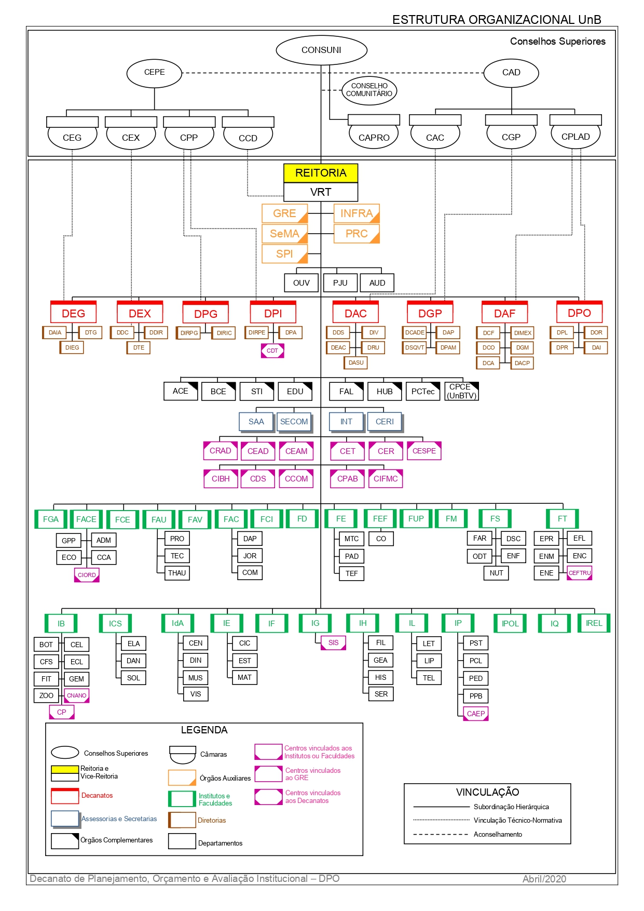
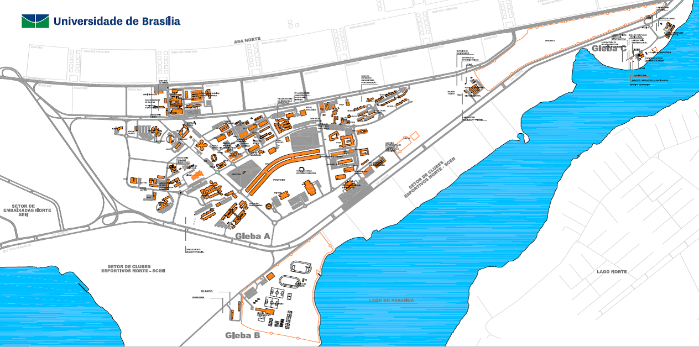

--- 
title: "ANUÁRIO ESTATÍSTICO 2020"
author: "Diretoria de Avaliação e Informações Gerenciais (DAI)<br>Decanato de Planejamento, Orçamento e Informações Gerenciais (DPO)"
date: "Setembro de 2020"
site: bookdown::bookdown_site
output: bookdown::gitbook
documentclass: book
bibliography: ["packages.bib"]
biblio-style: "apalike"
link-citations: true
github-repo: dai-unb/anuario2020
description: "Anuário Estatístico 2020 da UnB"
---

```{r setup, include=FALSE}
knitr::opts_chunk$set(
  echo = FALSE,
  message = FALSE,
  error = FALSE,
  warning = FALSE,
  cache = TRUE
)
library(tidyverse)
library(knitr)
library(kableExtra)

load("labels/Label_Unidades_pos.RData")
```

```{r functions}

# insere a coluna de unidade etc nas tabelas que não têm
# serve só pra graduação por enquanto
insere_descricao <- function(tabela, nome){
  
  tabela %>% 
    mutate({{ nome }} := rownames(tabela)) %>% 
    select({{ nome }}, everything())
}

# acha as linhas que devem ser coloridas
colorir <- function(tabela, dados, alpha = 0.2){
  
  unidades <- label_unidade %>% 
    select(Unidade) %>% 
    deframe() %>% 
    paste(., collapse = "|")
  
  var <- dados %>% select(starts_with("Unidade")) %>% names()
  
  colorir <- dados %>% 
    mutate(n = row_number()) %>% 
    filter(str_detect(.data[[var]], unidades)) %>% 
    select(n) %>% 
    deframe()
  
  tabela %>% 
    row_spec(
      row = colorir, background = alpha(fundo, alpha)
      )
}

# tabela geral
tabela_geral <- function(dados, 
                         titulo, 
                         negrito = TRUE, 
                         tamfonte = 16, 
                         colunas = colnames(dados), 
                         fundo = NULL, 
                         digitos = 0) {
  
  colnames(dados) <- str_to_upper(colnames(dados))
  
  dados %>%
    kable(
      caption = titulo,
      col.names = colunas,
      digits = digitos,
      escape = FALSE, # considera o <br> uma quebra de linha,
      align = c("l", rep("r", ncol(dados) - 1)),
      booktabs = TRUE,
      format.args = list(big.mark = ".")
    ) %>%
    kable_styling(
      bootstrap_options = c("striped", "hover", "responsive"),
      full_width = F,
      font_size = tamfonte
    ) %>%
    row_spec(
      row = nrow(dados),
      bold = negrito,
      background = fundo,
      color = ifelse(is.null(fundo), "#84898C", "white")
    ) %>%
    row_spec(
      row = 0,
      align = "c", color = ifelse(is.null(fundo), "#84898C", "white"), # pantone monument
      background = fundo,
      font_size = tamfonte - 2, extra_css = "vertical-align: middle"
    )
}
```

```{r}

```

# Apresentação {-}

A Universidade de Brasília – UnB apresenta o Anuário Estatístico 2020. O Anuário Estatístico tem por finalidade consolidar e disponibilizar informações à toda comunidade acadêmica, além de se constituir em um importante referencial para estudos e pesquisas sobre a política educacional da Universidade. Está organizado em uma série de cinco anos, possibilitando análises comparadas, longitudinais e de evolução em cada área de conhecimento. O controle dos registros acadêmicos ocorre por meio do Cadastro de Pessoa Física (CPF) de cada estudante.

Esta é a 22ª edição do anuário, iniciado no ano de 1988. Os dados aqui informados referem-se a cursos e alunos de graduação e de pós-graduação do ano de 2019, com retrospectiva desde o ano de 2015, tendo como fonte de dados o Censo da Educação Superior (CenSup), após sua consolidação pelo Instituto de Estudos e Pesquisas Educacionais Anísio Teixeira (INEP), autarquia do Ministério da Educação (MEC).

Para a busca de informações atualizadas, o Decanato de Planejamento, Orçamento e Avaliação Institucional enviou, em 26 de maio de 2020, solicitações de informações aos diferentes setores, Institutos e Faculdades da UnB. Em 8 de julho, ainda por meio do SEI, foi reiterada a solicitação de informações referentes ao ano de 2019 para compor o Anuário Estatístico 2020. 

Com a utilização dessa base, mantém-se a consistência histórica e institucional de informações da UnB, em um processo dinâmico de constante aperfeiçoamento.  

<br><br>

## Inovação desta versão {-}

Continuando a tendência de inovações para o Anuário Estatístico, este ano o Anuário foi feito inteiramente no [software livre R](https://www.r-project.org/), por meio do pacote [bookdown](https://cran.r-project.org/package=bookdown). Essa mudança teve como objetivo tornar o processo de confecção do documento o mais linear possível, aumentando a confiabilidade das informações aqui contidas. 

Além disso, ganhamos em transparência, pois todo o fluxo de trabalho está documentado no repositório [github/dai-dpo/anuario2020](https://github.com/dai-unb/anuario2020). No entanto não é possível reproduzir ou replicar as tabelas e gráficos aqui contidos, pois devido à sensibilidade dos dados tratados (informações pessoais de estudantes e servidores da UnB), a base de dados bruta não pôde ser disponibilizada.

Assim como na última versão, é possível baixar todas as tabelas que compõem o documento, garantindo o fácil acesso a diversas informações da Universidade de Brasília.

<br><br>

## Lista de autoridades {-}
Jair Messias Bolsonaro  
**Presidente da República**

Abraham Weintraub  
**Ministro da Educação**

Arnaldo Barbosa de Lima Júnior  
**Secretário de Educação Superior – Ministério da Educação – MEC**

<br><br>

**Universidade de Brasília**

**Reitora**: Márcia Abrahão Moura  
**Vice-Reitor**: Enrique Huelva Unternbäumen  
**Decana de Administração**: Maria Lucília dos Santos  
**Decano de Assuntos Comunitários**: Ileno Izídio da Costa  
**Decana de Ensino de Graduação**: Sérgio Antônio Andrade de Freitas  
**Decana de Extensão**: Olgamir Ferreira de Paiva  
**Decano de Gestão de Pessoas**: Carlos Vieira Mota  
**Decana de Pesquisa e Inovação**: Maria Emilia Walter  
**Decana de Planejamento, Orçamento e Avaliação Institucional**: Denise Imbroisi  
**Decana de Pós-Graduação**: Adalene Moreira Silva  

<br><br>

## Equipe DPO {-}

**Decanato de Planejamento, Orçamento e Avaliação Institucional (DPO)**  
Decana de Planejamento, Orçamento e Avaliação Institucional: Denise Imbroisi  
Diretora de Avaliação e Informações Gerenciais: Andrea Felippe Cabello (até 31/12/2019)  
Diretor de Avaliação e Informações Gerenciais: Guilherme Viana Ferreira  
Coordenador de Informações Gerenciais: Roberto de Freitas Neder  

Organização: Guilherme Viana Ferreira  
Revisão: --  

Equipe Técnica:   
Alexandre Cardias Pereira Alves  
Geisa Rodrigues Novais  
Pedro Ivo Guimarães Póvoa  
Roberto de Freitas Neder  

Coordenação Editoria, Projeto Gráfico, Editoração e Capa: DAI/DPO  
Este anuário foi organizado com base nas informações prestadas pelas unidades acadêmicas e administrativas, pelos centros, órgãos complementares e sistemas eletrônicos de dados da Universidade de Brasília.  

<br>

Universidade de Brasília  
Decanato de Planejamento e Orçamento – Prédio da Reitoria, bloco B, 1º andar  
Campus Universitário Darcy Ribeiro – Asa Norte  
70910-900 Brasília, DF, Brasil  
Telefones: + (61) 3107-0620 e 3107-0621  
http://www.unb.br  
unb@unb.br  
dpo@unb.br  
dai@unb.br  

<br><br>

## Lista de siglas e denominações {-}

**FUNDAÇÃO UNIVERSIDADE DE BRASÍLIA (FUB)**  
CONSELHO DIRETOR  
SCD	Secretaria do Conselho Diretor  

**UNIVERSIDADE DE BRASÍLIA (UnB)**  

**CONSELHOS SUPERIORES**  
CONSUNI	Conselho Universitário  

CEPE		Conselho de Ensino, Pesquisa e Extensão  
	CAC		Câmara de Assuntos Comunitários  
	CAD		Conselho de Administração  
	CAPRO	Câmara de Projetos, Convênios, Contratos e Instrumentos Correlatos  
	CCD		Câmara da Carreira Docente  
	CEG		Câmara de Ensino de Graduação  
	CEX		Câmara de Extensão  
CGP		Câmara de Gestão de Pessoas  
CPLAD	Câmara de Planejamento e Administração  
	CPP		Câmara de Pesquisa e Pós-Graduação  

**CONSELHO COMUNITÁRIO**  
REITORIA  
VRT	Vice-Reitoria  
GRE	Gabinete do Reitor  
	SCA	Subsecretaria de Comunicação Administrativa  
	SOC	Subsecretaria de Órgãos Colegiados  
PRC	Prefeitura do Campus  
	DAL	Diretoria de Administração e Logística  
	DSG	Diretoria de Serviços Gerais  
	DENA	Diretoria de Engenharia e Arquitetura  
INFRA	Secretaria de Infraestrutura  
PJU	Procuradoria Jurídica  
AUD	Auditoria  
OUV	Ouvidoria  

**DECANATOS**  
DEG	Decanato de Ensino de Graduação  
	DTG	Diretoria Técnica de Graduação  
	DAIA	Diretoria de Acompanhamento e Integração Acadêmica  
	DEGD	Diretoria de Ensino de Graduação a Distância  
	DIEG	Diretoria de Inovação e Estratégias para o Ensino de Graduação  

DEX	Decanato de Extensão  
	DTE	Diretoria Técnica de Extensão  
	DDIR	Diretoria de Desenvolvimento e Integração Regional   
	INTERFOCO	Diretoria de Capacitação e Formação Continuada  

DPG	Decanato de Pós-Graduação  
	DIRPG	Diretoria de Pós-Graduação  
DIRIC	Diretoria de Fomento à Iniciação Científica  

DPI 	Decanato de Pesquisa e Inovação  
	DIRPE Diretoria de Pesquisa   
DPA Diretoria de Apoio a Projetos Acadêmicos   
CDT Centro de Desenvolvimento Tecnológico 	 

DAC	Decanato de Assuntos Comunitários   
	DDS	Diretoria de Desenvolvimento Social   
	DEL	Diretoria de Esporte e Lazer  
DIV	Diretoria da Diversidade  
DRU	Diretoria do Restaurante Universitário  
DOCCA	Diretoria de Organizações Comunitárias, Cultura e Arte  

DAF	Decanato de Administração  
DTER	Diretoria de Terceirização  
DIMEX	Diretoria de Importação e Exportação  
DGM	Diretoria de Gestão de Materiais  
DCF	Diretoria de Contabilidade e Finanças  
DCO	Diretoria de Compras  

DGP	Decanato de Gestão de Pessoas  
	DCADE	Diretoria de Capacitação, Desenvolvimento e Educação  
	DAP	Diretoria de Administração de Pessoas  
	DSQVT	Diretoria de Saúde, Segurança e Qualidade de Vida no Trabalho  
	DPAM	Diretoria de Provimento, Acompanhamento e Movimentação  

DPO	Decanato de Planejamento, Orçamento e Avaliação Institucional  
	DPL	Diretoria de Planejamento  
	DOR	Diretoria de Orçamento  
	DAI	Diretoria de Avaliação e Informações Gerenciais   
	DPR	Diretoria de Processos Organizacionais  

**ASSESSORIAS E SECRETARIAS**  
	SAA	Secretaria de Administração Acadêmica  
	SECOM	Secretaria de Comunicação  
	SGP	Secretaria de Gestão Patrimonial  
	INT	Assessoria de Assuntos Internacionais  
	CERI	Coordenação do Cerimonial  

**ÓRGÃOS COMPLEMENTARES**  
	ACE	Arquivo Central  
BCE	Biblioteca Central  
	CPD	Centro de Informática  
	EDU	Editora Universidade de Brasília  
	FAL	Fazenda Água Limpa  
HUB	Hospital Universitário  
PCTec	Parque Científico e Tecnológico da UnB  
	CPCE (UnBTV)	Centro de Produção Cultural e Educativa  

**CENTROS**   
CCOM	 Centro de Políticas, Direito, Economia e Tecnologias das Comunicações  
CDS	Centro de Desenvolvimento Sustentável  
CEAD	Centro de Educação a Distância  
CEPLAN	Centro de Planejamento  
CET	Centro de Excelência em Turismo  
CER	Centro de Estudos do Cerrado  
CESPE	Centro de Seleção e de Promoção de Eventos  
CIFMC	 Centro Internacional de Física da Matéria Condensada  
CIORD	 Centro Integrado de Ordenamento Territorial (FACE)  
CME	Centro de Manutenção de Equipamentos Científicos  
CPAB	Centro de Pesquisa e Aplicação de Bambu e Fibras Naturais  
CPCE	Centro de Produção Cultural e Educativa  
CRAD	Centro de Referência em Conservação da Natureza e Recuperação de Áreas Degradadas  
DATAUnB	Centro de Pesquisas de Opinião Pública  
CEAM	Centro de Estudos Avançados Multidisciplinares  

**UNIDADES ACADÊMICAS**  
FACE	Faculdade de Economia, Administração, Contabilidade e Gestão de Políticas Públicas  
	ADM	Departamento de Administração  
	CCA	Departamento de Ciências Contábeis e Atuariais  
	ECO	Departamento de Economia  
	CIORD	Centro Integrado de Ordenamento Territorial  
	GPP	Gestão de Políticas Públicas  

FAC	Faculdade de Comunicação  
	DAP	Departamento de Audiovisuais e Publicidade  
	JOR	Departamento de Jornalismo  
	COM	Departamento de Comunicação Organizacional  

FAU	Faculdade de Arquitetura e Urbanismo  
PRO	Departamento de Projeto, Expressão e Representação em Arquitetura e Urbanismo  
TEC	Departamento de Tecnologia em Arquitetura e Urbanismo  
THAU	Departamento de Teoria e História em Arquitetura e Urbanismo  

FAV	Faculdade de Agronomia e Medicina Veterinária  

FCE	Faculdade UnB-Ceilândia  

FCI	Faculdade de Ciência da Informação  

FD	Faculdade de Direito  

FE	Faculdade de Educação  
MTC	Departamento de Métodos e Técnicas  
PAD	Departamento de Planejamento e Administração  
TEF	Departamento de Teoria e Fundamentos  

FEF	Faculdade de Educação Física  
CO	Centro Olímpico  

FGA	Faculdade UnB-Gama  

FM	Faculdade de Medicina  
NMT	Núcleo de Medicina Tropical  

FS	Faculdade de Ciências da Saúde   
FAR	Departamento de Farmácia  
DSC	Departamento de Saúde Coletiva   
ENF	Departamento de Enfermagem   
NUT	Departamento de Nutrição  
ODT	Departamento de Odontologia  

FT	Faculdade de Tecnologia  
EFL	Departamento de Engenharia Florestal  
ENC	Departamento de Engenharia Civil e Ambiental  
ENE	Departamento de Engenharia Elétrica  
ENM	Departamento de Engenharia Mecânica  
EPR	Departamento de Engenharia de Produção  
CEFTRU	Centro de Formação de Recursos Humanos em Transportes  

FUP	Faculdade UnB-Planaltina  
CETEC	Centro Transdisciplinar de Educação do Campo    

IB	Instituto de Ciências Biológicas  
BOT	Departamento de Botânica  
CEL	Departamento de Biologia Celular  
CFS	Departamento de Ciências Fisiológicas  
ECL	Departamento de Ecologia  
FIT	Departamento de Fitopatologia  
GEM	Departamento de Genética e Morfologia  
ZOO	Departamento de Zoologia  
CNANO	Centro de Nano Ciência e Nanotecnologia  
CP	Centro de Primatologia  

ICS	Instituto de Ciências Sociais  
CEPPAC	Centro de Pesquisa e Pós-Graduação sobre as Américas  
DAN	Departamento de Antropologia  
SOL	Departamento de Sociologia  
ELA	Departamento de Estudos Latino Americanos  

IdA	Instituto de Artes  
CEN	Departamento de Artes Cênicas  
DIN	Departamento de Desenho Industrial  
MUS	Departamento de Música  
VIS	Departamento de Artes Visuais  

IE	Instituto de Ciências Exatas  
CIC	Departamento de Ciência da Computação   
EST	Departamento de Estatística   
MAT	Departamento de Matemática  

IF	Instituto de Física  

IG	Instituto de Geociências   
GEO	Departamento de Geologia Geral e Aplicada  
GMP	Departamento de Mineralogia e Petrologia  
GRM	Departamento de Geoquímica e Recursos Minerais  
SIS	Observatório Sismológico  

IH	Instituto de Ciências Humanas  
FIL	Departamento de Filosofia  
GEA	Departamento de Geografia  
HIS	Departamento de História  
SER	Departamento de Serviço Social  

IL	Instituto de Letras  
LET	Departamento de Línguas Estrangeiras e Tradução  
LIP	Departamento de Linguística, Português e Línguas Clássicas  
TEL	Departamento de Teoria Literária e Literaturas  

IP	Instituto de Psicologia  
CAEP	Centro de Atendimento e Estudos Psicológicos  
PCL	Departamento de Psicologia Clínica  
PED	Departamento de Psicologia Escolar e do Desenvolvimento  
PPB	Departamento de Processos Psicológicos Básicos  
PST	Departamento de Psicologia Social e do Trabalho  

IPOL	Instituto de Ciência Política  

IQ	Instituto de Química  

IREL	Instituto de Relações Internacionais  

<br><br>

## Organograma {-}

```{r}

```
Fonte:  http://www.dpo.unb.br/index.php?option=com_content&view=article&id=24&Itemid=744?menu=425

<br><br>

## Mapa do Campus Darcy Ribeiro {-}

```{r}

```
